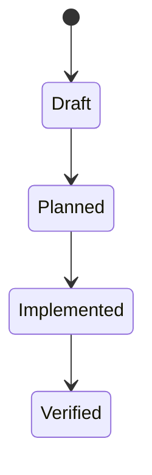

# Data Model: DOCA FM Live Curation and Contextual Storytelling

> Feature ID: `013-doca-fm-live-curation-and-contextual-storytelling`

## Entities

| Entity | Fields | Owner | Notes |
| --- | --- | --- | --- |
| TBD | TBD | TBD | TBD |

## State Transitions

## Validation Rules

- TBD
