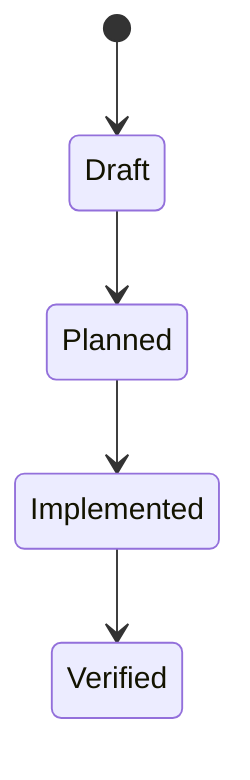

# Data Model: Project Planning - Coin System and ZaloPay MoMo Integration

> Feature ID: `017-project-planning-coin-system-and-zalopay-momo-integration`

## Entities

| Entity | Fields | Owner | Notes |
| --- | --- | --- | --- |
| TBD | TBD | TBD | TBD |

## State Transitions

## Validation Rules

- TBD
