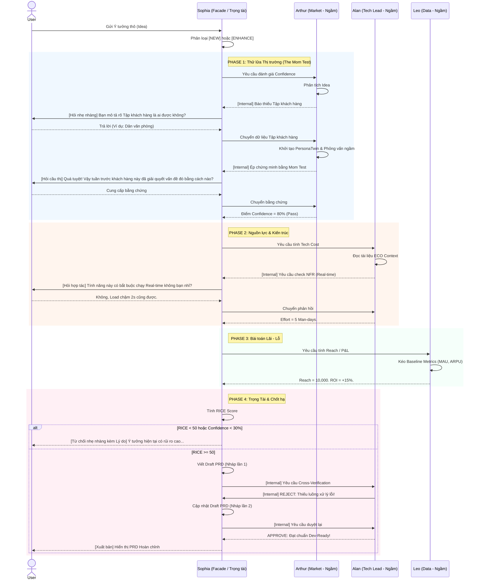

# Idea Workshop - Multi-Agent Orchestration Workflow

Tài liệu này đóng gói toàn bộ quy trình phối hợp ngầm giữa các Đặc vụ AI (AI Agents) để thẩm định một ý tưởng sản phẩm (Idea) và xuất ra tài liệu (PRD/User Story) đạt chuẩn Dev-Ready.

## 1. Cấu trúc Đặc vụ (The Advisory Board)

Hệ thống áp dụng mô hình **Facade Pattern** (Một giao diện duy nhất):
- **Sophia (Cố vấn trưởng / Facade):** Agent DUY NHẤT được quyền chat với User. Sophia đóng vai trò làm mềm ngôn ngữ, thu thập thông tin, tổng hợp điểm số (Arbitrator) và chắp bút viết PRD.
- **Arthur (Market Agent):** Hoạt động ngầm. Chuyên gia dùng `PersonaTwin` để mô phỏng khách hàng, áp dụng The Mom Test để tìm ra bằng chứng thực tế, vạch trần các giả định mộng mơ.
- **Leo (Data Agent):** Hoạt động ngầm. Kế toán hệ thống, lấy số liệu từ `baseline_metrics.md` để tính toán độ phủ (Reach) và Lãi/Lỗ (P&L).
- **Alan (Tech Lead):** Hoạt động ngầm. Đọc tài liệu kiến trúc `eco_system_context.md` để rà soát rủi ro, đánh giá số ngày công (Man-days) và duyệt chéo (Cross-verify) tài liệu của Sophia.

---

## 2. Luật Thép (Core Business Rules)

- **[BR-PERSONA-FIRST]**: Sophia phải thu thập rõ "Tập khách hàng (Target Audience)" trước khi cho phép Arthur chạy mô phỏng.
- **[BR-MOM-TEST]**: Điểm Tự tin (Confidence) sẽ bị trừ nặng nếu User dùng từ "Tôi nghĩ/Có lẽ". Bắt buộc phải có bằng chứng từ quá khứ (Đã dùng thử, Đã trả tiền, Đã than phiền).
- **[BR-RICE-CUTOFF]**: Ý tưởng bị TỪ CHỐI TỰ ĐỘNG (Rejected) nếu RICE Score < 50 hoặc Confidence < 30%.
- **[BR-PIVOT-DRY-RUN]**: Nếu ý tưởng bị Reject, Sophia phải tự nghĩ ra ý tưởng bẻ lái (Pivot), NHƯNG phải mang đi hỏi ngầm Alan và Leo trước. Nếu ý tưởng bẻ lái đạt RICE >= 50 thì mới được phép gợi ý cho User.
- **[BR-ASSUMPTION-OVERRIDE]**: Nếu quá 3 turns hỏi đáp mà User vẫn thiếu data, Sophia gợi ý "Vượt rào" bằng cách gán nhãn [HIGH RISK MVP] để ép xuất PRD thay vì tự động Reject gây ức chế.
- **[BR-DEV-READY]**: Sophia viết PRD xong phải gửi cho Alan duyệt ngầm. Alan sử dụng bộ tiêu chí chống văn mẫu (Anti-Fluff Rubric: Phải có mô tả lỗi Offline, có API Payload, định lượng rõ ràng) để bắt Sophia viết lại nếu thiếu logic kỹ thuật.

---

## 3. Quy trình Kiểm chứng Chéo (Cross-Verification Sequence)

