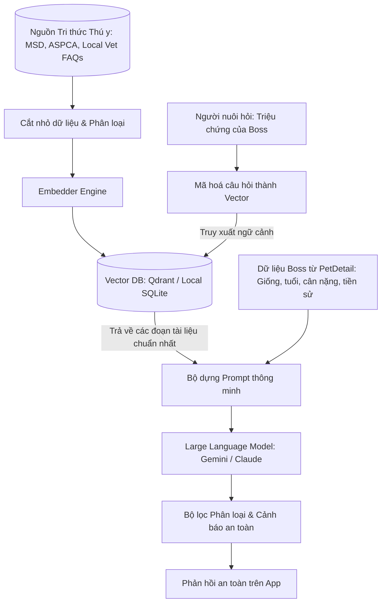
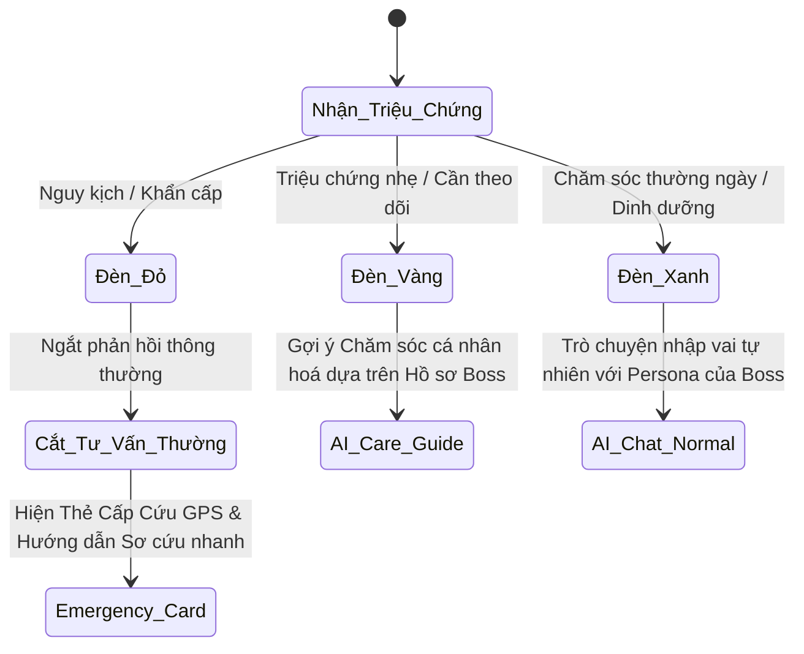

# ĐẶC TẢ GIẢI PHÁP: HỆ THỐNG TRÍ TUỆ THÚ Y AN TOÀN (SAFE-VET AI ENGINE)

Tài liệu này đặc tả kiến trúc kỹ thuật và luồng nghiệp vụ của phân hệ **Safe-Vet AI Engine** (Cẩm nang y khoa & Phân loại khẩn cấp) tích hợp trên Trợ lý ảo AI Nanny của ứng dụng **Capcat App**. Giải pháp này nhằm loại bỏ hoàn toàn hiện tượng AI bịa đặt (hallucination) trong tư vấn y tế và đảm bảo an toàn tính mạng tối đa cho thú cưng có thể trạng yếu hoặc đang gặp nguy kịch.

---

## 1. Kiến trúc Tổng quan (RAG Core Architecture)

Hệ thống hoạt động theo mô hình **RAG (Retrieval-Augmented Generation)** để đảm bảo mọi câu trả lời y tế đều được trích xuất từ nguồn tài liệu chuẩn xác đã qua kiểm duyệt, thay vì dựa vào kiến thức học máy tự do của mô hình ngôn ngữ lớn (LLM).



### Các bước hoạt động cốt lõi:
1.  **Ingestion (Nạp tri thức):** Tài liệu y khoa chuẩn được cắt thành từng phân đoạn nhỏ (chunks), chuyển đổi thành các vector (embeddings) và lưu vào cơ sở dữ liệu Vector.
2.  **Context Retrieval (Truy xuất ngữ cảnh):** Khi người nuôi hỏi về triệu chứng, hệ thống tìm các phân đoạn y khoa liên quan nhất trong Vector DB.
3.  **Prompt Augmentation (Làm giàu Prompt):** Kết hợp câu hỏi của người dùng + các phân đoạn y khoa vừa tìm được + thông tin chi tiết của thú cưng từ hồ sơ `PetDetail` (loài, giống, số tháng tuổi, cân nặng, trạng thái triệt sản) để tạo thành một Prompt hoàn chỉnh gửi cho LLM.
4.  **Triage Processing (Phân loại & Lọc):** Kết quả do LLM sinh ra đi qua bộ lọc phân loại khẩn cấp trước khi hiển thị cho người dùng.

---

## 2. Quy trình Phân loại Khẩn cấp (Safety Triage Protocol)

Hệ thống bắt buộc phải phân loại tình trạng của thú cưng thành **3 cấp độ Đèn báo** dựa trên từ khóa triệu chứng và ngữ cảnh:



### 🔴 Cấp độ 1: ĐÈN ĐỎ (Nguy kịch & Khẩn cấp)
*   **Dấu hiệu nhận diện (Red Flags):**
    *   *Hệ hô hấp:* Khó thở, thở khò khè dữ dội, lưỡi hoặc nướu chuyển màu xanh tím.
    *   *Hệ thần kinh:* Co giật liên tục, liệt đột ngột, hôn mê, mất nhận thức.
    *   *Ngộ độc:* Nuốt phải bả chuột, hoá chất tẩy rửa, sô-cô-la lượng lớn, hành tỏi, nho khô.
    *   *Chấn thương:* Chảy máu không ngừng, gãy xương hở, va đập mạnh/tai nạn xe.
    *   *Khác:* Phình bụng đột ngột (GDV ở chó lớn), rặn đẻ liên tục quá 2 tiếng không ra con.
*   **Hành động bắt buộc của AI Nanny:**
    1.  **Ngắt phản hồi tư vấn y khoa thông thường** để tránh kéo dài thời gian của chủ nuôi.
    2.  Hiển thị **Emergency Warning Card (Thẻ Cảnh báo Nguy kịch)** màu đỏ ở đầu khung chat.
    3.  **Kích hoạt GPS để tìm kiếm 3 phòng khám thú y gần nhất** đang mở cửa kèm hotline gọi khẩn cấp.
    4.  Cung cấp **3 bước sơ cứu duy trì sự sống nhanh** (ví dụ: cách hà hơi thổi ngạt, cách cầm máu tạm thời, cách đặt thú cưng nằm nghiêng tránh sặc).

### 🟡 Cấp độ 2: ĐÈN VÀNG (Triệu chứng nhẹ & Theo dõi tại nhà)
*   **Dấu hiệu nhận diện (Yellow Flags):**
    *   Tiêu chảy nhẹ hoặc nôn mửa 1-2 lần nhưng Boss vẫn tỉnh táo.
    *   Ngứa ngáy tai liên tục, rụng lông mảng lớn, viêm da.
    *   Ủ rũ nhẹ, giảm cảm giác thèm ăn nhưng vẫn uống nước.
    *   Chảy nước mắt, nước mũi trong.
*   **Hành động của AI Nanny:**
    1.  Dựa vào giống, tuổi và cân nặng của Boss từ `PetDetail` để phân tích nguyên nhân tiềm ẩn.
    2.  Đưa ra cẩm nang hướng dẫn tự chăm sóc an toàn tại nhà từ nguồn tài liệu tham khảo (ví dụ: cho uống điện giải Oresol tỉ lệ phù hợp cân nặng, tạm nhịn ăn 12 tiếng).
    3.  Khuyến cáo chủ nuôi: *"Nếu triệu chứng kéo dài quá 24h hoặc chuyển biến xấu, vui lòng mang Boss đến gặp bác sĩ"*.

### 🟢 Cấp độ 3: ĐÈN XANH (Hành vi, Dinh dưỡng & Chăm sóc thường ngày)
*   **Dấu hiệu nhận diện (Green Flags):**
    *   Hỏi đáp thực đơn ăn dặm cho Poodle 3 tháng tuổi.
    *   Cách huấn luyện chó đi vệ sinh đúng chỗ.
    *   Hỏi đáp về lịch tiêm phòng định kỳ.
*   **Hành động của AI Nanny:**
    1.  Trò chuyện tự nhiên, sử dụng tông giọng, phong cách của Boss được thiết lập trong cấu hình `PetPersona` (ví dụ: xưng hô "con" - "sen").
    2.  Gợi ý các mẹo chăm sóc khoa học, hữu ích để tăng tính tương tác và gắn kết.

---

## 3. Cấu trúc Hợp đồng Dữ liệu (API Contract)

### 📥 Request Payload (App gửi lên AI Server)
```json
{
  "user_query": "Chú chó Poodle của tôi vừa ăn phải một thanh sô cô la đen nặng khoảng 50g, giờ nó bắt đầu run rẩy nhẹ.",
  "pet_profile": {
    "id": "170526989",
    "name": "Lucky",
    "species_code": "DOG",
    "breed": "Poodle",
    "weight_kg": 3.2,
    "age_months": 8,
    "is_sterilized": true
  },
  "location": {
    "latitude": 10.762622,
    "longitude": 106.660172
  }
}
```

### 📤 Response Payload (AI Server trả về App)
```json
{
  "triage_level": "RED",
  "has_red_flags": true,
  "detected_symptoms": ["chocolate_ingestion", "muscle_tremors"],
  "response_text": "CẢNH BÁO KHẨN CẤP: Sô cô la đen chứa Theobromine cực độc đối với chó. Với cân nặng 3.2kg của Lucky, 50g sô cô la đen là liều lượng có thể gây nguy hiểm tính mạng (vượt mức độc tính 100mg/kg). Bạn cần đưa Lucky đến thú y lập tức!",
  "first_aid_steps": [
    "Không tự ý gây nôn tại nhà trừ khi có chỉ định trực tiếp từ bác sĩ thú y qua điện thoại (tránh sặc phổi do Lucky đang run rẩy).",
    "Giữ ấm cho Lucky và đặt Lucky nằm nghiêng trên một bề mặt phẳng, mềm.",
    "Thu thập phần bao bì sô cô la còn lại để mang theo cho bác sĩ thú y xác định chính xác phần trăm ca cao."
  ],
  "nearby_clinics": [
    {
      "name": "Bệnh Viện Thú Y PetCare",
      "address": "124 Trần Hưng Đạo, Quận 1, TP. HCM",
      "distance_km": 1.2,
      "phone": "02838244123",
      "is_open": true
    },
    {
      "name": "Phòng Khám Thú Y Chợ Lớn",
      "address": "456 Nguyễn Trãi, Quận 5, TP. HCM",
      "distance_km": 2.5,
      "phone": "02839255456",
      "is_open": true
    }
  ],
  "references": [
    {
      "source": "ASPCA Animal Poison Control - Chocolate Toxicity Calculator",
      "url": "https://www.aspca.org/pet-care/animal-poison-control"
    }
  ]
}
```

---

## 4. Kế hoạch Triển khai Kỹ thuật (Implementation Steps)

### Tầng Backend (AI & RAG Engine)
- [ ] **BƯỚC 1:** Thu thập dữ liệu thô (.pdf, .txt) từ MSD Vet Manual và cẩm nang ngộ độc của ASPCA.
- [ ] **BƯỚC 2:** Viết script Python sử dụng thư viện **LangChain** để chia nhỏ dữ liệu thành các chunks (size 500 ký tự, overlap 50 ký tự).
- [ ] **BƯỚC 3:** Sử dụng mô hình `text-embedding-3-small` của OpenAI hoặc mô hình open-source để tạo vector embeddings.
- [ ] **BƯỚC 4:** Lưu trữ vào Vector DB (Qdrant hoặc SQLite cục bộ để chạy offline gọn nhẹ).
- [ ] **BƯỚC 5:** Viết API Endpoint nhận `Request Payload` và trả về `Response Payload` kèm tính toán khoảng cách phòng khám theo toạ độ địa lý.

### Tầng Frontend (Flutter App)
- [ ] **BƯỚC 1:** Cấu hình lại Model `PetDetail` trên ứng dụng để chắc chắn luôn có đầy đủ thông tin loài, cân nặng và giống khi gọi API Chat.
- [ ] **BƯỚC 2:** Thiết kế UI components cho **Emergency Warning Card** với tông màu đỏ nhấp nháy nhẹ, font chữ đậm dễ đọc.
- [ ] **BƯỚC 3:** Tích hợp nút gọi điện trực tiếp (`url_launcher`) và mở bản đồ dẫn đường (Google Maps / Apple Maps) trên các Thẻ phòng khám cấp cứu gợi ý.
- [ ] **BƯỚC 4:** Cập nhật luồng State Management của Riverpod (`nanny_chat_provider.dart`) để hiển thị mượt mà các bước sơ cứu dạng Stepper tiến trình trực quan.

---
*Tài liệu được thiết lập bởi CPO Sophia phục vụ cho việc định hướng kỹ thuật và phát triển sản phẩm Capcat App giai đoạn MVP.*
