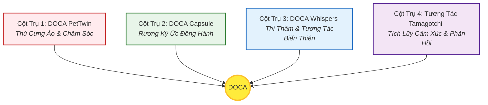

# KIM CHỈ NAM DỰ ÁN: DOCA
*(PROJECT VISION COMPASS & MANIFESTO)*

> **TUYÊN NGÔN SỨ MỆNH (MISSION STATEMENT):**  
> **"DOCA"** sinh ra không phải để làm một công cụ quản lý dữ liệu khô khan. Sứ mệnh tối cao của chúng tôi là **chữa lành sự cô đơn của con người đô thị**, biến chiếc điện thoại lạnh lẽo thành cầu nối cảm xúc sống động, nơi người dùng có thể trò chuyện, trêu đùa và lưu giữ linh hồn kỹ thuật số của chính chú thú cưng thực tế của họ thông qua **DOCA PetTwin** và **DOCA Capsule**.
>
> **"Chúng tôi không bán công cụ; chúng tôi bán sự giải trí, niềm vui và sự xoa dịu cảm xúc."**

---

## 🌌 Ba Đối Tượng Tham Chiếu Tinh Thần (The Spiritual Trinity)

Để giữ cho định vị sản phẩm luôn sắc bén và đi đúng quỹ đạo, mọi tính năng tương tác của DOCA bắt buộc phải kế thừa tinh hoa từ 3 biểu tượng huyền thoại:

1. **Tamagotchi (Thập niên 90) - Sự Chăm Sóc & Trách Nhiệm Cảm Xúc (Lõi tương tác của DOCA PetTwin):**
   * *Giá trị cốt lõi:* Cảm giác gắn kết sinh ra từ sự chăm sóc và trách nhiệm hàng ngày. Người dùng tự nguyện dành thời gian cho ăn, đi dạo, tắm, chải lông, tiêm ngừa, sổ giun cho Boss ảo trên ứng dụng để duy trì các chỉ số sinh học. Những hoạt động này sẽ là trigger trực tiếp cho các câu hỏi hội thoại từ Boss AI trong chat để thu thập thông tin và ghi nhận vào dòng thời gian.
2. **SimSimi (Thập niên 2000) - Sự Hài Hước Bất Ngờ & Khía Hóm Hỉnh:**
   * *Giá trị cốt lõi:* Sự bất ngờ tạo ra Dopamine tức thì. Những câu trả lời "khịa" dí dỏm, ngáo ngơ, không theo khuôn mẫu của chú gà vàng SimSimi đã từng làm rung chuyển thế giới ảo. DOCA kế thừa tinh thần này để tạo ra một Boss AI có cá tính cực kỳ sống động, dám trêu chọc, tranh luận vui vẻ và giận dỗi "Sen" dưới góc nhìn thứ nhất thay vì chỉ biết vâng lời ngoan ngoãn.
3. **Neko Atsume / Nintendogs (Thập niên 2000 - 2010) - Sự Chữa Lành Yên Bình & Tri Kỷ Thấu Hiểu:**
   * *Giá trị cốt lõi:* Sự hiện diện âm thầm nhưng đầy xoa dịu. Không có áp lực phải chiến thắng, không có nhiệm vụ căng thẳng, chỉ có sự bình yên khi nhìn thấy Boss ảo vui vẻ và lắng nghe những lời thì thầm ấm áp (`DOCA Whispers`) lúc đêm muộn. DOCA là nơi trú ẩn an lành, xoa dịu mọi giông bão tâm lý của con người sau một ngày dài mệt mỏi trong thế giới thực.

---

## 🧭 1. Triết Lý Thiết Kế Cốt Lõi (Core Philosophy)

Mọi dòng code được viết, mọi giao diện được vẽ, và mọi tính năng được đề xuất cho **DOCA** đều phải được soi chiếu qua kính lúp của **3 Không - 3 Có**:

| ❌ Chúng tôi KHÔNG BÁN | ✅ Chúng tôi TRAO TẶNG |
| :--- | :--- |
| **Không bán phần mềm quản lý sổ sách.** | **Có người bạn đồng hành 24/7** thấu hiểu sâu sắc chủ nuôi qua các chỉ số Tamagotchi. |
| **Không bán những đoạn chat robot công nghiệp.** | **Có những tràng cười Dopamine** từ những câu "khịa" ngáo ngơ chuẩn chất thú cưng dưới góc nhìn thứ nhất. |
| **Không bán mạng xã hội trống trải.** | **Có một "DOCA Capsule" (Rương Ký Ức)**, nơi lưu giữ trọn vẹn hành trình cuộc đời của Boss qua các sự kiện dòng thời gian. |

---

## 🏛️ 2. 4 Cột Trụ Trải Nghiệm Bất Biến (The 4 Immutable Pillars)

Bất kỳ tính năng mới nào được đưa vào phát triển bắt buộc phải đồng bộ và củng cố cho ít nhất 1 trong 4 cột trụ trải nghiệm dưới đây:

### 🐾 Cột Trụ 1: DOCA PetTwin (Thú Cưng Ảo & Nhân Cách Hóa)
Không có hai thực thể AI nào giống nhau trong DOCA. Linh hồn ảo của thú cưng được cấu thành một cách khoa học và tự nhiên từ thông số sinh học thực tế (`PetDetail`): Giống loài, độ tuổi, giới tính, cân nặng, kết hợp với cấu hình tính cách động (`PetPersona`) do chủ nuôi chọn lựa (Lười biếng, ngáo ngơ, chảnh chọe, nịnh nọt).

### 📸 Cột Trụ 2: DOCA Capsule (Rương Ký Ức Đồng Hành) - USP Độc Quyền
Đây là linh hồn tạo nên sự khác biệt. AI Pet không trò chuyện sáo rỗng. Nó đọc, hiểu các bức ảnh dìm hàng, các "Moment" (Nhật ký) và các sự kiện dòng thời gian tự động được ghi nhận để **lưu giữ vào bộ nhớ dài hạn (database timeline)**. Khi chat, nó sẽ chủ động gọi lại các ký ức này để trêu chọc hoặc vỗ về chủ nuôi dưới góc nhìn thứ nhất (Ví dụ: *"Nãy ba cho con ăn pate hay món gì mà ngon vậy?"*).

### 💬 Cột Trụ 3: DOCA Whispers & Tương Tác Biến Thiên (Variable Dopamine)
Ngôn từ của AI Pet phải bất ngờ, hóm hỉnh và mang đậm thói quen của loài, đặc biệt là các thông điệp thì thầm đêm muộn hiển thị ngoài màn hình khóa (`DOCA Whispers`). Tuyệt đối tránh xa lối nói chuyện nghiêm túc, khuôn mẫu của các chatbot công việc thông thường. Chúng tôi hướng tới sự hài hước như trào lưu SimSimi nhưng sâu sắc và ấm áp hơn nhờ sự am hiểu hồ sơ cá nhân.

### 🎮 Cột Trụ 4: Tương Tác Tamagotchi & Tích Lũy Cảm Xúc (Emotional Investment)
Tích hợp cơ chế nuôi thú ảo hiện đại (Tamagotchi 2.0). Khuyến khích người dùng chăm sóc thú cưng ảo trên ứng dụng (cho ăn, đi dạo, tắm, chải lông, tiêm ngừa, sổ giun) để duy trì các chỉ số Dinh dưỡng, Vận động, Hạnh phúc. Các hoạt động này là trigger tạo ra tin nhắn chủ động từ Boss AI để thu thập và lưu giữ dữ liệu vào dòng thời gian.

---

## 🪓 3. Ranh Giới Đỏ - Những Điều Tuyệt Đối KHÔNG LÀM (Anti-Goals)

Để ngăn chặn Tech Debt (Nợ kỹ thuật) và Scope Creep (Phình to phạm vi), ban quản trị dự án cam kết **KHÔNG BAO GIỜ** phát triển các mảng tính năng sau:

1.  **❌ KHÔNG xây dựng Mạng xã hội đại trà (General Social Media):** Chúng tôi không làm bản sao của Facebook hay Instagram. Mọi tính năng chia sẻ khoảnh khắc chỉ nhằm mục đích **xây dựng kho ký ức riêng tư** giữa Chủ nuôi và Thú cưng AI để nạp ngữ cảnh cho chat.
2.  **❌ KHÔNG biến AI thành Công cụ học thuật khô khan:** AI Pet không làm toán, không viết code hộ, không tư vấn y khoa nghiêm túc như bác sĩ chuyên nghiệp. Nếu người dùng hỏi bệnh lý nặng, AI sẽ khuyên người dùng mở Sổ tay sức khỏe hoặc dùng Safe Vet tìm phòng khám cấp cứu.
3.  **❌ KHÔNG bán gói đăng ký tháng ép buộc (Forced Subscriptions):** Chúng tôi không khóa tính năng trò chuyện cơ bản sau bức tường phí. Dòng tiền sẽ chảy từ **Tiếp thị Liên kết Cảm xúc (Contextual Affiliate/Referral)**: Tích hợp tinh tế các liên kết mua sách cũ, đĩa nhạc, điểm hẹn chữa lành, hoặc tranh ảnh/poster lưu niệm từ các đối tác thương mại uy tín (Shopee, Fahasa, Spotify, Apple Music) ngay tại Góc Cảm Xúc và luồng chat.
4.  **❌ KHÔNG làm Trợ lý nổi toàn cục (Assistant Host) và Quà tặng Daily phức tạp trong MVP:** Để đảm bảo đúng tiến độ MVP tinh gọn và tập trung tối đa vào trải nghiệm chat tri kỷ.

---

## ⚖️ 4. Khung Đánh Giá Đồng Bộ Tính Năng (Alignment Framework)

Từ nay về sau, trước khi bắt tay vào code bất kỳ tính năng mới nào, Đội ngũ phát triển bắt buộc phải họp và chấm điểm tính năng đó qua **Bộ 3 Câu Hỏi Vàng**:

1.  **Câu hỏi 1:** *Tính năng này có giải quyết trực tiếp sự cô đơn hoặc mang lại tiếng cười cho người dùng không?*
2.  **Câu hỏi 2:** *Tính năng này có dựa trên hoặc làm giàu thêm hồ sơ sinh học (`PetDetail`) và bộ nhớ kỷ niệm (`DOCA Capsule`) của Boss không?*
3.  **Câu hỏi 3:** *Nó có thúc đẩy tương tác 2 chiều hài hước, biến thiên không?*

> **Định mức phê duyệt:** Tính năng chỉ được thông qua và đưa vào lộ trình phát triển khi đạt **3/3 điểm ĐỒNG Ý**.

---

## 🌸 5. Thẩm Mỹ "Tiểu Thuyết Chữa Lành Nhật Bản" (Iyashikei Design & Tone)

Để xoa dịu sâu sắc tâm hồn cô đơn của người trẻ đô thị vào ban đêm, DOCA lấy cảm hứng nghệ thuật tối cao từ dòng **tiểu thuyết chữa lành Nhật Bản (Iyashikei)**. Đây là linh hồn thẩm mỹ bất biến của toàn bộ ứng dụng:

### 🎨 5.1. Ngôn Ngữ Thiết Kế Thị Giác (Visual Design)
*   **Tông màu hoài niệm (Cozy Earthy Palette):** Sử dụng các gam màu gỗ ấm, giấy tái chế, trắng kem, nâu nhạt và vàng dịu của ánh đèn đêm. Tuyệt đối tránh xa các màu sắc lòe loẹt, chói mắt.
*   **Bo góc Glassmorphism (Kính mờ):** Tạo cảm giác nhẹ nhàng, lãng đãng và mờ ảo như sương mù buổi sớm tại các thị trấn nhỏ Nhật Bản.
*   **Nét vẽ Sketch mộc mạc (Watercolor Studio Ghibli style):** Chú thú cưng ảo được phác họa bằng những nét vẽ tay mộc mạc, màu nước tinh tế, mang lại cảm giác ấm áp, thủ công và chân thành chuẩn phong cách Ghibli.

### ✍️ 5.2. Ngôn Ngữ Trị Liệu & Lời Thì Thầm (Iyashikei AI Voice & Whisper)
*   **Tính chiêm nghiệm sâu sắc:** Lời thì thầm (`DOCA Whispers`) lúc đêm muộn của Boss AI sẽ mang tính lãng đãng, nhiều suy tư và giàu chất thơ nhẹ nhàng (Ví dụ: *"Sen ơi, trăng đêm nay thật đẹp. Dưới mái nhà này, có trẫm đang ngủ khò và có Sen đang thức, thế là đủ yên bình rồi..."*).
*   **Nhịp độ chậm rãi (Slow-paced Life):** Tránh các câu từ thúc ép, hối hả. Mọi câu hỏi trắc nghiệm hay lời chọc ghẹo đều được diễn đạt một cách tự nhiên, hóm hỉnh và chậm rãi để mang lại cảm giác xoa dịu.

### 🎵 5.3. Âm Thanh Chữa Lành (Ambient Healing Audio)
*   **Lo-fi Ghibli & Ambient Sound:** Tích hợp nhạc nền lo-fi acoustic nhẹ nhàng cùng các âm thanh tự nhiên (tiếng mưa rơi rào rạt ngoài hiên, tiếng Boss thở khò khò cục bộ) để tạo ra một **góc trú ẩn tĩnh lặng** an lành nhất cho Sen.

---
*Bản tuyên ngôn này là Hiến pháp tối cao của dự án DOCA. Được phê chuẩn bởi CPO Sophia cùng Đội ngũ Sáng lập.*
