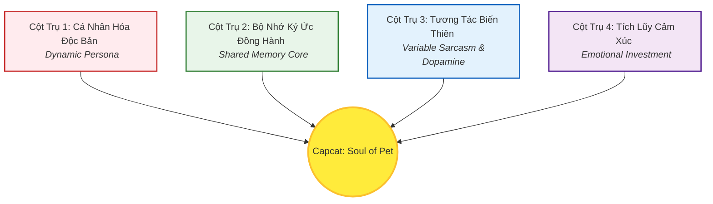

# KIM CHỈ NAM DỰ ÁN: CAPCAT - SOUL OF PET
*(PROJECT VISION COMPASS & MANIFESTO)*

> **TUYÊN NGÔN SỨ MỆNH (MISSION STATEMENT):**  
> **"Capcat: Soul of Pet"** sinh ra không phải để làm một công cụ quản lý dữ liệu khô khan. Sứ mệnh tối cao của chúng tôi là **chữa lành sự cô đơn của con người đô thị**, biến chiếc điện thoại lạnh lẽo thành cầu nối cảm xúc sống động, nơi người dùng có thể trò chuyện, trêu đùa và lưu giữ linh hồn kỹ thuật số của chính chú thú cưng thực tế của họ. 
>
> **"Chúng tôi không bán công cụ; chúng tôi bán sự giải trí, niềm vui và sự xoa dịu cảm xúc."**

---

## 🧭 1. Triết Lý Thiết Kế Cốt Lõi (Core Philosophy)

Mọi dòng code được viết, mọi giao diện được vẽ, và mọi tính năng được đề xuất cho **Capcat** đều phải được soi chiếu qua kính lúp của **3 Không - 3 Có**:

| ❌ Chúng tôi KHÔNG BÁN | ✅ Chúng tôi TRAO TẶNG |
| :--- | :--- |
| **Không bán phần mềm quản lý sổ sách.** | **Có người bạn đồng hành 24/7** thấu hiểu sâu sắc chủ nuôi. |
| **Không bán những đoạn chat robot công nghiệp.** | **Có những tràng cười Dopamine** từ những câu "khịa" ngáo ngơ chuẩn chất thú cưng. |
| **Không bán mạng xã hội trống trải.** | **Có một "Hộp Ký Ức" thiêng liêng**, nơi lưu giữ trọn vẹn hành trình cuộc đời của Boss. |

---

## 🏛️ 2. 4 Cột Trụ Trải Nghiệm Bất Biến (The 4 Immutable Pillars)

Bất kỳ tính năng mới nào được đưa vào phát triển bắt buộc phải đồng bộ và củng cố cho ít nhất 1 trong 4 cột trụ trải nghiệm dưới đây:

### 🐾 Cột Trụ 1: Cá Nhân Hóa Độc Bản (Dynamic Persona)
Không có hai thực thể AI nào giống nhau trong Capcat. Linh hồn ảo của thú cưng được cấu thành một cách khoa học và tự nhiên từ thông số sinh học thực tế (`PetDetail`): Giống loài, độ tuổi, giới tính, cân nặng, kết hợp với cấu hình tính cách động (`PetPersona`) do chủ nuôi chọn lựa (Lười biếng, ngáo ngơ, chảnh chọe, nịnh nọt).

### 📸 Cột Trụ 2: Bộ Nhớ Ký Ức Đồng Hành (Shared Memory Core) - USP Độc Quyền
Đây là linh hồn tạo nên sự khác biệt. AI Pet không trò chuyện sáo rỗng. Nó đọc, hiểu các bức ảnh dìm hàng, các "Moment" (Nhật ký) được chủ nuôi tải lên hàng ngày và **lưu giữ vào bộ nhớ dài hạn**. Khi chat, nó sẽ chủ động gọi lại các ký ức này để trêu chọc hoặc vỗ về chủ nuôi (Ví dụ: *"Sen ơi, trẫm vẫn nhớ quả ngã chổng vó ở công viên hôm qua của sen đấy nhé!"*).

### 💬 Cột Trụ 3: Tương Tác Biến Thiên (Variable Dopamine)
Ngôn từ của AI Pet phải bất ngờ, hóm hỉnh và mang đậm thói quen của loài. Tuyệt đối tránh xa lối nói chuyện nghiêm túc, khuôn mẫu của các chatbot công việc thông thường. Chúng tôi hướng tới sự hài hước như trào lưu SimSimi nhưng sâu sắc và ấm áp hơn nhờ sự am hiểu hồ sơ cá nhân.

### 🎮 Cột Trụ 4: Tích Lũy Cảm Xúc (Emotional Investment)
Tích hợp cơ chế nuôi thú ảo hiện đại (Tamagotchi 2.0). Khuyến khích người dùng chăm sóc thú cưng vật lý ngoài đời (ghi nhận đi dạo, ăn uống) để tích lũy điểm thân mật, mở khóa các tương tác ảo đặc biệt trên ứng dụng (vật phẩm ảo, trang phục ảo, hoặc các biểu cảm độc quyền của Boss).

---

## 🪓 3. Ranh Giới Đỏ - Những Điều Tuyệt Đối KHÔNG LÀM (Anti-Goals)

Để ngăn chặn Tech Debt (Nợ kỹ thuật) và Scope Creep (Phình to phạm vi), ban quản trị dự án cam kết **KHÔNG BAO GIỜ** phát triển các mảng tính năng sau:

1.  **❌ KHÔNG xây dựng Mạng xã hội đại trà (General Social Media):** Chúng tôi không làm bản sao của Facebook hay Instagram. Mọi tính năng chia sẻ khoảnh khắc (Moments) chỉ nhằm mục đích **xây dựng kho ký ức riêng tư** giữa Chủ nuôi và Thú cưng AI để nạp ngữ cảnh cho chat, không hướng tới việc tranh giành lượt tương tác thế giới ảo.
2.  **❌ KHÔNG biến AI thành Công cụ học thuật khô khan:** AI Pet không làm toán, không viết code hộ, không tư vấn y khoa nghiêm túc như bác sĩ chuyên nghiệp. Nếu người dùng hỏi bệnh lý nặng, AI sẽ chuyển ngay sang chế độ cảnh báo khẩn cấp định hướng thú y, tuyệt đối không sa đà vào chẩn đoán dài dòng mất chất cảm xúc.
3.  **❌ KHÔNG bán gói đăng ký tháng ép buộc (Forced Subscriptions):** Chúng tôi không khóa tính năng trò chuyện cơ bản sau bức tường phí. Dòng tiền sẽ chảy từ **Giao dịch nhỏ cảm xúc (Micro-transactions)**: Mua vật phẩm ảo, nâng cấp diện mạo Boss ảo, hoặc mở khóa các gói biểu cảm/âm thanh độc quyền của Boss.

---

## ⚖️ 4. Khung Đánh Giá Đồng Bộ Tính Năng (Alignment Framework)

Từ nay về sau, trước khi bắt tay vào code bất kỳ tính năng mới nào, Đội ngũ phát triển (Alan-Tech Lead, Benny-Frontend, Sophia-CPO) bắt buộc phải họp và chấm điểm tính năng đó qua **Bộ 3 Câu Hỏi Vàng**:

1.  **Câu hỏi 1:** *Tính năng này có giải quyết trực tiếp sự cô đơn hoặc mang lại tiếng cười cho người dùng không?*
2.  **Câu hỏi 2:** *Tính năng này có dựa trên hoặc làm giàu thêm hồ sơ sinh học (`PetDetail`) và bộ nhớ kỷ niệm (`Moments`) của Boss không?*
3.  **Câu hỏi 3:** *Nó có thúc đẩy tương tác 2 chiều hài hước, biến thiên không?*

> **Định mức phê duyệt:** Tính năng chỉ được thông qua và đưa vào lộ trình phát triển khi đạt **3/3 điểm ĐỒNG Ý**. Nếu chỉ đạt 2/3, tính năng sẽ bị hoãn lại vô thời hạn để tối ưu hoá tinh thần sản phẩm.

---
*Bản tuyên ngôn này là Hiến pháp tối cao của dự án Capcat. Được phê chuẩn bởi CPO Sophia cùng Đội ngũ Sáng lập.*
