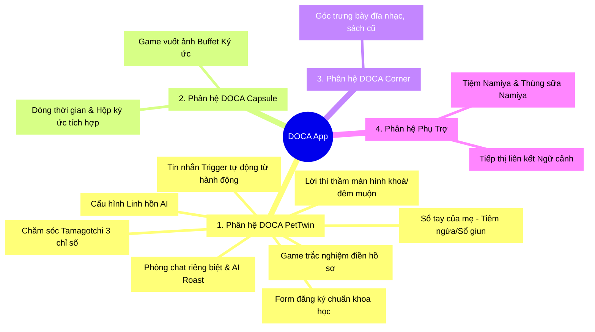

# DANH SÁCH TÍNH NĂNG TOÀN DIỆN (COMPREHENSIVE FEATURE LIST)
## DOCA: PHIÊN BẢN MVP - V1.0

Tài liệu này tổng hợp toàn bộ các tính năng của ứng dụng **DOCA** được phân nhóm theo phân hệ chức năng thương hiệu mới, phân định rõ phạm vi **MVP (Hành động ngay)** và **Tương lai (Tư liệu phát triển)**, tuân thủ nghiêm ngặt theo Bản tuyên ngôn Kim Chỉ Nam của dự án.

---

## 🏛️ BẢN ĐỒ PHÂN HỆ TÍNH NĂNG DOCA

---

## 🐾 PHÂN HỆ 1: DOCA PETTWIN (THÚ CƯNG ẢO & CHĂM SÓC TAMAGOTCHI)

### 1.1. Hồ sơ động chuẩn khoa học (`PetDetail` - MVP)
*   **Mô tả:** Nhận diện các thuộc tính sinh học căn bản: loài (chó/mèo), giống, cân nặng, giới tính, trạng thái triệt sản, ngày sinh nhật, ngày nhận nuôi.
*   **Tính năng bổ sung:** Tự động tính số ngày bên nhau (`togetherDays`), số ngày đếm ngược đến sinh nhật (`daysUntilBirthday`), quy đổi **Tuổi thú cưng sang Tuổi người** (`humanAge`) và xác định **Giai đoạn phát triển** (`LifeStage`) tương ứng.
*   **Sổ tay của mẹ (Care Log Booklet - MVP):** Một tab riêng biệt tích hợp bên trong **Pet Profile** để người dùng ghi chép lịch tiêm ngừa, sổ giun. Khi ghi nhận lịch tiêm/sổ giun ở đây, hệ thống sẽ tự động tạo một sự kiện sức khỏe ghi vào cơ sở dữ liệu dòng thời gian.

### 1.2. Tương tác chăm sóc ảo & Logic tính điểm (Tamagotchi Core - [HOÃN - PHASE 2])
*   **Mô tả:** Tích hợp 3 thanh chỉ số sinh học động (*Dinh dưỡng, Vận động, Hạnh phúc*) và menu các hành động chăm sóc (Cho ăn, Đi dạo, Tắm rửa, Tiêm ngừa/sổ giun) được hoãn sang Phase 2.
*   **Thiết kế MVP V1.0:** Loại bỏ hoàn toàn 3 thanh chỉ số ở trang chủ và nút bấm hành động. Boss ảo hiển thị hoạt ảnh nghỉ ngơi/chơi đùa tĩnh lặng để giữ tính thẩm mỹ MUJI tối giản và giảm 40% khối lượng lập trình.

### 1.3. Kích hoạt hội thoại chat từ hành động (Tamagotchi Chat Triggers - [HOÃN - PHASE 2])
*   Các kịch bản tin nhắn tự phát dựa trên hành động chăm sóc ảo (Cho ăn, Đi dạo, Tắm) và cảnh báo chỉ số thấp (Đ đói bụng, Cuồng chân) sẽ được chuyển toàn bộ sang Phase 2 cùng hệ thống chỉ số sinh học.
*   **Thiết kế MVP V1.0:** Các kịch bản mở đầu chat (Cozy Openers) sẽ dựa hoàn toàn trên các cảm biến tự nhiên và dòng thời gian:
    *   *Trigger Thời tiết & Thời gian:* Pet gợi mở câu chuyện khi trời mưa, sáng sớm, đêm muộn (`DOCA Whispers`).
    *   *Trigger Kỷ niệm:* Pet tự động gọi lại các tấm ảnh cũ hoặc sự kiện y tế lưu trong `DOCA Capsule` để trò chuyện cùng Sen.
    *   *Trắc nghiệm 9h sáng:* Quyết định giữ lại làm công cụ xây dựng profile Pet (`Conversational Builder`).

##### Nhóm Trắc nghiệm Xây dựng Linh hồn (Conversational Builder - MVP):
*   **Kịch bản (Quên mở app > 48h):** Người dùng không mở app hoặc không tương tác trong 48 giờ.
    *   *Incoming Message:* *"Ba quên con rồi đúng không... Con nhớ ba lắm, mở app nói chuyện với con tí đi... 😢"*

---

### 1.4. Trò chơi trắc nghiệm điền Hồ sơ (Conversational Builder - MVP)
*   **Cơ chế hoạt động:**
    1.  Mỗi ngày vào lúc **09:00 sáng**, Boss AI sẽ chủ động gửi 1 câu hỏi trắc nghiệm dưới dạng tin nhắn incoming trong phòng chat của Boss.
    2.  **Giao diện:** Phía trên ô nhập liệu xuất hiện 3-4 nút phản hồi nhanh (Quick Reply Chips) chứa các đáp án định sẵn.
    3.  *Ví dụ:* Boss hỏi: *"Ba ơi, ba thấy con ghét nhất là bị chạm vào đâu?"* ➔ Đáp án gợi ý: `[Đuôi 🐕]`, `[Chân trước 🐾]`, `[Bụng mềm 🥺]`.
    4.  **Logic Ghi Nhận (Ingestion):** Khi người dùng bấm chọn một đáp án:
        *   Đáp án được gửi đi dưới dạng tin nhắn của User.
        *   Boss phản hồi lại một câu hài hước phù hợp tính cách (Ví dụ: *"Chuẩn luôn ba ơi, chạm vào đuôi là con cắn yêu đấy!"*).
        *   Hệ thống tự động phân tích và lưu đáp án này vào trường `likes`/`dislikes` hoặc `petTraits` của Boss trong database.
        *   Dữ liệu này sẽ làm giàu hồ sơ Boss, giúp AI sử dụng làm ngữ cảnh trong các cuộc trò chuyện tương lai (Ví dụ: *"Đừng chạm vào đuôi con nhé!"*).

### 1.5. Nhân cách hóa AI (`PetPersona` - MVP)
*   **Mô tả:** Cho phép người dùng cấu hình "linh hồn ảo" cho Boss bằng cách chọn lựa 1 trong 4 mẫu cá tính: *Ngáo ngơ, Chảnh chọe, Đanh đá, Nịnh nọt*. AI sẽ tự động điều chỉnh tông giọng, cách xưng hô (Self-reference / Owner-term) phù hợp với cá tính đó dưới góc nhìn thứ nhất.

### 1.6. Phòng Chat Riêng Biệt & AI Roast (Vision Ingestion - MVP)
*   **Mô tả:** Mỗi Boss có một phòng chat hoàn toàn riêng biệt. Mọi hình ảnh, màu sắc, bong bóng chat sẽ thay đổi 100% theo giao diện và cá tính đặc trưng của Boss đó. Người dùng có thể gửi ảnh dìm hàng của Boss trong chat và AI (Vision) sẽ đưa ra câu phản hồi trêu chọc/khịa lại Sen cực kỳ hài hước.

### 1.7. DOCA Whispers (Lời thì thầm màn hình khóa - MVP)
*   **Mô tả:** Tự động gửi lời thì thầm ngọt ngào/suy tư nghiêng font Space Mono lên màn hình khóa vào đêm muộn (11h đêm - 2h sáng) để an ủi người dùng bận rộn.

---

## 📸 PHÂN HỆ 2: DOCA CAPSULE (CHIẾC RƯƠNG KÝ ỨC & NẠP KỶ NIỆM)

### 2.1. Dòng thời gian Ký ức & Database Timeline (MVP)
*   **Mô tả:** Một cơ sở dữ liệu dòng thời gian (Database Timeline) tập hợp và lưu giữ tất cả các bản ghi/sự kiện thu thập từ mọi hoạt động của Boss:
    *   Ảnh chụp do người dùng tải lên (`Moments`).
    *   Ký ức hội thoại được trích xuất từ chat (`Chat Memories`).
    *   Nhật ký y tế từ Sổ tay của mẹ (`Medical Logs`).
    *   Nhật ký hành động chăm sóc (`Care Actions`).
*   **Trình diễn:** Các sự kiện từ chat/sức khỏe/chăm sóc sẽ lưu dưới dạng sự kiện văn bản thuần túy (Text-based records). Dòng thời gian này đóng vai trò là Bộ nhớ dài hạn cung cấp ngữ cảnh (Context) để AI Pet đối thoại thấu cảm.

### 2.2. Trò chơi "Buffet Ký Ức" 5 giây (Tinder Swipe Game - [HOÃN - PHASE 2])
*   **Mô tả:** Cơ chế quét ảnh tự động ngầm và giao diện vuốt thẻ bài Tinder được hoãn sang Phase 2.
*   **Thiết kế MVP V1.0 (Nạp Kỷ Niệm Tối Giản):**
    *   *Nút Thêm Kỷ Niệm:* Nhấp nút `[Thêm Kỷ Niệm 📋]` tại Rương ký ức để mở Bottom Sheet chọn ảnh thủ công từ thư viện và nhập ghi chú.
    *   *Nạp qua khung Chat:* Gửi ảnh dìm trực tiếp vào phòng chat với Boss AI. AI sẽ phân tích và tự động đưa tấm ảnh Polaroid đó vào Rương ký ức kèm theo lời bình luận khía hóm hỉnh.

---

## 🎨 PHÂN HỆ 3: DOCA CORNER (GÓC CẢM XÚC - NEW FEATURE)

### 3.1. Ý tưởng cốt lõi (Concept)
*   Một góc triển lãm nhỏ, yên bình bên trong ứng dụng, được thiết kế theo phong cách tối giản MUJI (MUJI Minimalism).
*   Nơi bày biện các "tác phẩm cảm xúc" dưới dạng poster hoặc thẻ bài bo góc (card bo góc) xinh xắn để người dùng thưởng thức và lưu trữ.

### 3.2. Các loại vật phẩm trưng bày (Emotional Cards)
*   **Đĩa nhạc cũ (Vinyls):** Hiển thị đĩa than cổ điển xoay chậm, phát các bản lofi mộc mạc (kết nối Spotify/Youtube để nghe đầy đủ).
*   **Quyển sách cũ:** Bìa sách màu nước bo góc kèm trích dẫn quote sâu sắc chữa lành (dùng font Space Mono Italic).
*   **Nhân vật & Tác giả:** Các thẻ bài bo góc vẽ tay chân dung các tác giả văn học chữa lành (Ví dụ: Keigo Higashino) hoặc các nhân vật mascot của nhà DOCA.

### 3.3. Tương tác (Interaction)
*   Người dùng có thể bấm "Treo lên" để lưu các thẻ này vào bộ sưu tập cá nhân.
*   Gửi tặng các vật phẩm từ DOCA Corner cho Boss ảo như một món quà tinh thần để tăng nhanh chỉ số Hạnh phúc (`Happiness +15`).

---

## 🤖 PHÂN HỆ 4: CÁC PHÂN HỆ PHỤ TRỢ (SUPPORTING ENGINES)

### 4.1. Tiệm Tạp Hóa Namiya - Gieo Tơ Lòng Ẩn Danh (MVP)
*   **Mô tả:** Chiếc hòm thư gỗ MUJI ấm áp đặt cạnh lọ hoa nhỏ ở trang chủ: *"Tiệm tạp hóa Namiya: Hôm nay bạn có nỗi niềm gì cần gỡ rối không? 🐾"*. Nhấp vào sẽ mở Notion-Style Editor để viết thư ẩn danh gửi đi.
*   **Thùng Sữa Namiya (Milk Box Inbox):** Nhận thư phản hồi từ "ông già Namiya và 3 chú mèo" dưới dạng giao diện phẳng, tinh khiết, đậm chất thơ.

### 4.2. Mô hình Tiếp thị Liên kết Ngữ cảnh (Contextual Affiliate Monetization - MVP)
*   **Mô tả:** Thay thế hoàn toàn mô hình Cửa hàng Vật phẩm ảo & Tiền ảo (CatCoins) bằng mô hình Tiếp thị Liên kết (Affiliate Links) tích hợp tinh tế vào các đối tượng văn hóa nghệ thuật (sách, nhạc, vật phẩm, poster) xuất hiện trong luồng chat và Góc Cảm Xúc (DOCA Corner).
*   **Cơ chế hoạt động:**
    *   **Trích xuất thực thể (Entity Tagging):** Các từ khóa về sách, đĩa nhạc, tác phẩm hay nhân vật xuất hiện trong hội thoại hoặc kệ sách được gắn thẻ hyperlink chấm mảnh.
    *   **Hộp thoại Chi tiết (Cozy Bottom Sheet):** Khi nhấp vào, Bottom Sheet trượt lên hiển thị thông tin trích dẫn, ảnh Polaroid nghệ thuật và các nút chuyển hướng trực tiếp kèm mã ID Affiliate của nhà phát triển.
    *   **Đối tác Tích hợp:**
        *   *Sách cũ & Poster:* Liên kết tiếp thị liên kết đến **Shopee Mall** (gian hàng Nhã Nam, Bloom Books) hoặc **Fahasa** (cho người dùng Việt Nam), **Amazon Associates** (cho người dùng quốc tế).
        *   *Âm nhạc:* Liên kết Spotify Referral & Apple Music Partnerize.
*   **Lợi thế kinh doanh (BizDev Strategy):** 
    *   *Tối giản vận hành:* Không cần tích hợp cổng thanh toán (In-App Purchase), không cần cơ sở dữ liệu túi đồ (Inventory) phức tạp, giảm thiểu 90% lỗi giao dịch & đối soát tài chính.
    *   *Giữ vững triết lý Muji:* Tránh thương mại hóa thô bạo (ads, gacha). Người dùng cảm nhận ứng dụng như một cuốn sổ tay gợi ý sách/nhạc chữa lành chân thành, tăng tỷ lệ nhấp chuột (CTR) và tỷ lệ mua hàng (Conversion Rate) tự nhiên.

### 4.3. Safe Vet Engine (Tích hợp có điều kiện - MVP)
*   **Mô tả:** Bộ lọc Đèn Đỏ Cảnh báo Cấp cứu quét từ khóa triệu chứng nguy hiểm trong chat. Khi phát hiện sẽ hiển thị Banner Cảnh báo Ấm áp ngoài trang chủ, hướng dẫn sơ cứu nhanh và định vị GPS 3 phòng khám thú y gần nhất.

---

## 🚀 TÍNH NĂNG CHUYỂN SANG TƯƠNG LAI (FUTURE BACKLOG - PHASE 2)
*   **Trợ lý nổi toàn cục (`AssistantHost`):** Loại bỏ khỏi MVP V1.0.
*   **Gacha Thẻ bài nghệ thuật GenAI cao cấp & Gói thanh quản giọng nói (Voice Packs).**
*   **Hộp Quà Daily Gacha có túi đồ tích lũy.**
*   **Widget OS Home Screen hiển thị Boss ngủ.**
