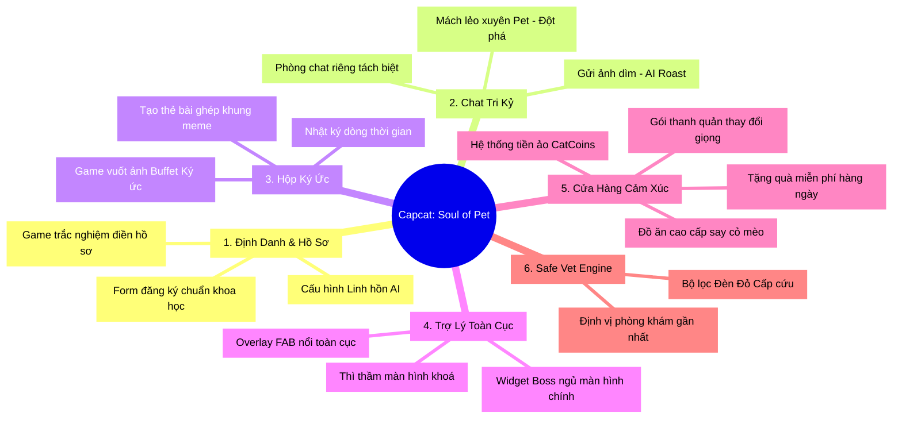

# DANH SÁCH TÍNH NĂNG TOÀN DIỆN (COMPREHENSIVE FEATURE LIST)
## CAPCAT: SOUL OF PET (PHIÊN BẢN: MVP - V1.0)

Tài liệu này tổng hợp toàn bộ các tính năng của ứng dụng **Capcat: Soul of Pet** được phân nhóm theo phân hệ chức năng, phân định rõ phạm vi **MVP (Hành động ngay)** và **Tương lai (Tư liệu phát triển)**, tuân thủ nghiêm ngặt theo Bản tuyên ngôn Kim Chỉ Nam của dự án.

---

## 🏛️ BẢN ĐỒ PHÂN HỆ TÍNH NĂNG CAPCAT

---

## 🐾 PHÂN HỆ 1: ĐỊNH DANH & HỒ SƠ THÚ CƯNG (IDENTITY & PROFILING)

### 1.1. Hồ sơ động chuẩn khoa học (`PetDetail` - MVP)
*   **Mô tả:** Nhận diện các thuộc tính sinh học căn bản: loài (chó/mèo), giống, cân nặng, giới tính, trạng thái triệt sản, ngày sinh nhật, ngày nhận nuôi.
*   **Tính năng bổ sung:** Tự động tính số ngày bên nhau (`togetherDays`), số ngày đếm ngược đến sinh nhật (`daysUntilBirthday`), quy đổi **Tuổi thú cưng sang Tuổi người** (`humanAge`) và xác định **Giai đoạn phát triển** (`LifeStage`) tương ứng.

### 1.2. Trò chơi trắc nghiệm điền Hồ sơ (Conversational Builder - MVP)
*   **Mô tả:** Thay thế form điền truyền thống bằng game trắc nghiệm 1 câu hỏi/ngày trong luồng chat do Boss AI khơi gợi để tự động cập nhật thuộc tính thích/ghét (`likes`/`dislikes`) của thú cưng vào database.

### 1.3. Nhân cách hóa AI (`PetPersona` - MVP)
*   **Mô tả:** Cho phép người dùng cấu hình "linh hồn ảo" cho Boss bằng cách chọn lựa 1 trong 4 mẫu cá tính: *Ngáo ngơ, Chảnh chọe, Đanh đá, Nịnh nọt*. AI sẽ tự động điều chỉnh tông giọng, cách xưng hô (Self-reference / Owner-term) phù hợp với cá tính đó.

---

## 💬 PHÂN HỆ 2: PHÒNG CHAT TRI KỶ AI (INTERACTIVE CHAT ROOM)

### 2.1. Phòng Chat Riêng Biệt Tách Bản (Isolated Chat Threads - MVP)
*   **Mô tả:** Mỗi Boss có một phòng chat hoàn toàn riêng biệt. Mọi hình ảnh, màu sắc, bong bóng chat sẽ thay đổi 100% theo giao diện và cá tính đặc trưng của Boss đó, tránh làm loãng cảm xúc.

### 2.2. Gửi ảnh dìm - AI Roast (Vision Ingestion - MVP)
*   **Mô tả:** Cho phép người dùng gửi ảnh dìm hàng của Boss trực tiếp trong chat. AI sử dụng công nghệ Vision đọc hiểu bức ảnh và đưa ra câu phản hồi trêu chọc/khịa lại Sen cực kỳ hài hước.

### 2.3. Mách lẻo xuyên Pet (Cross-Pet Memory Bridge - MVP Đột phá)
*   **Mô tả:** AI của Pet A (Mèo Bánh Mỳ) có khả năng đọc Moments của Pet B (Chó Lucky) để nhắn tin mách lẻo hoặc khịa chéo với Sen (Ví dụ: *"Sen ơi nãy thằng Lucky nó ngáo ngơ lắm..."*).

---

## 📸 PHÂN HỆ 3: HỘP KÝ ỨC & ĐỒ HỌA MEME (MEMORY BOX & PRIVATE DIARY)

### 3.1. Dòng thời gian Ký ức (`Moments Feed` - MVP)
*   **Mô tả:** Bảng tin tổng hợp các khoảnh khắc, nhật ký của toàn bộ thú cưng trong gia đình.
*   **Tác vụ ngầm:** Ảnh gửi trong chat sẽ tự động được hệ thống gắn thẻ `petId` và đóng gói thành Moments chạy trên bảng tin này mà người dùng không cần đăng thủ công.

### 3.2. Trò chơi "Buffet Ký Ức" 5 giây (Tinder Swipe Game - MVP)
*   **Mô tả:** Game quét ảnh ngoại tuyến bằng ML Kit cục bộ trên máy, hiển thị 15 ảnh chứa Pet dạng thẻ bài Tinder. Người dùng vuốt phải để nạp ảnh vào Hộp ký ức (nhận câu chọc từ AI, cộng điểm Thân mật) hoặc vuốt trái để giữ riêng tư.

### 3.3. Thẻ bài Meme ghép khung (Meme Card Generator - MVP)
*   **Mô tả:** Tự động cắt mặt thú cưng từ ảnh gửi trong chat ghép vào 100+ khung hình vui nhộn được vẽ sẵn (Hoàng đế, phi hành gia) ngay trên điện thoại (chi phí API = 0đ) để chia sẻ lên mạng xã hội lấy Awareness.

---

## 🤖 PHÂN HỆ 4: TRỢ LÝ TOÀN CỤC & WIDGET (COMPANION HOST & WIDGETS)

### 4.1. Trợ lý phủ nổi toàn cục (`AssistantHost` - MVP)
*   **Mô tả:** Một widget nổi thông minh chạy đè lên tất cả các màn hình của ứng dụng dưới hình ảnh chibi của Boss ảo. Nhấp vào sẽ mở nhanh khung chat nhanh với Boss.

### 4.2. Thì thầm màn hình khóa luân phiên (Dynamic Push Whispers - MVP)
*   **Mô tả:** Tự động điều phối luân phiên các Pet gửi lời thì thầm ngọt ngào/ngáo ngơ lên màn hình khóa vào đêm muộn (11h đêm - 2h sáng).

### 4.3. Widget Boss ngủ màn hình chính (Interactive Home Widget - Tương lai)
*   **Mô tả:** Widget của hệ điều hành điện thoại hiển thị Boss đang ngủ khò khò. Khi chạm vào, Boss vươn vai thức dậy tạo chuyển động mượt mà.

---

## 💰 PHÂN HỆ 5: CỬA HÀNG CẢM XÚC & DÒNG TIỀN (VIRTUAL TREAT & GACHA SHOP)

### 5.1. Tặng quà miễn phí hàng ngày (Daily Free Treats - MVP)
*   **Mô tả:** Tặng thức ăn thường miễn phí mỗi ngày để tạo thói quen chăm sóc Boss ảo và xây dựng chỉ số Thân Mật trước khi giới thiệu tính năng trả phí.

### 5.2. Cửa hàng vật phẩm ảo Say cỏ mèo (Premium Treats Shop - Tương lai)
*   **Mô tả:** Bán các vật phẩm đặc biệt bằng tiền CatCoins (Pate hoàng gia, Xì-gà Cỏ mèo). Khi dâng vật phẩm này, Boss AI sẽ kích hoạt các chế độ chat say xỉn/tưng bưng cực kỳ độc lạ.

### 5.3. Gacha Thẻ bài nghệ thuật GenAI cao cấp (Tương lai)
*   **Mô tả:** Sử dụng API GenAI để vẽ ảnh nghệ thuật thực sự từ ảnh chụp. Mở khóa thêm lượt sinh ảnh bằng tiền CatCoins hoặc xem video quảng cáo (Rewarded Ads).

### 5.4. Gói thanh quản thay đổi Giọng nói (Voice Packs - Tương lai)
*   **Mô tả:** Bán các gói âm thanh/giọng đọc biểu cảm cao (Mèo Chảnh chọe, Chó Quý tộc) để phát âm thanh thì thầm thay vì hiển thị text thô.

---

## 🚑 PHÂN HỆ 6: SAFE-VET TRIAGE ENGINE (ĐỊNH HƯỚNG Y TẾ AN TOÀN)

### 6.1. Bộ lọc Đèn Đỏ Cảnh báo Cấp cứu (Red-Flag Detection - MVP)
*   **Mô tả:** Quét từ khóa triệu chứng nguy hiểm (khó thở, co giật, ngộ độc). Khi phát hiện, ngay lập tức tắt luồng chat y tế tự do của AI và hiển thị Thẻ Cảnh báo Đèn Đỏ.

### 6.2. Chỉ đường & Gọi điện Phòng khám (GPS Clinic Finder - MVP)
*   **Mô tả:** Sử dụng GPS tìm 3 phòng khám thú y gần nhất đang mở cửa, tích hợp nút gọi nhanh và bản đồ dẫn đường cứu hộ.

### 6.3. Cẩm nang Sơ cứu Duy trì sự sống (First-Aid Step Guide - MVP)
*   **Mô tả:** Hiển thị 3 bước sơ cứu nhanh bằng hình ảnh động trực quan để chủ nuôi duy trì sự sống cho Boss trong lúc di chuyển đến phòng khám.
