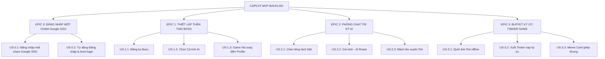

# AGILE PRODUCT BACKLOG & USER STORIES: CAPCAT - SOUL OF PET
*(PHIÊN BẢN: MVP V1.0 - CHUẨN ĐẶC TẢ PHÁT TRIỂN)*

Tài liệu này đặc tả chi tiết danh sách **EPICS, User Stories và Tiêu chí nghiệm thu (Acceptance Criteria - AC)** cho giai đoạn MVP của dự án Capcat. Đây là kim chỉ nam kỹ thuật giúp **Maya (Designer UI/UX)** thiết kế prototype chuẩn xác và **Alan/Benny (Engineering)** lập trình mã nguồn không sai lệch.

---

## 🏛️ TỔNG QUAN PHÂN RÃ CÁC EPICS

---

## 🔐 EPIC 0: ĐĂNG NHẬP MỘT CHẠM (ONE-TAP GOOGLE SSO AUTHENTICATION)

### US-0.1: Đăng nhập Nhanh chóng qua Google SSO (Single Sign-On)
*   **Phát biểu:** 
    *   *Là một:* Người dùng bận rộn (Sen),
    *   *Tôi muốn:* Đăng nhập vào app bằng tài khoản Google của mình chỉ với một chạm,
    *   *Để:* Tôi có thể sử dụng ngay ứng dụng mà không cần qua các bước điền form đăng ký email/mật khẩu phiền phức.
*   **Tiêu chí Nghiệm thu (Acceptance Criteria):**
    *   **AC-1 (Sleek Auth UI):** Hiển thị màn hình Chào mừng (Welcome Screen) mang phong cách thương hiệu sắc sảo, có nút bấm nổi bật **"Đăng nhập bằng Google"** tích hợp logo Google chuẩn.
    *   **AC-2 (Google SDK Integration):** Khi nhấn nút, app kích hoạt hộp thoại xác thực bảo mật của Google SDK. Nhận về hồ sơ người dùng (Tên hiển thị, Email, Ảnh đại diện Google).
    *   **AC-3 (State Synchronization):** Đồng bộ tài khoản Google vừa đăng nhập với hệ thống **Firebase Authentication** để quản lý phiên và bảo mật người dùng.
*   **Technical Context (Alan):** Sử dụng các package đã có sẵn trong `pubspec.yaml`: `google_sign_in` và `firebase_auth`.

### US-0.2: Duy trì phiên đăng nhập & Tự động đăng nhập (Auto-login)
*   **Phát biểu:**
    *   *Là một:* Người dùng cũ quay lại app,
    *   *Tôi muốn:* Ứng dụng tự động đăng nhập thẳng vào màn hình chính mà không bắt tôi phải bấm lại nút đăng nhập,
    *   *Để:* Tôi tiết kiệm thời gian tiếp cận Boss ảo.
*   **Tiêu chí Nghiệm thu (Acceptance Criteria):**
    *   **AC-1 (Token Caching):** Lưu an toàn Session Token của người dùng xuống Secure Storage cục bộ sau khi đăng nhập thành công.
    *   **AC-2 (Splash Verification):** Tại màn hình Splash Screen, app tự động kiểm tra tính hợp lệ của token/Firebase Auth. Nếu hợp lệ -> chuyển thẳng vào Home Screen. Nếu hết hạn -> dẫn về Welcome Screen.
*   **Technical Context (Benny):** Tận dụng `[old]auth_check_screen.dart` để tái cấu trúc luồng check auth bằng Riverpod state.

---

## 🐶 EPIC 1: THIẾT LẬP THẦN THÁI BOSS (PET IDENTITY & PROFILING)

### US-1.1: Đăng ký & Thiết lập Thông tin Sinh học của Boss
*   **Phát biểu:** 
    *   *Là một:* Chủ nuôi thú cưng (Sen),
    *   *Tôi muốn:* Điền các thông tin cơ bản của Boss (loài, giống, giới tính, cân nặng, ngày nhận nuôi) một cách nhanh gọn,
    *   *Để:* App tự động tính toán các chỉ số sinh học động của Boss.
*   **Tiêu chí Nghiệm thu (Acceptance Criteria):**
    *   **AC-1 (Onboarding):** Người dùng có thể chọn loài (Chó hoặc Mèo), nhập tên Boss và tải lên ảnh đại diện ban đầu.
    *   **AC-2 (Calculated Fields):** Hệ thống tự động tính toán và hiển thị: số ngày ở bên nhau (`togetherDays`), số ngày đếm ngược đến sinh nhật tiếp theo, và **Tuổi người quy đổi** của Boss dựa trên ngày sinh và giống loài.
    *   **AC-3 (Validation):** Không cho phép bỏ trống tên Boss và loài. Cân nặng phải nhập dạng số dương.
*   **Technical Context (Alan):** Dữ liệu lưu xuống Model `PetDetail` cục bộ qua `shared_preferences`.

### US-1.2: Cấu hình Mẫu cá tính & Linh hồn Boss (`PetPersona`)
*   **Phát biểu:**
    *   *Là một:* Chủ nuôi thú cưng,
    *   *Tôi muốn:* Lựa chọn mẫu cá tính đặc trưng cho Boss (Ngáo ngơ, Chảnh chọe, Đanh đá, Nịnh nọt),
    *   *Để:* Định hình giọng điệu giao tiếp của Boss ảo trong suốt ứng dụng.
*   **Tiêu chí Nghiệm thu (Acceptance Criteria):**
    *   **AC-1 (Selection UI):** Hiển thị màn hình 4 thẻ bài cá tính với hình minh họa chibi Boss ngộ nghĩnh và mô tả ngắn về thói quen của cá tính đó.
    *   **AC-2 (Self-Terms Update):** Khi chọn một cá tính, hệ thống tự động gán cấu hình xưng hô tương ứng (Ví dụ: Cá tính *Chảnh chọe* gán xưng hô: Pet xưng "Trẫm" - gọi chủ là "Sen"; Cá tính *Nịnh nọt* gán xưng hô: Pet xưng "Con" - gọi chủ là "Ba/Mẹ").
*   **Technical Context (Benny):** Maya cần vẽ 4 trạng thái chibi Boss khác nhau tương ứng với 4 cá tính này.

### US-1.3: Trò chơi Trắc nghiệm Hỏi xoáy điền Profile (Conversational Builder)
*   **Phát biểu:**
    *   *Là một:* Chủ nuôi thú cưng lười điền thông tin,
    *   *Tôi muốn:* Trả lời các câu hỏi trắc nghiệm ngắn vui vẻ do Boss AI hỏi hàng ngày trong chat,
    *   *Để:* Tự động hoàn thiện hồ sơ sở thích/thói quen của Boss mà không cảm thấy nhàm chán.
*   **Tiêu chí Nghiệm thu (Acceptance Criteria):**
    *   **AC-1 (Daily Trigger):** Mỗi ngày 1 lần duy nhất khi người dùng mở chat, Boss AI sẽ gửi 1 câu hỏi trắc nghiệm về thói quen của Boss dưới dạng các nút bấm nhanh (Ví dụ: *"Đố Sen biết trẫm ghét bị tắm bằng gì nhất? [A. Nước lạnh] \| [B. Sữa tắm mùi nhài] \| [C. Ghét tất cả]"*).
    *   **AC-2 (Profile Ingestion):** Khi người dùng click chọn nút đáp án, hệ thống tự động ghi nhận thuộc tính đó vào trường `PetDetail.brief` (Likes/Dislikes) và lưu lại mà không bắt người dùng nhập text.
    *   **AC-3 (AI Response):** Boss AI lập tức phản hồi 1 câu chọc ghẹo phù hợp với đáp án vừa chọn trước khi quay lại luồng chat tự do.

---

## 💬 EPIC 2: PHÒNG CHAT TRI KỶ AI & ROAST ẢNH DÌM (ISOLATED CHAT & ROAST)

### US-2.1: Giao diện Phòng Chat riêng biệt tách bản (Isolated Chat Threads)
*   **Phát biểu:**
    *   *Là một:* Chủ nuôi có nhiều thú cưng,
    *   *Tôi muốn:* Chat với từng Boss trong các phòng chat hoàn toàn riêng biệt,
    *   *Để:* Cảm xúc không bị loãng và giữ nguyên tính tri kỷ độc bản của từng con.
*   **Tiêu chí Nghiệm thu (Acceptance Criteria):**
    *   **AC-1 (Isolated UI):** Khi mở chat với Lucky (chó), toàn bộ avatar, hình nền khung chat, và màu sắc bong bóng chat mang phong cách của Lucky. Khi sang chat với Bánh Mỳ (mèo), giao diện thay đổi 100% sang phong cách của Bánh Mỳ.
    *   **AC-2 (State Isolation):** Lịch sử tin nhắn, hàng đợi tin nhắn của Pet nào phải nằm trọn vẹn trong phòng chat của Pet đó, tuyệt đối không bị trộn lẫn dữ liệu.
*   **Technical Context (Alan):** Quản lý luồng chat thông qua `petId` định danh trong Riverpod state (`nanny_chat_provider.dart`).

### US-2.2: Gửi ảnh dìm hàng - AI Vision Roast
*   **Phát biểu:**
    *   *Là một:* Chủ nuôi thích chụp ảnh dìm của Boss,
    *   *Tôi muốn:* Gửi ảnh chụp Boss ngáo ngơ trực tiếp vào khung chat,
    *   *Để:* Nhận lại câu phản hồi "khịa" hài hước, chọc ghẹo từ AI dựa trên bức ảnh đó.
*   **Tiêu chí Nghiệm thu (Acceptance Criteria):**
    *   **AC-1 (Photo Upload):** Nút gửi ảnh hoạt động mượt mà trong khung chat, cho phép chọn ảnh từ thư viện.
    *   **AC-2 (Vision Roast Response):** Hệ thống gửi ảnh qua Vision LLM API. AI trả về câu bình luận chuẩn xác về tư thế hoặc trạng thái của thú cưng trong ảnh (Ví dụ: ngủ há mồm, ngã chổng vó) kèm giọng điệu trêu đùa của cá tính Boss.
    *   **AC-3 (Auto-Moment Generation):** Bức ảnh gửi lên kèm câu khịa của AI tự động được hệ thống lưu lại và đóng gói thành một bài nhật ký mới trên bảng tin Moments cá nhân ở màn hình chính.

### US-2.3: Tương tác Gia đình Chéo (Mách lẻo xuyên Pet - Đột phá)
*   **Phát biểu:**
    *   *Là một:* Chủ nuôi có từ 2 thú cưng trở lên,
    *   *Tôi muốn:* Boss A (mèo) nhắn tin kể xấu/mách lẻo về trò đùa của Boss B (chó) với tôi và ngược lại,
    *   *Để:* Cảm nhận không khí gia đình thú cưng sống động, vui nhộn thực tế.
*   **Tiêu chí Nghiệm thu (Acceptance Criteria):**
    *   **AC-1 (Cross-Context Injection):** Khi mở phòng chat của Pet A, prompt AI sẽ nhận thêm ngữ cảnh tóm tắt từ các Moments gần nhất có gắn tag `petId` của Pet B trong cùng một gia đình.
    *   **AC-2 (Conversational Snitch):** AI Pet A sẽ ngẫu nhiên chủ động nhắn tin mách lẻo về trò nghịch ngợm của Pet B (Ví dụ: *"Sen ơi trẫm vừa thấy thằng Lucky cắn rách cái dép đi trong nhà của Sen ở phòng khách kìa!"*).
    *   **AC-3 (Emotional Feedback Loop):** Khi người dùng sang phòng chat của Pet B, Pet B sẽ có phản hồi ấm ức hoặc giải thích ngây ngô khi bị chủ nuôi hỏi tội.

---

## 📸 EPIC 3: BUFFET KÝ ỨC TINDER GAME (TINDER SWIPE & MEME CARDS)

### US-3.1: Xin quyền Limited Access & Quét ảnh Pet Cục bộ (Offline ML Kit)
*   **Phát biểu:**
    *   *Là một:* Người dùng chú trọng bảo mật riêng tư,
    *   *Tôi muốn:* Ứng dụng chỉ được phép xem các bức ảnh mà tôi cho phép,
    *   *Để:* Tôi cảm thấy an toàn và tin cậy khi sử dụng.
*   **Tiêu chí Nghiệm thu (Acceptance Criteria):**
    *   **AC-1 (Limited Dialog):** Hệ thống kích hoạt hộp thoại phân quyền hệ điều hành dạng **"Chỉ cho phép truy cập các ảnh được chọn"**.
    *   **AC-2 (Offline Scan):** Bộ quét ảnh chạy ngầm cục bộ 100% bằng ML Kit trên máy người dùng, nhận diện và lọc ra tối đa 15 ảnh chứa Chó/Mèo trong số ảnh được phân quyền. **Tuyệt đối không gửi ảnh lên máy chủ trong bước này.**
    *   **AC-3 (Failure State):** Nếu quét không ra ảnh Pet nào, hiển thị màn hình trống thân thiện hướng dẫn người dùng cách chọn thêm ảnh Pet.

### US-3.2: Trò chơi "Buffet Ký Ức" 5 giây (Tinder Swipe Card Game)
*   **Phát biểu:**
    *   *Là một:* Chủ nuôi bận rộn và lười upload ảnh,
    *   *Tôi muốn:* Vuốt trái/phải các thẻ bài ảnh dìm Boss như chơi game Tinder,
    *   *Để:* Nạp ký ức nhanh chóng dưới 5 giây và nhận Dopamine tương tác vui vẻ.
*   **Tiêu chí Nghiệm thu (Acceptance Criteria):**
    *   **AC-1 (Swipe UI):** Hiển thị 15 ảnh đã quét dưới dạng một stack thẻ bài xếp chồng lên nhau. Cho phép vuốt trái hoặc vuốt phải mượt mà kèm hiệu ứng xoay nghiêng thẻ bài theo ngón tay kéo.
    *   **AC-2 (Swipe Right Action):** Vuốt phải = Đồng ý nạp ảnh. Ảnh lập tức được tải lên ngầm (Background upload), tạo bài viết Moments mới, cộng `Intimacy +5` cho Pet, và kích hoạt bong bóng thoại AI chọc ghẹo bay lên.
    *   **AC-3 (Swipe Left Action):** Vuốt trái = Bỏ qua ảnh. Thẻ bài bay ra ngoài màn hình và ảnh giữ nguyên trạng thái riêng tư cục bộ trên máy.
    *   **AC-4 (Feast Summary):** Khi vuốt hết 15 ảnh, hiển thị màn hình tổng kết Boss chibi ôm bụng căng tròn no nê và tặng thưởng 1 viên Kẹo Ảo.

### US-3.3: Thẻ bài Meme ghép khung tự động (Meme Card Generator - 0đ)
*   **Phát biểu:**
    *   *Là một:* Người nuôi thú cưng thích khoe ảnh dìm,
    *   *Tôi muốn:* Tự động ghép khuôn mặt của Boss trong ảnh dìm vào các khung hình meme hài hước vẽ sẵn,
    *   *Để:* Dễ dàng tải về hoặc chia sẻ lên Story Instagram/Facebook.
*   **Tiêu chí Nghiệm thu (Acceptance Criteria):**
    *   **AC-1 (Local Compositing):** App tự động sử dụng thư viện đồ họa cục bộ trên máy để cắt khuôn mặt Boss và ghép đè vào các khung hình meme chibi ngộ nghĩnh (không gọi API tốn phí).
    *   **AC-2 (Template Library):** Cung cấp danh sách các khung hình meme (phi hành gia, hoàng đế) trượt ngang phía dưới để người dùng thay đổi khung hình theo ý thích.
    *   **AC-3 (Social Share):** Nút **"Chia sẻ Story"** hoạt động chính xác, tạo ra ảnh đầu ra chất lượng cao kèm watermark nhỏ "Capcat: Soul of Pet" ở góc dưới.

---
*Tài liệu Backlog & User Stories được biên soạn và kiểm duyệt bởi CPO Sophia phục vụ cho giai đoạn thiết kế UI/UX và phát triển mã nguồn Capcat MVP.*
