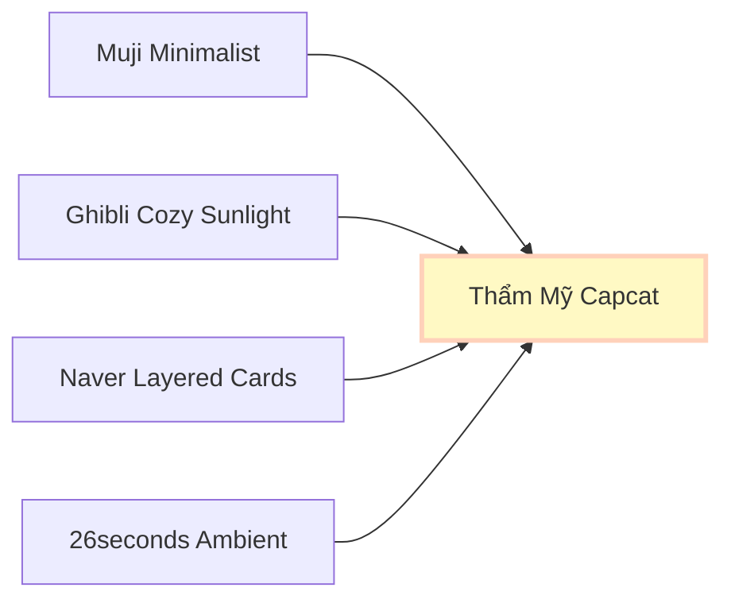

# ĐỒNG BỘ NỀN TẢNG HỆ THỐNG THIẾT KẾ: CAPCAT DESIGN SYSTEM FOUNDATION
*(CẨM NANG THIẾT KẾ MỸ THUẬT & TOKENS CHO THỂ LOẠI CHỮA LÀNH IYASHIKEI)*

---

> [!NOTE]  
> Tài liệu này được biên soạn độc quyền cho **Capcat: Soul of Pet**, kế thừa tinh thần thẩm mỹ từ hai ứng dụng định hình phong cách **26seconds** và **Naver Digital Diary**. 
> Hệ thống thiết kế này là **kim chỉ nam tối cao** giúp các kỹ sư phát triển ứng dụng (`capcat_app`) hiện thực hóa giao diện lập trình mà không cần can thiệp trực tiếp vào mã nguồn của dự án trong giai đoạn này.

---

## 🧭 1. Triết Lý Thẩm Mỹ (The Artistic Philosophy)

Hệ thống thiết kế của **Capcat** không hướng tới sự bóng bẩy, hiện đại công nghiệp của các ứng dụng SaaS thông thường. Nó hướng tới sự **hoài niệm, mộc mạc, yên bình và đậm chất thơ (Iyashikei)**. 



*   **Sự Tĩnh Lặng Trực Quan:** Bố cục thoáng đãng, tối ưu khoảng trắng (negative space) rộng lớn để mắt người dùng được thư giãn sâu sắc vào ban đêm.
*   **Cấu Trúc Tối Giản Hiện Đại (Modern Classic Structure):** Giao diện phẳng tinh khiết, các card, panel và menu điều hướng được sắp xếp ngăn nắp, cân đối bằng các đường viền mảnh tinh tế (`1px solid`) và các thẻ bo góc nhẹ nhàng (`12px - 16px`), mang lại sự sang trọng và tin cậy cao của phong cách modern classic.
*   **Sự Ấm Áp Tinh Tế (Subtle Warmth):** Màu sắc được lựa chọn ở các tông dịu nhẹ và tối giản, kết hợp giữa nền trắng/tối thuần khiết và các điểm nhấn tinh tế để tạo không khí chữa lành và cảm xúc, tuyệt đối không lạm dụng hiệu ứng đồ họa lòe loẹt hay hình ảnh trang trí rườm rà.

---

## 🎨 2. Hệ Thống Màu Sắc (Color Tokens System)

Dựa trên triết lý trải nghiệm của **26seconds**, hệ thống màu sắc được cấu trúc thành **Chủ đề Sáng (Cozy Light) làm chủ đạo** cho toàn bộ app (Trang chủ, Thư viện, Chat, Cài đặt), và **Chủ đề Tối (Cozy Dark) chuyên biệt** dành riêng cho các trải nghiệm có chiều sâu cảm xúc cao, game tương tác, postcard lưu niệm hoặc vé tàu hành trình (Boarding Pass).

### 2.1. Danh Sách Mã Màu Bản Sắc (Brand Palette)

| Token Name | Hex Code | HSL Value | Ý Nghĩa Thẩm Mỹ & Ứng Dụng |
| :--- | :--- | :--- | :--- |
| **MÀU SÁNG CHỦ ĐẠO** | | | *(Dành cho luồng chính: Trang chủ, Thư viện, Chat)* |
| `Pure White` | `#FFFFFF` | `hsl(0, 0%, 100%)` | Nền ứng dụng chính, sạch sẽ, rộng rãi, chuẩn Muji |
| `Oatmeal Background`| `#F8F9FA` | `hsl(210, 17%, 98%)`| Nền phụ hoặc nền lưới cho các thẻ danh mục |
| `Soft Milk Beige` | `#F5F5F0` | `hsl(60, 13%, 95%)` | Bề mặt giấy thủ công, làm màu nền của thẻ Moments |
| `Deep Obsidian` | `#1C1C1E` | `hsl(240, 2%, 11%)` | Chữ chính trên nền sáng, rõ nét nhưng rất dịu mắt |
| `Charcoal Black` | `#121212` | `hsl(0, 0%, 7%)` | Các nút hành động chính (Primary Button), tạo tương phản cao |
| **MÀU TỐI CHUYÊN BIỆT**| | | *(Dành cho: Game quẹt thẻ, Postcard, Boarding Pass, Premium)*|
| `Dark Slate` | `#0D0D0D` | `hsl(0, 0%, 5%)` | Bóng đêm vô cực làm nền chính cho Game quẹt thẻ, Postcard |
| `Ticket Charcoal` | `#1E1F24` | `hsl(228, 9%, 13%)` | Màu thẻ Ticket, Boarding Pass (Bo góc `28px` cực kỳ sang trọng) |
| `Neon Healing Green`| `#76C123` | `hsl(88, 69%, 45%)` | Màu nhấn phát sáng cho mục tiêu, mốc đo lường và nút Premium |
| `Warm Amber Light` | `#FFF9C4` | `hsl(54, 100%, 89%)` | Ánh đèn ngủ ấm áp ban đêm, vạt nắng xiên nhẹ dịu |
| **MÀU NHẤN TRUYỀN THỐNG NHẬT BẢN** | | | *(Ý nghĩa văn hóa tâm hồn - Emotional & Functional Accents)* |
| `Sakura Pink` | `#FCAFAF` | `hsl(350, 93%, 84%)` | **Hồng Anh Đào:** Gợi sự ấm áp, yêu thương tri kỷ, dành riêng cho **Boss Mèo**, tim thân mật, và các nút cưng nựng. |
| `Matcha Green` | `#8FA882` | `hsl(100, 20%, 58%)` | **Xanh Matcha (Earthy Zen):** Gợi sự bình yên tĩnh lặng của trà đạo, dành riêng cho **Boss Chó**, tiến trình đi dạo và mốc y khoa Safe-Vet. |

---

### 2.2. Đặc Tả Giao Diện Đa Theme (Theme Specs Mapping)

```
1. Cozy Light Mode (CHỦ ĐẠO - Mặc Định Hệ Thống)
+-----------------------------------------------------------------------+
|  BACKGROUND (Nền ứng dụng)           -->  Pure White (#FFFFFF)        |
|  SURFACE CARD (Thẻ bài lớn)          -->  Soft Milk Beige (#F5F5F0)   |
|  TEXT ON SURFACE (Chữ trên thẻ)      -->  Deep Obsidian (#1C1C1E)      |
|  TEXT ON BACKGROUND (Chữ trên nền)   -->  Deep Obsidian (#1C1C1E)      |
|  PRIMARY BUTTON (Nút bấm chính)      -->  Charcoal Black (#121212)     |
|  PRIMARY CHAT BUBBLE (Sen nói)       -->  Cat Pastel Peach (#FFD1BA)   |
|  SECONDARY CHAT BUBBLE (Pet trả lời)  -->  Soft Milk Beige (#F5F5F0)   |
+-----------------------------------------------------------------------+

2. Cozy Dark Mode (CHUYÊN BIỆT - Màn hình Game quẹt thẻ, Postcard, Ticket)
+-----------------------------------------------------------------------+
|  BACKGROUND (Nền ứng dụng)           -->  Dark Slate (#0D0D0D)         |
|  SURFACE TICKET (Khung thẻ game/vé)  -->  Ticket Charcoal (#1E1F24)    |
|  ACCENT TARGET (Điểm nhấn trạng thái)-->  Neon Healing Green (#76C123)  |
|  TEXT ON SURFACE (Chữ trên thẻ vé)   -->  Pure White (#FFFFFF)        |
|  TEXT ON BACKGROUND (Chữ trên nền)   -->  Soft Milk Beige (#F5F5F0)   |
|  PRIMARY BUTTON (Nút hành động tối)  -->  Pure White (#FFFFFF)        |
+-----------------------------------------------------------------------+
```

### 2.3. Màu Nhận Diện Trạng Thái (Semantic Soft Colors)

Tránh tuyệt đối các tông màu đỏ chói hay xanh neon. Toàn bộ thông điệp hệ thống đều sử dụng dải màu nhẹ dịu mắt:
*   **Thành công (Cozy Success):** `#E8F5E9` (Pastel Sage Green) - Gợi cảm giác xanh tươi của cây cỏ vườn nhà.
*   **Cảnh báo (Cozy Warning):** `#FFE0B2` (Soft Apricot Orange) - Màu cam của vỏ quýt chín.
*   **Lỗi / Khẩn cấp (Cozy Error):** `#FFCDD2` (Dusty Cherry Pink) - Màu hồng nhạt cánh hoa anh đào úa.
*   **Thông tin (Cozy Info):** `#E1F5FE` (Pale Sky Blue) - Màu xanh da trời ban mai lãng đãng sương mù.

---

### 2.4. Phân Cấp Màu Sắc Nút Bấm (Button Color Hierarchy Specs)

Để đảm bảo tính nhất quán trực quan y hệt như cấu trúc tinh tế của **26seconds**, hệ thống nút bấm của Capcat được phân chia thành 3 lớp rõ rệt:

#### A. Trong Chủ Đề Sáng (Cozy Light - Chủ Đạo)
1.  **Nút Bấm Chính (Primary Button):**
    *   *Màu nền:* `Charcoal Black` (`#121212`) - Đen than đá sẫm tuyệt đối.
    *   *Màu chữ:* `Pure White` (`#FFFFFF`) dùng font `Quicksand Bold`.
    *   *Ứng dụng:* Dành cho các hành động quyết định như "Đăng nhập", "Bắt đầu ngay", "Kế tiếp".
2.  **Nút Bấm Phụ (Secondary Button):**
    *   *Màu nền:* `Oatmeal Background` (`#F8F9FA`) kết hợp đường viền mảnh `1px` màu `#EAEAEA`.
    *   *Màu chữ:* `Deep Obsidian` (`#1C1C1E`) dùng font `Quicksand Medium`.
    *   *Ứng dụng:* Dành cho các hành động bổ trợ như "Bỏ qua", "Quay lại", "Hủy bỏ".
3.  **Nút Tương Tác Cảm Xúc (Sensory Pet Buttons):**
    *   *Nút tương tác Mèo:* Nền hồng pastel `Sakura Pink` (`#FCAFAF` với độ mờ 20%), chữ `Deep Obsidian` sẫm. Dành riêng cho nút cưng nựng mèo ("Cho mèo ăn", "Vuốt ve Bánh Mỳ").
    *   *Nút tương tác Chó:* Nền xanh pastel `Matcha Green` (`#8FA882` với độ mờ 15%), chữ `Deep Obsidian` sẫm. Dành riêng cho nút cưng nựng chó ("Đi dạo cùng Lucky", "Chải lông").

#### B. Trong Chủ Đề Tối (Cozy Dark - Chuyên Biệt)
1.  **Nút Bấm Chính (Primary Button):**
    *   *Màu nền:* `Pure White` (`#FFFFFF`).
    *   *Màu chữ:* `Charcoal Black` (`#121212`) dùng font `Quicksand Bold`.
    *   *Ứng dụng:* Cho các hành động nổi bật nhất trong bóng đêm (Ví dụ: Nút Premium "Mua Capcat Premium").
2.  **Nút Bấm Phụ (Secondary Button):**
    *   *Màu nền:* Kính mờ `Glassmorphism` (`Colors.white.withOpacity(0.08)`) viền mỏng gradient.
    *   *Màu chữ:* `Soft Milk Beige` (`#F5F5F0`) dùng font `Quicksand Medium`.
    *   *Ứng dụng:* Dành cho các lựa chọn bổ trợ hoặc các tag lọc trong game quẹt thẻ.

---

## ✍️ 3. Hệ Thống Kiểu Chữ (Typography Tokens System)

Để đạt được sự nhẹ nhàng, tinh tế và dễ chịu tối đa cho võng mạc, hệ thống kiểu chữ của Capcat sử dụng cấu trúc **phối hợp các Font không chân (Sans-serif) bo góc mềm mại**, chỉ sử dụng font có chân (Serif) làm điểm nhấn thơ ca cực kỳ giới hạn.

1.  **Quicksand (Google Fonts - Primary Sans-serif):** Font không chân có các góc bo tròn đầu (rounded terminals) cực kỳ thân thiện, ấm áp và dễ thương. Đóng vai trò là linh hồn giao tiếp chủ đạo cho các tiêu đề lớn, nút bấm tương tác và tin nhắn trò chuyện của Boss & Sen.
2.  **Nunito (Google Fonts - Secondary Sans-serif):** Font không chân có tỷ lệ hoàn hảo, bo góc nhẹ nhàng, cực kỳ thanh lịch và dễ đọc ở các đoạn văn dài. Sử dụng cho các phần mô tả hoạt động, nhãn phụ và trang cài đặt.
3.  **Outfit (Google Fonts - Numeric Sans-serif):** Font không chân mang phong cách hình học tối giản (geometric). Sử dụng riêng để hiển thị các con số kỹ thuật, cân nặng, thời gian đi dạo để đảm bảo tính hiện đại, sắc nét và sang trọng.
4.  **Playfair Display / Noto Serif JP (Serif - Accent Font Only):** Font có chân cổ điển sang trọng. **Tuyệt đối giới hạn** chỉ sử dụng cho các câu triết lý ngẫu nhiên lúc đêm muộn (`whisperItalic`) hoặc trích dẫn thơ ca đặc biệt để tạo cảm giác tự sự lãng mạn như một cuốn tiểu thuyết chữa lành.

### Bảng Phân Cấp Kiểu Chữ Chuẩn (Typography Hierarchy Scale)

| Token Name | Font Family | Size (sp/dp) | Weight | Line Height | Usage / Áp dụng thực tế |
| :--- | :--- | :--- | :--- | :--- | :--- |
| `displayLarge` | *Quicksand* | `32` | Bold (700) | `1.2` | Tiêu đề chương lớn hoan nghênh, Tên Pet ở Dashboard |
| `headlineLarge` | *Quicksand* | `24` | Bold (700) | `1.3` | Tiêu đề của Thẻ Ký ức (Moments Card) |
| `titleLarge` | *Quicksand* | `20` | SemiBold (600) | `1.4` | Tên người dùng, Tiêu đề phần Chat, Tiêu đề Popup |
| `bodyLarge` | *Quicksand* | `16` | Medium (500) | `1.5` | Nội dung tin nhắn chat thân mật của Boss & Sen |
| `bodyMedium` | *Nunito* | `14` | Regular (400) | `1.5` | Nội dung mô tả hoạt động chăm sóc thường nhật, thẻ phụ |
| `whisperItalic`| *Playfair Display* | `15` | Medium Italic (500) | `1.6` | **[Điểm nhấn Serif đặc biệt]** Lời thì thầm chiêm nghiệm đêm muộn |
| `numericLabel` | *Outfit* | `13` | SemiBold (600) | `1.2` | Số cân nặng, số phút đi dạo, mốc thời gian hiển thị |
| `buttonText` | *Quicksand* | `15` | SemiBold (600) | `1.0` | Chữ hiển thị trên các nút bấm bo góc tròn chính |
| `captionText` | *Nunito* | `12` | Regular (400) | `1.4` | Dấu mốc thời gian phụ (Time Stamp), chú thích chú giải |

---

## 🎴 4. Hình Khối & Bo Góc Tối Giản (Border Radius & Shapes)

Tính chất chữa lành của Iyashikei không mâu thuẫn với sự tinh tế của ngôn ngữ thiết kế tối giản hiện đại. Sự bo cong trong Capcat được khống chế ở tỷ lệ vừa phải, tinh khiết, mang lại cảm giác ngăn nắp, chuyên nghiệp và sang trọng:

```
                  CẤU TRÚC BO GÓC DỰ ÁN CAPCAT
    
    [ Border Radius 16px ]  --->  Thẻ bài chính (Cards), Hộp thoại
    +-------------------------------------------------------------+
    | [ Border Radius 12px ] --->  Nút bấm, Panel tương tác phụ  |
    | +--------------------+                                      |
    | | [ 8px ] Tag        |                                      |
    | +--------------------+                                      |
    +-------------------------------------------------------------+
```

*   **`Radius.cozyCard` (16px):** Áp dụng cho các thẻ bài chính hiển thị ở màn hình Swipe game (Buffet Ký ức), khung ảnh dìm hàng, và các hộp thoại pop-up trung tâm. Giúp thẻ bài có góc bo tròn thanh nhã, mỏng nhẹ, không bị phình to bong bóng kiểu chibi.
*   **`Radius.cozyButton` (12px):** Áp dụng cho các nút bấm hành động (Ví dụ: "Gửi ký ức", "Chải lông"), bảng điều khiển chức năng phụ, thanh input chat.
*   **`Radius.cozyTag` (8px):** Dành cho các nhãn phân loại nhỏ như loài pet (Chó, Mèo), mức độ thân mật (Bạn bè, Tri kỷ), hoặc nhãn thời gian.
*   **`Radius.cozyAvatar` (8px):** Áp dụng cho avatar phụ của Pet hoặc người dùng để có hình khối bo tròn góc tinh tế.

---

## 🌌 5. Kính Mờ & Đổ Bóng Cozy (Glassmorphism & Shadows)

### 5.1. Hiệu Ứng Kính Mờ (Glassmorphism Spec)

Để tạo hiệu ứng như sương mù lúc bình minh che phủ các thung lũng Nhật Bản, các panel điều khiển phụ nổi trên nền tối được thiết kế dưới dạng kính mờ:

*   **Độ Mờ Nền (Backdrop Filter Blur):** `sigmaX: 8.0 - 12.0`, `sigmaY: 8.0 - 12.0` (tiết chế vừa phải, giữ cho chữ luôn rõ nét).
*   **Màu Phủ (Tint Color Overlay):**
    *   *Cozy Dark:* `Colors.white.withOpacity(0.06)` hoặc `Colors.black.withOpacity(0.4)`.
    *   *Cozy Light:* `Colors.white.withOpacity(0.7)`.
*   **Nguyên tắc áp dụng:** Kính mờ chỉ được sử dụng ở các panel bổ trợ hoặc bottom sheet nhỏ lơ lửng, tuyệt đối không lạm dụng đè lên các vùng hiển thị thông tin chính gây rối mắt.
*   **Đường Viền Kính (Frosted Border):** Viền cực mỏng `1.0px` tinh tế màu trắng sữa hoặc đen mờ nhẹ, không lấp lánh cầu kỳ:
    *   *Top-left:* `Colors.white.withOpacity(0.08)`.
    *   *Bottom-right:* `Colors.white.withOpacity(0.02)`.

---

### 5.2. Đổ Bóng Ấm Áp (Cozy Ambient Shadows)

Tuyệt đối **không** dùng bóng đen đậm góc cạnh (`rgba(0,0,0,0.5)`). Bóng đổ trong Capcat giả lập sự tán xạ ánh sáng tự nhiên mềm mại, có tông màu ấm áp lan tỏa:

*   **Chế Độ Tối (Cozy Dark):** 
    *   Sử dụng bóng đổ tán xạ mang sắc cam ấm dịu (`#FFD1BA` ở mức mờ cực sâu) để mô phỏng hào quang ấm áp của Boss tỏa ra xung quanh căn phòng trống:
    *   `boxShadow`: `color: rgba(255, 209, 186, 0.04)`, `blurRadius: 30`, `spreadRadius: 2`, `offset: Offset(0, 10)`.
*   **Chế Độ Sáng (Cozy Light):**
    *   Sử dụng bóng đổ mang sắc xám yến mạch nhẹ nhàng để tôn vinh sự mộc mạc của giấy:
    *   `boxShadow`: `color: rgba(28, 28, 30, 0.03)`, `blurRadius: 24`, `spreadRadius: 0`, `offset: Offset(0, 8)`.

---

## 🌅 6. Dải Màu Chuyển Cảm Xúc (Cozy Healing Gradients)

Ứng dụng sử dụng 3 dải màu chuyển chính giúp nhấn mạnh yếu tố thời gian trôi chậm rãi của phong cách Slow-life:

```
1. VẠT NẮNG XIÊN (Warm Sunbeams)
   [#FFF9C4 - 100% Opacity] ====> [#FFD1BA - 40% Opacity]
   (Ứng dụng: Màn hình loading thư giãn, nền các Moment ban ngày)

2. HOÀNG HÔN GA TÀU (Twilight Station)
   [#120E2E - 100% Opacity] ====> [#121212 - 100% Opacity]
   (Ứng dụng: Giao diện trò chuyện đêm muộn của Boss)

3. HƠI ẤM TRÁI TIM (Heartbeat Warmth)
   [#FFE5D9 - 100% Opacity] ====> [#FFFFFF - 100% Opacity]
   (Ứng dụng: Giao diện nâng cấp độ thân mật, mở khóa Ký Ức)
```

---

## 🎵 7. Trải Nghiệm Xúc Giác & Âm Thanh (Sonic & Haptic Specs)

Hệ thống thiết kế Iyashikei không chỉ nằm ở thị giác, nó tác động sâu sắc vào thính giác và xúc giác để tạo cảm giác tri kỷ:

### 7.1. Đặc Tả Rung Xúc Giác (Haptic Feedback Matrix)

*   **Nhịp Rung Tiếng Mèo Thở (Cat Purring Haptic):**
    *   *Tần số:* Trùng lặp liên tục `40Hz` - `50Hz` (siêu thấp).
    *   *Biên độ:* Rất nhẹ, ngắt quãng mỗi `1.2 giây` khi người dùng ấn giữ vuốt ve thú cưng trên màn hình. Giả lập cảm giác chân thật như chú mèo đang nằm trên đùi và thở ấm áp.
*   **Nhịp Gạt Thẻ Ký Ức (Moment Swipe Haptic):**
    *   *Loại:* Light Impact Haptic. Kích hoạt một nhịp giật nhẹ duy nhất khi một thẻ bài được gạt hoàn tất sang phải hoặc sang trái trong trò chơi Swipe.

---

### 7.2. Đặc Tả Không Gian Âm Thanh (Ambient Soundscape Specs)

*   **Âm lượng mặc định:** Cố định ở mức `20%` khi khởi chạy, không gây giật mình cho người dùng lúc đêm muộn.
*   **Chuyển đổi âm lượng (Fade-in / Fade-out):** Mọi bản nhạc ambient acoustic khi bật/tắt hoặc chuyển màn hình phải áp dụng hiệu ứng chuyển đổi mượt mà kéo dài tối thiểu `2.5 giây` để tránh sự đứt gãy đột ngột về cảm xúc.
*   **Lo-fi Acoustic Filter:** Các bản nhạc Ghibli lofi dạo đàn guitar được lọc bớt dải tần số cao gắt (High-cut filter ở ngưỡng `8000Hz`), tăng nhẹ dải trung trầm để tạo cảm giác âm thanh ấm, mộc, phát ra từ một chiếc loa đĩa than cổ điển trong căn phòng gỗ.

---

## 🛠️ 8. Hướng Dẫn Phát Triển Hệ Thống Cho Kỹ Sư Lập Trình (Developer Integration Blueprint)

> [!IMPORTANT]  
> Các kỹ sư phát triển ứng dụng Flutter (`capcat_app`) được khuyến nghị tuyệt đối tuân thủ cấu trúc khai báo Tokens này dưới dạng mã nguồn độc lập trong thư mục `lib/theme/` khi bắt đầu triển khai code trong các giai đoạn tiếp theo.

### 8.1. Tổ Chức Cấu Trúc Khai Báo (Theme Architecture Concept)

Kỹ sư nên triển khai mã nguồn thành 3 file độc lập để quản lý tập trung:

1.  `app_theme.dart`: Chứa định nghĩa `ThemeData` cho Light và Dark mode của ứng dụng, ánh xạ trực tiếp các mã màu của `Capcat Design System`.
2.  `app_text_styles.dart`: Khai báo hệ thống font chữ phân cấp rõ ràng (`Quicksand`, `Nunito`, `Outfit`, và điểm nhấn `Playfair Display`), thiết lập đúng trọng số (weights) và khoảng giãn dòng (`height`).
3.  `app_decorations.dart`: Định nghĩa sẵn các cấu trúc `BoxDecoration` mẫu cho hiệu ứng Kính mờ (Glassmorphic Container), bo góc lớn `Radius.cozyCard`, và đổ bóng tán xạ mờ ảo `Cozy Shadows`.

### 8.2. Tài liệu mô tả cách lập trình mẫu (Implementation Reference):

Kỹ sư có thể tạo ra các class tĩnh (static classes) như sau:

*   **Khai báo Màu Sắc (`AppColors`):**
    ```dart
    class AppColors {
      // Cozy Light (Chủ đạo hệ thống)
      static const Color pureWhite = Color(0xFFFFFFFF);
      static const Color oatmealBg = Color(0xFFF8F9FA);
      static const Color milkBeige = Color(0xFFF5F5F0);
      static const Color deepObsidian = Color(0xFF1C1C1E);
      static const Color charcoalBlack = Color(0xFF121212);

      // Cozy Dark (Chuyên biệt: Game quẹt thẻ, Postcard, Boarding Pass)
      static const Color darkSlate = Color(0xFF0D0D0D);
      static const Color ticketCharcoal = Color(0xFF1E1F24);
      static const Color neonGreen = Color(0xFF76C123);
      static const Color warmAmber = Color(0xFFFFF9C4);

      // Màu Nhấn Truyền Thống Nhật Bản (Emotional Accents)
      static const Color sakuraPink = Color(0xFFFCAFAF); // Hồng Anh Đào (Mèo)
      static const Color matchaGreen = Color(0xFF8FA882); // Xanh Matcha (Chó, Trà Đạo)
    }
    ```

*   **Khai báo Bo Góc & Độ Mờ (`AppDecorations`):**
    ```dart
    class AppDecorations {
      static const double radiusCard = 16.0;
      static const double radiusButton = 12.0;
      
      // Trang trí thẻ bài ở chế độ Sáng chủ đạo (Modernist Flat Card)
      static final BoxDecoration lightCardDecoration = BoxDecoration(
        color: AppColors.pureWhite,
        borderRadius: BorderRadius.circular(radiusCard),
        border: Border.all(color: const Color(0xFFEAEAEA), width: 1.0),
        boxShadow: [
          BoxShadow(
            color: const Color(0xFF1C1C1E).withOpacity(0.02),
            blurRadius: 16,
            spreadRadius: 0,
            offset: const Offset(0, 4),
          )
        ],
      );

      // Trang trí thẻ Ticket/Postcard ở chế độ Tối chuyên biệt
      static final BoxDecoration darkTicketDecoration = BoxDecoration(
        color: AppColors.ticketCharcoal,
        borderRadius: BorderRadius.circular(radiusCard),
        border: Border.all(color: const Color(0xFF2C2C2E), width: 1.0),
        boxShadow: [
          BoxShadow(
            color: const Color(0xFFFFD1BA).withOpacity(0.02),
            blurRadius: 20,
            spreadRadius: 0,
            offset: const Offset(0, 6),
          )
        ],
      );
    }
    ```

*   **Khai báo Kiểu Chữ (`AppTextStyles`):**
    ```dart
    class AppTextStyles {
      // Font không chân chính: Thân thiện, tròn trịa dễ thương
      static const TextStyle chatBubbleText = TextStyle(
        fontFamily: 'Quicksand',
        fontSize: 16.0,
        fontWeight: FontWeight.w500,
        height: 1.5,
        color: AppColors.deepObsidian,
      );

      // Font không chân phụ: Thanh lịch, dễ đọc cho nội dung dài
      static const TextStyle bodyTextDescription = TextStyle(
        fontFamily: 'Nunito',
        fontSize: 14.0,
        fontWeight: FontWeight.w400,
        height: 1.5,
        color: AppColors.deepObsidian,
      );

      // Font không chân số học: Hiện đại, hình học sắc nét
      static const TextStyle numericStats = TextStyle(
        fontFamily: 'Outfit',
        fontSize: 13.0,
        fontWeight: FontWeight.w600,
        height: 1.2,
        color: AppColors.deepObsidian,
      );

      // Font có chân duy nhất: Dành riêng cho lời thì thầm tự sự đặc biệt
      static const TextStyle whisperItalic = TextStyle(
        fontFamily: 'Playfair Display',
        fontSize: 15.0,
        fontWeight: FontWeight.w500,
        fontStyle: FontStyle.italic,
        height: 1.6,
        color: AppColors.deepObsidian,
      );
    }
    ```

---

## 🗃️ 9. Trạng Thái Cập Nhật Hệ Thống (Version Ledger)

*   **Phiên bản hiện tại:** `v1.0.0-Iyashikei`
*   **Người phụ trách thiết kế:** Maya (UI/UX Designer)
*   **Mức độ phê duyệt:** Hoàn chỉnh - Sẵn sàng cho việc tham chiếu và phát triển.

*Mọi thay đổi đối với tài liệu Design System Foundation bắt buộc phải qua sự phê duyệt của Hội đồng Mỹ thuật Capcat.*
