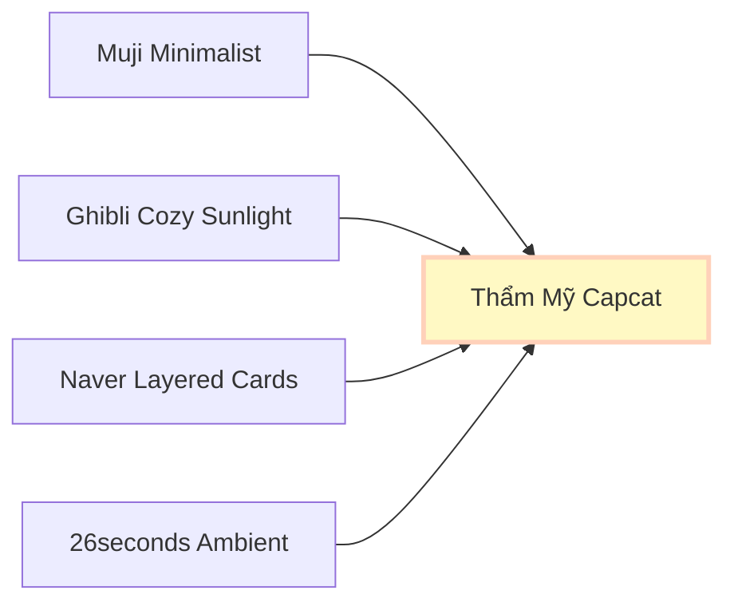

# ĐỒNG BỘ NỀN TẢNG HỆ THỐNG THIẾT KẾ: CAPCAT DESIGN SYSTEM FOUNDATION
*(CẨM NANG THIẾT KẾ MỸ THUẬT & TOKENS CHO THỂ LOẠI CHỮA LÀNH IYASHIKEI)*

---

> [!NOTE]  
> Tài liệu này được biên soạn độc quyền cho **Capcat: Soul of Pet**, kế thừa tinh thần thẩm mỹ từ hai ứng dụng định hình phong cách **26seconds** và **Naver Digital Diary**. 
> Hệ thống thiết kế này là **kim chỉ nam tối cao** giúp các kỹ sư phát triển ứng dụng (`capcat_app`) hiện thực hóa giao diện lập trình mà không cần can thiệp trực tiếp vào mã nguồn của dự án trong giai đoạn này.

---

## 🧭 1. Triết Lý Thẩm Mỹ (The Artistic Philosophy)

Hệ thống thiết kế của **Capcat** không hướng tới sự bóng bẩy, hiện đại công nghiệp của các ứng dụng SaaS thông thường. Nó hướng tới sự **hoài niệm, mộc mạc, yên bình và đậm chất thơ (Iyashikei)**. 



*   **Sự Tĩnh Lặng Trực Quan:** Bố cục thoáng đãng, các khoảng thở lớn để mắt người dùng được thư giãn sâu sắc vào ban đêm.
*   **Xúc Giác Thủ Công (Analog Feel):** Cảm giác như đang chạm vào các trang giấy tái chế, những tấm thẻ bìa các-tông dày dặn bo góc mềm, lật nhẹ nhàng qua nhau.
*   **Vạt Nắng Xiên Quá Khứ:** Việc sử dụng các dải màu pastel ấm áp gợi nhớ về những buổi chiều hoàng hôn hay những tia nắng xiên qua khung cửa sổ phòng đọc sách gỗ cũ.

---

## 🎨 2. Hệ Thống Màu Sắc (Color Tokens System)

Bảng màu được chia làm hai chủ đề chính: **Cozy Dark (Bóng Đêm Tĩnh Lặng)** là chủ đề mặc định của ứng dụng để xoa dịu võng mạc vào ban đêm, và **Cozy Light (Nắng Sớm Ngoại Ô)** làm chủ đề phụ sáng sủa, ấm áp.

### 2.1. Danh Sách Mã Màu Bản Sắc (Brand Palette)

| Token Name | Hex Code | HSL Value | Ý Nghĩa Nghệ Thuật & Ứng Dụng |
| :--- | :--- | :--- | :--- |
| `Dark Slate` | `#0D0D0D` | `hsl(0, 0%, 5%)` | Bóng đêm vô cực ngoài cửa sổ, nền sâu nhất của app |
| `Deep Charcoal` | `#121212` | `hsl(0, 0%, 7%)` | Nền phụ của các khu vực chat, tạo chiều sâu 3D |
| `Milk Beige` | `#F5F5F0` | `hsl(60, 13%, 95%)` | Màu trang giấy nhật ký cổ điển, màu thẻ bài chính |
| `Deep Obsidian` | `#1C1C1E` | `hsl(240, 2%, 11%)` | Chữ chính trên nền Milk Beige, rõ ràng nhưng không gắt |
| `Cat Pastel Peach` | `#FFD1BA` | `hsl(20, 100%, 86%)` | Màu nhấn đặc trưng của Boss Mèo (Bánh Mỳ), ấm áp |
| `Dog Pastel Sage` | `#E8F5E9` | `hsl(120, 38%, 94%)` | Màu nhấn đặc trưng của Boss Chó (Lucky), thanh bình |
| `Warm Amber Light` | `#FFF9C4` | `hsl(54, 100%, 89%)` | Ánh đèn ngủ ấm áp, vạt nắng xiên nhẹ dịu |
| `Soft Card Ivory` | `#FCFCF9` | `hsl(60, 20%, 98%)` | Thẻ bài phụ trong chế độ Sáng (Cozy Light) |

---

### 2.2. Đặc Tả Giao Diện Đa Theme (Theme Specs Mapping)

```
Cozy Dark Mode (Mặc Định - Deep Night)
+-----------------------------------------------------------------------+
|  BACKGROUND (Nền ứng dụng)           -->  Dark Slate (#0D0D0D)         |
|  SURFACE CARD (Thẻ bài lớn)          -->  Milk Beige (#F5F5F0)         |
|  TEXT ON SURFACE (Chữ trên thẻ)      -->  Deep Obsidian (#1C1C1E)      |
|  TEXT ON BACKGROUND (Chữ trên nền)   -->  Milk Beige (#F5F5F0)         |
|  PRIMARY CHAT BUBBLE (Sen nói)       -->  Cat Pastel Peach (#FFD1BA)   |
|  SECONDARY CHAT BUBBLE (Pet trả lời)  -->  Soft Card Ivory (#FCFCF9)    |
+-----------------------------------------------------------------------+

Cozy Light Mode (Nắng Sớm - Warm Sunrise)
+-----------------------------------------------------------------------+
|  BACKGROUND (Nền ứng dụng)           -->  Milk Beige (#F5F5F0)         |
|  SURFACE CARD (Thẻ bài lớn)          -->  Soft Card Ivory (#FCFCF9)    |
|  TEXT ON SURFACE (Chữ trên thẻ)      -->  Deep Obsidian (#1C1C1E)      |
|  TEXT ON BACKGROUND (Chữ trên nền)   -->  Deep Obsidian (#1C1C1E)      |
|  PRIMARY CHAT BUBBLE (Sen nói)       -->  Cat Pastel Peach (#FFD1BA)   |
|  SECONDARY CHAT BUBBLE (Pet trả lời)  -->  Deep Charcoal (#121212)      |
+-----------------------------------------------------------------------+
```

### 2.3. Màu Nhận Diện Trạng Thái (Semantic Soft Colors)

Tránh tuyệt đối các tông màu đỏ chói hay xanh neon. Toàn bộ thông điệp hệ thống đều sử dụng dải màu nhẹ dịu mắt:
*   **Thành công (Cozy Success):** `#E8F5E9` (Pastel Sage Green) - Gợi cảm giác xanh tươi của cây cỏ vườn nhà.
*   **Cảnh báo (Cozy Warning):** `#FFE0B2` (Soft Apricot Orange) - Màu cam của vỏ quýt chín.
*   **Lỗi / Khẩn cấp (Cozy Error):** `#FFCDD2` (Dusty Cherry Pink) - Màu hồng nhạt cánh hoa anh đào úa.
*   **Thông tin (Cozy Info):** `#E1F5FE` (Pale Sky Blue) - Màu xanh da trời ban mai lãng đãng sương mù.

---

## ✍️ 3. Hệ Thống Kiểu Chữ (Typography Tokens System)

Để đạt được sự nhẹ nhàng, tinh tế và dễ chịu tối đa cho võng mạc, hệ thống kiểu chữ của Capcat sử dụng cấu trúc **phối hợp các Font không chân (Sans-serif) bo góc mềm mại**, chỉ sử dụng font có chân (Serif) làm điểm nhấn thơ ca cực kỳ giới hạn.

1.  **Quicksand (Google Fonts - Primary Sans-serif):** Font không chân có các góc bo tròn đầu (rounded terminals) cực kỳ thân thiện, ấm áp và dễ thương. Đóng vai trò là linh hồn giao tiếp chủ đạo cho các tiêu đề lớn, nút bấm tương tác và tin nhắn trò chuyện của Boss & Sen.
2.  **Nunito (Google Fonts - Secondary Sans-serif):** Font không chân có tỷ lệ hoàn hảo, bo góc nhẹ nhàng, cực kỳ thanh lịch và dễ đọc ở các đoạn văn dài. Sử dụng cho các phần mô tả hoạt động, nhãn phụ và trang cài đặt.
3.  **Outfit (Google Fonts - Numeric Sans-serif):** Font không chân mang phong cách hình học tối giản (geometric). Sử dụng riêng để hiển thị các con số kỹ thuật, cân nặng, thời gian đi dạo để đảm bảo tính hiện đại, sắc nét và sang trọng.
4.  **Playfair Display / Noto Serif JP (Serif - Accent Font Only):** Font có chân cổ điển sang trọng. **Tuyệt đối giới hạn** chỉ sử dụng cho các câu triết lý ngẫu nhiên lúc đêm muộn (`whisperItalic`) hoặc trích dẫn thơ ca đặc biệt để tạo cảm giác tự sự lãng mạn như một cuốn tiểu thuyết chữa lành.

### Bảng Phân Cấp Kiểu Chữ Chuẩn (Typography Hierarchy Scale)

| Token Name | Font Family | Size (sp/dp) | Weight | Line Height | Usage / Áp dụng thực tế |
| :--- | :--- | :--- | :--- | :--- | :--- |
| `displayLarge` | *Quicksand* | `32` | Bold (700) | `1.2` | Tiêu đề chương lớn hoan nghênh, Tên Pet ở Dashboard |
| `headlineLarge` | *Quicksand* | `24` | Bold (700) | `1.3` | Tiêu đề của Thẻ Ký ức (Moments Card) |
| `titleLarge` | *Quicksand* | `20` | SemiBold (600) | `1.4` | Tên người dùng, Tiêu đề phần Chat, Tiêu đề Popup |
| `bodyLarge` | *Quicksand* | `16` | Medium (500) | `1.5` | Nội dung tin nhắn chat thân mật của Boss & Sen |
| `bodyMedium` | *Nunito* | `14` | Regular (400) | `1.5` | Nội dung mô tả hoạt động chăm sóc thường nhật, thẻ phụ |
| `whisperItalic`| *Playfair Display* | `15` | Medium Italic (500) | `1.6` | **[Điểm nhấn Serif đặc biệt]** Lời thì thầm chiêm nghiệm đêm muộn |
| `numericLabel` | *Outfit* | `13` | SemiBold (600) | `1.2` | Số cân nặng, số phút đi dạo, mốc thời gian hiển thị |
| `buttonText` | *Quicksand* | `15` | SemiBold (600) | `1.0` | Chữ hiển thị trên các nút bấm bo góc tròn chính |
| `captionText` | *Nunito* | `12` | Regular (400) | `1.4` | Dấu mốc thời gian phụ (Time Stamp), chú thích chú giải |

---

## 🎴 4. Hình Khối & Bo Góc (Border Radius & Shapes)

Tính chất chữa lành của Iyashikei chống lại những đường nét sắc nhọn vuông vức. Sự bo cong mang lại cảm giác mềm mại, an toàn và dễ chịu tuyệt đối cho tâm lý con người.

```
                  CẤU TRÚC BO GÓC DỰ ÁN CAPCAT
    
    [ Border Radius 28px ]  --->  Thẻ bài chính, Hộp thoại Moments
    +-------------------------------------------------------------+
    | [ Border Radius 16px ] --->  Nút bấm, Panel tương tác phụ  |
    | +--------------------+                                      |
    | | [ 12px ] Tag       |                                      |
    | +--------------------+                                      |
    +-------------------------------------------------------------+
```

*   **`Radius.cozyCard` (24px - 28px):** Áp dụng cho các thẻ bài chính hiển thị ở màn hình Swipe game (Buffet Ký ức), khung ảnh dìm hàng, và các hộp thoại pop-up trung tâm.
*   **`Radius.cozyButton` (16px):** Áp dụng cho các nút bấm hành động (Ví dụ: "Gửi ký ức", "Chải lông"), bảng điều khiển chức năng phụ, thanh input chat.
*   **`Radius.cozyTag` (12px):** Dành cho các nhãn phân loại nhỏ như loài pet (Chó, Mèo), mức độ thân mật (Bạn bè, Tri kỷ), hoặc nhãn thời gian.
*   **`Radius.cozyAvatar` (8px):** Áp dụng cho avatar phụ của Pet hoặc người dùng để không bị quá tròn xoe công nghiệp mà có hình khối bo tròn góc tinh tế.

---

## 🌌 5. Kính Mờ & Đổ Bóng Cozy (Glassmorphism & Shadows)

### 5.1. Hiệu Ứng Kính Mờ (Glassmorphism Spec)

Để tạo hiệu ứng như sương mù lúc bình minh che phủ các thung lũng Nhật Bản, các panel điều khiển phụ nổi trên nền tối được thiết kế dưới dạng kính mờ:

*   **Độ Mờ Nền (Backdrop Filter Blur):** `sigmaX: 12.0`, `sigmaY: 12.0` đến `16.0`.
*   **Màu Phủ (Tint Color Overlay):**
    *   *Cozy Dark:* `Colors.white.withOpacity(0.06)` hoặc `Colors.black.withOpacity(0.4)`.
    *   *Cozy Light:* `Colors.white.withOpacity(0.7)`.
*   **Đường Viền Kính (Frosted Border):** Viền mỏng `1.5px`, sử dụng gradient tuyến tính từ trên xuống:
    *   *Top-left:* `Colors.white.withOpacity(0.12)` (Đón ánh nắng dịu nhẹ).
    *   *Bottom-right:* `Colors.white.withOpacity(0.02)` (Khuất ánh sáng).

---

### 5.2. Đổ Bóng Ấm Áp (Cozy Ambient Shadows)

Tuyệt đối **không** dùng bóng đen đậm góc cạnh (`rgba(0,0,0,0.5)`). Bóng đổ trong Capcat giả lập sự tán xạ ánh sáng tự nhiên mềm mại, có tông màu ấm áp lan tỏa:

*   **Chế Độ Tối (Cozy Dark):** 
    *   Sử dụng bóng đổ tán xạ mang sắc cam ấm dịu (`#FFD1BA` ở mức mờ cực sâu) để mô phỏng hào quang ấm áp của Boss tỏa ra xung quanh căn phòng trống:
    *   `boxShadow`: `color: rgba(255, 209, 186, 0.04)`, `blurRadius: 30`, `spreadRadius: 2`, `offset: Offset(0, 10)`.
*   **Chế Độ Sáng (Cozy Light):**
    *   Sử dụng bóng đổ mang sắc xám yến mạch nhẹ nhàng để tôn vinh sự mộc mạc của giấy:
    *   `boxShadow`: `color: rgba(28, 28, 30, 0.03)`, `blurRadius: 24`, `spreadRadius: 0`, `offset: Offset(0, 8)`.

---

## 🌅 6. Dải Màu Chuyển Cảm Xúc (Cozy Healing Gradients)

Ứng dụng sử dụng 3 dải màu chuyển chính giúp nhấn mạnh yếu tố thời gian trôi chậm rãi của phong cách Slow-life:

```
1. VẠT NẮNG XIÊN (Warm Sunbeams)
   [#FFF9C4 - 100% Opacity] ====> [#FFD1BA - 40% Opacity]
   (Ứng dụng: Màn hình loading thư giãn, nền các Moment ban ngày)

2. HOÀNG HÔN GA TÀU (Twilight Station)
   [#120E2E - 100% Opacity] ====> [#121212 - 100% Opacity]
   (Ứng dụng: Giao diện trò chuyện đêm muộn của Boss)

3. HƠI ẤM TRÁI TIM (Heartbeat Warmth)
   [#FFE5D9 - 100% Opacity] ====> [#FFFFFF - 100% Opacity]
   (Ứng dụng: Giao diện nâng cấp độ thân mật, mở khóa Ký Ức)
```

---

## 🎵 7. Trải Nghiệm Xúc Giác & Âm Thanh (Sonic & Haptic Specs)

Hệ thống thiết kế Iyashikei không chỉ nằm ở thị giác, nó tác động sâu sắc vào thính giác và xúc giác để tạo cảm giác tri kỷ:

### 7.1. Đặc Tả Rung Xúc Giác (Haptic Feedback Matrix)

*   **Nhịp Rung Tiếng Mèo Thở (Cat Purring Haptic):**
    *   *Tần số:* Trùng lặp liên tục `40Hz` - `50Hz` (siêu thấp).
    *   *Biên độ:* Rất nhẹ, ngắt quãng mỗi `1.2 giây` khi người dùng ấn giữ vuốt ve thú cưng trên màn hình. Giả lập cảm giác chân thật như chú mèo đang nằm trên đùi và thở ấm áp.
*   **Nhịp Gạt Thẻ Ký Ức (Moment Swipe Haptic):**
    *   *Loại:* Light Impact Haptic. Kích hoạt một nhịp giật nhẹ duy nhất khi một thẻ bài được gạt hoàn tất sang phải hoặc sang trái trong trò chơi Swipe.

---

### 7.2. Đặc Tả Không Gian Âm Thanh (Ambient Soundscape Specs)

*   **Âm lượng mặc định:** Cố định ở mức `20%` khi khởi chạy, không gây giật mình cho người dùng lúc đêm muộn.
*   **Chuyển đổi âm lượng (Fade-in / Fade-out):** Mọi bản nhạc ambient acoustic khi bật/tắt hoặc chuyển màn hình phải áp dụng hiệu ứng chuyển đổi mượt mà kéo dài tối thiểu `2.5 giây` để tránh sự đứt gãy đột ngột về cảm xúc.
*   **Lo-fi Acoustic Filter:** Các bản nhạc Ghibli lofi dạo đàn guitar được lọc bớt dải tần số cao gắt (High-cut filter ở ngưỡng `8000Hz`), tăng nhẹ dải trung trầm để tạo cảm giác âm thanh ấm, mộc, phát ra từ một chiếc loa đĩa than cổ điển trong căn phòng gỗ.

---

## 🛠️ 8. Hướng Dẫn Phát Triển Hệ Thống Cho Kỹ Sư Lập Trình (Developer Integration Blueprint)

> [!IMPORTANT]  
> Các kỹ sư phát triển ứng dụng Flutter (`capcat_app`) được khuyến nghị tuyệt đối tuân thủ cấu trúc khai báo Tokens này dưới dạng mã nguồn độc lập trong thư mục `lib/theme/` khi bắt đầu triển khai code trong các giai đoạn tiếp theo.

### 8.1. Tổ Chức Cấu Trúc Khai Báo (Theme Architecture Concept)

Kỹ sư nên triển khai mã nguồn thành 3 file độc lập để quản lý tập trung:

1.  `app_theme.dart`: Chứa định nghĩa `ThemeData` cho Light và Dark mode của ứng dụng, ánh xạ trực tiếp các mã màu của `Capcat Design System`.
2.  `app_text_styles.dart`: Khai báo hệ thống font chữ phân cấp rõ ràng (`Quicksand`, `Nunito`, `Outfit`, và điểm nhấn `Playfair Display`), thiết lập đúng trọng số (weights) và khoảng giãn dòng (`height`).
3.  `app_decorations.dart`: Định nghĩa sẵn các cấu trúc `BoxDecoration` mẫu cho hiệu ứng Kính mờ (Glassmorphic Container), bo góc lớn `Radius.cozyCard`, và đổ bóng tán xạ mờ ảo `Cozy Shadows`.

### 8.2. Tài liệu mô tả cách lập trình mẫu (Implementation Reference):

Kỹ sư có thể tạo ra các class tĩnh (static classes) như sau:

*   **Khai báo Màu Sắc (`AppColors`):**
    ```dart
    class AppColors {
      static const Color darkSlate = Color(0xFF0D0D0D);
      static const Color deepCharcoal = Color(0xFF121212);
      static const Color milkBeige = Color(0xFFF5F5F0);
      static const Color deepObsidian = Color(0xFF1C1C1E);
      static const Color catPeach = Color(0xFFFFD1BA);
      static const Color dogSage = Color(0xFFE8F5E9);
      static const Color warmAmber = Color(0xFFFFF9C4);
      static const Color softIvory = Color(0xFFFCFCF9);
    }
    ```

*   **Khai báo Bo Góc & Độ Mờ (`AppDecorations`):**
    ```dart
    class AppDecorations {
      static const double radiusCard = 26.0;
      static const double radiusButton = 16.0;
      
      static final BoxDecoration cozyCardDecoration = BoxDecoration(
        color: AppColors.milkBeige,
        borderRadius: BorderRadius.circular(radiusCard),
        boxShadow: [
          BoxShadow(
            color: const Color(0xFFFFD1BA).withOpacity(0.04),
            blurRadius: 30,
            spreadRadius: 2,
            offset: const Offset(0, 10),
          )
        ],
      );
    }
    ```

*   **Khai báo Kiểu Chữ (`AppTextStyles`):**
    ```dart
    class AppTextStyles {
      // Font không chân chính: Thân thiện, tròn trịa dễ thương
      static const TextStyle chatBubbleText = TextStyle(
        fontFamily: 'Quicksand',
        fontSize: 16.0,
        fontWeight: FontWeight.w500,
        height: 1.5,
        color: AppColors.deepObsidian,
      );

      // Font không chân phụ: Thanh lịch, dễ đọc cho nội dung dài
      static const TextStyle bodyTextDescription = TextStyle(
        fontFamily: 'Nunito',
        fontSize: 14.0,
        fontWeight: FontWeight.w400,
        height: 1.5,
        color: AppColors.deepObsidian,
      );

      // Font không chân số học: Hiện đại, hình học sắc nét
      static const TextStyle numericStats = TextStyle(
        fontFamily: 'Outfit',
        fontSize: 13.0,
        fontWeight: FontWeight.w600,
        height: 1.2,
        color: AppColors.deepObsidian,
      );

      // Font có chân duy nhất: Dành riêng cho lời thì thầm tự sự đặc biệt
      static const TextStyle whisperItalic = TextStyle(
        fontFamily: 'Playfair Display',
        fontSize: 15.0,
        fontWeight: FontWeight.w500,
        fontStyle: FontStyle.italic,
        height: 1.6,
        color: AppColors.deepObsidian,
      );
    }
    ```

---

## 🗃️ 9. Trạng Thái Cập Nhật Hệ Thống (Version Ledger)

*   **Phiên bản hiện tại:** `v1.0.0-Iyashikei`
*   **Người phụ trách thiết kế:** Maya (UI/UX Designer)
*   **Mức độ phê duyệt:** Hoàn chỉnh - Sẵn sàng cho việc tham chiếu và phát triển.

*Mọi thay đổi đối với tài liệu Design System Foundation bắt buộc phải qua sự phê duyệt của Hội đồng Mỹ thuật Capcat.*
