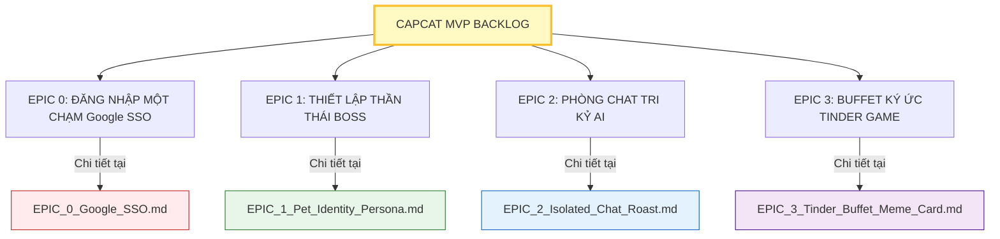

# CAPCAT - SOUL OF PET: AGILE PRODUCT BACKLOG (MASTER INDEX)
*(PHIÊN BẢN: MVP V1.0 - ĐƯỜNG KÍNH NẰM TRONG DOCUMENT/BACKLOG/)*

Tài liệu này là **Mục Lục Tổng Quan** của Agile Backlog dự án Capcat. Để ngăn ngừa sự phồng to và khó kiểm soát của một tài liệu Backlog khổng lồ đơn lẻ, đội ngũ CPO Sophia đã phân rã toàn bộ luồng nghiệp vụ MVP thành **4 Epics chi tiết** được lưu trữ độc lập tại thư mục `Document/Backlog/`.

---

## 🏛️ Sơ đồ Phân rã EPICS & Stories

---

## 🗂️ Danh Sách File Đặc Tả Chi Tiết (Backlog Files)

Vui lòng nhấp vào từng liên kết dưới đây để truy cập chi tiết các User Stories, Tiêu chí nghiệm thu (Acceptance Criteria) và Bối cảnh kỹ thuật cho từng Epic:

### 🔐 1. [EPIC 0: Đăng Nhập Một Chạm](file:///Users/macinia/Capcat%20Project/Document/Backlog/EPIC_0_Google_SSO.md)
*   *Mục tiêu:* Xác thực danh tính người dùng nhanh chóng qua Google SSO + duy trì phiên tự động đăng nhập (Auto-login) an toàn cục bộ.
*   *Trạng thái:* **Sẵn sàng để thiết kế & lập trình.**

### 🐶 2. [EPIC 1: Thiết Lập Thần Thái Boss](file:///Users/macinia/Capcat%20Project/Document/Backlog/EPIC_1_Pet_Identity_Persona.md)
*   *Mục tiêu:* Thiết lập thông tin Boss, cấu hình nhân cách AI (`PetPersona`), trò chơi trắc nghiệm chat điền profile, và **vòng xoay Boss Carousel tương tác (gõ đầu Boss)** cải tiến từ Mom Test.
*   *Trạng thái:* **Sẵn sàng để thiết kế & lập trình.**

### 💬 3. [EPIC 2: Phòng Chat Tri Kỷ AI & Roast Ảnh Dìm](file:///Users/macinia/Capcat%20Project/Document/Backlog/EPIC_2_Isolated_Chat_Roast.md)
*   *Mục tiêu:* Chat thời gian thực riêng biệt theo từng Pet, AI đọc ảnh dìm hàng và Roast chọc ghẹo cực hài hước, và **tính năng Mách lẻo xuyên Pet** tri kỷ gia đình chéo.
*   *Trạng thái:* **Sẵn sàng để thiết kế & lập trình.**

### 📸 4. [EPIC 3: Buffet Ký Ức Tinder Game](file:///Users/macinia/Capcat%20Project/Document/Backlog/EPIC_3_Tinder_Buffet_Meme_Card.md)
*   *Mục tiêu:* Game vuốt Tinder chọn ảnh dìm 5 giây chạy offline 0đ, tự động lưu Moment nhật ký có bộ lọc tag, banner động ẩn/hiện thông minh cải tiến từ Mom Test, và tạo thẻ bài Meme ghép khung 0đ chia sẻ Story.
*   *Trạng thái:* **Sẵn sàng để thiết kế & lập trình.**

---
*Backlog Master Index được bảo trì bởi CPO Sophia phục vụ cho mục tiêu kiểm soát phạm vi và bàn giao chất lượng Agile.*
