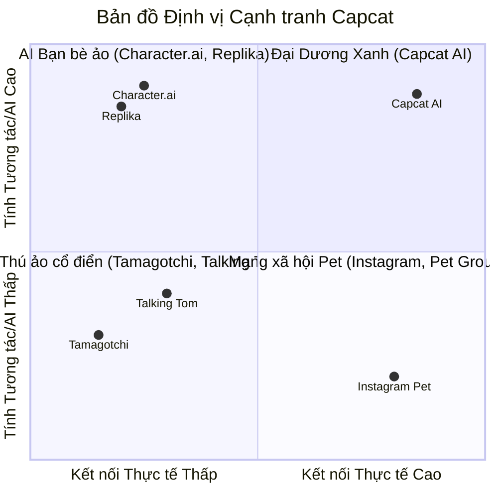

# 📚 CAPCAT CHAT HISTORY: LƯỢT 14
*(NHẬT KÝ THẢO LUẬN & ĐẶC TẢ CHI TIẾT NGÀY 28/05/2026)*

---

### 🙋‍♂️ **Người dùng hỏi:**
> tiếp tục mở rộng phản biện thị trường thêm.

---

### 🤖 **Đặc vụ phản hồi:**

Để biến ý tưởng **"Ý tưởng vị cảm xúc - Linh hồn ảo của thú cưng thực"** này thành một mô hình kinh doanh có khả năng sống sót và tăng trưởng bùng nổ, tôi sẽ phân tích phản biện thị trường ở cấp độ **CPO Enterprise (Giám đốc Sản phẩm Cấp cao)**. 

Dưới đây là bản phân tích đa chiều về **Bản đồ cạnh tranh**, **Vòng lặp giữ chân (Hook Model)**, các **Rủi ro chí mạng** và **Mô hình kiếm tiền (Monetization)** của dự án này:

---

## 🗺️ 1. BẢN ĐỒ CẠNH TRANH & ĐỊNH VỊ PHÂN KHÚC (COMPETITIVE LANDSCAPE)

Nếu nhìn vào thị trường ứng dụng giải trí và AI hiện tại, chúng ta đang đứng ở **giao lộ của 3 thế lực lớn** nhưng sở hữu một **Đại Dương Xanh** độc bản:

### Phân tích định vị:
*   **Thế lực 1 - AI Bạn bè ảo (Character.ai, Replika):** AI rất thông minh nhưng **xa rời thực tế**. Người dùng nhanh chán vì biết rõ đó là thực thể 100% hư cấu, không có bất kỳ kết nối vật lý nào với đời sống của họ.
*   **Thế lực 2 - Thú ảo cổ điển (Tamagotchi, My Talking Tom):** Có hình ảnh thú cưng nhưng **thiếu trí tuệ**. Các đoạn hội thoại được lập trình sẵn (hardcoded), không có kh
<truncated 3668 bytes>
 về dòng tiền (Monetization Friction)
*   *Phân tích:* Người dùng cực kỳ ghét trả phí đăng ký tháng (Subscription) cho các ứng dụng trò chuyện giải trí thuần túy.
*   *Cách cứu:* **Tuyệt đối không bán tính năng chat.** Hãy bán **Cảm xúc ảo**.
    *   *Mô hình Micro-transaction (Giao dịch nhỏ):* Cho phép nuôi thú ảo song song. Người dùng chat miễn phí, nhưng để mua một chiếc mũ sinh nhật ảo cho Boss, mua một hộp Pate ảo để "tăng độ thân mật", hoặc mở khóa gói giọng nói đặc biệt, họ sẽ sẵn sàng chi 10.000đ - 20.000đ mỗi lần mà không hề đắn đo (như cách các game gacha Trung Quốc đang kiếm hàng trăm triệu USD).

---

## 🎯 4. ĐỀ XUẤT ĐỊNH VỊ THƯƠNG HIỆU & KHẨU HIỆU (BRAND POSITIONING)

Để tạo tiếng vang lớn ngay khi ra mắt, chúng ta cần một định vị thương hiệu cực kỳ sắc bén:

*   **Tên sản phẩm đề xuất:** **Capcat: Soul of Pet** (Linh hồn của Boss) hoặc **Capcat: The Talking Paw** (Tiếng nói của bàn chân nhỏ).
*   **Khẩu hiệu (Slogan):** 
    *   *Tiếng Việt:* *"Nếu Boss biết nói, Boss sẽ khịa bạn thế nào?"* hoặc *"Nuôi thú cưng ngoài đời, nuôi linh hồn ảo trên app."*
    *   *Tiếng Anh:* *"Your pet in real life. Their soul in your pocket."*
*   **Thông điệp cốt lõi:** Chúng ta không bán một công cụ quản lý. Chúng ta bán một **liều thuốc chữa lành sự cô đơn** cho những người trẻ đô thị thông qua hình ảnh chú thú cưng của họ.

Bạn đánh giá thế nào về phân tích sâu này? Bạn có muốn tôi tiến hành cập nhật lại tài liệu đặt tả tổng quan dự án hiện tại (`02_OVERALL.md`) để chuyển hẳn hướng đi của toàn bộ dự án từ **"Chat App thông thường"** sang **"Mạng xã hội Cảm xúc & Linh hồn ảo Thú cưng (Capcat: Soul of Pet)"** không?

---
*Tài liệu phân tách tự động từ hệ thống logs của Antigravity AI.*
