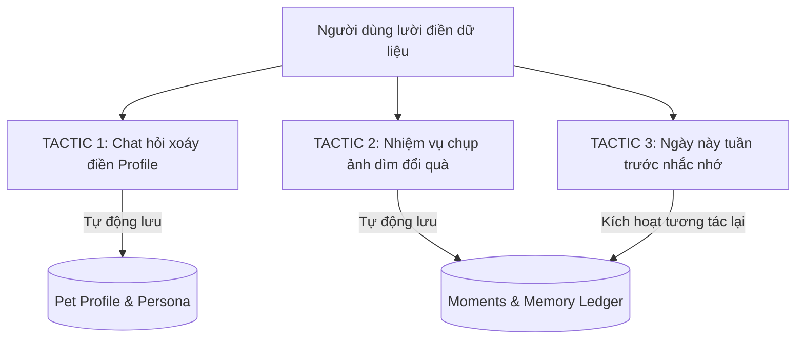

# 📚 CAPCAT CHAT HISTORY: LƯỢT 19
*(NHẬT KÝ THẢO LUẬN & ĐẶC TẢ CHI TIẾT NGÀY 28/05/2026)*

---

### 🙋‍♂️ **Người dùng hỏi:**
> các câu trả lời của bạn hợp lý, nhưng chung ta ở giai đoạn MVP. và quan trọng nhất chúng ta cần có là làm giàu ký ức kỹ niệm của người và Pets (bằng profile và dòng kỷ niệm, ảnh dìm) . Làm sao ? tính năng gì ? tactic gì?

---

### 🤖 **Đặc vụ phản hồi:**

Bạn hỏi câu hỏi **chạm đúng vào xương sống của MVP (Minimum Viable Product)**. 

Trong giai đoạn đầu, **bắt người dùng điền một form hồ sơ dài** hay **bắt họ viết nhật ký hàng ngày như làm bài tập về nhà** là cách nhanh nhất để giết chết sản phẩm. Người dùng cực kỳ lười. 

Vì vậy, tactic cốt lõi của chúng ta là: **"Gamification & Conversational Data Collection" (Thu thập dữ liệu thông qua trò chơi và trò chuyện)**. Người dùng không hề biết họ đang "điền thông tin" hay "làm giàu dữ liệu" — họ chỉ đang chơi và đùa giỡn với Boss của mình, còn việc thu thập dữ liệu là **tác dụng phụ tự động** của trò chơi đó.

Dưới đây là 3 Tactic & Tính năng MVP tinh gọn nhất để làm giàu ký ức:

---

## 🎨 3 TACTIC MVP LÀM GIÀU KÝ ỨC (LOW-FRICTION, HIGH-DOPAMINE)

---

### 🐾 Tactic 1: "Hỏi Xoáy Đáp Xoay" Điền Hồ Sơ (Conversational Profile Builder)
*   **The Pain (Nỗi đau):** Form đăng ký thông tin Boss dài dòng, nhàm chán như đi khám bệnh.
*   **Tactic thực thi:** Biến việc điền hồ sơ thành **trò chơi trắc nghiệm vui nhộn trực tiếp trong Chat**. Boss AI sẽ chủ động đặt câu hỏi trêu đùa theo ngày.
    *   *Kịch bản Chat:* 
        *   **Boss AI:** *"Sen ơi, trẫm hỏi thật nhé. Đố Sen biết món ăn trẫm ghét nhất trên đời là gì? Đố trả lời đúng đấy! 😎"*
        *   *App hiển thị 3 n
<truncated 2250 bytes>
t lại Ký ức (The Throwback Loop)
*   **The Pain (Nỗi đau):** Kỷ niệm lưu lại xong sẽ bị lãng quên nếu không được nhắc tới.
*   **Tactic thực thi:** Tận dụng dữ liệu `togetherDays` (Số ngày bên nhau) để Boss AI chủ động khơi gợi lại kỷ niệm cũ trong chat.
    *   *Kịch bản Chat:*
        *   **Boss AI:** *"Sen ơi! Nhớ ngày này tuần trước không? Bức ảnh Sen chụp trẫm ngã chổng vó lúc đang nhảy lên sofa nè (Hiển thị lại ảnh cũ trong khung chat). Hôm nay nhìn trẫm quý phái hơn nhiều rồi đúng không? Cho trẫm xin 1 cái xoa đầu ảo đi!"*
        *   *Nút hành động:* **[Xoa đầu Boss (Tăng Intimacy)] | [Chụp ảnh so sánh hôm nay]**
    *   **Dữ liệu làm giàu:** Khi bấm *"Chụp ảnh so sánh hôm nay"*, người dùng sẽ gửi thêm một bức ảnh mới, tiếp tục làm giàu kho dữ liệu ký ức.

---

## 🛠️ ĐÁNH GIÁ TÍNH KHẢ THI MVP TỪ TECH LEAD ALAN & CPO SOPHIA

*   **Alan (Tech Lead):** *"Tôi duyệt 3 tactic này! Về mặt kỹ thuật, chúng ta đã có sẵn cấu trúc Model `PetDetail`, `PetPersona` và `MomentsListView`. Việc tự động tạo Moment từ luồng chat chỉ tốn thêm 1 hàm ghi đè dữ liệu (Upsert) trong `nanny_chat_provider.dart` cực kỳ đơn giản và không phát sinh chi phí hạ tầng."*
*   **Sophia (CPO):** *"Đây là một giải pháp MVP hoàn hảo. Nó đi đúng tinh thần của Tamagotchi và SimSimi: người dùng tương tác hoàn toàn bằng ngôn ngữ tự nhiên và hình ảnh cảm xúc, còn chúng ta thì âm thầm thu thập toàn bộ dữ liệu để phục vụ cho các thuật toán cá nhân hóa sâu sắc phía sau."*

Bạn thấy 3 Tactic thu thập dữ liệu "vô hình" này đã đủ tinh gọn và kích thích Dopamine cho người dùng trong giai đoạn MVP chưa? Chúng ta có nên đóng gói chúng vào tài liệu phát triển tiếp theo không?

---
*Tài liệu phân tách tự động từ hệ thống logs của Antigravity AI.*
