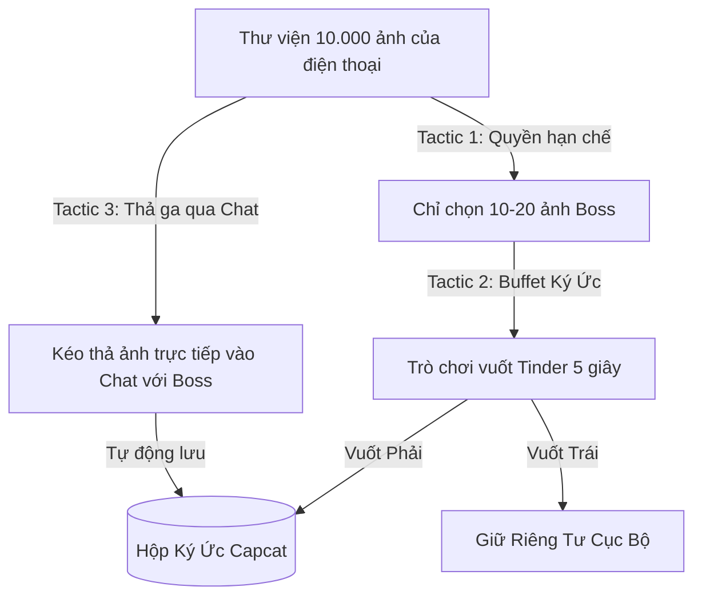

# 📚 CAPCAT CHAT HISTORY: LƯỢT 25
*(NHẬT KÝ THẢO LUẬN & ĐẶC TẢ CHI TIẾT NGÀY 28/05/2026)*

---

### 🙋‍♂️ **Người dùng hỏi:**
> Hôp ký ức. tôi biết người nuôi chó mèo có rất nhiều hình ảnh của chúng trong máy. làm sao để họ bỏ vào họp ký ức của chúng ta ? Trải nghiệm phải thoải mái ko cảm giác bị xăm phạm nhưng phải nhanh và tiện

---

### 🤖 **Đặc vụ phản hồi:**

Đây là một câu hỏi **cực kỳ nhân văn và chạm đúng tâm lý bảo mật** của người dùng thời nay. 

Nếu chúng ta yêu cầu quyền truy cập toàn bộ thư viện ảnh rồi tự động quét, người dùng sẽ lập tức **cảm thấy bị xâm phạm quyền riêng tư (Privacy Intrusion)** và gỡ app ngay lập tức. Còn nếu bắt họ bấm nút upload thủ công từng tấm giữa một rừng 10.000 bức ảnh trong máy, họ sẽ **nản vì quá phiền**.

Để giải quyết bài toán *"Vừa an toàn, vừa nhanh tiện, vừa thoải mái"* này, tôi cùng đội ngũ UI/UX (Benny) và Kỹ thuật (Alan) đề xuất giải pháp **"Cửa Ngõ Ký Ức An Toàn" (Zero-Intrusion Memory Gate)** với 3 Tactic tinh tế sau:

---

## 🛠️ 3 TACTIC NẠP KÝ ỨC VỪA AN TOÀN VỪA SIÊU TỐC

---

### 🛡️ Tactic 1: Quyền truy cập Hạn chế (Limited Photo Access - Tôn trọng tuyệt đối)
*   **Trải nghiệm tâm lý (An toàn):** Khi app xin quyền truy cập ảnh, thay vì xin toàn bộ, hệ thống sẽ mở hộp thoại tiêu chuẩn của iOS/Android: **"Chỉ cho phép truy cập các ảnh được chọn"** (Limited Photo Library Access).
*   **Lời dẫn hướng dẫn ấm áp (Onboarding):**
    > *"Để bảo vệ 100% quyền riêng tư của bạn, Capcat sẽ không bao giờ nhìn thấy các ảnh cá nhân khác của bạn. Bạn chỉ cần tick ch
<truncated 1331 bytes>
TRÁI (Bỏ qua):** *"Giữ riêng tư"* -> Ảnh sẽ bị bỏ qua và không bao giờ gửi lên server.
*   **Tâm lý người dùng:** Cực kỳ gây nghiện! Người dùng chỉ mất đúng 5 giây vuốt màn hình như chơi game để nạp hàng loạt kỷ niệm mà không hề có cảm giác đang "làm việc".

---

### 💬 Tactic 3: "Thả Ga Qua Chat" (Chat-Based Photo Ingestion - Nhanh nhất)
*   **Trải nghiệm tương tác (Tự nhiên nhất):** Người dùng có thói quen gửi ảnh cho bạn bè qua chat Zalo/Messenger. Chúng ta biến luồng chat với Boss AI thành nơi nhận ảnh chính.
*   **Cách hoạt động:**
    *   Trong lúc chat xàm xàm với Boss, Sen chỉ cần bấm biểu tượng Máy ảnh, quét chọn nhanh 3-4 tấm ảnh dìm hàng và nhấn gửi.
    *   Boss AI đọc ảnh (Vision API) và phản hồi: *"Ối giời ơi, Sen gửi một đống ảnh dìm hàng trẫm đây à? Để trẫm tự xếp ngay ngắn vào Hộp Ký Ức của trẫm nhé, sau này có bằng chứng tính sổ với Sen!"*
    *   **Tác vụ ngầm:** Hệ thống tự động trích xuất các bức ảnh này, gắn tag ngày tháng và lưu thẳng vào thư mục Moments nhật ký mà người dùng không cần thao tác thêm.

---

### 🎙️ Đánh giá từ CPO Sophia:
*"Sự kết hợp giữa **Quyền hạn chế (Limited Access)** để tạo lòng tin, **Game vuốt Tinder (Buffet Ký ức)** để tạo sự nhanh tiện, vui vẻ, và **Gửi ảnh qua Chat** để tạo sự tự nhiên chính là công thức hoàn hảo. Nó giúp chúng ta làm giàu dữ liệu ký ức cực kỳ nhanh chóng mà vẫn khiến khách hàng cảm thấy vô cùng thoải mái và an toàn."*

Bạn thấy 3 Tactic xử lý trải nghiệm nạp ký ức này đã giải quyết triệt để nỗi lo ngại của bạn chưa? Chúng ta có nên cập nhật ngay luồng UX này vào tài liệu MOM để đội ngũ Benny thiết kế UI luôn không?

---
*Tài liệu phân tách tự động từ hệ thống logs của Antigravity AI.*
