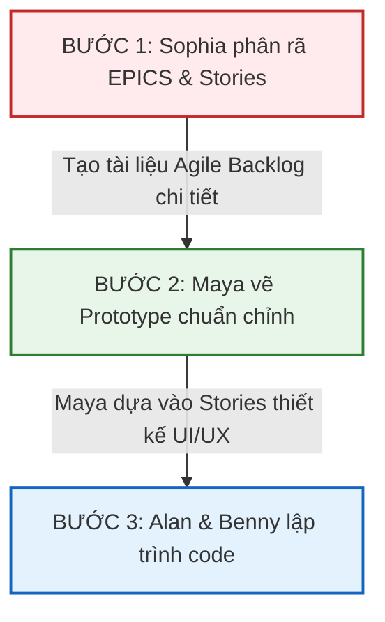

# 📚 CAPCAT CHAT HISTORY: LƯỢT 28
*(NHẬT KÝ THẢO LUẬN & ĐẶC TẢ CHI TIẾT NGÀY 28/05/2026)*

---

### 🙋‍♂️ **Người dùng hỏi:**
> oki sophia giờ tôi đên breadown EPIC / Story trước hay nhờ maya vẽ prototype nhỉ ?

---

### 🤖 **Đặc vụ phản hồi:**

Với tư cách là CPO, **tôi khuyên chúng ta nên thực hiện việc phân rã EPICS / User Stories trước, sau đó mới chuyển giao cho Maya thiết kế Prototype.**

---

### 🎯 TẠI SAO NÊN PHÂN RÃ USER STORIES TRƯỚC? (THE BEST PRACTICE)

1.  **Tránh thiết kế thiếu màn hình (No Missing Screens):** Nếu Maya tự vẽ prototype trước khi có Stories, cô ấy sẽ chỉ vẽ các màn hình "hạnh phúc" (Happy Path) như màn hình vuốt ảnh. Cô ấy sẽ rất dễ bỏ quên các màn hình trạng thái cực kỳ quan trọng như: *Màn hình trống (Empty State - Khi thư viện không có ảnh Pet), Màn hình chờ tải (Loading Shimmer), hoặc Hộp thoại xin quyền truy cập ảnh (Limited Access Permission Dialog).*
2.  **Định hình luồng nghiệp vụ rõ ràng (Define UX Flow):** Khi phân rã User Stories với các **Tiêu chí nghiệm thu (Acceptance Criteria - AC)** chi tiết, chúng ta sẽ làm rõ được nút nào bấm vào sẽ dẫn đi đâu, hiệu ứng chuyển cảnh như thế nào. Đây chính là **bản vẽ kỹ thuật** để Maya dựa vào đó thiết kế UI một cách chuẩn xác 100%, không bị lệch pha giữa Thiết kế và Lập trình.

---

## 🗺️ LỘ TRÌNH TRIỂN KHAI TIẾP THEO

Tôi đề xuất lộ trình hành động tinh gọn như sau:

### 📋 Bước 1: Sophia sẽ đảm nhận phân rã **3 EPICS cốt lõi của MVP** bao gồm:
*   **EPIC-1: Thiết lập Thần thái Boss (`PetDetail` & `PetPersona`):** Các Stories về Onboarding, chọn tính cách và game trắc nghiệm hỏi xoáy.
*   **EPIC-2: Trò chuyện Khịa & Roast ảnh dìm (`Isolated Chat`):** Các Stories về giao diện chat riêng biệt, luồng gửi ảnh và nhận câu Roast từ AI.
*   **EPIC-3: Buffet Ký ức Tinder Game (`Tinder Swipe` & `Meme Cards`):** Các Stories về popup cuối tuần, quét ảnh ML Kit offline, tương tác vuốt trái/phải và màn hình tổng hợp tiệc no nê.

---

### 🤝 Bạn có đồng ý để tôi (Sophia) tiến hành phân rã chi tiết **EPICS & User Stories** cho giai đoạn MVP này ngay bây giờ không? 

Tôi sẽ tạo một tài liệu Backlog chuẩn Agile cực kỳ chuyên nghiệp trong thư mục `Document/` để chúng ta lưu trữ và chuyển giao cho Maya!

---
*Tài liệu phân tách tự động từ hệ thống logs của Antigravity AI.*
