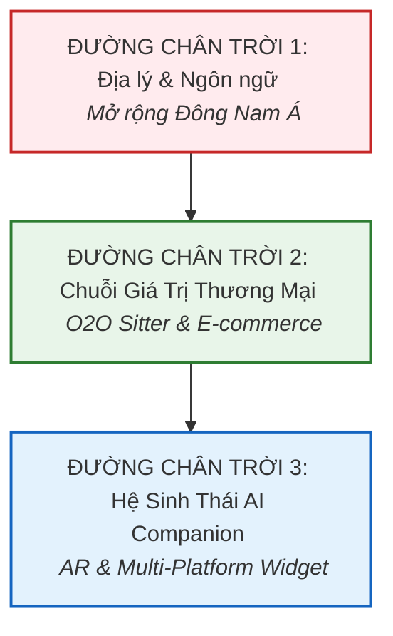

# 📚 CAPCAT CHAT HISTORY: LƯỢT 39
*(NHẬT KÝ THẢO LUẬN & ĐẶC TẢ CHI TIẾT NGÀY 28/05/2026)*

---

### 🙋‍♂️ **Người dùng hỏi:**
> tiêm năng mở rộng

---

### 🤖 **Đặc vụ phản hồi:**

Khi chúng ta đã có một **MVP tự nuôi sống được chính nó (Self-sustaining MVP)** tại 2 đô thị lớn ở Việt Nam, **Tiềm năng mở rộng (Expansion Potential)** của Capcat là vô cùng khổng lồ. 

Bản chất của sản phẩm cảm xúc là **không bị giới hạn bởi ranh giới địa lý hay kỹ thuật**. Dưới sự định hướng của Sophia (CPO) và Leo (Data Analyst), chúng tôi đề xuất chiến lược mở rộng theo **3 Đường Chân Trời (3 Horizons of Expansion)** cực kỳ sắc bén và thực tế:

---

## 🗺️ 3 ĐƯỜNG CHÂN TRỜI MỞ RỘNG CHIẾN LƯỢC CỦA CAPCAT

---

### 🌏 ĐƯỜNG CHÂN TRỜI 1: Mở rộng Địa lý & Ngôn ngữ ( SEA Scale-up)
*   **Mục tiêu:** Đưa sản phẩm ra khỏi Việt Nam, nhắm vào các siêu đô thị Đông Nam Á có mật độ người trẻ độc thân nuôi pet cực cao: **Bangkok (Thái Lan), Jakarta (Indonesia), Manila (Philippines), và Singapore**.
*   **Tại sao phân khúc này hấp dẫn?**
    *   Thái Lan và Philippines là những quốc gia có độ cuồng nhiệt thú cưng (Pet humanization) cao nhất Châu Á. Trào lưu dùng app chữa lành và chi tiền cho thú cưng tại đây vô cùng mạnh mẽ.
*   **Tính khả thi kỹ thuật (Alan - Tech Lead):** *"Cực kỳ đơn giản. Mã nguồn hiện tại của Capcat đã được cấu hình đa ngôn ngữ chuẩn (`l10n.yaml`, `intl`). Hệ thống chỉ cần bật ngôn ngữ 
<truncated 1440 bytes>
  *Mô hình dòng tiền:* Capcat thu **10% - 15% phí hoa hồng** trên mỗi giao dịch đặt lịch giữ trẻ. Đây là nguồn doanh thu cực kỳ lớn và bền vững!

#### 2.3. Tiếp thị liên kết Dinh dưỡng & Thú y (Affiliate Triage):
*   AI Nanny am hiểu thể trạng Boss sẽ gợi ý các dòng hạt, pate chức năng phù hợp (Ví dụ: đề xuất pate giảm búi lông cho mèo lông dài). Link mua hàng sẽ liên kết trực tiếp với Shopee/Lazada hoặc các thương hiệu thức ăn đối tác lớn để nhận **10% - 20% hoa hồng tiếp thị liên kết**.

---

### 🤖 ĐƯỜNG CHÂN TRỜI 3: Hệ sinh thái "AI Pet Companion" Đa nền tảng
*   **Mục tiêu:** Biến Boss ảo thành một thực thể đồng hành xuyên suốt đời sống số của người dùng.
*   **AR Pet Twin (Thú ảo thực tế tăng cường):** Tích hợp công nghệ AR. Người dùng có thể chiếu hình ảnh Boss ảo màu nước 3D đi lại, chơi đùa ngay trong căn phòng thực tế của mình để quay video, chụp ảnh chữa lành.
*   **Cross-App AI Widget:** Phát triển Boss AI thành các widget tương tác thông minh ngay trên màn hình khoá của iOS/Android hoặc tích hợp vào chatbot trên Messenger/Zalo để Sen có thể chat với Boss ở bất kỳ đâu mà không cần mở app.

---

### 🎙️ Lời kết của Leo (BA):
*"Chiến lược mở rộng 3 bước này đảm bảo **chúng ta đi từ gốc lên ngọn**. MVP đầu tiên tự nuôi sống mình bằng dòng tiền ảo và in ấn nhỏ. Khi tệp người dùng đã đủ trung thành, chúng ta bứt phá sang mảng dịch vụ giữ pet (O2O) và thương mại điện tử để gặt hái doanh thu khổng lồ. Đây là một con đường kinh doanh vô cùng vững chắc và thông minh."*

Bạn thấy tiềm năng mở rộng 3 giai đoạn này có đủ khả thi và kích thích tầm nhìn dài hạn của bạn cho Capcat không?

---
*Tài liệu phân tách tự động từ hệ thống logs của Antigravity AI.*
