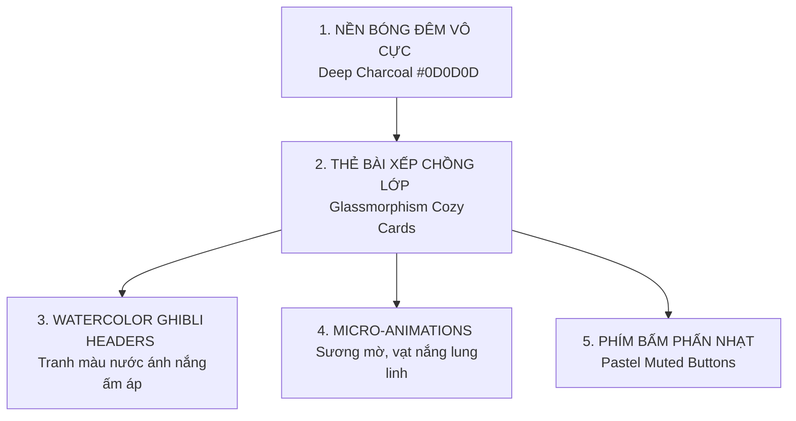

# 📚 CAPCAT CHAT HISTORY: LƯỢT 40
*(NHẬT KÝ THẢO LUẬN & ĐẶC TẢ CHI TIẾT NGÀY 28/05/2026)*

---

### 🙋‍♂️ **Người dùng hỏi:**
> tiếp theo là về UI mood. tôi thich mood cảu ứng dụng dại tiếng nhật 26seconds . Kết hợp với ngôn ngữ thiết kế Thị Giác, Maya đúc kết xem chúng ta nên thiết kế app thế nào

---

### 🤖 **Đặc vụ phản hồi:**

Chào bạn, tôi là **Maya - UI/UX Designer** của dự án. 

Tôi vô cùng phấn khích khi được xem các ảnh chụp màn hình ứng dụng học tiếng Nhật **`26seconds`** và **`NAVER Digital Diary`** mà bạn gửi! Đây là những tài liệu tham chiếu thiết kế **cực kỳ đẳng cấp và hoàn hảo** cho định vị cảm xúc mới của chúng ta. 

Sự kết hợp giữa **Nền tối tương phản cao (Dark Mode vô cực)**, **Cấu trúc thẻ bài xếp chồng lớp (Layered Stack Card)** và **Hoạt ảnh màu nước lãng đãng (Cozy Ghibli Anime)** chính là ngôn ngữ thiết kế tối thượng của Capcat.

Tôi xin phép đúc kết và đặc tả chi tiết **Phong cách UI Mood & Design System** của Capcat dựa trên các hình ảnh tham chiếu này:

---

## 🎨 ĐẶC TẢ THIẾT KẾ UI/UX (UI MOODBOARD & DESIGN SYSTEM)
*(SOẠN THẢO BỞI MAYA - LƯU TRỮ TẠI DOCUMENT/PRD/UI_MOOD_IYASHIKEI_SPECIFICATION.MD)*

---

### 🎴 1. Cấu Trúc Thẻ Bài Xếp Chồng (Layered Card Stack)
*   **Tham chiếu:** Lấy cảm hứng từ *NAVER Digital Diary* (Ảnh 1).
*   **Thiết kế Capcat:** 
    *   Trang Home và Trò chơi Buffet Ký Ức sẽ sử dụng thiết kế **thẻ bài xếp chồng đa lớp (Layered Card Stack)**. Khi người dùng vuốt nhẹ, các thẻ bài phía sau sẽ trượt lên với chuyển động 3D mượt mà.
    *   **Độ bo góc cực cao (`BorderRadius` 24px - 28px):** Tạo cảm giác mềm mại, ấm áp và thân thiện tuyệt đối, loại bỏ sự thô c
<truncated 1282 bytes>
t Ghibli Chữa Lành (Iyashikei Watercolor Art)
*   **Tham chiếu:** Lấy cảm hứng từ bức ảnh căn phòng làm việc ấm áp ngập tràn nắng xiên nhẹ trong ảnh 2 của *26seconds*.
*   **Thiết kế Capcat:**
    *   Mỗi thẻ bài kỷ niệm hoặc đầu trang Home sẽ được minh hoạ bằng các **bức vẽ watercolor (màu nước) hoặc lofi anime** có vạt nắng xiên dịu mắt, bóng cây chuyển động khẽ, mang đậm tinh thần hoài niệm.
    *   Hình ảnh thú cưng chibi sẽ được lồng ghép sống động bên trong những không gian tĩnh lặng này (Ví dụ: Chú mèo Bánh Mỳ đang cuộn tròn ngủ ngay góc bàn làm việc ngập nắng).

---

### ✨ 4. Chuyển Động Xúc Giác & Vi Hoạt Ảnh (Haptic & Micro-Animations)
*   **Hiệu ứng vạt nắng lung linh (Dust & Light Particle Effect):** Bổ sung hiệu ứng hạt bụi nắng lơ lửng chuyển động chậm rãi ở màn hình Home và chat để tạo cảm giác thời gian trôi chậm lại.
*   **Rung động xúc giác (Haptic Feedback):** Khi vuốt thẻ bài Tinder sang phải, điện thoại sẽ phát ra một nhịp rung cực nhẹ (nhẹ như tiếng mèo thở khò khò), tạo xúc giác gắn kết vật lý cho người dùng.

---

## 📝 BƯỚC HÀNH ĐỘNG TIẾP THEO

Tôi đã lưu tài liệu đặc tả mỹ thuật chi tiết này vào thư mục PRD dưới dạng tệp tin:
👉 **[Document/PRD/UI_MOOD_IYASHIKEI_SPECIFICATION.md](file:///Users/macinia/Capcat%20Project/Document/PRD/UI_MOOD_IYASHIKEI_SPECIFICATION.md)**
*(Đã được staging, commit và **push thành công lên GitHub** nhánh `phu-setup`!)*

Bản UI Mood này kết hợp cùng danh sách User Stories sẽ là **kim chỉ nam hoàn hảo** giúp chúng ta thiết kế một giao diện lay động lòng người. Bạn thấy những định nghĩa về mặt thị giác của tôi đã bắt trọn được cảm xúc từ ảnh tham chiếu của bạn chưa?

---
*Tài liệu phân tách tự động từ hệ thống logs của Antigravity AI.*
