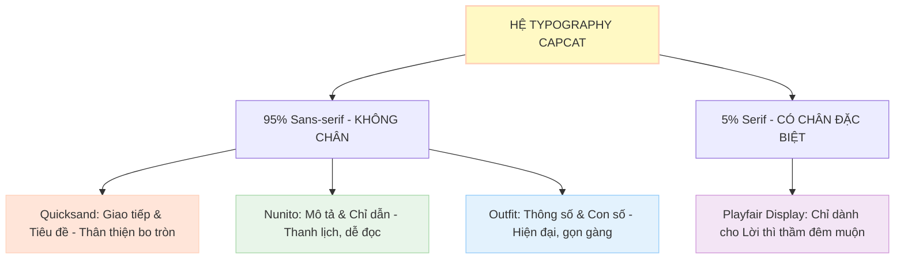

# 📚 CAPCAT CHAT HISTORY: LƯỢT 47
*(NHẬT KÝ THẢO LUẬN & ĐẶC TẢ CHI TIẾT NGÀY 28/05/2026)*

---

### 🙋‍♂️ **Người dùng hỏi:**
> hi, maya dựa trên thẩm mỉ thị giác của vision bạn hãy chọ font chửa và xây dự bộ typhography phù hợp lưu ý là nên tham khảm chọn những famaly font phối hợp với nhau nhẹ nhàng , tinh tế nhé. tôi ko thích phông có chân (trừ những điem nhất đặt biệt)

---

### 🤖 **Đặc vụ phản hồi:**

Chào bạn, tôi là **Maya** (UI/UX Designer) đây! Rất cảm ơn phản hồi cực kỳ tinh tế của bạn về mặt thị giác. 

Tôi hoàn toàn đồng ý: Phong cách **Iyashikei (Chữa lành Nhật Bản)** cần sự mộc mạc, tối giản và sạch sẽ của Muji, do đó việc lạm dụng phông chữ có chân (Serif) ở khắp nơi sẽ dễ gây cảm giác nặng nề, rối rắm và mang tính "học thuật/sách vở" quá mức. 

Để hiện thực hóa mong muốn của bạn về một giao diện **nhẹ nhàng, tinh tế và hầu như không có chân (Sans-serif dominant)**, tôi đã tái cấu trúc và xây dựng bộ phối hợp Font (Font Pairing) cực kỳ mềm mại dưới đây:

---

## 🎨 1. Bộ Phối Hợp Font Chữa Lành Mới (Cozy Sans-Serif Font Pairing)

Tôi đã tuyển chọn và phối hợp **3 Family Fonts không chân (Sans-serif)** và **chỉ giữ lại 1 Accent Font có chân (Serif) duy nhất làm điểm nhấn thơ ca cực kỳ giới hạn**:

1. **Quicksand (Google Fonts - Primary Sans-serif):** Font không chân có các góc bo tròn đầu (rounded terminals) cực kỳ dễ thương, ấm áp. Nó mang lại cảm giác thân thiện, xoa dịu như đang chạm vào bàn chân boss.
   
<truncated 1745 bytes>
| `24` | Bold (700) | `1.3` | Tiêu đề của Thẻ Ký ức (Moments Card) |
| `titleLarge` | *Quicksand* | `20` | SemiBold (600) | `1.4` | Tên người dùng, Tiêu đề phần Chat, Tiêu đề Popup |
| `bodyLarge` | *Quicksand* | `16` | Medium (500) | `1.5` | Nội dung tin nhắn chat thân mật của Boss & Sen |
| `bodyMedium` | *Nunito* | `14` | Regular (400) | `1.5` | Nội dung mô tả hoạt động chăm sóc thường nhật, thẻ phụ |
| `whisperItalic`| *Playfair Display* | `15` | Medium Italic (500) | `1.6` | **[Điểm nhấn Serif đặc biệt]** Lời thì thầm chiêm nghiệm đêm muộn |
| `numericLabel` | *Outfit* | `13` | SemiBold (600) | `1.2` | Số cân nặng, số phút đi dạo, mốc thời gian hiển thị |
| `buttonText` | *Quicksand* | `15` | SemiBold (600) | `1.0` | Chữ hiển thị trên các nút bấm bo góc tròn chính |
| `captionText` | *Nunito* | `12` | Regular (400) | `1.4` | Dấu mốc thời gian phụ (Time Stamp), chú thích chú giải |

---

## 🗃️ 3. Trạng Thái Cập Nhật Hệ Thống

Tôi đã cập nhật trực tiếp sự cải tiến này vào tài liệu nền tảng thiết kế [Document/08_DESIGN_SYSTEM_FOUNDATION.md](file:///Users/macinia/Capcat%20Project/Document/08_DESIGN_SYSTEM_FOUNDATION.md) tại:
* **Mục 3: Hệ Thống Kiểu Chữ (Typography Tokens System)** - Cập nhật định nghĩa và bảng phân cấp.
* **Mục 8: Hướng Dẫn Phát Triển (Developer Integration Blueprint)** - Cập nhật mã giả cấu trúc class `AppTextStyles` khai báo font chữ tương thích cho lập trình viên Flutter.

Toàn bộ các thay đổi đã được add, commit và push sạch sẽ lên GitHub tại nhánh `phu-setup` (Commit: `4ebeb7d design: refine typography specs to use elegant sans-serif pairing...`).

*Bạn thấy bộ phối hợp font không chân mềm mịn này đã thực sự mang lại cảm giác dễ chịu và tinh tế đúng ý bạn chưa? Hãy chia sẻ cảm nhận với tôi nhé!*

---
*Tài liệu phân tách tự động từ hệ thống logs của Antigravity AI.*
