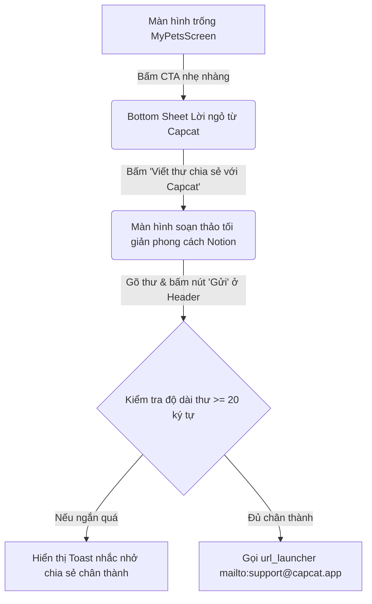

# TURN 12: XÁC ĐỊNH GIAI ĐOẠN NGHIÊN CỨU CHƯA CODE
*(STRICT RESEARCH PHASE LOCK & SPECIFICATION FIRST)*

> **Mã Lượt Chat:** `TURN-30052026-12`  
> **Chủ trì:** Sophia (CPO / PM), Alan (Tech Lead)

---

## 🙋‍♂️ **Người dùng hỏi:**
> chúng ta làm nghiên cứ thôi chưa code, lưu ý nha

---

## 🤖 **Đặc vụ phản hồi (Cố vấn ảo liên hiệp):**
Dạ tôi đã hiểu rõ! Chúng ta sẽ hoàn toàn tập trung vào việc nghiên cứu, lên kế hoạch chi tiết và thiết kế giải pháp hoàn chỉnh chứ chưa tiến hành sửa đổi mã nguồn hay viết code thực tế ở giai đoạn này.

Để tổng kết lại nghiên cứu giải pháp tối ưu cho chức năng ẩn này, tôi xin trình bày sơ đồ luồng trải nghiệm người dùng hiện đại và cấu trúc kỹ thuật tối giản đã thống nhất như sau:

### 1. Luồng trải nghiệm người dùng (UX Flow)

### 2. Thiết kế chi tiết giao diện Soạn thảo phong cách Notion (Notion-Style Editor UI)
Chúng ta sẽ thiết kế một trang/màn hình sạch sẽ hoàn toàn dựa trên các widget tiêu chuẩn của Flutter thay vì nhúng các thư viện soạn thảo nặng nề:
* **Background**: Màu trắng phẳng tuyệt đối (`AppColors.white`), tạo cảm giác sạch sẽ và hiện đại.
* **Header (Thanh công cụ trên cùng)**:
  * Trái: Nút quay lại (`Icons.arrow_back_ios_new_rounded`).
  * Giữa: Nhãn tiêu đề nhỏ "Thư gửi Capcat" (`fontSize: 16`, màu xám đậm).
  * Phải: Nút hành động **"Gửi"** (`TextButton` màu xanh lá cây đặc trưng `AppColors.greenStrong1`, font bold nổi bật).
* **Body (Khu vực soạn thảo)**:
  * Nằm trong một `SingleChildScrollView` kết hợp `SafeArea` để tránh bàn phím che khuất văn bản.
  * **Ô tiêu đề**: `TextField` không viền (`border: InputBorder.none`), cỡ chữ `24px` hoặc `26px`, font chữ đậm (`FontWeight.bold`), placeholder dịu mắt *"Tiêu đề bức thư..."*.
  * **Đường phân cách**: Một đường `Divider` mỏng thanh mảnh màu xám nhạt để tạo cấu trúc trang rõ ràng.
  * **Ô soạn thư**: `TextField` không viền, cho phép giãn dòng thoáng đãng (`height: 1.5`), tự động tăng dòng (`maxLines: null`), bàn phím dạng multiline, placeholder khơi gợi tâm tư: *"Hãy chia sẻ chân thành với Capcat về bản thân bạn, lý do bạn mong muốn nhận nuôi một bé thú cưng ngoài đời thực..."*

### 3. Kỹ thuật chuyển tiếp Email (Email Transfer Tech)
Sử dụng thư viện `url_launcher` đã có sẵn trong dự án để khởi tạo đường dẫn URI dạng:
`mailto:support@capcat.app?subject=[Tiêu đề]&body=[Nội dung thư]`

* **Ưu điểm**:
  * Tận dụng tối đa ứng dụng Email mặc định (như Mail trên iOS/macOS, Gmail trên Android) có sẵn trên điện thoại của người dùng để thực hiện việc gửi và nhận phản hồi thực tế ngoài hệ thống.
  * Không làm tăng kích thước ứng dụng và tuyệt đối an toàn vì hệ thống email xử lý độc lập.

---

Tất cả các nội dung nghiên cứu trên đã được ghi nhận đầy đủ tại tệp kế hoạch: [implementation_plan.md](file:///Users/macinia/.gemini/antigravity-ide/brain/4c94a7f9-32cc-41bb-9780-dd6ec8bd05d1/implementation_plan.md). 

Tôi sẽ lưu lại kế hoạch này ở trạng thái chờ và hoàn toàn không thực hiện bất kỳ thay đổi nào vào codebase cho đến khi bạn sẵn sàng và đưa ra chỉ thị tiếp theo. Bạn có ý kiến đóng góp hay cần bổ sung thêm chi tiết nghiên cứu nào nữa không ạ?
