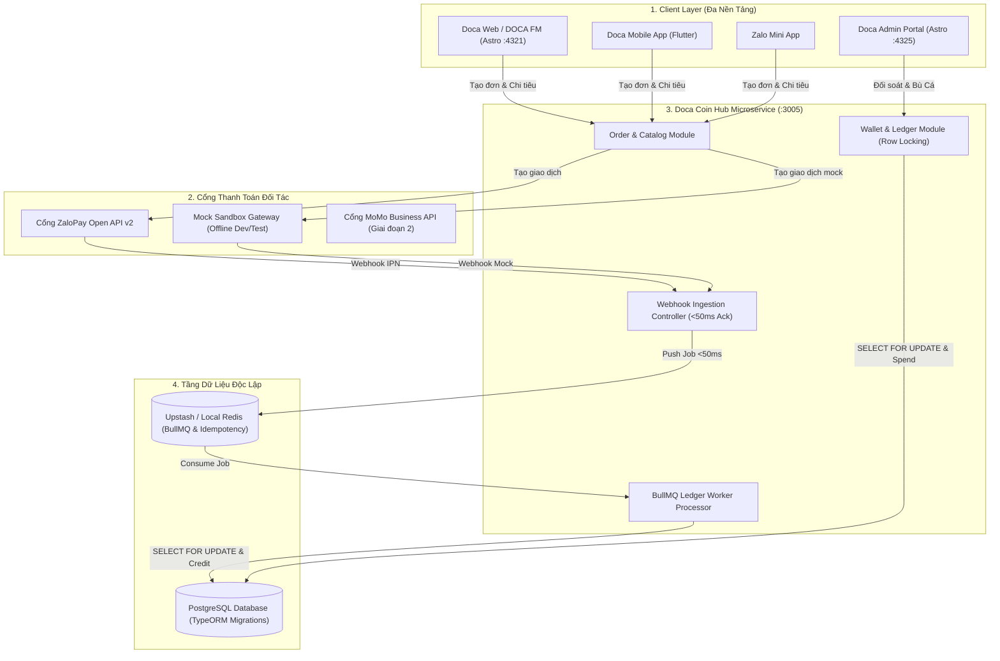
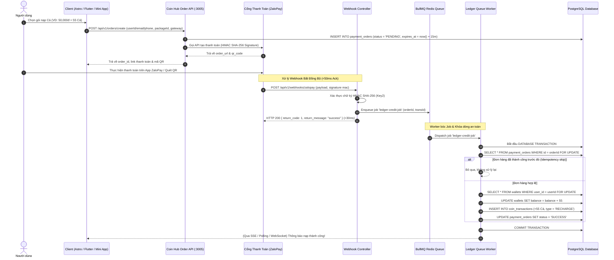
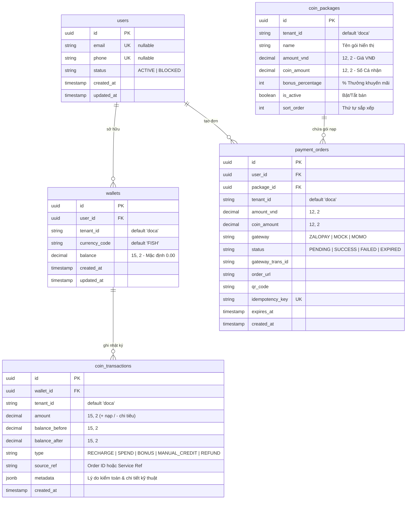

# PRODUCT BRIEF: HỆ THỐNG VÍ CÁ (DOCA COIN HUB) & THANH TOÁN ĐA NỀN TẢNG (NESTJS MICROSERVICE)

> **Tài liệu chuẩn kiến trúc & nghiệp vụ chính thức** thay thế toàn diện bản phác thảo cũ tại `Document/CoinSystem/`.  
> Phục vụ làm cổng thanh toán, sổ cái kế toán và nền kinh tế ảo dùng chung cho toàn bộ hệ sinh thái Doca Pet / Capcat (Astro Web, Flutter Mobile App, Zalo Mini App, và Admin Portal).

---

## 1. TỔNG QUAN SẢN PHẨM (PRODUCT OVERVIEW)

### A. Định nghĩa & Mục tiêu
*   **Tên chính thức:** Doca Coin Hub (`apps/coin-hub`).
*   **Đơn vị tiền tệ nội bộ:** **Cá** (hoặc Fish Coin).
*   **Mục tiêu cốt lõi:** Cho phép người dùng chuyển đổi tiền thật (VNĐ) qua các cổng thanh toán uy tín (ZaloPay, MoMo, VietQR/PayOS, Mock Sandbox) thành "Cá" để chi trả các dịch vụ số nội bộ.
*   **Mục đích sử dụng Cá:**
    *   Nghe nhạc chất lượng cao & tương tác quà tặng trên **DOCA FM**.
    *   Mở khóa các bài viết độc quyền, truyện dài kỳ của host Tina, blog chuyên sâu.
    *   Mở khóa tính năng đặc biệt (Phân tích hồ sơ thú cưng nâng cao, Quiz, vật phẩm nuôi thú ảo).

### B. Nguyên tắc Tài chính Tối thượng (Financial & Legal Invariants)
1.  **Giao dịch 1 chiều (No Cash-Out):** Tiền VNĐ nạp thành Cá chỉ dùng để tiêu thụ nội bộ, **tuyệt đối không hỗ trợ rút ngược lại thành tiền mặt/thẻ cào**.
2.  **Không chuyển Cá nội bộ (No P2P Transfers):** Không hỗ trợ chuyển số dư Cá giữa các tài khoản người dùng khác nhau nhằm đảm bảo tuyệt đối tính hợp pháp, phòng chống đánh bạc ảo và rửa tiền.
3.  **Bất biến Sổ cái (Immutable Ledger Audit Trail):** Mọi biến động số dư phải được ghi nhận vào bảng `coin_transactions` với đầy đủ `balance_before`, `amount`, `balance_after` và lý do giao dịch. Không bao giờ cập nhật số dư mà không có dòng nhật ký tương ứng.
4.  **Độ chính xác Số học (High Precision):** Sử dụng kiểu dữ liệu `DECIMAL(15, 2)` cho số dư Cá và `DECIMAL(12, 2)` cho tiền VNĐ để chống sai số làm tròn (Rounding errors).

---

## 2. KIẾN TRÚC HỆ THỐNG CỐT LÕI (CORE ARCHITECTURE)

Doca Coin Hub được triển khai dưới dạng **Microservice NestJS độc lập** (`apps/coin-hub` cổng `:3005`), tách biệt hoàn toàn khỏi Web Frontend để đảm bảo an toàn giao dịch và phục vụ đa nền tảng.

---

### A. Luồng Nạp Cá Bất Đồng Bộ & Chống Timeout (Sequence Diagram)

---

## 3. THIẾT KẾ CƠ SỞ DỮ LIỆU (DATABASE ERD & SCHEMA)

Tuân thủ nghiêm ngặt quy tắc **Không dùng auto-sync**, toàn bộ cấu trúc bảng được quản lý bằng **TypeORM Versioned Migrations** tại `apps/coin-hub/src/database/migrations/`.

---

## 4. BỘ API DÙNG CHUNG CHUẨN RESTFUL (SWAGGER /DOCS)

Backend cung cấp tài liệu Swagger UI tự động tại `http://localhost:3005/docs`.

### A. Nhóm API Cho Khách Hàng (Client APIs)
1. **Lấy danh sách gói nạp:** `GET /api/v1/orders/packages?tenant_id=doca`
2. **Tạo đơn nạp Cá:** `POST /api/v1/orders/create`
   - *Payload:* `{ email?: string, phone?: string, package_id: string, tenant_id: string, gateway: "ZALOPAY" | "MOCK", return_url?: string }`
3. **Thăm dò trạng thái đơn:** `GET /api/v1/orders/:id/status`
4. **Kiểm tra số dư Ví:** `GET /api/v1/wallets/balance?email=...&phone=...&tenant_id=doca`
5. **Tiêu Cá (Khóa dòng nguyên tử):** `POST /api/v1/wallets/spend`
   - *Payload:* `{ email?: string, phone?: string, tenant_id: "doca", amount: 30, service_ref: "UNLOCK_STORY_015" }`
6. **Lịch sử biến động số dư:** `GET /api/v1/wallets/history?email=...&tenant_id=doca&limit=20`

### B. Nhóm API Webhook Cổng Thanh Toán
1. **ZaloPay Callback:** `POST /api/v1/webhooks/zalopay` (Xác thực HMAC SHA-256 Key2 $
ightarrow$ Đẩy job vào BullMQ $
ightarrow$ Trả 200 OK ngay).
2. **Mock Sandbox Callback:** `POST /api/v1/webhooks/mock` (Giả lập thanh toán tức thì trong môi trường phát triển offline).

### C. Nhóm API Quản Trị & Đối Soát (Admin APIs)
1. **Thống kê tổng quan:** `GET /api/v1/admin/summary?tenant_id=doca` (Tổng Cá lưu hành & Tổng doanh thu VNĐ).
2. **Danh sách đơn hàng:** `GET /api/v1/admin/orders?status=PENDING&page=1`
3. **Tra cứu đối soát ZaloPay:** `POST /api/v1/admin/orders/:id/reconcile` (Gọi API ZaloPay query status để xử lý đơn treo).
4. **Cộng Cá bù thủ công:** `POST /api/v1/admin/wallets/manual-credit`
   - *Payload:* `{ email?: string, phone?: string, amount: 50, audit_reason: "Đền bù lỗi nghẽn ZaloPay" }`
5. **Quản lý gói nạp động:** `POST /api/v1/admin/packages` & `PUT /api/v1/admin/packages/:id`

---

## 5. ĐẶC TẢ TRẢI NGHIỆM NGƯỜI DÙNG (UX/UI SPECIFICATION)

Thiết kế giao diện tuân thủ tuyệt đối quy chuẩn **Cozy Muji Minimalist** (Nền trắng giấy `#FFFFFF`, màu nhấn Matcha Green `#76C123`, chữ Charcoal `#1C1C1E`, icon mảnh nét Phosphor Icons).

### A. Widget Ví Cá Trên Trang Profile & Header
*   **Hiển thị:** Huy hiệu số dư Cá hiện tại kèm icon Cá (`150` <i class="ph-fill ph-fish"></i>).
*   **Tương tác:** Nút *"Nạp thêm"* mở Modal chọn gói nạp; Nút *"Lịch sử"* mở danh sách biến động.

### B. Modal Chọn Gói Nạp & Thanh Toán
*   **Desktop:** Modal Cozy hiển thị danh sách gói nạp dạng lưới 3 cột. Khi bấm *"Thanh toán"*, hiển thị mã QR động ZaloPay kèm hướng dẫn quét mã trên điện thoại.
*   **Mobile:** Bottom Sheet trượt từ đáy màn hình. Khi bấm *"Thanh toán"*, hệ thống tự động kích hoạt App-to-App deep link mở thẳng ứng dụng ZaloPay.

### C. Trạng Thái Chờ & Hoạt Ảnh Chúc Mừng (Confetti State)
*   Trong lúc chờ người dùng quét mã trên điện thoại, Client tự động polling trạng thái đơn (`GET /api/v1/orders/:id/status`) định kỳ mỗi 3 giây.
*   Ngay khi đơn chuyển sang `SUCCESS`, Modal tự đóng, phát hoạt ảnh pháo hoa chúc mừng (Confetti animation) và cập nhật số dư mới tức thì.

---

## 6. QUẢN TRỊ, ĐỐI SOÁT & PHÂN QUYỀN (ADMIN & RECONCILIATION)

### A. Bảng Phân Quyền Vận Hành (RBAC)
| Vai trò | Quyền hạn đối với Doca Coin Hub |
| :--- | :--- |
| **Super Admin / Owner** | Toàn quyền cấu hình gói nạp, sửa giá, xem doanh thu, và bù Cá thủ công có lưu vết kiểm toán. |
| **Kế toán (Accountant)** | Tra cứu lịch sử đơn hàng, xem báo cáo doanh thu tài chính, thực hiện đối soát tự động với ngân hàng. |
| **CSKH / Hỗ trợ** | Tra cứu số dư ví khách hàng theo Email/SĐT để giải quyết khiếu nại. |

### B. Đối Soát Tự Động (Automated Reconciliation)
*   Hằng ngày vào lúc **00:30**, tác vụ Cron tự động đối chiếu các đơn hàng `PENDING` trong ngày với Query Status API của ZaloPay. Nếu tiền đã trừ ở ví khách mà đơn chưa `SUCCESS`, hệ thống tự động bù đơn và bắn thông báo cảnh báo qua Telegram/Discord.
*   Giao diện Admin tại `/admin/billing` cho phép bấm nút *"Tra cứu ZaloPay"* để đối soát từng đơn riêng lẻ theo thời gian thực.

---

## 7. TỰ ĐỘNG HÓA KẾ TOÁN & THUẾ (E-INVOICE AUTOMATION)

*   **Xuất Hóa Đơn Điện Tử Tổng Cuối Ngày (Daily Aggregate e-Invoice):**
    *   Hàng ngày phát sinh hàng trăm giao dịch nạp Cá nhỏ lẻ (10k, 50k, 100k).
    *   Vào lúc **23:55 hằng ngày**, tác vụ tự động gom toàn bộ doanh thu nạp thành công trong ngày từ bảng `payment_orders`.
    *   Gọi API **Misa MeInvoice** (hoặc Viettel SInvoice) để xuất **duy nhất 01 hóa đơn điện tử tổng** cho doanh thu dịch vụ số trong ngày, đồng bộ tự động lên phần mềm kế toán và Tổng cục Thuế theo đúng luật định.

---

## 8. LỘ TRÌNH MỞ RỘNG (ROADMAP)
1. **Phase 1 (Hiện tại):** NestJS Microservice (`apps/coin-hub`), Mock Gateway, ZaloPay v2 Dynamic QR & App-to-App, BullMQ Webhook Queue, Admin Billing Portal.
2. **Phase 2 (Mở rộng Cổng):** Tích hợp thêm MoMo Business API và VietQR / PayOS.
3. **Phase 3 (Mobile & Real-Time):** Tích hợp Zalo Mini App QuickPay SDK, Flutter Mobile App Deep Link, và WebSockets thay thế Polling.
