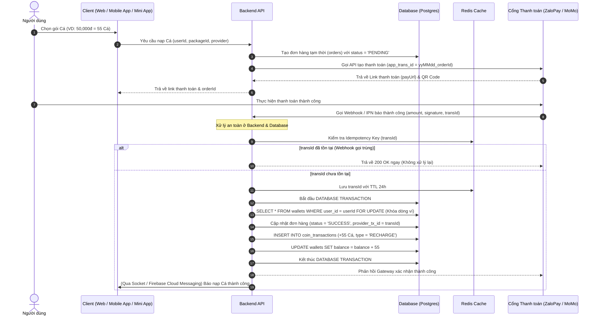
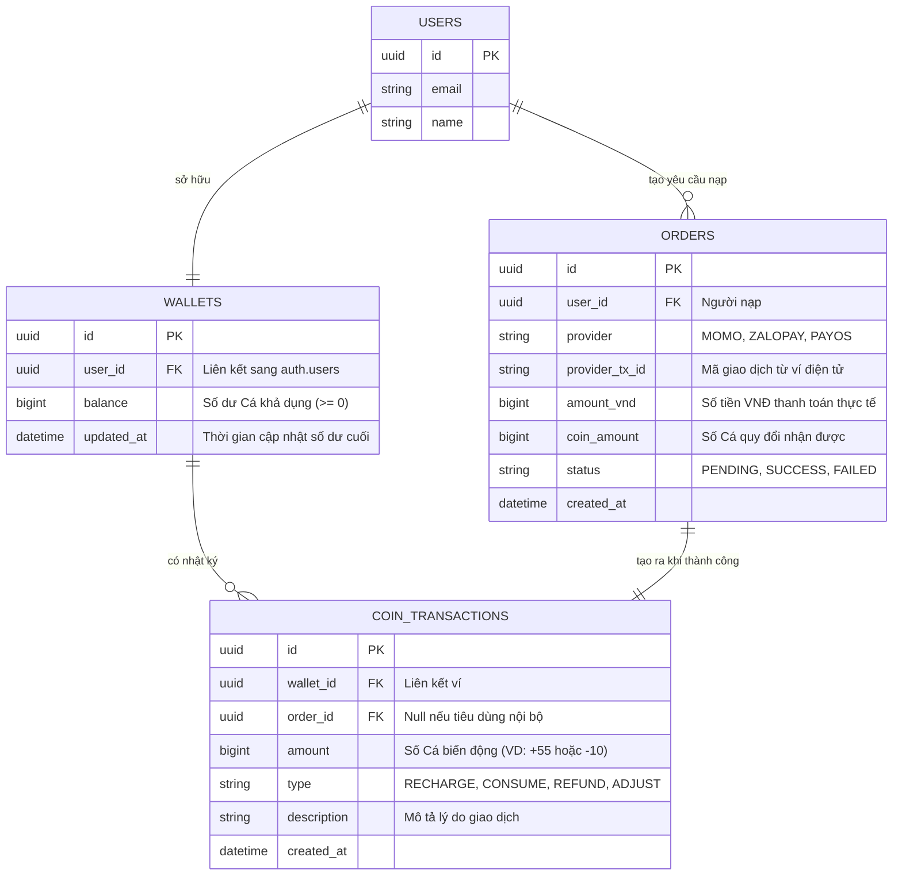

# PRODUCT BRIEF: HỆ THỐNG VÍ CÁ (XU) & THANH TOÁN TỰ ĐỘNG (WEB & APP)

Tài liệu đặc tả sản phẩm này quy hoạch **Hệ thống Quản lý Ví Cá (Xu) và Nạp Cá tự động** dùng chung (Core Module) cho toàn bộ hệ sinh thái của Capcat / Doca Pet bao gồm nền tảng Web (`doca.capcat.vn`), các ứng dụng di động (Mobile App iOS/Android) và Zalo Mini App.

---

## 1. TỔNG QUAN SẢN PHẨM (PRODUCT OVERVIEW)

### A. Định nghĩa & Mục tiêu
*   **Tên nội bộ:** Phân hệ quản lý Ví Cá (Fish Wallet / Coin System).
*   **Đơn vị quy đổi:** **Cá** (đóng vai trò là tiền ảo nội bộ/điểm thưởng).
*   **Mục tiêu:** Cho phép người dùng chuyển đổi tiền thật (VNĐ) thông qua các cổng thanh toán (ZaloPay, MoMo, VietQR/PayOS) thành "Cá" để chi trả cho các dịch vụ nội dung số cao cấp hoặc tương tác trong hệ thống.
*   **Mục đích sử dụng Cá:**
    *   Nghe nhạc chất lượng cao trên **DOCA FM**.
    *   Mở khóa và đọc các bài viết ẩn, blog chuyên sâu.
    *   Mở khóa các tính năng đặc biệt (Quiz, đền bù, vật phẩm nuôi thú ảo).

### B. Nguyên tắc Tài chính Tối thượng (Financial Rules)
1.  **Giao dịch 1 chiều (No Cash-Out):** Người dùng chỉ được nạp tiền vào quy đổi sang Cá và tiêu dùng Cá trong hệ sinh thái. 
2.  **Không cho phép rút tiền:** Không hỗ trợ đổi ngược từ Cá thành tiền mặt, thẻ cào.
3.  **Không chuyển Cá nội bộ:** Không hỗ trợ tính năng chuyển Cá giữa các tài khoản người dùng khác nhau nhằm đảm bảo tuyệt đối tính hợp pháp pháp lý, phòng chống đánh bạc ảo và rửa tiền.

---

## 2. KIẾN TRÚC HỆ THỐNG CỐT LÕI (CORE ARCHITECTURE)

Hệ thống được thiết kế theo mô hình **Sổ cái Ledger (Ledger Bookkeeping)** và xử lý bất đồng bộ thông qua **Webhook/IPN** của các cổng thanh toán.

### A. Luồng Dữ liệu Thanh toán & Nạp Cá (Sequence Diagram)
Quy trình nạp tiền tự động qua cổng thanh toán và cơ chế đối soát chống trùng lặp:



### B. Thiết kế Cơ sở Dữ liệu (Database ERD)
Mô hình dữ liệu chuẩn mực để lưu vết tài chính:



---

## 3. THIẾT KẾ DB FUNCTIONS CỐT LÕI (DATABASE-LEVEL INTEGRITY)

Để đảm bảo dữ liệu không bao giờ bị sai lệch ngay cả khi hệ thống bị quá tải, hai hàm PL/pgSQL dưới đây chạy trong môi trường bảo mật độc lập (`SECURITY DEFINER`):

### A. Hàm Cộng/Trừ Cá an toàn (`charge_user_coin`)
*   **Mục tiêu:** Thay đổi số dư ví đồng thời ghi chép nhật ký sổ cái trong cùng một Database Transaction.
*   **Cơ chế:** Sử dụng `FOR UPDATE` để khóa dòng ví của người dùng, ngăn ngừa lỗi Race Condition khi người dùng nạp tiền hoặc chi tiêu đồng thời trên nhiều thiết bị.

```sql
CREATE OR REPLACE FUNCTION public.charge_user_coin(
    p_user_id UUID,
    p_amount BIGINT,
    p_order_id UUID,
    p_type VARCHAR(50),
    p_description TEXT
) RETURNS VOID AS $$
DECLARE
    v_wallet_id UUID;
    v_current_balance BIGINT;
BEGIN
    -- Tạo ví mặc định với số dư = 0 nếu chưa từng tồn tại ví
    INSERT INTO public.wallets (user_id, balance, updated_at)
    VALUES (p_user_id, 0, now())
    ON CONFLICT (user_id) DO NOTHING;

    -- Thực hiện khóa dòng ví (Row-level Lock)
    SELECT id, balance INTO v_wallet_id, v_current_balance
    FROM public.wallets
    WHERE user_id = p_user_id
    FOR UPDATE;

    -- Kiểm tra nếu số dư không đủ (khi người dùng chi tiêu Cá)
    IF p_amount < 0 AND v_current_balance + p_amount < 0 THEN
        RAISE EXCEPTION 'Số dư ví Cá không đủ để thực hiện giao dịch này';
    END IF;

    -- Cập nhật số dư ví mới
    UPDATE public.wallets
    SET balance = balance + p_amount,
        updated_at = now()
    WHERE id = v_wallet_id;

    -- Ghi sổ nhật ký giao dịch
    INSERT INTO public.coin_transactions (wallet_id, order_id, amount, type, description, created_at)
    VALUES (v_wallet_id, p_order_id, p_amount, p_type, p_description, now());
END;
$$ LANGUAGE plpgsql SECURITY DEFINER;
```

### B. Hàm Hoàn tất đơn nạp Cá (`complete_payment_order`)
*   **Mục tiêu:** Cập nhật trạng thái đơn nạp và cộng Cá vào ví khi cổng thanh toán xác nhận nạp tiền thành công.
*   **Cơ chế:** Khóa dòng đơn hàng để tránh xung đột dữ liệu nếu IPN Webhook gửi tín hiệu đồng thời nhiều lần.

```sql
CREATE OR REPLACE FUNCTION public.complete_payment_order(
    p_order_id UUID,
    p_provider_tx_id VARCHAR(255)
) RETURNS BOOLEAN AS $$
DECLARE
    v_order_status VARCHAR(50);
    v_user_id UUID;
    v_coin_amount BIGINT;
    v_provider VARCHAR(50);
BEGIN
    -- Khóa dòng đơn hàng
    SELECT status, user_id, coin_amount, provider INTO v_order_status, v_user_id, v_coin_amount, v_provider
    FROM public.orders
    WHERE id = p_order_id
    FOR UPDATE;

    -- Nếu đơn nạp đã được xử lý thành công hoặc thất bại trước đó, bỏ qua
    IF v_order_status != 'PENDING' THEN
        RETURN FALSE;
    END IF;

    -- Cập nhật đơn nạp thành công
    UPDATE public.orders
    SET status = 'SUCCESS',
        provider_tx_id = p_provider_tx_id
    WHERE id = p_order_id;

    -- Thực hiện cộng Cá và ghi nhật ký
    PERFORM public.charge_user_coin(
        v_user_id,
        v_coin_amount,
        p_order_id,
        'RECHARGE',
        'Nạp Cá tự động qua ' || v_provider
    );

    RETURN TRUE;
END;
$$ LANGUAGE plpgsql SECURITY DEFINER;
```

---

## 4. HỆ THỐNG API DÙNG CHUNG (SHARED WEB & APP API ENDPOINTS)

Bộ API endpoints dùng chung được xây dựng theo chuẩn RESTful để cả nền tảng Web, Mobile App và Zalo Mini App có thể tích hợp.

### A. Lấy danh sách Gói nạp (`GET /api/billing/packages`)
*   **Mô tả:** Trả về danh sách các gói Cá cấu hình sẵn từ Backend.
*   **Phản hồi (JSON):**
    ```json
    [
      {
        "id": "coin_10k",
        "name": "Gói Cá Tina",
        "amount_vnd": 10000,
        "coin_amount": 10,
        "bonus_coin": 0,
        "description": "Thích hợp nghe thử nhạc premium"
      },
      {
        "id": "coin_50k",
        "name": "Gói Cá Latte",
        "amount_vnd": 50000,
        "coin_amount": 50,
        "bonus_coin": 5,
        "description": "Đề xuất: Nhận thêm 5 cá thưởng"
      },
      {
        "id": "coin_100k",
        "name": "Gói Cá Muối",
        "amount_vnd": 100000,
        "coin_amount": 100,
        "bonus_coin": 15,
        "description": "Tiết kiệm nhất: Nhận thêm 15 cá thưởng"
      }
    ]
    ```

### B. Tạo Yêu cầu nạp Cá (`POST /api/billing/recharge`)
*   **Yêu cầu (JSON):**
    ```json
    {
      "userId": "uuid-cua-user",
      "packageId": "coin_50k",
      "provider": "ZALOPAY" // Hoặc "MOMO"
    }
    ```
*   **Luồng xử lý:**
    1. Backend kiểm tra tính hợp lệ của `userId` và `packageId`.
    2. Gọi DB helper `createPendingOrder` để chèn bản ghi đơn nạp ở trạng thái `PENDING`.
    3. Gọi API của đối tác tương ứng (ZaloPay SDK hoặc MoMo SDK).
    4. Trả về cho Client đường dẫn thanh toán.
*   **Phản hồi (JSON):**
    ```json
    {
      "success": true,
      "orderId": "uuid-don-hang-vua-tao",
      "paymentUrl": "https://gateway.zalopay.vn/...",
      "qrCodeUrl": "https://..." // Nếu cổng thanh toán có trả về QR dạng ảnh
    }
    ```

### C. Lấy số dư hiện tại (`GET /api/billing/balance?userId=...`)
*   **Phản hồi (JSON):**
    ```json
    {
      "balance": 150
    }
    ```

### D. Xem Lịch sử Giao dịch (`GET /api/billing/history?userId=...`)
*   **Phản hồi (JSON):**
    ```json
    {
      "history": [
        {
          "id": "uuid-giao-dich-1",
          "amount": 55,
          "type": "RECHARGE",
          "description": "Nạp Cá tự động qua ZaloPay",
          "created_at": "2026-08-02T14:30:00Z"
        },
        {
          "id": "uuid-giao-dich-2",
          "amount": -10,
          "type": "CONSUME",
          "description": "Mở khóa nhạc Premium DOCA FM",
          "created_at": "2026-08-02T15:00:00Z"
        }
      ]
    }
    ```

### E. Webhook Cổng thanh toán (IPN Receiver)
*   **Endpoints:** 
    *   ZaloPay: `POST /api/billing/webhook/zalopay`
    *   MoMo: `POST /api/billing/webhook/momo`
*   **Nhiệm vụ:**
    1. Verify signature bằng thuật toán SHA256 kết hợp cùng Key bảo mật tương ứng của từng nhà mạng.
    2. Ghi nhận giao dịch thành công.
    3. Gọi hàm DB `complete_payment_order` để hoàn tất và cộng Cá.
    4. Phản hồi cho Gateway của nhà mạng xác nhận đã xử lý Webhook thành công.

---

## 5. ĐẶC TẢ TRẢI NGHIỆM NGƯỜI DÙNG (UX/UI SPECIFICATION - MULTI-PLATFORM)

Thiết kế giao diện tuân thủ tuyệt đối quy chuẩn **Muji Minimalist** (Nền trắng giấy `#FFFFFF`, chữ đen than `#1C1C1E`, các thẻ Card màu xám yến mạch `#F8F9FA`) kết hợp nét vẽ mảnh nét của bộ **Phosphor Icons (ph-light)**.

### A. Widget hiển thị Ví Cá trên Profile
Bố trí một Card Widget có tên **"Ví Cá Của Bạn" (Wallet Card)** tại trang thông tin cá nhân:
*   **Hiển thị:** Số dư Cá hiện tại dạng lớn cùng icon Cá (Ví dụ: `150` <i class="ph-fill ph-fish"></i>).
*   **Hành động:** 
    *   Nút *"Nạp thêm"* (Matcha Green `#76C123` / Obsidian Black `#1C1C1E`) chuyển hướng sang giao diện ví.
    *   Nút *"Lịch sử"* mở ra danh sách biến động.

### B. Màn hình chọn Gói nạp & Phương thức thanh toán
*   **Lựa chọn gói nạp:** Thiết kế dạng lưới (Grid) hiển thị trực quan Số lượng Cá nhận được, Giá tiền VNĐ tương ứng, các tag quà tặng Cá bonus (nếu có).
*   **Bottom Sheet xác nhận (Cozy Sheet):** Khi bấm chọn gói nạp, một Bottom Sheet sẽ trượt từ cạnh dưới màn hình lên (trên Mobile/Zalo Mini App) hoặc hiển thị Modal Cozy thu nhỏ (trên Desktop).
    *   Thông tin tóm tắt gói nạp đã chọn.
    *   Lựa chọn phương thức: Ví điện tử ZaloPay hoặc Ví điện tử MoMo.
    *   Nút xác nhận thanh toán.

### C. Màn hình Chờ thanh toán & Tự động Hoàn tất (Polishing State)
*   **Hành vi:**
    1. Khi người dùng bấm xác nhận thanh toán, hệ thống sẽ mở link thanh toán (hoặc deep link chuyển hướng sang App Ví điện tử liên kết).
    2. Một Modal Cozy **"Đang chờ thanh toán"** xuất hiện cùng vòng xoay vô tận (Loading Spinner).
    3. Hệ thống chạy cơ chế tự động thăm dò số dư (Auto-polling) định kỳ 3 giây/lần gọi API `balance`.
    4. Ngay khi phát hiện số dư Cá trong ví của user thay đổi tăng lên (do Webhook từ ZaloPay/MoMo đã cập nhật thành công ở Backend), Modal tự đóng, phát hoạt ảnh chúc mừng (Confetti) và đưa người dùng trở lại trang chủ/trang sử dụng dịch vụ với số dư Cá mới.

---

## 6. QUẢN TRỊ & ĐỐI SOÁT (ADMIN & ACCOUNTING CONTROL)

### A. Phân quyền Vận hành (Role-Based Access Control - RBAC)
Quyền hạn truy cập và thao tác với Ví Cá trên Admin Portal (`doca-admin-web`):

| Vai trò | Quyền hạn đối với Ví Cá | Mô tả chi tiết |
| :--- | :--- | :--- |
| **Super Admin / Owner** | Toàn quyền (Full Access) | Thay đổi giá gói nạp, xem toàn bộ giao dịch, thực hiện cộng/trừ Cá thủ công (Manual Adjustment) cho tài khoản trong các trường hợp đặc biệt đền bù. |
| **Kế toán (Accountant)** | Chỉ đọc (Read-Only) | Xem danh sách đơn nạp tiền, giao dịch, lịch sử và xuất báo cáo doanh thu tài chính định kỳ (CSV / Excel). Không thể chỉnh sửa số dư hay gói nạp. |
| **CS / Hỗ trợ khách hàng** | Xem & Viết giới hạn | Tra cứu số dư ví của khách hàng để xử lý khiếu nại, có quyền gửi yêu cầu cộng Cá đền bù (cần có lý do hệ thống và phê duyệt). |

### B. Cơ chế Đối soát tài chính (Reconciliation)
1.  **Đối soát tự động (Cron-Job):** Định kỳ hằng ngày vào lúc **00:30**, một hệ thống Cron-job tự động đối chiếu dữ liệu lịch sử thanh toán lấy từ API của đối tác (ZaloPay/MoMo) so với các đơn hàng thành công ghi nhận trong Database. Nếu xuất hiện bất kỳ chênh lệch nào (ví dụ: tiền đã trừ ở ví khách hàng nhưng DB ghi nhận `PENDING`), hệ thống sẽ bắn cảnh báo đỏ trực tiếp qua Discord/Telegram cho đội ngũ kỹ thuật và kế toán.
2.  **Đối soát thủ công:** Giao diện trên Admin Portal cho phép Kế toán tải lên (Upload) file đối soát giao dịch định dạng CSV xuất từ đối tác, hệ thống sẽ tự động quét và đánh dấu các giao dịch không trùng khớp.

---

## 7. TỰ ĐỘNG HÓA KẾ TOÁN & THUẾ (TAX & ACCOUNTING AUTOMATION)

Để giải phóng sức lao động và tối ưu hóa chi phí vận hành kế toán đối với mô hình vận hành tinh gọn:

### A. Tự động hóa Doanh thu đầu ra (e-Invoice API)
*   **Giải pháp:** Tích hợp API xuất hóa đơn điện tử tự động của các nhà cung cấp như **Misa MeInvoice** hoặc **SInvoice Viettel**.
*   **Cơ chế:**
    1. Trong ngày, hệ thống phát sinh hàng trăm giao dịch nạp Cá nhỏ lẻ (10k, 50k, 100k).
    2. Vào lúc **23:55 hằng ngày**, một tác vụ tự động (Cron-job) sẽ gom toàn bộ doanh thu thực tế ghi nhận thành công từ bảng `orders` của ngày hôm đó.
    3. Gọi API xuất hóa đơn của Misa MeInvoice để **tạo và xuất duy nhất 01 hóa đơn điện tử tổng** cho doanh thu dịch vụ số trong ngày (tuân thủ đúng quy định về xuất hóa đơn tổng cuối ngày đối với dịch vụ bán lẻ trực tuyến nhỏ không cần thông tin người mua của Tổng cục Thuế).
    4. Hóa đơn điện tử này tự động đồng bộ thẳng lên phần mềm kế toán và Tổng cục Thuế.

### B. Tự động hóa Chi phí đầu vào (Expense Scan AI)
*   **Giải pháp:** Kết nối bot AI đọc email nhận hóa đơn điện tử đầu vào doanh nghiệp (như Bizzi.vn hoặc Misa AMIS).
*   **Cơ chế:** Khi có các hóa đơn chi phí (phí Server AWS, phí mua API, hóa đơn mua sắm thiết bị) gửi về email công ty, bot AI sẽ tự động đọc tệp đính kèm (`XML`, `PDF`), tra cứu đối chiếu mã số thuế và trạng thái hoạt động của nhà cung cấp trên cổng thông tin Tổng cục Thuế, sau đó hạch toán tự động vào phần chi phí trên phần mềm kế toán.

---

## 8. ĐÌNH HƯỚNG PHÁT TRIỂN & MOBILE APP DEEP LINK (ROADMAP)

Khi mở rộng phân hệ Ví Cá lên các ứng dụng di động (Mobile App iOS/Android) và Zalo Mini App:

1.  **Zalo Mini App SDK Integration:**
    *   Tận dụng SDK ZaloPay tích hợp sẵn trong Zalo Mini App để người dùng thanh toán trực tiếp không cần rời ứng dụng qua giao diện ZaloPay QuickPay.
2.  **App-to-App Deep Linking:**
    *   Khi nạp Cá qua MoMo/ZaloPay trên App di động, API phản hồi sẽ trả về Deep Link để ứng dụng tự động mở trực tiếp ứng dụng ví tương ứng của khách hàng, hiển thị màn hình thanh toán và quay lại ứng dụng gốc sau khi hoàn thành.
3.  **Tích hợp WebSockets:**
    *   Thay thế cơ chế Polling (thăm dò) ở Web bằng kết nối WebSockets (hoặc Firebase Realtime Database) để thông báo trạng thái cộng Cá lập tức theo thời gian thực (Real-time Push Notification).
