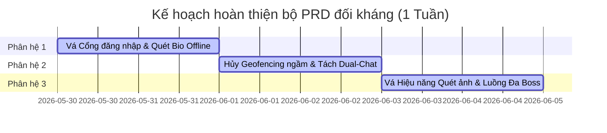

# 🛡️ BÁO CÁO THẨM ĐỊNH ĐỐI KHÁNG TOÀN DIỆN (AUDIT REPORT - ALL PRD PORTFOLIO)
*(COMPREHENSIVE ADVERSARIAL AUDIT & SYSTEM REFINEMENT PLAN FOR ALL 4 MAJOR ENGINES)*

> **Mã Tài Liệu:** `AUDIT_REPORT_ALL_PRDS`  
> **Chủ trì:** Sophia (CPO / PM)  
> **Đội ngũ phản biện đối kháng:** Alan (Tech Lead), Benny (Senior Mobile Dev), Arthur (Mom Test & Security Expert)  
> **Phạm vi kiểm duyệt:** Toàn bộ 25+ tệp đặc tả PRD thuộc 4 phân hệ lớn trong thư mục [PRD/](file:///Users/macinia/Capcat%20Project/Document/PRD/).  
> **Mục tiêu:** Tháo mũ "người nhà", tấn công trực diện để chỉ ra các điểm gãy (broken flows), khoảng trống kỹ thuật (gaps) và mâu thuẫn kiến trúc (contradictions), kèm kế hoạch hoàn thiện tinh giản tối đa.

---

## 💥 PHÂN HỆ 1: AUTHENTICATION & ONBOARDING ENGINE
*(Phân hệ Đăng nhập một chạm & Đón Boss về nhà)*

### 1. Điểm gãy SĐT vs Google SSO (Legacy Auth Contradiction)
*   **Mâu thuẫn:** Tài liệu `SPEC_01_LOGIN_PORTAL.md` tuyên bố loại bỏ hoàn toàn việc đăng ký bằng Số điện thoại (SĐT) lúc Onboarding để giảm ma sát, chỉ dùng duy nhất Google SSO. Nhưng trong file ngôn ngữ hệ thống `app_vi.arb` và các màn hình cũ, có hàng chục key liên quan đến `forgotPhoneTitle`, `forgotPhoneSubtitle`, `OTP Screen`, `signUpInvalidPhone`.
*   **Hậu quả:** Gãy luồng hỗ trợ người dùng cũ. Nếu bỏ hẳn SĐT, các tài khoản đăng ký cũ bằng SĐT sẽ bị cô lập, không thể đăng nhập hoặc đồng bộ dữ liệu.
*   **Vá lỗi (Giải pháp tinh giản):** Áp dụng kiến trúc **Dual-Auth Strategy**:
    *   Giữ Google SSO làm luồng Onboarding mặc định (Default) cho người dùng mới.
    *   Cung cấp một nút nhỏ phẳng dưới chân trang chào mừng: *"Đăng nhập bằng số điện thoại (Dành cho tài khoản cũ)"* để dẫn tới màn hình OTP truyền thống, không ép buộc người dùng mới phải nhập SĐT.

### 2. Điểm gãy Quét sinh học ảnh ảo khi ngoại tuyến (Offline Bio Scan Gap)
*   **Khoảng trống:** `SPEC_02_BOSS_ONBOARDING.md` và `SPEC_03_SOUL_MIRROR_SCAN.md` đặc tả việc người dùng chụp ảnh thú cưng thật để AI offline quét nhận dạng giống loài, màu lông. Tuy nhiên, tài liệu chưa định nghĩa hành vi khi **máy ảnh chụp một vật thể không phải chó/mèo** (ví dụ: cái bàn, trần nhà) hoặc khi **thiết bị hoàn toàn không có kết nối mạng** làm thế nào để đồng bộ dữ liệu sinh học này về server.
*   **Vá lỗi:** 
    *   *Chặn ảnh rác:* Nếu model ML Kit offline trả về độ tin cậy nhận diện chó/mèo < 70%, lập tức hiển thị SnackBar cảnh báo hóm hỉnh: *"Hình như đây là một góc phòng tĩnh lặng chứ không phải Boss? Sen chụp lại rõ nét hơn chút nhé! 📸"*.
    *   *Ngoại tuyến:* Cho phép tạo profile cục bộ lưu vào SQLite tạm thời. Khi phát hiện thiết bị online (`connectivity_plus`), tự động kích hoạt background sync đồng bộ dữ liệu profile về server.

---

## 💥 PHÂN HỆ 2: COZY CHAT RESONANCE ENGINE
*(Phân hệ Chat cộng hưởng không gian - thời gian thực)*

### 3. Điểm gãy Định vị ngầm & Hao pin hệ điều hành (Geofencing Battery & OS Block)
*   **Điểm gãy CHÍ TỬ:** `SPEC_02_CONTEXT_SENSING.md` và `SPEC_04_INVISIBLE_GEOSPATIAL.md` yêu cầu sử dụng `flutter_background_geolocation` để liên tục quét định vị ngầm và lên lịch `workmanager` đánh thức app ngầm vào 12h đêm, 10h sáng, 3h chiều để cảm nhận ngữ cảnh. 
*   **Hậu quả:** 
    1.  **Hệ điều hành tiêu diệt:** Cả iOS và Android cực kỳ khắt khe với việc chạy ngầm định vị. OS sẽ hiển thị cảnh báo bảo mật đáng sợ lên màn hình khóa của người dùng: *"Capcat đã sử dụng vị trí của bạn dưới nền. Bạn có muốn tiếp tục cho phép?"* điều này sẽ kích hoạt phản ứng phòng thủ tâm lý dữ dội của người dùng, phá nát triết lý "Chữa lành".
    2.  Apple BackgroundTask API **không bao giờ đảm bảo chạy đúng giờ** (12h đêm hay 3h chiều). Nó chỉ chạy khi hệ điều hành thấy máy rảnh/đang cắm sạc.
*   **Vá lỗi (Quyết định Xoay trục Kỹ thuật):** Hủy bỏ hoàn toàn việc quét định vị chạy ngầm liên tục dưới nền. Chuyển dịch 100% sang **Foreground Sensing (Cảm nhận khi mở app)**:
    *   Chỉ lấy tọa độ GPS và thời tiết thực tế bằng API khi người dùng **mở app** (Foreground session) và nạp ngầm vào phòng chat.
    *   Sử dụng **Local Scheduled Push Notifications (Thông báo đẩy cục bộ hẹn giờ)** dựa trên giờ sinh hoạt cuối cùng để Spontaneous Opener (Lời mở đầu tự phát) hiển thị trên màn hình khóa. Giải pháp này mượt mà 100%, không tốn pin, không kích hoạt cảnh báo bảo mật của OS.

### 4. Mâu thuẫn Giữa Trễ Ngẫu Nhiên vs Chat Trực Tiếp (Active Chat Loop Contradiction)
*   **Mâu thuẫn:** `SPEC_05_FREQUENCY_COMPASS.md` quy định áp dụng bộ trễ ngẫu nhiên 15-45 phút cho tin nhắn của Boss AI để giả lập thú cưng thật trả lời chậm rãi. Tuy nhiên, nếu người dùng đang mở app và nhắn tin liên tục, việc bắt họ đợi 30 phút cho mỗi tin nhắn sẽ giết chết sự gắn kết của người dùng lập tức.
*   **Vá lỗi:** Phân tách rõ ràng làm 2 chế độ Chat (Dual-Mode Chat Loop):
    *   *Chế độ Chủ động (Active Chat Session - Khi người dùng đang mở app):* Boss phản hồi trong vòng **2-4 giây** (kèm hiệu ứng bong bóng ba chấm nhấp nháy *"Lucky đang gõ..."* để tạo cảm giác hồi hộp, Dopamine).
    *   *Chế độ Tự phát (Passive Chat Session - Khi người dùng không mở app):* Hạn chế tối đa 1 tin nhắn tự phát/ngày gửi ngầm qua thông báo đẩy sau 4-8 tiếng không tương tác để kéo Sen quay lại.

---

## 💥 PHÂN HỆ 3: MEMORY VAULT ENGINE
*(Phân hệ Hộp ký ức & Trò chơi vuốt ảnh Dopamine)*

### 5. Điểm gãy Hiệu năng Quét ảnh nền Cục bộ (Background Scan Resource Exhaustion)
*   **Điểm gãy:** `SPEC_02_OFFLINE_ML_FILTERS.md` đặc tả việc ứng dụng chạy quét ngầm toàn bộ thư viện ảnh (gallery) của điện thoại dưới nền bằng Google ML Kit để phân loại ảnh thú cưng.
*   **Hậu quả:** Chạy quét ML hàng nghìn ảnh dưới nền sẽ làm nóng máy, hao pin khủng khiếp và lập tức bị hệ điều hành iOS/Android giết tiến trình ngầm do vượt quá giới hạn CPU (CPU threshold termination).
*   **Vá lỗi:** Tuyệt đối không quét ảnh ngầm dưới nền. Chuyển sang **Foreground Idle Processing**:
    *   Chỉ quét ảnh khi người dùng mở ứng dụng và **không tương tác** (trạng thái Idle) hoặc khi người dùng chủ động bấm vào banner "Buffet Ký ức".
    *   Giới hạn nghiêm ngặt mỗi lần quét tối đa **10-15 ảnh mới nhất**, lưu trạng thái index vào SQLite để không bao giờ quét lại ảnh cũ.

### 6. Khoảng trống Chuyển đổi Đơn Boss sang Đa Boss (Migration Gap)
*   **Khoảng trống:** `SPEC_08_PET_INDIVIDUAL_RECOGNITION.md` sử dụng mô hình TFLite MobileNetV3 để nhận diện phân loại ảnh chó Lucky vs mèo Bánh Mỳ khi người dùng nuôi 2+ boss. Tuy nhiên, tài liệu bỏ trống hoàn toàn kịch bản: Người dùng ban đầu chỉ nuôi 1 boss (hệ thống lưu tất cả ảnh mà không gán ID cụ thể), sau đó họ đón thêm boss thứ 2 về nhà.
*   **Hậu quả:** Toàn bộ kho ký ức cũ không được phân loại, hiển thị hỗn loạn hoặc bị gán sai cho boss mới.
*   **Vá lỗi:** Bổ sung quy trình **Retroactive Re-indexing Flow (Tái phân loại lịch sử)**:
    *   Khi người dùng tạo boss thứ 2 thành công, hệ thống hiển thị một hộp thoại gợi ý nhẹ nhàng: *"Nhà mình có thành viên mới! Bạn có muốn Lucky giúp bạn phân loại lại kho ký ức cũ không? 🐾"*.
    *   Bấm đồng ý sẽ chạy một tiến trình ngầm (Throttled Background Thread) so sánh vector đặc trưng của toàn bộ ảnh cũ với boss mới và cập nhật lại trường `pet_id` chính xác.

---

## 📅 V. KẾ HOẠCH HÀNH ĐỘNG HOÀN THIỆN (REFINEMENT ACTION PLAN)

Để đưa toàn bộ 25+ tệp tài liệu PRD này về trạng thái **Thực tế - Siêu Mượt - Không Lỗi Build**, chúng ta sẽ bổ sung các chỉ mục sửa đổi vào các tài liệu PRD master mà không làm phình to scope ban đầu:

### 1. Phân hệ 1: Authentication & Onboarding
*   *Action Item 1 (Benny/Alan):* Cập nhật `SPEC_01_LOGIN_PORTAL.md` thêm luồng đăng nhập SĐT phụ trợ cho User cũ.
*   *Action Item 2 (Alan):* Thêm logic chặn ảnh không phải thú cưng và cơ chế lưu trữ SQLite offline vào `SPEC_02_BOSS_ONBOARDING.md`.

### 2. Phân hệ 2: Cozy Chat Resonance
*   *Action Item 3 (Benny/Alan):* Chuyển đổi toàn bộ cơ chế định vị ngầm Geofencing sang Foreground Sensing trong tệp `SPEC_02_CONTEXT_SENSING.md`.
*   *Action Item 4 (Sophia):* Hiệu chỉnh lại thông số trễ phản hồi tin nhắn (tách biệt luồng Active vs Passive Chat) trong tệp `SPEC_05_FREQUENCY_COMPASS.md`.

### 3. Phân hệ 3: Memory Vault
*   *Action Item 5 (Alan/Benny):* Sửa cơ chế quét ảnh từ chạy ngầm sang quét Foreground Idle trong tệp `SPEC_02_OFFLINE_ML_FILTERS.md`.
*   *Action Item 6 (Sophia/Alan):* Bổ sung luồng tái phân loại ảnh lịch sử (Retroactive Re-indexing) khi chuyển đổi từ 1 Boss sang 2+ Boss trong tệp `SPEC_08_PET_INDIVIDUAL_RECOGNITION.md`.

---

*Tài liệu thẩm định đối kháng toàn diện được đóng dấu kiểm duyệt bởi Ban cố vấn Capcat — PM Sophia, Tech Lead Alan, Dev Benny, Expert Arthur.*
