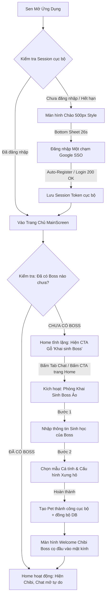

# PRODUCT REQUIREMENTS DOCUMENT (PRD MASTER)
## PHÂN HỆ ĐĂNG NHẬP MỘT CHẠM & KHAI SINH BOSS ẢO (AUTHENTICATION & ONBOARDING ENGINE)
*(Phiên bản: 3.0 - Giai đoạn: MVP - Người soạn: CPO Sophia)*

---

## 1. TUYÊN NGÔN TRIẾT LÝ SẢN PHẨM (PRODUCT VISION)

Trong Capcat, chúng tôi tôn trọng quyền tự do trải nghiệm của người dùng (Sen). Thay vì **ép buộc** Sen phải điền form khai sinh Boss ảo ngay lập tức sau khi đăng nhập (gây ra cảm giác áp lực và tăng tỷ lệ thoát app), Capcat MVP áp dụng triết lý **"Trải nghiệm tĩnh lặng trước - Kết nối cảm xúc sau"**:

*   **Một chạm vào thẳng vườn nhà:** Sau khi đăng nhập Google SSO, Sen được đưa thẳng vào trang chủ `MainScreen` với trạng thái "Vườn nhà trống". Họ có thể ngắm giao diện, chuyển đổi các tab để làm quen với không gian mộc mạc Wabi-Sabi.
*   **Điểm kích hoạt (CTA) tự nhiên:** Phòng Khai sinh Boss chỉ được kích hoạt một cách tự nguyện qua hai điểm chạm:
    1.  **CTA "Mảnh vườn chờ trông" trên trang Home:** Một chiếc card gỗ retro xinh xắn mời gọi Sen gieo mầm linh hồn đầu tiên.
    2.  **Gate chặn tại Phòng Chat:** Khi Sen bấm vào tab Chat, vì phòng chat cần có đối tượng giao tiếp, app sẽ trượt lên một Action Sheet mời Sen khai sinh Boss để bắt đầu trò chuyện tri kỷ.

---

## 2. BẢN ĐỒ DÒNG CHẢY TRẢI NGHIỆM THỐNG NHẤT (UNIFIED FLOW MAP)

---

## 3. CƠ CẤU THƯ MỤC ĐẶC TẢ CHI TIẾT (SPECIFICATION DIRECTORY STRUCTURE)

Để đảm bảo tính nhất quán và khoa học như các phân hệ Cozy Chat và Memory Vault trước đây, Phân hệ Đăng nhập & Khai sinh được phân rã thành các tài liệu đặc tả độc lập nằm tại thư mục:
`Document/PRD/AUTHENTICATION_AND_ONBOARDING_ENGINE/`

1.  **[PRD_MASTER_AUTH_ONBOARD.md](file:///Users/macinia/Capcat%20Project/Document/PRD/AUTHENTICATION_AND_ONBOARDING_ENGINE/PRD_MASTER_AUTH_ONBOARD.md) (Tài liệu này):** Tổng quan tầm nhìn, sơ đồ luồng thống nhất và cấu trúc dữ liệu.
2.  **[SPEC_01_LOGIN_PORTAL.md](file:///Users/macinia/Capcat%20Project/Document/PRD/AUTHENTICATION_AND_ONBOARDING_ENGINE/SPEC_01_LOGIN_PORTAL.md):** Đặc tả chi tiết cổng chào Một Chạm Google SSO (phong cách 500px & 26s), loại bỏ verify SĐT lúc Onboard để tối giản ma sát.
3.  **[SPEC_02_BOSS_ONBOARDING.md](file:///Users/macinia/Capcat%20Project/Document/PRD/AUTHENTICATION_AND_ONBOARDING_ENGINE/SPEC_02_BOSS_ONBOARDING.md):** Đặc tả chi tiết giao diện thiết lập thông tin Boss, chọn cá tính AI, gán xưng hô (`xungHoWithPet`) và hoạt ảnh cọ kính chào mừng Sen mới.

---

## 4. CHI TIẾT TÍCH HỢP HỆ THỐNG (SYSTEM INTEGRATION & ROUTING RULES)

### 4.1. Quy tắc Điều Hướng Splash Guard & Hỗ trợ Empty State
Khi `AppEntryPoint` khởi chạy, việc điều hướng được làm sạch tối đa:
*   `State: authenticated = true` $\rightarrow$ Navigate thẳng tới `MainScreen()`.
*   `State: authenticated = false` $\rightarrow$ Navigate tới `WelcomeScreen()`.

Trong màn hình `MainScreen()`, việc kiểm tra `hasPet` được phân cấp dưới dạng Component State:
*   **Tại Tab Home:** 
    *   *If `hasPet == true`:* Hiển thị Home Header bình thường, Touch Chibi Carousel.
    *   *If `hasPet == false`:* Hiển thị Vùng Chờ trống kèm một Card Gỗ Retro: *"Mảnh vườn Capcat đang tĩnh lặng chờ trông... Hãy khai sinh chú chó/mèo ảo đầu tiên để lấp đầy yêu thương nhé!"* và nút bấm màu xanh **[Khai sinh ngay 🐾]** trượt lên Action Sheet.
*   **Tại Tab Chat:**
    *   *If `hasPet == false`:* Hiển thị màn hình giới thiệu phòng chat tri kỷ ấm áp kèm nút bấm **[Nhận nuôi thú cưng để trò chuyện]** trượt lên Action Sheet.

### 4.2. Dữ liệu User Profile để Tối ưu các Luồng Sau (Downstream Profile Model)
Hồ sơ người dùng (User Profile) được tự động tạo từ tài khoản Google và lưu trữ bổ sung các biến tùy chỉnh để cá nhân hóa giọng điệu AI sau này:
*   `avatarUrl` (String): Đồng bộ từ Google.
*   `fullName` (String): Tên hiển thị (để Boss AI gọi Sen).
*   `xungHoWithPet` (Enum): Xưng hô Sen chọn (Ba, Mẹ, Sen, Cậu, Tớ...).
*   `caregiverRole` (Enum): Vai trò (Nuôi chính / Nuôi phụ) phục vụ tính năng mách lẻo chéo.
