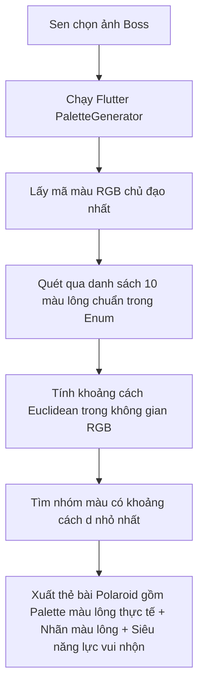

# SPECIFICATION 03: GIẢI PHÁP KỸ THUẬT "GƯƠNG SOI LINH HỒN BOSS"
## (OFFLINE COAT COLOR EXTRACTOR & PET LABELS MATCHING)
*(Phiên bản: 3.0 - Giai đoạn: MVP - Người soạn: Tech Lead Alan)*

---

## 1. TỔNG QUAN GIẢI PHÁP (SOLUTION OVERVIEW)

Để tạo ra trải nghiệm nhận diện Boss ảo **"Wow" lập tức dưới 200ms** mà **hoàn toàn miễn phí (0đ server API)**, hệ thống sử dụng sức mạnh xử lý cục bộ trên thiết bị di động thông qua sự phối hợp của các thư viện chạy Offline:
1.  **Google ML Kit Image Labeling (Cục bộ):** Nhận diện phân loại nhãn sinh học cơ bản (Chó `"Dog"` hoặc Mèo `"Cat"`).
2.  **Khớp Giống Loài Offline (Breed Offline Matching):** Quét qua các nhãn đầu ra có độ tin cậy cao (`confidence >= 0.65`) của ML Kit (ví dụ: *Golden Retriever, Poodle, Pembroke Welsh Corgi, Siamese cat...*) để tự động đối chiếu và tự điền giống loài chuẩn trong **Enum `PetBreed`**. Nếu không nhận diện được giống cụ thể, hệ thống sẽ tự động gán mặc định là **Chó Ta / Mèo Ta (Mixed/Local Breed)** nhưng cho phép Sen tự chọn lại qua searchable dropdown.
3.  **Flutter Palette Generator (Cục bộ):** Trích xuất các màu sắc chủ đạo từ hình ảnh của thú cưng, sau đó sử dụng thuật toán **Khoảng cách Màu sắc Euclidean (Color Distance)** để khớp vào **Enum 10 nhóm màu lông thú cưng chuẩn hóa**.

---

## 2. THUẬT TOÁN TRÍCH XUẤT & PHÂN NHÓM MÀU SẮC (COLOR ALGORITHM)



### 2.1. Thuật toán Tính toán Khoảng cách Màu sắc (Euclidean Distance Formula)
Mã màu chủ đạo trích xuất từ ảnh được biểu diễn dưới dạng vector $C_{dom} = (R_{dom}, G_{dom}, B_{dom})$. 
Chúng ta có danh sách 10 mã màu lông chuẩn biểu diễn dưới dạng $C_{std} = (R_{std}, G_{std}, B_{std})$.

Khoảng cách màu sắc $d$ giữa màu trích xuất và màu chuẩn được tính bằng công thức khoảng cách không gian 3 chiều:

$$d = \sqrt{(R_{dom} - R_{std})^2 + (G_{dom} - G_{std})^2 + (B_{dom} - B_{std})^2}$$

Nhóm màu lông chuẩn nào có giá trị $d$ **nhỏ nhất** sẽ được hệ thống lựa chọn làm kết quả nhận diện màu lông của Boss.

---

## 3. THIẾT KẾ ENUM MÀU LÔNG VÀ SIÊU NĂNG LỰC (`PetCoatColor`)

Dưới đây là bảng định nghĩa cấu trúc dữ liệu Enum `PetCoatColor` tích hợp sẵn mã RGB chuẩn và các thuộc tính cá nhân hóa vui nhộn phục vụ luồng hiển thị:

```dart
enum PetCoatColor {
  gingerOrange(
    code: 'GINGER_ORANGE',
    displayNameVi: 'Cam Gừng cá tính',
    displayNameEn: 'Ginger Orange',
    standardRgb: [230, 126, 34], // #E67E22
    funnyTraitVi: 'Phàm ăn pate cấp độ vũ trụ, ngủ bất chấp không gian.',
    funnyTraitEn: 'Gluttonous eater, can sleep anywhere, anytime.',
  ),
  tuxedoBlack(
    code: 'TUXEDO_BLACK',
    displayNameVi: 'Đen Huyền bí',
    displayNameEn: 'Tuxedo Black',
    standardRgb: [44, 62, 80], // #2C3E50
    funnyTraitVi: 'Tàng hình hoàn hảo vào bóng đêm để âm thầm khịa Sen.',
    funnyTraitEn: 'Master of stealth in the dark, silent judger.',
  ),
  creamGold(
    code: 'CREAM_GOLD',
    displayNameVi: 'Vàng Kem ấm áp',
    displayNameEn: 'Cream Gold',
    standardRgb: [243, 156, 18], // #F39C12
    funnyTraitVi: 'Thân thiện thái quá, ai đi qua cũng vẫy đuôi làm quen.',
    funnyTraitEn: 'Overly friendly, treats everyone as their best friend.',
  ),
  snowWhite(
    code: 'SNOW_WHITE',
    displayNameVi: 'Trắng Tuyết quý phái',
    displayNameEn: 'Snow White',
    standardRgb: [236, 240, 241], // #ECF0F1
    funnyTraitVi: 'Sợ bẩn hơn sợ đói, hay dỗi khi không được khen đẹp.',
    funnyTraitEn: 'Fears dirt more than hunger, professional sulker.',
  ),
  silverTabby(
    code: 'SILVER_TABBY',
    displayNameVi: 'Mướp Xám trầm tư',
    displayNameEn: 'Silver Tabby',
    standardRgb: [189, 195, 199], // #BDC3C7
    funnyTraitVi: 'Trầm cảm nhẹ, thích ngồi bên cửa sổ nhìn xa xăm nghĩ sự đời.',
    funnyTraitEn: 'Deep thinker, prefers staring out windows contemplating life.',
  ),
  chocoBrown(
    code: 'CHOCO_BROWN',
    displayNameVi: 'Nâu Choco ngọt ngào',
    displayNameEn: 'Choco Brown',
    standardRgb: [126, 81, 9], // #7E5109
    funnyTraitVi: 'Tăng động 24/7, sở thích gặm dép và đuổi theo cái đuôi của mình.',
    funnyTraitEn: 'Hyperactive 24/7, loves chewing slippers and tail chasing.',
  ),
  calicoThree(
    code: 'CALICO_THREE',
    displayNameVi: 'Tam Thể sắc sảo',
    displayNameEn: 'Calico Three',
    standardRgb: [229, 152, 102], // #E59866
    funnyTraitVi: 'Đa nhân cách, sáng nắng chiều mưa, lúc cọ đầu lúc cào Sen.',
    funnyTraitEn: 'Multi-personality, cuddly one second, scratchy the next.',
  ),
  blueGrey(
    code: 'BLUE_GREY',
    displayNameVi: 'Xám Xanh quý tộc',
    displayNameEn: 'Blue Grey',
    standardRgb: [127, 140, 141], // #7F8C8D
    funnyTraitVi: 'Phong thái hoàng gia lạnh lùng, chỉ nhìn Sen bằng nửa con mắt.',
    funnyTraitEn: 'Royal attitude, looks down on humans with half an eye.',
  ),
  bicoWhite(
    code: 'BICO_WHITE',
    displayNameVi: 'Nhị Thể hài hước',
    displayNameEn: 'Bico White',
    standardRgb: [52, 73, 94], // #34495E
    funnyTraitVi: 'Học sinh cá biệt, ngáo ngơ bền vững, chuyên làm trò hề.',
    funnyTraitEn: 'Class clown, permanently goofy, meme generator.',
  ),
  mixedRainbow(
    code: 'MIXED_RAINBOW',
    displayNameVi: 'Đa Sắc hoang dã',
    displayNameEn: 'Mixed Rainbow',
    standardRgb: [149, 165, 166], // #95A5A6
    funnyTraitVi: 'Sinh tồn đỉnh cao, ăn tạp ngủ say, đề kháng vũ trụ.',
    funnyTraitEn: 'Ultimate survivor, eats everything, sleeps like a log.',
  );

  final String code;
  final String displayNameVi;
  final String displayNameEn;
  final List<int> standardRgb;
  final String funnyTraitVi;
  final String funnyTraitEn;

  const PetCoatColor({
    required this.code,
    required this.displayNameVi,
    required this.displayNameEn,
    required this.standardRgb,
    required this.funnyTraitVi,
    required this.funnyTraitEn,
  });
}

enum PetBreed {
  // --- CHÓ (DOG BREEDS) ---
  goldenRetriever(
    code: 'GOLDEN_RETRIEVER',
    displayNameVi: 'Golden Retriever',
    aliases: ['Golden Retriever', 'Golden', 'retriever'],
    isDog: true,
  ),
  corgi(
    code: 'CORGI',
    displayNameVi: 'Welsh Corgi',
    aliases: ['Pembroke Welsh Corgi', 'Cardigan Welsh Corgi', 'Corgi'],
    isDog: true,
  ),
  poodle(
    code: 'POODLE',
    displayNameVi: 'Poodle',
    aliases: ['Poodle', 'Toy Poodle', 'Standard Poodle', 'Miniature Poodle'],
    isDog: true,
  ),
  husky(
    code: 'HUSKY',
    displayNameVi: 'Siberian Husky',
    aliases: ['Siberian Husky', 'Husky', 'Alaskan Malamute', 'Malamute'],
    isDog: true,
  ),
  shibaInu(
    code: 'SHIBA_INU',
    displayNameVi: 'Shiba Inu',
    aliases: ['Shiba Inu', 'Shiba', 'Akita'],
    isDog: true,
  ),
  chihuahua(
    code: 'CHIHUAHUA',
    displayNameVi: 'Chihuahua',
    aliases: ['Chihuahua'],
    isDog: true,
  ),
  pug(
    code: 'PUG',
    displayNameVi: 'Pug mặt xệ',
    aliases: ['Pug', 'mops'],
    isDog: true,
  ),
  dogVietnameseTa(
    code: 'DOG_VIETNAMESE_TA',
    displayNameVi: 'Chó Cỏ / Chó Ta',
    aliases: ['mong coc', 'phu quoc', 'laika'],
    isDog: true,
  ),
  dogMixed(
    code: 'DOG_MIXED',
    displayNameVi: 'Chó lai / Giống hỗn hợp',
    aliases: [],
    isDog: true,
  ),

  // --- MÈO (CAT BREEDS) ---
  britishShorthair(
    code: 'BRITISH_SHORTHAIR',
    displayNameVi: 'Mèo Anh Lông Ngắn (ALN)',
    aliases: ['British Shorthair', 'Shorthair cat', 'Chartreux'],
    isDog: false,
  ),
  britishLonghair(
    code: 'BRITISH_LONGHAIR',
    displayNameVi: 'Mèo Anh Lông Dài (ALD)',
    aliases: ['British Longhair', 'Longhair cat', 'Persian cat'],
    isDog: false,
  ),
  scottishFold(
    code: 'SCOTTISH_FOLD',
    displayNameVi: 'Mèo Tai Cụp Scottish',
    aliases: ['Scottish Fold', 'Fold cat'],
    isDog: false,
  ),
  sphynx(
    code: 'SPHYNX',
    displayNameVi: 'Mèo không lông Sphynx',
    aliases: ['Sphynx', 'hairless cat'],
    isDog: false,
  ),
  siamese(
    code: 'SIAMESE',
    displayNameVi: 'Mèo Xiêm quý tộc',
    aliases: ['Siamese cat', 'Siamese', 'Burmese'],
    isDog: false,
  ),
  catVietnameseTa(
    code: 'CAT_VIETNAMESE_TA',
    displayNameVi: 'Mèo Ta / Mèo Mướp',
    aliases: ['tabby cat', 'malkin'],
    isDog: false,
  ),
  catMixed(
    code: 'CAT_MIXED',
    displayNameVi: 'Mèo lai / Giống hỗn hợp',
    aliases: [],
    isDog: false,
  );

  final String code;
  final String displayNameVi;
  final List<String> aliases;
  final bool isDog;

  const PetBreed({
    required this.code,
    required this.displayNameVi,
    required this.aliases,
    required this.isDog,
  });
}
```

---

## 4. QUY TRÌNH THỰC THI PHÍA CLIENT (FLUTTER CODE STRUCTURE)

Khi ảnh được chọn, luồng tính toán trích xuất màu lông và đối chiếu giống loài từ nhãn ML Kit chạy ngầm trong isolate để đảm bảo UI siêu mượt:

```dart
import 'package:flutter/material.dart';
import 'package:palette_generator/palette_generator.dart';
import 'dart:math';

class SoulMirrorScanResult {
  final PetCoatColor matchedColor;
  final PetBreed matchedBreed;
  final bool isDog;
  final List<Color> extractedPalette;

  SoulMirrorScanResult({
    required this.matchedColor,
    required this.matchedBreed,
    required this.isDog,
    required this.extractedPalette,
  });
}

class SoulMirrorService {
  /// Hàm phân tích chính chạy offline
  static Future<SoulMirrorScanResult> analyzePhoto({
    required ImageProvider imageProvider,
    required List<String> mlKitLabels, // Nhãn đầu ra nhận diện từ ML Kit Offline
  }) async {
    // 1. Nhận diện loài (Dog/Cat) từ nhãn ML Kit
    final bool isDog = mlKitLabels.any((label) => 
      label.toLowerCase() == 'dog' || label.toLowerCase() == 'puppy');

    // 2. Trích xuất Palette màu thực tế từ ảnh lông
    final PaletteGenerator paletteGen = await PaletteGenerator.fromImageProvider(
      imageProvider,
      maximumColorCount: 8,
    );

    final Color dominantColor = paletteGen.dominantColor?.color ?? Colors.grey;
    final List<Color> extractedPalette = paletteGen.colors.take(4).toList();

    // 3. Khớp màu lông chuẩn qua Euclidean Distance
    double minDistance = double.infinity;
    PetCoatColor bestColorMatch = PetCoatColor.mixedRainbow;

    for (final coatColor in PetCoatColor.values) {
      final double distance = _calculateDistance(dominantColor, coatColor.standardRgb);
      if (distance < minDistance) {
        minDistance = distance;
        bestColorMatch = coatColor;
      }
    }

    // 4. Khớp giống loài (Breed Matching) từ nhãn ML Kit
    final PetBreed bestBreedMatch = _matchBreedOffline(mlKitLabels, isDog);

    return SoulMirrorScanResult(
      matchedColor: bestColorMatch,
      matchedBreed: bestBreedMatch,
      isDog: isDog,
      extractedPalette: extractedPalette,
    );
  }

  /// Thuật toán đối chiếu giống loài cục bộ
  static PetBreed _matchBreedOffline(List<String> labels, bool isDog) {
    for (final label in labels) {
      for (final breed in PetBreed.values) {
        if (breed.isDog == isDog) {
          for (final alias in breed.aliases) {
            if (label.toLowerCase().contains(alias.toLowerCase())) {
              return breed;
            }
          }
        }
      }
    }
    // Fallback mặc định nếu không khớp giống cụ thể
    return isDog ? PetBreed.dogVietnameseTa : PetBreed.catVietnameseTa;
  }

  static double _calculateDistance(Color color, List<int> standardRgb) {
    return sqrt(
      pow(color.red - standardRgb[0], 2) +
      pow(color.green - standardRgb[1], 2) +
      pow(color.blue - standardRgb[2], 2)
    );
  }
}
```

---

## 5. HIỂN THỊ KẾT QUẢ TRÊN UI (WOW PRESENTATION DESIGN)

*   **Hiển thị Palette thực tế:** Tấm thẻ Polaroid sẽ đính kèm 4 hình tròn nhỏ hiển thị đúng 4 mã màu thực tế (`extractedPalette`) được trích xuất từ lông Boss, tạo cảm giác vô cùng nghệ thuật và cá nhân hóa.
*   **Trình bày Nhãn màu & Giống loài & Siêu năng lực:** Hiển thị mộc mạc:
    *   *Màu lông xác định:* **Mèo Cam Gừng cá tính**
    *   *Giống loài nhận diện:* **Mèo Anh Lông Ngắn (ALN)** *(được tự động chọn trong dropdown)*
    *   *Siêu năng lực linh hồn:* **Phàm ăn pate cấp độ vũ trụ, ngủ bất chấp không gian.**
