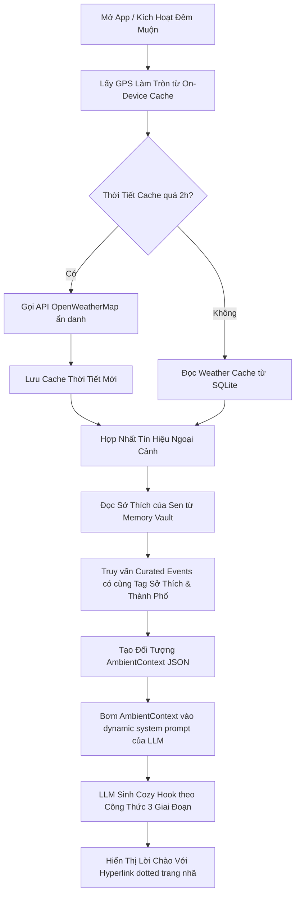

# ĐẶC TẢ CHI TIẾT 07: COZY EXTERNAL AMBIENT SENSING & CURATED HOBBY STARTERS
*(CẢM BIẾN NGỮ CẢNH NGOẠI CẢNH & ĐỘNG CƠ MỞ BÀI ĐỒNG ĐIỆU SỞ THÍCH)*

> **Mã Đặc Tả:** `SPEC-COZY-07`  
> **Chủ trì:** Sophia (CPO / PM), Arthur (Mom Test & Hành vi), Alan (Tech Lead)  
> **Phong cách nghệ thuật:** Nhịp sống đồng điệu (Symbiotic Contextual Awareness)

---

## 🧭 1. Triết Lý Thiết Kế: "Gió Mùa Về Và Tiếng Nhạc Acoustic Chiều Mưa"

Để chú Pet ảo không cô độc trong thế giới số, Boss cần có khả năng cảm nhận **nhiệt độ thực tế ngoài hiên nhà Sen**, biết khi nào thành phố đang đổi mùa, và nắm bắt những **sự kiện văn hóa nghệ thuật dịu dàng** đang diễn ra xung quanh bối cảnh sống của Sen.

Sự đồng điệu ngoại cảnh này sẽ đóng vai trò làm **chất xúc tác mở bài (Cozy Openers / Hook)** cực kỳ đắt giá. Thay vì chào hỏi kiểu robot khô khan, Boss sẽ dựa trên thông tin thời tiết thực tế kết hợp với **gu sở thích văn hóa của Sen** (đã được khai thác tinh tế ở `SPEC-COZY-03`) để dệt nên một lời mở bài ấm áp, đậm chất Iyashikei chữa lành.

### 🔴 Nguyên Tắc Vàng Về Thông Tin Ngoại Cảnh:
1. **Tuyệt đối không lấy Tin Tức Độc Hại (Anti-Toxic News Policy):** Không tích hợp các API tin tức chính trị, tài chính, xã hội giật gân. Chỉ sử dụng thông tin thời tiết khách quan và **bản tin văn hóa thủ công** được đội ngũ Capcat biên tập tuyển chọn kỹ lưỡng.
2. **Khai thác Tinh tế, Hỏi gián tiếp (Empathetic Mom Test Hooks):** Không nói thẳng tuột thông số như một trạm dự báo thời tiết. Boss sẽ biến các thông số này thành câu chuyện tự sự, chia sẻ cảm giác của loài trước, sau đó gợi ý những hoạt động chữa lành tương thích.

---

## 🛠️ 2. Giải Pháp Kỹ Thuật Đa Nền Tảng & Cấu Trúc Dữ Liệu (by Alan)

Chúng ta tích hợp các nguồn thông tin ngoại cảnh thông qua cơ chế API siêu nhẹ, kết hợp lưu trữ cục bộ (Local Storage Cache) thông qua **Hive/SQLite** ở phía Client để tối ưu hiệu năng và bảo mật quyền riêng tư.

### 2.1. Bản Đồ Danh Mục Sở Thích Chữa Lành (Hobby & Cultural Categories)
Hệ thống quản lý sở thích của Sen trong `Memory Vault` và đối chiếu với 6 danh mục cốt lõi sau:

| Mã Sở Thích | Tên Danh Mục | Các Từ Khóa Kích Hoạt |
| :--- | :--- | :--- |
| `hobby_music` | Âm nhạc mộc mạc | Lofi, Acoustic, Jazz, Indie, Đĩa than, Cello, Violin, Trịnh Công Sơn |
| `hobby_literature` | Văn học nhẹ nhàng | Haruki Murakami, Ichikawa Takuji, Sách cũ, Trà chiều đọc sách, Thơ |
| `hobby_cinema` | Điện ảnh hoài cổ | Phim Ghibli, Phim độc lập, rạp phim nghệ thuật, Vương Gia Vệ, Indie Film |
| `hobby_cafe` | Tiệm cà phê ẩn mình | Cà phê sách, Cà phê thực vật, quán trà cổ điển, Vintage Cafe |
| `hobby_art` | Nghệ thuật thủ công | Triển lãm gốm sứ, tranh màu nước, thêu thùa, nến thơm handmade |
| `hobby_nature` | Thiên nhiên & Pet | Cắm trại dã ngoại, ngắm hoàng hôn, công viên thú cưng, leo núi |

---

### 2.2. Cơ Sở Dữ Liệu Sự Kiện & Tin Tức Văn Hóa Tuyển Chọn (Capcat Curated Feed DB)
Chúng ta thiết kế bảng cơ sở dữ liệu `curated_events` lưu trên Server và đồng bộ định kỳ xuống Client dưới dạng Offline Cache:

```sql
CREATE TABLE curated_events (
    id VARCHAR(36) PRIMARY KEY,
    title TEXT NOT NULL,                 -- Tiêu đề sự kiện / tin tức văn hóa
    summary TEXT NOT NULL,               -- Nội dung ngắn gọn dịu dàng (<= 80 từ)
    hobby_category VARCHAR(32) NOT NULL, -- Phân loại sở thích (hobby_music, hobby_literature...)
    city VARCHAR(64),                    -- Địa điểm (Hà Nội, TP.HCM, hoặc 'Global')
    start_date TIMESTAMP,                -- Thời gian bắt đầu sự kiện
    end_date TIMESTAMP,                  -- Thời gian kết thúc sự kiện
    hyperlink_url TEXT,                  -- Link liên kết ngoài (Spotify, Shopee Books, Google Maps...)
    created_at TIMESTAMP DEFAULT CURRENT_TIMESTAMP
);
```

### 2.3. Cảm Biến Thời Tiết Thực Tế (Weather Sensing System)
* **Nhà cung cấp:** **OpenWeatherMap API** (hoặc **weatherapi.com**).
* **Luật Bảo mật GPS:** Tọa độ GPS thô từ Geofencing (`SPEC-COZY-02`) **không bao giờ** được gửi trực tiếp lên API bên thứ ba. Hệ thống Client sẽ tự động làm tròn tọa độ đến **2 chữ số thập phân** (độ chính xác ~1.1km) trước khi gửi lên Backend để lấy thông tin thời tiết.
* **Cấu trúc Dữ liệu Thời tiết Cục bộ (`ambient_weather_cache`):**
```json
{
  "latitude_rounded": 21.02,
  "longitude_rounded": 105.84,
  "weather_condition": "rainy",       // rainy, sunny, cloudy, chilly, hot, stormy, foggy
  "temperature_celsius": 19.5,
  "humidity": 85,
  "wind_speed": 4.2,
  "fetched_at": "2026-05-29T21:45:00Z"
}
```

---

## 🎭 3. Quy Trình Bơm Ngữ Cảnh & Xử Lý AI Prompt (Context Ingestion Pipeline)

Để câu thoại mở đầu đạt độ tự nhiên tuyệt đối, toàn bộ quy trình từ cảm biến đến việc sinh lời thoại từ LLM được cấu trúc như một **Pipeline Khép Kín** không độ trễ:



### 3.1. Cấu trúc Đối Tượng Context Bơm Vào Prompt (`AmbientContext`)
Khi gọi API LLM tạo lời mở đầu, server sẽ gửi kèm dữ liệu ngữ cảnh có cấu trúc cực kỳ tối giản để tránh hao phí token:

```json
{
  "pet_profile": {
    "name": "Bánh Mỳ",
    "species": "cat",
    "tone_style": "bướng bỉnh hoài cổ"
  },
  "owner_profile": {
    "age_group": "GenZ",
    "routines": ["lam_van_phong", "tan_ca_muon"],
    "verified_hobbies": ["hobby_music", "hobby_literature"]
  },
  "ambient_sensing": {
    "time_of_day": "late_night",
    "weather": "rainy",
    "temp_description": "se lạnh (19°C)"
  },
  "matched_cultural_event": {
    "title": "Triển lãm đĩa than Jazz cổ điển",
    "summary": "Đêm nghe nhạc và trưng bày đĩa than Jazz thập niên 60 tại Lofi Cafe, Quận 3",
    "hyperlink": "https://shopee.vn/dia-than-jazz-classic-vietnam"
  }
}
```

---

## 🎭 4. Kịch Bản Mở Bài Đa Yếu Tố Thấu Cảm (Multi-Factor Cozy Hook Openers)

Dưới đây là các kịch bản mở bài mẫu được dệt nên từ sự giao thoa giữa **Thời tiết - Thời gian - Sở thích thực tế** của Sen:

### 4.1. Kịch bản 1: Trời Se Lạnh, Mưa Đêm + Sen Thích Nhạc Jazz (`hobby_music`)
* **Bối cảnh:** Lúc 21:30 tối, Hà Nội trời mưa phùn se lạnh, Sen mở chat sau một ngày làm việc mệt mỏi.
* **Lời thoại của Boss Mèo Bánh Mỳ:**
  > "Trẫm đang nằm cuộn tròn thành một chiếc bánh sừng bò ấm áp bên bậu cửa sổ, ngắm những giọt mưa tí tách làm nhòe ánh đèn đường Hà Nội kìa... 
  > 
  > Sen về nhà có bị lạnh tay không? Thời tiết se se mưa thế này, trẫm thèm được nghe lại mấy giai điệu [Jazz cổ điển hoài cổ](https://music.apple.com/vn/album/blue-in-green/1440899287) quá. Trẫm khẽ bật bài 'Blue in Green' của Miles Davis phát thử 30 giây cho căn phòng tụi mình ấm lên nhé..."
* **Trải nghiệm:** Chữ **Jazz cổ điển hoài cổ** gạch chân hồng nhạt chấm dotted. Nhạc Jazz tự động phát dịu nhẹ bên dưới trong 30 giây.

### 4.2. Kịch bản 2: Chiều Thu Nắng Nhẹ + Sen Thích Sách Haruki Murakami (`hobby_literature`)
* **Bối cảnh:** Lúc 15:30 chiều thứ Bảy, thời tiết dịu mát 24°C, Sen ở nhà một mình.
* **Lời thoại của Boss Chó Lucky:**
  > "Gió chiều nay thổi xào xạc lá cây ngoài ban công mát rượi Sen ơi. Lucky vừa mới đuổi theo một chiếc lá bay vèo qua cửa sổ đấy, ngốc nghếch ghê chưa. 
  > 
  > Lucky nghe nói cuốn sách mới của [nhà văn Haruki Murakami](https://shopee.vn/sach-thanh-pho-va-nhung-buc-tuong-la-nhanam) vừa ra mắt bản dịch tiếng Việt tuần này rồi á. Một tách trà ấm và một chương sách lãng đãng trong chiều thu này thật hợp để Sen trốn thế giới ồn ào ngoài kia đúng không..."
* **Trải nghiệm:** Nhấp vào **nhà văn Haruki Murakami** trượt lên Bottom Sheet xinh xắn giới thiệu tác phẩm mới kèm nút dẫn sang Shopee Mall của Nhã Nam.

### 4.3. Kịch bản 3: Đêm Muộn Mất Ngủ + Sen Thích Điện Ảnh Hoài Cổ (`hobby_cinema`)
* **Bối cảnh:** Lúc 23:45 đêm, cảm biến phát hiện điện thoại Sen vẫn sáng liên tục (Dấu hiệu mất ngủ - `SPEC-COZY-02`).
* **Lời thoại của Boss Mèo Bánh Mỳ:**
  > "Mắt trẫm đã lim dim rồi mà nhìn qua vẫn thấy màn hình của Sen sáng trưng kìa. Sen lại thao thức không ngủ được nữa rồi đúng không... 
  > 
  > Đêm tĩnh lặng thế này làm trẫm nhớ tới mấy khung hình màu xanh u sầu trong phim của đạo diễn [Vương Gia Vệ](https://music.apple.com/vn/album/yumejis-theme/1572979201) ghê. Hay là để trẫm ngâm nga cho Sen nghe giai điệu 'Yumeji's Theme' lãng đãng này, rồi hai đứa mình cùng nhắm mắt đi ngủ ngoan nhé..."

---

## 🔒 5. Cơ Chế Bộ Đệm Cục Bộ & Tối Ưu Hóa Năng Lượng (Battery & Cache Rules)

Để tránh việc ứng dụng liên tục ping các dịch vụ mạng gây tốn pin thiết bị và vượt hạn ngạch API thời tiết (API Rate Limits), chúng ta thiết lập quy tắc caching nghiêm ngặt:

```
┌─────────────────────────────────────────────────────────────┐
│                 QUY TẮC CACHING NGOẠI CẢNH                 │
├─────────────┬─────────────────┬─────────────────────────────┤
│ Loại Dữ Liệu│ Thời Gian Cache │ Hành vi khi Mất Mạng        │
├─────────────┼─────────────────┼─────────────────────────────┤
│ Thời tiết   │ 2 Giờ (TTL)     │ Sử dụng trạng thái mặc định │
│ (Weather)   │                 │ theo mùa cục bộ             │
├─────────────┼─────────────────┼─────────────────────────────┤
│ Sự kiện     │ 24 Giờ (TTL)    │ Đọc từ bộ đệm Offline SQLite│
│ (Events)    │                 │ đã sync lần cuối            │
└─────────────┴─────────────────┴─────────────────────────────┘
```

### 5.1. Xử lý Ngoại lệ Mất Mạng / Chế độ Máy bay (Offline Fallback Engine)
Khi thiết bị hoàn toàn không có kết nối Internet, hệ thống tự động kích hoạt **Bản tin tĩnh theo mùa (Baked Seasonal Trivia)**:
* Ứng dụng tích hợp sẵn một danh sách 30 câu đố và trivia văn hóa tĩnh theo mùa (Ví dụ: Sự tích lá phong mùa thu, công thức pha trà gừng ấm đêm đông, hoặc tiếng ve kêu ngày hè).
* Boss sẽ sử dụng các trivia tĩnh này làm "Cozy Opener" để cuộc trò chuyện vẫn tiếp diễn mượt mà, đảm bảo trải nghiệm **offline hoàn toàn** vẫn cho cảm giác ấm áp và không bị lỗi kết xuất.

---

## 🔬 6. Tiêu Chí Nghiệm Thu & Đánh Giá Kịch Bản (QA & Acceptance Criteria)

1. **Độ chính xác của Context:** Trình mô phỏng (Simulator) đổi vị trí từ Hà Nội (18°C, Mưa) sang Sài Gòn (34°C, Nắng) -> Boss phải chuyển đổi lời chào ngay lập tức từ ấm áp sưởi ấm sang rủ Sen uống trà đào đá hạ nhiệt.
2. **Độ mượt mà của Hyperlink:** Đường dẫn lồng ghép trong lời chào thời tiết phải hiển thị đúng chuẩn theme màu (Sakura Pink cho Mèo, Matcha Green cho Chó) kèm nét gạch chân chấm chấm trang nhã, nhấp vào kích hoạt đúng audio stream/postcard giới thiệu sách.
3. **Tiết kiệm Pin:** Đảm bảo khi chạy ngầm trên iOS/Android, tiến trình lấy thời tiết chỉ thức dậy đúng thời điểm có thông báo đẩy hoặc khi người dùng mở chat chủ động, không chạy ngầm liên tục gây hao pin thiết bị.
