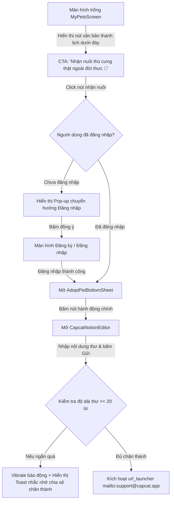

# 🐾 ĐẶC TẢ PRD: LUỒNG NHẬN NUÔI THÚ CƯNG THẬT (ẨN)
*(PRD_HIDDEN_ADOPTION_FLOW - FEATURE & INTERACTION SPECIFICATION)*

> **Mã Phân Hệ:** `PRD_HIDDEN_ADOPTION_FLOW`  
> **Phân hệ cha:** `NAMIYA_MAILBOX_ENGINE`  
> **Người biên soạn:** Sophia (CPO) & Benny (Lead UI/UX)  
> **Trạng thái:** Hoàn thành (Dev-Ready - Đã sửa lỗi đối kháng)  

---

## I. TẦM NHÌN VỀ SẢN PHẨM & TRẢI NGHIỆM CẢM XÚC

Việc xây dựng một hệ thống nhận nuôi thú cưng hoang/cứu hộ công khai trên ứng dụng là một bài toán vô cùng nhạy cảm và phức tạp về mặt quy trình pháp lý, vận hành và kiểm duyệt. 

Để **khảo sát nhu cầu thực tế** của người dùng và kết nối những người thực sự có tình yêu thương lớn đối với động vật ngoài đời thực, chúng tôi thiết kế một **Chức năng Ẩn (Hidden Gateway)** cực kỳ tinh tế dành riêng cho người dùng chưa có thú cưng trên hệ thống.

### 🛡️ Cơ chế lọc tự nhiên (Natural Barrier Principle):
Nhận nuôi một sinh mệnh thật sự ngoài đời thực đòi hỏi trách nhiệm to lớn, thời gian và sự kiên nhẫn. Bằng cách thiết lập lối vào ẩn và yêu cầu người dùng phải tự tay **viết một bức thư tay chia sẻ chân thành dài tối thiểu 20 từ**, hệ thống sẽ tự động lọc đi 95% những người dùng tò mò, thiếu nghiêm túc hoặc có ý định lợi dụng, chỉ giữ lại những tấm lòng thực sự trân quý động vật.

---

## II. CHI TIẾT LUỒNG TƯƠNG TÁC (INTERACTIVE USER FLOW)



### 1. Trạng thái trống (Blank State Gateway)
*   **Điều kiện:** Khi danh sách thú cưng của người dùng trống (`pets.isEmpty` là true) trên màn hình quản lý thú cưng (`MyPetsScreen`).
*   **Vị trí đặt CTA:** Nằm ở cuối cùng màn hình dưới phần thông báo trống `_EmptyState`, thiết kế dạng nút văn bản (Text Link) cực kỳ thanh lịch và nhã nhặn:
    *   *“Nhận nuôi thú cưng thật ngoài đời thực 🐾”*
    *   Màu sắc nút: Xanh lục bảo dịu nhẹ (`AppColors.greenStrong1`) hoặc màu xám tro thanh nhã (`AppColors.greyText2`) để giữ tính chất ẩn giấu của lối vào.

### 2. Luồng bảo vệ trạng thái đăng nhập (Authentication Protection Flow)
Để tránh điểm gãy hệ thống khi người dùng vãng lai (Guest) click gửi thư cứu hộ mà không có thông tin email và danh tính liên kết:
*   **Hành vi:** Khi người dùng nhấn vào nút CTA nhận nuôi:
    1.  **Nếu đã đăng nhập:** Ngay lập tức mở `AdoptPetBottomSheet` mượt mà.
    2.  **Nếu chưa đăng nhập (Khách):** Hiện một Dialog thông báo phẳng thanh nhã:
        *   *“Để đồng hành cùng bạn trên hành trình nhận nuôi đầy trách nhiệm này, bạn vui lòng đăng nhập tài khoản trước nhé. Capcat rất muốn lắng nghe câu chuyện của bạn! ❤️”*
        *   Nút hành động: **Đăng nhập ngay** và **Hủy**.
        *   Khi bấm **Đăng nhập ngay**, ứng dụng chuyển tiếp mượt mà sang màn hình Đăng ký/Đăng nhập. Sau khi đăng nhập thành công, tự động đưa người dùng trở lại màn hình viết thư nhận nuôi.

### 3. Bottom Sheet Lời Ngỏ (AdoptPetBottomSheet)
*   **Kích thước:** Chiếm khoảng 50% chiều cao màn hình di động, bo góc trên `24dp` cực kỳ mềm mại, sử dụng nền màu trắng kem ấm áp.
*   **Tiêu đề:** **Nhận nuôi thú cưng thật 🐾**
*   **Nội dung lời ngỏ (Tông giọng chữa lành Iyashikei):**
    > *"Capcat tin rằng mỗi chú chó, chú mèo hoang hay bị bỏ rơi đều xứng đáng có một mái ấm tràn ngập tình thương ngoài đời thực. Việc nhận nuôi và bảo bọc một sinh mệnh là một hành trình đầy trách nhiệm, yêu cầu sự kiên nhẫn và tình yêu thương vô điều kiện.*
    >
    > *Nếu bạn thực sự nghiêm túc và sẵn lòng chào đón một thành viên bốn chân mới vào gia đình mình, hãy gửi cho chúng tôi một bức thư chia sẻ về bản thân, không gian sống và tình yêu của bạn nhé. Chúng ta sẽ cùng trò chuyện."*
*   **Nút hành động (Notion-style Flat Button):** **Viết thư chia sẻ với Capcat 💌**

### 4. Tái sử dụng Trình soạn thảo `CapcatNotionEditor`
Khi nhấn nút hành động trên Bottom Sheet, ứng dụng sẽ mở ra màn hình soạn thảo `CapcatNotionEditor` được cấu hình riêng cho luồng nhận nuôi:
*   `titleHint` = *"Thư bày tỏ nguyện vọng nhận nuôi..."*
*   `bodyHint` = *"Hãy chia sẻ chân thành với Capcat về bản thân bạn, không gian sống, lý do bạn mong muốn nhận nuôi một bé thú cưng ngoài đời, hoặc trải nghiệm chăm sóc trước đây nhé... 🐾"*
*   `minWordCount` = 20 (Đặc biệt cấu hình tối thiểu 20 từ để lọc người dùng).

---

## III. KỸ THUẬT GỬI THƯ BẢO MẬT (SECURE API ENDPOINT PROTOCOL)

Để bảo mật tuyệt đối email cá nhân thực tế của người dùng và giữ chân họ ở trong app (không bị gãy luồng thoát ra app Mail ngoài), Capcat loại bỏ hoàn toàn giao thức `mailto`. Khi người dùng nhấn nút **Gửi** trên trình soạn thảo, hệ thống sẽ gọi API Endpoint bảo mật:

### 1. Chi tiết API Endpoint gửi thư cứu hộ
*   **Endpoint:** `POST /api/rescue/adopt_request`
*   **Headers:** `Content-Type: application/json`, `Authorization: Bearer <token>`
*   **Payload gửi lên Server:**
    ```json
    {
      "nickname": "Tấm Lòng Vàng Q3",
      "title": "Thư bày tỏ nguyện vọng nhận nuôi bé Lucky thứ hai",
      "content": "Con xin chào ban cố vấn, con hiện đang có một không gian sống rất rộng rãi và có kinh nghiệm nuôi mèo 3 năm..."
    }
    ```

### 2. Xử lý phía Server (Backend & Admin Notification)
1.  **Xác thực & Bảo mật:** Server nhận request, tự động giải mã `user_id` và lấy email thật của người dùng (`user.email`) từ cơ sở dữ liệu session bảo mật, thay vì bắt client truyền email thô lên.
2.  **Đóng gói chuyển tiếp:** Server sử dụng thư viện Mailer (như Nodemailer / SendGrid) gửi một email HTML được format tuyệt đẹp (Giấy viết tay kraft + dấu chân mèo) ngầm về cho hòm thư quản trị `support@capcat.app`:
    *   **Subject:** `[Capcat Cứu Hộ] Thư xin nhận nuôi từ Sen: [Nickname]`
    *   **Body Content:** Đầy đủ thông tin `Nickname`, `Email liên hệ thực tế` (lấy an toàn từ database), `Nội dung thư bày tỏ lòng chân thành`.
3.  **Trả về kết quả cho Client:** Server trả về HTTP 200 OK. Client hiển thị hoạt ảnh "Lá thư bay vào hộp gỗ cứu hộ" kèm nhịp rung nhẹ (Haptic) đem lại cảm giác yên bình và thành công.

---

*Tài liệu đặc tả đối kháng này đã được phê chuẩn để sẵn sàng phục vụ giai đoạn phát triển khi cần thiết. Ký tên: Team Cố vấn Capcat (Sophia, Alan & Benny)*

