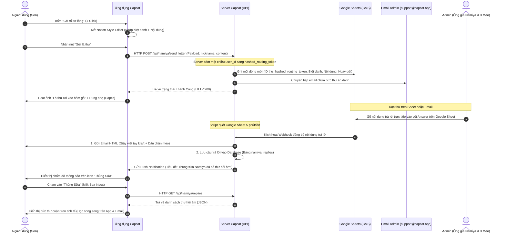

# 📚 TÀI LIỆU ĐẶC TẢ PRD: TIỆM TẠP HÓA NAMIYA - GỠ RỐI TƠ LÒNG
*(PRODUCT REQUIREMENT DOCUMENT - NAMIYA MAILBOX ENGINE)*

> **Mã Phân Hệ:** `NAMIYA_MAILBOX_ENGINE`  
> **Chủ trì:** Sophia (CPO / PM) & Arthur (Mom Test Expert)  
> **Người thực hiện đặt tả:** Benny (Senior Mobile Developer)  
> **Trạng thái:** Sẵn sàng kiểm duyệt (Draft V1.2 - Đã sửa lỗi đối kháng)  

---

## I. TỔNG QUAN TÍNH NĂNG (FEATURE OVERVIEW)

Lấy cảm hứng từ cuốn tiểu thuyết chữa lành nổi tiếng *"Tiệm tạp hóa Namiya"* của Keigo Higashino, tính năng **"Tiệm tạp hóa Namiya - Gỡ rối tơ lòng"** là một cổng kết nối cảm xúc ẩn danh dành cho người dùng đã đăng nhập ứng dụng. Người dùng có thể viết những bức thư chia sẻ những ưu tư, khúc mắc sâu kín trong lòng gửi đi. 

Bức thư sẽ được chuyển về hòm mail hỗ trợ của Capcat. Đội ngũ vận hành (đóng vai trò ông già Namiya) và 3 chú mèo mascot của nhà Capcat (Lucky thông thái, Bánh Mỳ ngáo ngơ, Lucky điềm tĩnh, v.v.) sẽ trực tiếp đọc và viết thư hồi đáp thủ công. 

Để giữ cho scope MVP cực kỳ tinh giản, thay vì xây dựng một hệ thống Inbound Email Parser (quét email tự động) vô cùng phức tạp, toàn bộ quy trình nhận và hồi đáp thư sẽ được vận hành qua **hạ tầng Google Sheets đóng vai trò làm CMS**. 

Khi có thư trả lời trên Google Sheets, hệ thống sẽ tự động đồng bộ câu trả lời, gửi email song song về **Email đăng ký** của người dùng và xuất hiện trong **"Thùng Sữa" (Milk Box)** - hộp thư thông báo cơ học độc quyền ngay trên ứng dụng để người dùng có thể đọc một cách trọn vẹn ở cả hai nơi.

---

## II. CÁC ĐIỂM CHẠM GIAO DIỆN (ENTRY POINTS)

Để tối đa hóa nhận thức cảm xúc mà không gây loãng app, tính năng được phân bổ ở 2 vị trí chiến lược bên trong ứng dụng cho người dùng đã đăng nhập:

```
+-----------------------+       +---------------------------+       +---------------------------+
| 1. COZY CHAT AI PETS  | ----> |   NAMIYA MAILBOX ENGINE   | <---- |    2. HOME SCREEN CARD    |
| (Pets nhắc hẹn tự nhiên) |       | (Trình soạn thảo Notion)  |       |  (Hòm thư gỗ Wabi-Sabi)  |
+-----------------------+       +---------------------------+       +---------------------------+
```

### 1. Điểm chạm 1: Màn Hình Chính (Home Screen Card)
*   **Vị trí:** Một widget nhỏ gọn, ấm áp nằm dưới phần Dòng kỷ niệm (Moments) hoặc xen kẽ trên Home.
*   **Thiết kế:** Hình ảnh chiếc hòm thư gỗ phong cách Nhật Bản mộc mạc đặt cạnh lọ hoa nhỏ, kèm dòng chữ: 
    *   *“Tiệm tạp hóa Namiya: Hôm nay bạn có nỗi niềm gì cần gỡ rối không? 🐾”*
*   **Hành vi:** Nhấn vào Widget sẽ lập tức mở giao diện soạn thảo Notion-style Editor để người dùng bắt đầu viết thư gỡ rối tơ lòng.

### 2. Điểm chạm 2: Lời nhắc từ Boss ảo trong Cozy Chat (Contextual In-Chat Trigger)
*   **Vị trí:** Trong luồng chat riêng tư giữa Sen và thú cưng AI của Sen.
*   **Kịch bản:** Khi AI phân tích ngôn ngữ phát hiện người dùng đang có tâm trạng cực kỳ buồn bã, bế tắc hoặc stress nặng trong cuộc sống, Boss AI sẽ gửi một lời nhắn ấm áp gợi ý:
    *   *"Sen ơi, trẫm thấy hôm nay Sen buồn nhiều lắm. Hay là Sen ghé qua **Tiệm tạp hóa Namiya** (nằm ngoài Home ấy), viết một bức thư bỏ vào hòm thư ẩn danh xem sao. Trẫm nghe nói ở đó có ông già Namiya và 3 chú mèo lớn thông thái lắm, họ sẽ hồi âm gỡ rối cho Sen đó! 🐾"*

---

## III. SƠ ĐỒ LUỒNG ĐẶC TẢ CHI TIẾT (FLOW DIAGRAM)

Quy trình vận hành sử dụng Google Sheets làm CMS tinh giản được thiết kế như sau:



---

## IV. BẢO VỆ QUYỀN RIÊNG TƯ & CHỐNG SPAM (PRIVACY & SPAM RULES)

### 1. Ẩn danh tuyệt đối bằng cơ chế Băm một chiều (One-Way Hash Routing)
Để triệt tiêu hoàn toàn khoảng trống bảo mật rò rỉ thông tin cá nhân, hệ thống áp dụng cơ chế băm:
*   Trường liên kết với tài khoản người dùng trên Database và Google Sheets sẽ là `hashed_routing_token = SHA256(user_id + Salt_Key)`.
*   Admin, lập trình viên và email hỗ trợ chỉ đọc được **Biệt danh**, **Mã Hash** và **Nội dung thư**. Hoàn toàn không có cách nào truy vết ngược lại danh tính thật hay số điện thoại của người gửi trừ khi có quyền truy cập root khóa Salt.

### 2. Kiểm soát tần suất gieo tơ lòng (Rate Limiting)
*   Để chống lại các cuộc tấn công spam hòm mail support, mỗi tài khoản `user_id` chỉ được gửi tối đa **1 bức thư trong vòng 24 giờ**.
*   *Thông báo chặn từ Client:*
    *   *“Hòm thư Namiya tạm thời đóng cửa để ông già Namiya và 3 chú mèo nghỉ ngơi. Hẹn gặp lại tâm sự của bạn vào ngày mai nhé... 🌙”*

---

## V. ĐẶC TẢ DỮ LIỆU & KỸ THUẬT (DATA & API SPECIFICATION)

### 1. Cấu trúc Database cục bộ & Server (Schema)

#### Bảng `namiya_letters` (Lưu thông tin thư gửi đi)
```sql
CREATE TABLE namiya_letters (
  id TEXT PRIMARY KEY,
  hashed_routing_token TEXT NOT NULL, -- Băm một chiều của user_id để định tuyến bảo mật
  nickname TEXT,                      -- Biệt danh ẩn danh
  content TEXT,                       -- Nội dung tơ lòng
  created_at TIMESTAMP,               -- Ngày gửi
  status TEXT                         -- 'pending' (chờ trả lời), 'replied' (đã trả lời)
);
```

#### Bảng `namiya_replies` (Lưu câu trả lời từ Admin gửi về Thùng Sữa)
```sql
CREATE TABLE namiya_replies (
  id TEXT PRIMARY KEY,
  letter_id TEXT,                     -- Khớp với thư gửi đi
  cat_advisor_name TEXT,              -- Tên chú mèo tư vấn (Lucky, Bánh Mỳ, v.v.)
  cat_advice_content TEXT,            -- Lời khuyên của chú mèo
  namiya_advice_content TEXT,          -- Lời khuyên sâu sắc từ ông già Namiya (CPO)
  replied_at TIMESTAMP,               -- Ngày phản hồi
  is_read INTEGER DEFAULT 0           -- Trạng thái đọc thư trên App (0: Chưa đọc, 1: Đã đọc)
);
```

### 2. Thiết kế API Endpoint

#### API 1: Gửi thư tơ lòng
*   **Endpoint:** `POST /api/namiya/send_letter`
*   **Headers:** `Content-Type: application/json`, `Authorization: Bearer <token>` (Bắt buộc)
*   **Payload:**
    ```json
    {
      "nickname": "Trái tim cô đơn Quận 1",
      "content": "Dạo này công việc của con áp lực quá, mỗi đêm về phòng trọ con chỉ biết khóc một mình..."
    }
    ```

#### API 2: Lấy danh sách thư trong Thùng Sữa
*   **Endpoint:** `GET /api/namiya/replies`
*   **Headers:** `Authorization: Bearer <token>` (Bắt buộc)
*   **Response:**
    ```json
    [
      {
        "reply_id": "rep_98765",
        "letter_title": "Thư gửi ngày 30/05",
        "nickname": "Trái tim cô đơn Quận 1",
        "letter_content": "Dạo này công việc của con áp lực quá...",
        "cat_advisor_name": "Mèo Bánh Mỳ 🐾",
        "cat_advice_content": "Meo meo! Áp lực thì ăn pate đi Sen ơi, ăn no rồi lăn ra ngủ là hết áp lực ngay ý mà!",
        "namiya_advice_content": "Chào con, ta hiểu những vất vả con đang trải qua...",
        "replied_at": "2026-05-31T09:00:00Z",
        "is_read": false
      }
    ]
    ```

---

*Tài liệu đặc tả đối kháng này đã sẵn sàng để chuyển giao cho đội ngũ phát triển. Ký tên: Team Cố vấn Capcat (Sophia, Alan, Benny)*
