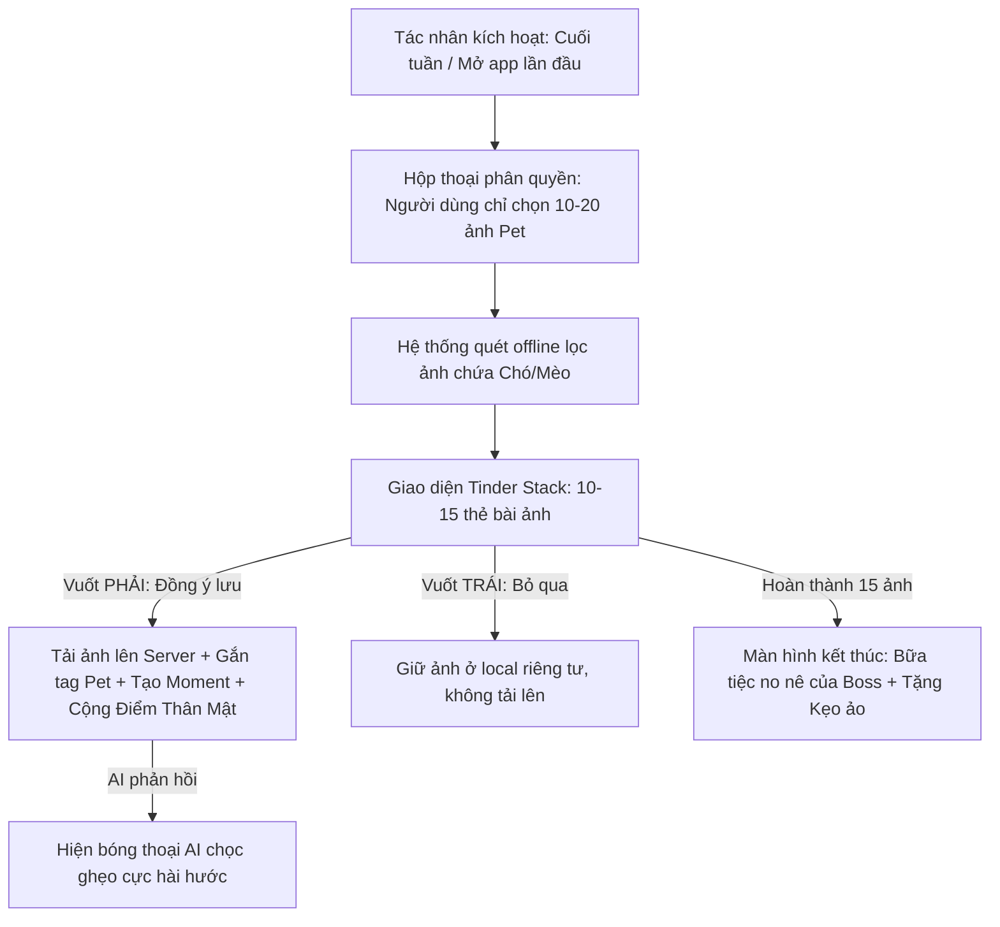

# PRODUCT REQUIREMENTS DOCUMENT (PRD)
## TRÒ CHƠI "BUFFET KÝ ỨC" 5 GIÂY (TINDER SWIPE GAME)
*(Phiên bản: 1.0 - Giai đoạn: MVP - Người soạn: CPO Sophia)*

---

## 1. TỔNG QUAN SẢN PHẨM (PRODUCT OVERVIEW)

### 1.1. Mục tiêu (Objective)
Tạo ra một giải pháp nạp hình ảnh của thú cưng vào hệ thống dữ liệu ký ức của Capcat với trải nghiệm **không xâm phạm quyền riêng tư**, **tiện lợi cực cao (dưới 5 giây)**, mang tính giải trí gây nghiện (Gamified Dopamine) và kích thích tương tác cảm xúc ngay lập tức giữa Sen và Boss ảo.

### 1.2. Vấn đề giải quyết (Problems Solved)
*   **Sự lười biếng của người dùng:** Người nuôi thú cưng chụp rất nhiều ảnh dìm hàng nhưng cực kỳ lười bấm nút chọn lọc và tải lên nhật ký (Moments).
*   **Nỗi sợ xâm phạm riêng tư:** Người dùng e ngại việc cấp toàn bộ quyền truy cập ảnh cho các ứng dụng AI quét tự động.
*   **Trải nghiệm khô khan:** Các luồng chọn ảnh truyền thống (Photo Picker) quá tẻ nhạt, thiếu cảm xúc.

---

## 2. CHÂN DUNG KHÁCH HÀNG & NGỮ CẢNH (PERSONA & SCENARIO)

*   **Chân dung:** Nam (24 tuổi, Dev cô đơn). Có 2000 bức ảnh của chú mèo Bánh Mỳ trong máy nhưng chưa từng đăng một tấm nào lên Moments.
*   **Ngữ cảnh:** Đêm muộn thứ Bảy, Nam mở app Capcat. Một ô cửa sổ bật lên mang tên **"Tiệc Buffet Ký Ức của Bánh Mỳ 🐟"**. Nam vuốt trái, vuốt phải các bức ảnh ngáo ngơ của Bánh Mỳ trong 5 giây như chơi Tinder. Mèo Bánh Mỳ ảo liên tục nhảy ra "khịa" từng bức ảnh cậu vuốt. Cậu bật cười thoải mái, tích luỹ được 5 Moments và tắt máy đi ngủ với cảm giác vui vẻ, ấm áp.

---

## 3. ĐẶC TẢ TRẢI NGHIỆM CHI TIẾT (USER EXPERIENCE FLOW)

### 3.1. Kích hoạt Trò chơi (The Trigger)
*   Tự động xuất hiện dạng Pop-up chào mừng khi người dùng mở ứng dụng lần đầu vào thứ Bảy/Chủ Nhật.
*   Hoặc người dùng có thể chủ động bấm vào nút **"Bữa tiệc Ký ức"** nằm trên màn hình Home.

### 3.2. Quét cục bộ bảo mật (Zero-Intrusion Local Filtering)
1.  Hệ thống xin quyền **Limited Photo Access**. Người dùng chỉ cần tick chọn các ảnh liên quan đến Boss.
2.  App chạy ngầm thư viện nhận diện vật thể ngoại tuyến **(Google ML Kit Object Detection - chạy offline 100% trên điện thoại)** để quét nhanh các ảnh được phân quyền, lọc ra tối đa 15 bức ảnh có chứa nhãn `"Dog"` hoặc `"Cat"`. 
3.  **Tuyệt đối không có hình ảnh nào được gửi lên máy chủ trong bước này.**

### 3.3. Giao diện Vuốt Thẻ bài (Tinder Swipe Interface)
*   Màn hình hiển thị một chồng thẻ bài ảnh (Card Stack) nằm ở trung tâm.
*   Phía trên thẻ bài là hình vẽ phác thảo màu nước phong cách Ghibli động của Boss đang cầm dĩa/thìa háo hức chờ ăn kỷ niệm.
*   **Thao tác vuốt:**
    *   👉 **VUỐT PHẢI (Feed Boss / Đồng ý lưu):**
        *   Tải ảnh lên máy chủ, tự động tạo thành một bài viết Nhật ký (Moments) được gắn thẻ `petId`.
        *   Cộng **+5 điểm Thân Mật (Intimacy Level)** cho Pet.
        *   Hiển thị bong bóng thoại (Speech Bubble) từ Boss ảo nhảy ra chọc ghẹo bức ảnh đó (Ví dụ: *"Ối giời, cái mặt trẫm lúc ngáp nhìn như hố đen vũ trụ thế này mà sen cũng lưu à? Quê xệ!"*).
    *   👈 **VUỐT TRÁI (Keep Private / Bỏ qua):**
        *   Bỏ qua bức ảnh, giữ nguyên tính riêng tư tuyệt đối trên máy của người dùng.
        *   Boss ảo xị mặt nhẹ: *"Món này trẫm không ăn được, qua món tiếp đi!"*.

### 3.4. Màn hình Kết thúc (The Feast Summary)
*   Hiển thị chú thú cưng vẽ phong cách Ghibli nằm lăn lộn ôm bụng căng tròn hạnh phúc: *"Trẫm no bụng ký ức rồi! Cảm ơn Sen yêu!"*.
*   Tặng thưởng **1 viên Kẹo Ảo (Catmint Candy)** dùng để tăng năng lượng chat cho Boss.

---

## 4. YÊU CẦU KỸ THUẬT & CÔNG NGHỆ (TECHNICAL REQUIREMENTS)

### 4.1. Công nghệ phía Client (Flutter App)
- **Giao diện vuốt thẻ:** Sử dụng package `flutter_card_swiper` hoặc tự thiết kế Custom GestureDetector với ma trận chuyển đổi ma sát mềm mại, có hỗ trợ phản hồi xúc giác nhẹ (Haptic Feedback) khi vuốt thành công.
- **Nhận diện ảnh ngoại tuyến:** Tích hợp `google_ml_kit` (phân hệ Object Detection & Image Labeling). Model chạy offline, dung lượng nhẹ (<5MB), đảm bảo xử lý lọc 15 ảnh dưới 0.5 giây.
- **Tải ảnh nền (Background Upload):** Khi người dùng vuốt phải, ảnh được đưa vào hàng đợi tải lên ngầm (Background Queue) sử dụng `dio` để không làm gián đoạn trò chơi của người dùng.

### 4.2. Công nghệ phía Backend (AI & Storage)
- **Tích hợp Vision API:** Ảnh vuốt phải được gửi qua mô hình Vision LLM (như Gemini 1.5 Flash) kèm System Prompt để sinh nhanh 1 câu bình luận ngắn (<20 từ) hài hước chuẩn tính cách của Pet.
- **Memory Ingestion:** Lưu trữ vector hoá dữ liệu ảnh đã duyệt vào Vector DB phục vụ luồng Chat sau này.

---

## 5. TÍCH HỢP KIẾM TIỀN (MONETIZATION INTEGRATION)

Mặc dù đây là tính năng lõi miễn phí để xây dựng thói quen gắn bó, chúng ta vẫn tích hợp khéo léo dòng tiền:
1.  **Mua Vé Quét Thêm (Gacha Extra Scan):** Mặc định mỗi tuần chỉ được quét miễn phí 15 ảnh. Nếu người dùng chụp quá nhiều ảnh và muốn chơi tiếp, họ có thể mua **"Vé Quét Ký Ức"** với giá 2.000đ/vé (hoặc xem 1 video quảng cáo để nhận vé miễn phí).
2.  **Khóa các Khung Meme cao cấp:** Sau khi vuốt phải, người dùng có thể bấm nhanh nút **"Ghép Khung"** (Tactic 2). Các khung cơ bản là miễn phí, nhưng các khung siêu đẹp, chuyển động lấp lánh sẽ yêu cầu trả phí bằng `CatCoins` để mở khóa.
