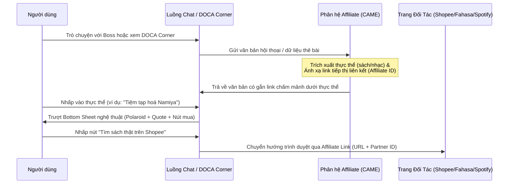

# 🏛️ ĐẶC TẢ SẢN PHẨM (PRD): PHÂN HỆ TIẾP THỊ LIÊN KẾT NGỮ CẢNH
*(CONTEXTUAL AFFILIATE MONETIZATION ENGINE - PRD)*

> **Mã Tài Liệu:** `PRD-MONETIZATION-AFFILIATE`  
> **Phiên bản:** `V1.0 (MVP)`  
> **Chủ trì:** Sophia (CPO / PM)  
> **Mục tiêu:** Thiết lập dòng doanh thu bền vững và hòa hợp cảm xúc cho ứng dụng DOCA.

---

## 🎯 1. Bối Cảnh & Định Vị Chiến Lược (Context & Positioning)

Ứng dụng **DOCA** hoạt động trên triết lý tối giản kiểu MUJI và thẩm mỹ chữa lành Nhật Bản (Iyashikei). Do đó, các mô hình kiếm tiền truyền thống như quảng cáo động (Google AdMob), đăng ký tháng ép buộc (Subscription Wall) hoặc cơ chế quay thưởng Gacha (bán vật phẩm ảo) hoàn toàn bị nghiêm cấm vì chúng phá vỡ cảm giác yên bình và lòng tin của người dùng.

**Mô hình Tiếp thị Liên kết Ngữ cảnh (Contextual Affiliate Monetization)** là lời giải cho bài toán này:
*   **Không quảng cáo phô trương:** Ứng dụng hoàn toàn sạch sẽ, không có banner nhấp nháy hay quảng cáo xen kẽ.
*   **Hòa hợp cảm xúc:** Các liên kết mua sắm xuất hiện tự nhiên như những gợi ý chân thành từ chú thú cưng ảo (ví dụ: gợi ý một cuốn sách cũ của Keigo Higashino khi Sen buồn, hoặc một đĩa nhạc Lofi Ghibli lúc đêm muộn).
*   **Mô hình gọn nhẹ:** Không cần cổng thanh toán trong app (In-App Purchase), không cần hệ thống kho đồ ảo (Inventory database), giảm 90% rủi ro vận hành tài chính.

---

## 👥 2. Đối Tượng Người Dùng & JTBD (User Jobs-to-be-Done)

*   **User Persona:** Người trẻ đô thị cô đơn, thường xuyên thức khuya, tìm kiếm sự an ủi tinh thần và có sở thích đọc sách, nghe nhạc nhẹ, sưu tầm poster.
*   **JTBD:** 
    *   *Khi trò chuyện với Boss:* "Tôi muốn tìm một cuốn sách hay hoặc một đĩa nhạc mộc mạc để thư giãn, và tôi thích cảm giác được Boss ảo khuyên dùng."
    *   *Khi mở Góc Cảm Xúc (DOCA Corner):* "Tôi muốn ngắm nhìn các bìa sách màu nước cổ điển và dễ dàng mua phiên bản sách thật trên Shopee/Fahasa nếu thấy đồng cảm."

---

## 🏗️ 3. Luồng Hoạt Động Của Hệ Thống (System User Flow)

---

## ⚙️ 4. Các Yêu Cầu Chức Năng (Functional Requirements)

### 4.1. Entity Auto-Detection & Hyperlinking (MVP)
*   **Mô tả:** Hệ thống phải phát hiện ra các tên sách, đĩa nhạc, tác giả cụ thể xuất hiện trong nội dung chat của Boss AI hoặc thẻ bài trong Góc Cảm Xúc.
*   **Giao diện:** Thực thể được nhận diện sẽ được hiển thị dưới dạng văn bản có gạch chân chấm mảnh nhẹ màu đất ấm (Cozy Earthy style) thay vì link xanh đậm công nghiệp.
*   **Hành động:** Khi nhấp vào, không mở trình duyệt ngay lập tức mà kích hoạt một Bottom Sheet thông tin nội bộ.

### 4.2. Cozy Bottom Sheet Chi Tiết Vật Phẩm (MVP)
*   **Giao diện:** Áp dụng phong cách MUJI tối giản và Glassmorphism (kính mờ).
*   **Nội dung hiển thị:**
    *   Ảnh phác hoạ Polaroid màu nước của bìa sách/album nhạc.
    *   Đoạn trích dẫn (Quote) tâm đắc nhất dưới dạng chữ font Space Mono Italic.
    *   Nút hành động (Button): Ví dụ `[Tìm sách trên Shopee 🐾]` hoặc `[Nghe nhạc trên Spotify 🎵]`.
*   **Cơ chế chèn ID:** Khi bấm nút hành động, ứng dụng sẽ mở trình duyệt web ngoài (in-app browser) chuyển hướng tới URL đích có đính kèm tham số tiếp thị liên kết của lập trình viên (ví dụ: `?aff_sub=developer_id`).

### 4.3. Góc Quà Tặng Tinh Thần (DOCA Corner Integration)
*   **Mô tả:** Tích hợp trực tiếp các liên kết mua sắm thật vào Góc Trưng Bày Đĩa Nhạc/Sách Cổ.
*   **Cơ chế:** Người dùng có thể xem trước các bìa sách màu nước phác thảo trong app hoàn toàn miễn phí. Khi họ muốn sở hữu phiên bản vật lý, nút bấm Affiliate sẽ sẵn sàng chuyển hướng họ đến cửa hàng thực tế.

---

## 🚫 5. Ranh Giới Đỏ - Những Điều Tuyệt Đối Không Làm (Anti-Goals)
1.  **❌ KHÔNG hiển thị popup quảng cáo che màn hình:** Quảng cáo chen ngang (interstitial ads) là điều cấm kỵ. Mọi liên kết mua sắm chỉ hiển thị khi người dùng tự chủ động nhấp vào từ khoá.
2.  **❌ KHÔNG phạt người dùng không mua hàng:** Chỉ số hạnh phúc của Boss ảo hoàn toàn có thể duy trì bằng các hoạt động chăm sóc miễn phí. Việc mua sách/nhạc thật bên ngoài chỉ là hoạt động gia tăng cảm xúc, không ảnh hưởng đến tiến trình nuôi pet ảo.
3.  **❌ KHÔNG bán dữ liệu chat cho bên thứ ba:** Mọi dữ liệu trích xuất từ khoá đều được xử lý cục bộ trên thiết bị và chỉ gửi mã định danh sản phẩm lên server affiliate, bảo vệ tính riêng tư tuyệt đối cho người dùng.

---

## 🏁 6. Định Nghĩa Hoàn Thành (Definition of Done - DoD)
*   [ ] Đầy đủ tệp đặc tả kỹ thuật cho bộ lọc trích xuất từ khoá.
*   [ ] Thiết kế giao diện Cozy Bottom Sheet đạt chuẩn thẩm mỹ chữa lành Nhật Bản.
*   [ ] Mã nguồn Flutter tích hợp chuyển hướng URL tiếp thị liên kết hoạt động tốt trên cả Android và iOS mà không gây crash ứng dụng.
