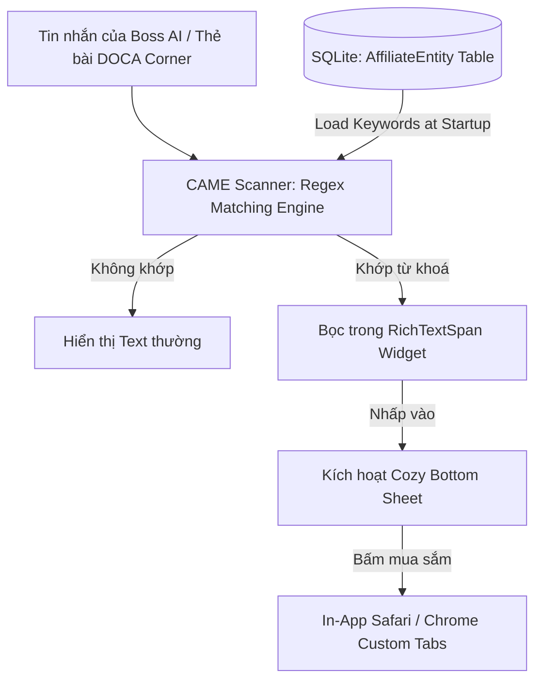

# 🛠️ ĐẶC TẢ KỸ THUẬT: CƠ CHẾ NHẬN DIỆN THỰC THỂ TIẾP THỊ LIÊN KẾT
*(CONTEXTUAL ENTITY TAGGING ENGINE - SYSTEM DESIGN)*

> **Mã Tài Liệu:** `SPEC-MONETIZATION-ENTITY-TAGGING`  
> **Phiên bản:** `V1.0 (MVP)`  
> **Chủ trì:** Alan (Tech Lead)  
> **Phối hợp:** Sophia (CPO)  
> **Mục tiêu:** Thiết kế giải pháp trích xuất và ánh xạ từ khoá tiếp thị liên kết nhẹ nhàng, hiệu năng cao và chạy offline trên ứng dụng Flutter.

---

## 🏗️ 1. Kiến Trúc Tổng Quan (System Architecture)

Để đảm bảo hiệu năng tối ưu trên môi trường di động và tránh phụ thuộc vào các dịch vụ đám mây xử lý ngôn ngữ tự nhiên đắt đỏ (như Google Cloud Natural Language API) ở giai đoạn MVP, hệ thống Nhận diện Thực thể Tiếp thị Liên kết (CAME Tagging Engine) sẽ hoạt động theo cơ chế **Tiền Biên Dịch & Tra Cứu Cục Bộ (Pre-compiled Regex & Local Database Lookup)**.



---

## 💾 2. Cơ Sở Dữ Liệu Thực Thể (Database Schema Design)

Bảng dữ liệu thực thể tiếp thị liên kết sẽ được lưu trữ trong SQLite cục bộ để phục vụ tra cứu tức thời dưới 5 miligiây:

### Bảng `affiliate_entities`

```sql
CREATE TABLE affiliate_entities (
    id TEXT PRIMARY KEY,
    entity_type TEXT NOT NULL,          -- 'BOOK' | 'MUSIC' | 'LOCATION'
    keywords TEXT NOT NULL,             -- Danh sách từ khoá tìm kiếm (JSON Array)
    display_name TEXT NOT NULL,         -- Tên hiển thị (Ví dụ: "Tiệm Tạp Hóa Namiya")
    author_artist TEXT,                 -- Tác giả / Nghệ sĩ (Ví dụ: "Keigo Higashino")
    polaroid_image_path TEXT,           -- Đường dẫn ảnh màu nước cục bộ / cached url
    quote TEXT,                         -- Lời trích dẫn chữa lành
    affiliate_url_vn TEXT,              -- Link Shopee/Fahasa kèm Partner ID
    affiliate_url_global TEXT,          -- Link Amazon kèm Partner ID
    created_at INTEGER NOT NULL
);
```

*Ví dụ bản ghi dữ liệu mẫu (Seeding Data):*
```json
{
  "id": "entity_namiya_001",
  "entity_type": "BOOK",
  "keywords": "[\"tiệm tạp hóa namiya\", \"tiệm tạp hoá namiya\", \"namiya mailbox\", \"namiya\"]",
  "display_name": "Tiệm tạp hóa Namiya",
  "author_artist": "Keigo Higashino",
  "polaroid_image_path": "assets/images/polaroids/namiya.jpg",
  "quote": "Bản đồ là tờ giấy trắng cũng có cái tốt. Vì là tờ giấy trắng nên bạn có thể vẽ bất kỳ bản đồ nào tùy thích...",
  "affiliate_url_vn": "https://shope.ee/example_affiliate_namiya_id",
  "affiliate_url_global": "https://amazon.com/example_affiliate_namiya_id"
}
```

---

## 🧠 3. Giải Thuật Quét & Gắn Thẻ (Scanning & Parsing Algorithm)

### 3.1. Khởi tạo lúc ứng dụng khởi động (Initialization)
1. Tải toàn bộ danh sách `keywords` từ bảng `affiliate_entities` lên bộ nhớ RAM dưới dạng một `Map<String, String>` (với Key là keyword viết thường, Value là Entity ID).
2. Tạo biểu thức chính quy (Regex) tổng hợp động từ danh sách từ khoá để quét nhanh một chạm:
   $$\text{Regex Pattern} = \b(\text{keyword}_1|\text{keyword}_2|\dots|\text{keyword}_n)\b$$

### 3.2. Quét văn bản tin nhắn (Real-time Parsing)
Khi có tin nhắn mới hiển thị trong luồng chat:
1. Chuyển văn bản tin nhắn thành chữ thường để so khớp không phân biệt hoa thường.
2. Dùng Regex Pattern quét qua văn bản để xác định các vị trí bắt đầu và kết thúc của thực thể khớp.
3. Chia chuỗi gốc thành các phân đoạn `TextSpan` (chứa text thường) và `WidgetSpan` (chứa từ khoá được trang trí).

### 3.3. Ví dụ mã giả Flutter/Dart
```dart
List<InlineSpan> parseCozyMessage(String text, Map<String, String> keywordMap, RegExp regex) {
  final List<InlineSpan> spans = [];
  int start = 0;
  
  regex.allMatches(text.toLowerCase()).forEach((match) {
    // Thêm đoạn text thường trước thực thể
    if (match.start > start) {
      spans.add(TextSpan(text: text.substring(start, match.start)));
    }
    
    // Lấy từ khoá gốc khớp trong text gốc (giữ nguyên hoa thường của user/bot)
    final String matchedText = text.substring(match.start, match.end);
    final String? entityId = keywordMap[matchedText.toLowerCase()];
    
    // Thêm thực thể được gắn thẻ hyperlink chấm mảnh
    spans.add(
      WidgetSpan(
        alignment: PlaceholderAlignment.baseline,
        baseline: TextBaseline.alphabetic,
        child: CozyAffiliateLinkWidget(
          text: matchedText,
          entityId: entityId ?? '',
        ),
      ),
    );
    
    start = match.end;
  });
  
  if (start < text.length) {
    spans.add(TextSpan(text: text.substring(start)));
  }
  
  return spans;
}
```

---

## 🎨 4. Đặc Tả Giao Diện Widget `CozyAffiliateLinkWidget`

Lớp giao diện thể hiện liên kết trong Flutter phải đáp ứng các tiêu chuẩn thẩm mỹ Iyashikei:
1.  **Màu sắc:** Sử dụng màu chữ gốc của chat bubble để tránh cảm giác bị nhồi nhét link quảng cáo xanh lam.
2.  **Đường gạch chân:** Đường nét đứt mảnh (`TextDecoration.underline` kết hợp với `decorationStyle: TextDecorationStyle.dashed`) màu vàng nhạt/nâu gỗ dịu dàng.
3.  **Hiệu ứng Tap:** Khi chạm vào, có độ nảy nhẹ phản hồi rung xúc giác vật lý (`HapticFeedback.lightImpact`) và trượt mở Bottom Sheet từ phía dưới lên với tốc độ 300ms, sử dụng đường cong `Curves.easeOutCubic`.

---

## 🛡️ 5. Định Nghĩa Hoàn Thành (Definition of Done - DoD)
*   [ ] Thực thi kiểm thử đơn vị (Unit test) đảm bảo thuật toán phân tách chuỗi chạy đúng với dữ liệu mẫu có nhiều từ khoá.
*   [ ] Đảm bảo việc quét regex không gây giật lag giao diện (FPS duy trì ổn định ở mức 60fps trên thiết bị cấu hình trung bình).
*   [ ] Cơ sở dữ liệu SQLite khởi tạo và nạp dữ liệu seed thành công mà không gây nghẽn luồng UI (UI Thread block).
