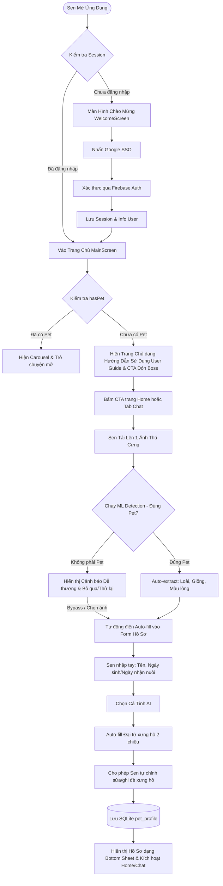
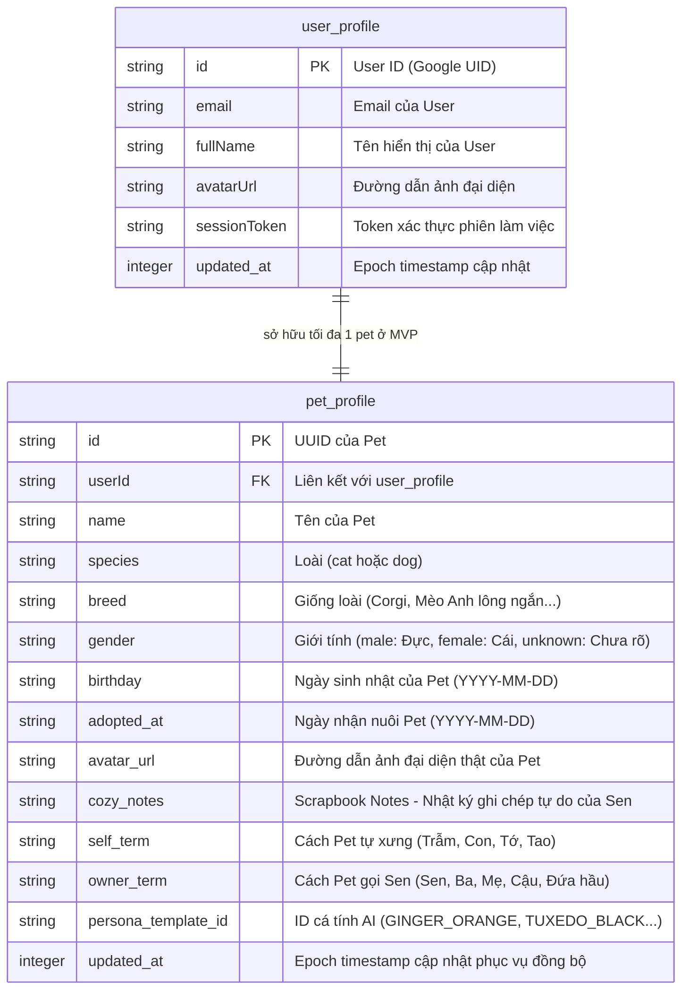
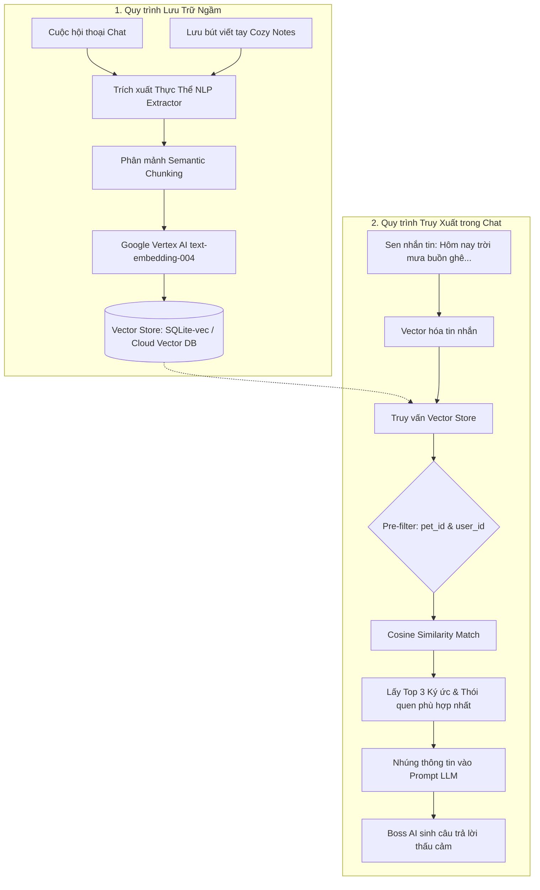

# TÀI LIỆU YÊU CẦU SẢN PHẨM (PRD CONSOLIDATED)
## PHÂN HỆ ĐĂNG NHẬP MỘT CHẠM & ONBOARDING HỘI THOẠI (AUTHENTICATION & CONVERSATIONAL ONBOARDING)
*(Phiên bản: 5.0 - Giai đoạn: MVP Phase 1 - Thương hiệu: DOCA - Tác giả: Sophia, Chartis, Maya, Noah)*

---

## I. TẦM NHÌN SẢN PHẨM & PHẠM VI MVP (PRODUCT VISION & SCOPE)

Phân hệ Đăng nhập & Onboarding của **DOCA** áp dụng triết lý thiết kế chữa lành **Iyashikei (Muji Warm Minimalism)**. Nhằm tối ưu tỷ lệ chuyển đổi và giảm thiểu tối đa ma sát cho người dùng mới, hệ thống loại bỏ hoàn toàn các cơ chế phức tạp không cần thiết (như đăng nhập OTP số điện thoại, tạo hồ sơ offline đồng bộ phức tạp, hiệu ứng tráng ảnh Polaroid động, hay ma trận bảo mật và bộ lọc cảm xúc NLP quá sâu). 

### 🎯 Nguyên tắc Cốt lõi của MVP:
1. **Đăng nhập siêu đơn giản:** Chỉ sử dụng duy nhất Google One-Tap SSO. Không hỗ trợ người dùng cũ qua số điện thoại để tinh gọn hạ tầng kỹ thuật.
2. **Onboarding qua Hội thoại (Conversational Onboarding):** Thay vì các form điền thông tin khô khan, thông tin của Boss sẽ được thu thập tự nhiên thông qua một cuộc hội thoại ngắn với NPC (Ông lão Namiya) trong không gian màu nước Ghibli.
3. **Trải nghiệm tĩnh lặng trước - Kết nối cảm xúc sau:** Sau khi đăng nhập, Sen không bị ép buộc làm onboarding ngay mà được đưa vào Trang chủ trống. Luồng đón Boss chỉ kích hoạt khi Sen tự nhấn CTA gỗ trên Trang chủ hoặc chuyển sang tab Chat.
4. **Cơ sở dữ liệu phẳng tối giản:** Thông tin Pet được lưu trữ trong 1 bảng phẳng SQLite cục bộ duy nhất và đồng bộ trực tiếp lên server đám mây.

---

## II. BẢN ĐỒ DÒNG CHẢY NGƯỜI DÙNG (USER FLOW)
*Biên soạn bởi CPO /sophia-product-manager*



### 1. Luồng Đăng nhập Một chạm (Google SSO Flow)
*   **Bước 1:** Sen mở app -> Hệ thống kiểm tra Session token ở Local Storage. 
*   **Bước 2:** Nếu chưa đăng nhập, hiển thị màn hình `WelcomeScreen`. Sen chạm vào nút "Đăng nhập bằng Google".
*   **Bước 3:** Google SDK hiển thị hộp thoại chọn tài khoản Gmail. Sau khi chọn, Firebase Auth trả về dữ liệu định danh cơ bản.
*   **Bước 4:** Client gọi API backend `socialLogin` để xác thực, ghi nhận thông tin User và lưu Token vào Local Secure Storage.
*   **Bước 5:** Điều hướng Sen thẳng vào Trang chủ `MainScreen` với trạng thái "Vườn nhà trống".

### 2. Kích hoạt & Điều hướng Phòng Đón Boss (Trigger & Routing)
*   **Trang chủ dạng Hướng dẫn sử dụng (User Guide Home Screen):** Nếu kiểm tra thấy Sen chưa thiết lập hồ sơ thú cưng (`hasPet == false`), giao diện Trang chủ (`MainScreen`) sẽ hiển thị ở chế độ **Khám phá không gian chữa lành (User Guide)**. 
    *   *Nội dung giới thiệu:* Trình bày ngắn gọn, phẳng Muji các tính năng chính của ứng dụng để Sen làm quen: Trò chuyện tri kỷ với AI Pet có cá tính độc bản, Chiếc rương kỷ niệm lưu giữ hình ảnh/nhật ký, Góc trưng bày đĩa nhạc lofi/sách cũ, Hòm thư gỗ ẩn danh Namiya.
    *   *Nút CTA nổi bật:* Hiển thị một nút gỗ retro phẳng hoặc Capsule lớn: *"Đón Boss Về Nhà"* (hoặc *"Gieo Mầm Linh Hồn Đầu Tiên 🐾"*). Khi nhấn vào nút này, hệ thống sẽ điều hướng Sen sang màn hình `PetOnboardingScreen`.
*   **Gate chặn Tab Chat:** Khi Sen nhấn vào Tab Chat ở thanh dock dưới, do chưa có đối tượng trò chuyện, hệ thống sẽ trượt lên một Action Sheet mời gọi: *"Hãy đón Boss về để bắt đầu những lời tâm sự tri kỷ."* cùng nút CTA dẫn tới màn hình Onboarding.

### 3. Luồng Thiết lập Hồ sơ Thú cưng Thông minh (Smart Pet Profiling Flow)
*   **Bước 1 (Tải ảnh khởi đầu & Xác thực chân dung):** Sen bấm nút đón Boss -> Trượt mở màn hình tạo hồ sơ bắt đầu bằng tác vụ tải lên 1 hình ảnh thật của Boss.
    *   *Bộ lọc ML Kit Validation (Detech):* Hệ thống chạy nhận diện ảnh cục bộ trong 200ms. Nếu không phát hiện nhãn chó/mèo (`confidence < 70%`), hiển thị hộp thoại cảnh báo: *"Hình như đây là một góc phòng tĩnh lặng chứ không phải chân dung Boss? Sen chụp lại rõ nét hơn hoặc chọn ảnh khác xem sao nhé! 📸"*. Cho phép Sen thử chụp lại hoặc chọn bỏ qua để sử dụng tranh vẽ Ghibli mặc định của loài đó.
*   **Bước 2 (Trích xuất & Tự động điền - Auto-fill):**
    *   Hệ thống tự động phân loại **Loài (Species)**: Chó hoặc Mèo.
    *   Tự động nhận dạng gợi ý **Giống loài (Breed)** (Golden, Poodle, Corgi, Mèo Anh lông ngắn...) qua nhãn ảnh ML.
    *   Tự động trích xuất **Màu lông (Coat color)** từ Palette màu thực tế của ảnh bằng thuật toán khoảng cách màu sắc Euclidean.
    *   Cả 3 thông số này được **tự động điền (Auto-filled)** sẵn vào các ô biểu mẫu tương ứng để Sen không phải gõ.
*   **Bước 3 (Người dùng nhập thông tin tối thiểu):** Sen tự tay điền các thông tin quan trọng tối giản:
    *   **Tên của Boss** (Bắt buộc).
    *   **Ngày sinh nhật hoặc Ngày nhận nuôi** (sử dụng bộ DatePicker phẳng Muji tối giản).
    *   *Điều chỉnh:* Sen hoàn toàn có thể chọn lại Loài, Giống và Màu lông qua dropdown searchable nếu AI trích xuất chưa chuẩn xác.
*   **Bước 4 (Chọn Cá tính AI & Ánh xạ Xưng hô 2 chiều):**
    *   Sen chọn 1 trong 4 thẻ Cá tính AI: Chảnh chọe, Nịnh nọt, Đanh đá, Ngáo ngơ.
    *   Hệ thống tự động hiển thị xưng hô 2 chiều (Boss gọi Sen và cách Boss tự xưng) tương ứng với bảng ánh xạ.
    *   *Quyền tự thiết lập lại (Manual Override):* Hiển thị hai ô nhập liệu độc lập: *"Cách Boss xưng hô"* và *"Cách Boss gọi Sen"* để Sen tự ghi đè xưng hô tùy thích (ví dụ: thay vì mặc định "Trẫm" có thể sửa thành "Hoàng thượng", "Boss"; thay vì "Sen" có thể sửa thành "Đầy tớ", "Đứa ở").
*   **Bước 5 (Hoàn tất & Kích hoạt):** Lưu dữ liệu vào bảng phẳng SQLite cục bộ và đồng bộ lên server -> Trượt mở Hồ sơ Pet Profile dưới dạng Bottom Sheet.

---

## III. CẤU TRÚC DỮ LIỆU CỐT LÕI (DATA STRUCTURE)
*Biên soạn bởi Kiến trúc sư dữ liệu /chartis-data-visualizer*

### 1. Sơ đồ Thực thể Quan hệ SQLite (Flat SQLite Entity Relationship)

Do tinh giản tối đa các bảng y tế và chỉ số Tamagotchi, cơ sở dữ liệu được rút gọn thành một cấu trúc phẳng cực kỳ nhẹ nhàng bao gồm 2 bảng: `user_profile` và `pet_profile`.



### 2. Quy tắc Ánh xạ Xưng hô Thông minh (AI Pronoun Mapping Matrix)

Quyết định đại từ xưng hô được hệ thống tự động thiết lập dựa trên sự kết hợp giữa **Danh xưng của Sen (do Sen chọn)** và **Cá tính AI của Boss** nhằm cá nhân hóa cảm xúc hội thoại:

| Cá tính AI | Xưng hô của Boss (`self_term`) | Gọi chủ nuôi (`owner_term`) | Ghi chú & Ví dụ demo |
| :--- | :--- | :--- | :--- |
| **Nịnh Nọt** | Con | Ba / Mẹ / Anh / Chị / Cậu | Tự động gọi theo danh xưng Sen chọn. *VD: "Con thương Mẹ nhất!"* |
| **Chảnh Chọe** | Trẫm | Sen | Ghi đè toàn bộ danh xưng của Sen thành "Sen". *VD: "Trẫm đói rồi, dọn đồ ăn đi Sen!"* |
| **Đanh Đá** | Tao | Đứa hầu / Sen | Ghi đè danh xưng của Sen thành "Đứa hầu". *VD: "Tao cấm đứa hầu chạm vào đuôi tao nhé!"* |
| **Ngáo Ngơ** | Tớ | Cậu | Mặc định xưng hô như bạn bè bình đẳng. *VD: "Tớ muốn ăn cá mập cơ, Sen dắt tớ đi mua đi!"* |

---

## IV. ĐẶC TẢ GIAO DIỆN & WIREFRAME (VISUAL WIREFRAMES)
*Thiết kế bởi UX Architect /maya-ui-ux-designer*

### 1. Màn hình Chào mừng (`WelcomeScreen`)
Muji Minimalist Style: Thiết kế phẳng tuyệt đối, nền màu kem nhã nhặn `#FBFBFA`, chữ đen Obsidian `#262626`. Loại bỏ toàn bộ các ô nhập số điện thoại rườm rà.

```
+-------------------------------------------------------------+
|                                                             |
|                         [DOCA LOGO]                         |
|                                                             |
|             "Discover the silent soul of pet."             |
|                                                             |
|                       /\_/\  /\_/\                          |
|                      ( o.o )( =.o=)                         |
|                                                             |
|                   .        .        .                       |
|                                                             |
|            +-----------------------------------+            |
|            |      [Nút Google One-Tap SSO]     |            |
|            |       G  Đăng nhập bằng Google    |            |
|            +-----------------------------------+            |
|                                                             |
|              Bằng cách đăng nhập, bạn đồng ý với            |
|               Điều khoản & Chính sách của DOCA              |
|                                                             |
+-------------------------------------------------------------+
```

#### 📊 Đặc tả Dữ liệu & Thành phần (WelcomeScreen Component Schema):
| Tên Label | Kiểu dữ liệu | Quy tắc Kiểm thử (Validate Rule) | Quy tắc Nghiệp vụ (Business Rule) | Hiển thị trên UI | Quy tắc Tự điền (Auto-fill Rule) |
| :--- | :---: | :--- | :--- | :---: | :--- |
| **Nút Google One-Tap SSO** | Action Button | Không cần validate (luôn active) | Nhấn kích hoạt Google SDK để xác thực tài khoản Google. Trả về access token và email định danh. | Có | Không |
| **Điều khoản & Chính sách** | Navigation Link | Không | Chạm chuyển hướng sang WebView hiển thị trang pháp lý & điều khoản DOCA. | Có | Không |

### 2. Màn hình Thiết lập Hồ sơ Boss (`PetOnboardingScreen`)
Sử dụng giao diện phẳng Muji tối giản, chia các cụm trường dữ liệu ngăn nắp.

```
+-------------------------------------------------------------+
| [🏠]                 ĐÓN BOSS VỀ NHÀ VƯỜN               [❓] |
|-------------------------------------------------------------|
|                                                             |
|          +---------------------------------------+          |
|          |         [ Ảnh chân dung Boss ]        |          |
|          |           (Đã xác thực: 🐱 Mèo)       |          |
|          |        [Chọn ảnh khác 📸]             |          |
|          +---------------------------------------+          |
|                                                             |
|  Tên của Boss (*): [ Bánh Mỳ                           ]   |
|  Ngày nhận nuôi (*): [ 📅 15/05/2024                   ]   |
|                                                             |
|  ---------------------------------------------------------  |
|  [ Tự động trích xuất từ ảnh - Có thể chỉnh sửa ]           |
|  - Loài: [ Mèo 🐱 (Auto-filled)                     ]       |
|  - Giống: [ Mèo Anh Lông Ngắn (Auto-filled)         ]       |
|  - Màu lông: [ Xám mướp (Auto-filled)               ]       |
|  ---------------------------------------------------------  |
|                                                             |
|  Cá tính AI:                                                |
|  ( ) Nịnh Nọt    (*) Chảnh Chọe   ( ) Đanh Đá   ( ) Ngáo Ngơ|
|                                                             |
|  Đại từ xưng hô 2 chiều:                                    |
|  - Boss tự xưng:  [ Trẫm            ]                       | <-- Cho phép sửa
|  - Gọi chủ nuôi:  [ Sen             ]                       | <-- Cho phép sửa
|                                                             |
|                       [ ĐÓN BOSS VỀ 🐾 ]                    |
|                                                             |
+-------------------------------------------------------------+
```

#### 📊 Đặc tả Dữ liệu & Thành phần (PetOnboardingScreen Component Schema):
| Tên Label | Kiểu dữ liệu | Quy tắc Kiểm thử (Validate Rule) | Quy tắc Nghiệp vụ (Business Rule) | Hiển thị trên UI | Quy tắc Tự điền (Auto-fill Rule) |
| :--- | :---: | :--- | :--- | :---: | :--- |
| **Ảnh chân dung Boss** | File Binary / Image | ML Kit local check: độ tin cậy chó/mèo $\ge 70\%$. Nếu sai hiển thị warning. | Làm ảnh đại diện chính của Boss. Nếu chọn bỏ qua/lỗi, gán ảnh Ghibli mặc định theo giống/màu lông tương ứng. | Có | Không |
| **Tên của Boss** | String | Bắt buộc, tối đa 30 ký tự, không chứa kí tự đặc biệt/emoji. | Làm định danh gọi tên của Pet trong prompt LLM. | Có | Không |
| **Ngày nhận nuôi** | Date (YYYY-MM-DD) | Bắt buộc, không lớn hơn ngày hiện tại. | Dùng tính toán số ngày bên nhau. | Có | Mặc định chọn ngày hiện tại. |
| **Loài** | Dropdown Enum (`species`) | Bắt buộc (Mèo/Chó). | Phân nhánh logic đĩa ảnh Ghibli và hành vi chat cơ bản. | Có | Tự chọn 'Mèo' hoặc 'Chó' dựa trên nhãn nhận diện ML Kit. |
| **Giống** | Searchable Dropdown Enum (`PetBreed`) | Bắt buộc (Theo danh sách giống). | Kết hợp cấu hình cá tính và vẽ minh họa Ghibli. | Có | Khớp nhãn ML Kit (Golden, Poodle...). Nếu không ra, chọn giống Ta/Lai mặc định. |
| **Màu lông** | Dropdown Enum (`PetCoatColor`) | Bắt buộc (10 nhóm màu chuẩn). | Phục vụ ánh xạ tranh Ghibli 0đ. | Có | Tự trích xuất màu chủ đạo dominant RGB từ ảnh qua khoảng cách Euclidean. |
| **Giới tính** | Dropdown Enum (`gender`) | Không bắt buộc (Đực/Cái/Chưa rõ). | Sử dụng điều chỉnh đại từ trong hội thoại. | Có | Mặc định 'Chưa rõ'. |
| **Cá tính AI** | Radio Select Enum (`persona`) | Bắt buộc (1 trong 4 tính cách). | Lập cấu hình LLM System Prompt. | Có | Không |
| **Boss tự xưng** | String | Bắt buộc, tối đa 10 ký tự. | Ghi nhận làm `self_term` cho hệ thống chat. | Có | Tự điền dựa theo Cá tính AI đã chọn (Chảnh -> Trẫm). |
| **Gọi chủ nuôi** | String | Bắt buộc, tối đa 10 ký tự. | Ghi nhận làm `owner_term` cho hệ thống chat. | Có | Tự điền dựa theo Cá tính AI đã chọn (Chảnh -> Sen). |

### 3. Hồ sơ Pet dạng Bottom Sheet Tối Giản Cực Hạn (`PetProfileBottomSheet` / `PetProfileSheet`)
*Thiết kế bởi UX Architect /maya-ui-ux-designer và Chuẩn hóa nội dung bởi /ux-writing*

Để tránh quá tải thông tin (Information Overload) và giữ đúng triết lý **MUJI Warm Minimalism**, Hồ sơ Pet được quy hoạch lại cực kỳ tinh gọn trong 1 giao diện phẳng duy nhất (không chia tab). Màn hình chỉ trưng bày các thông số sinh học thiết yếu, và nhường chỗ cho cảm xúc chữa lành.

#### ✍️ Hướng dẫn Chuẩn hóa Wording (Cozy Microcopy Guidelines):
*   **Tiêu đề Sheet:** `Góc nhỏ của [Tên Boss] 🐾` (tạo cảm giác riêng tư, ấm áp).
*   **Thời gian đồng hành:** `Chúng mình đã có [Số ngày] ngày bình yên bên nhau 🌸` (thay vì chữ "Đồng hành" khô khan).
*   **Giống loài & Giới tính:** `Mèo Anh lông ngắn ngọt ngào • Bé trai ♂` hoặc `Cú ngáo Corgi tinh nghịch • Bé gái ♀`.
*   **Góc lưu bút viết tay:** `Những điều nho nhỏ Sen ghi lại` (thay vì "Góc lưu ý của Sen" mang tính hành chính).
*   **Bong bóng lời thì thầm:** Lời thoại chữa lành ngắn gọn từ cá tính Pet.

#### Giao diện ASCII của Bottom Sheet Profile:
```
+-------------------------------------------------------------+
|                                                             |
|                    [ Màn Hình Chính Home ]                  |
|                                                             |
|  +=======================================================+  |
|  |                  ( DRAG HANDLE === )                  |  | <-- Thanh kéo đóng Sheet
|  |                 Góc nhỏ của Bánh Mỳ            [📸]  |  |
|  |-------------------------------------------------------|  |
|  |                                                       |  |
|  |                          /\_/\                        |  |
|  |                         ( =.o=)                       |  |
|  |                         / >🍑< \                      |  |
|  |                                                       |  |
|  |             Bánh Mỳ (Mèo Anh lông ngắn ngọt ngào)     |  |
|  |     Chúng mình đã có 42 ngày bình yên bên nhau 🌸      |  |
|  |          - Giới tính: Bé trai ♂                       |  |
|  |          - Ngày sinh nhật: Ngày 15 tháng 05           |  |
|  |                                                       |  |
|  |  +-------------------------------------------------+  |  |
|  |  | "Trông trẫm lúc ngủ hơi dìm hàng nhỉ Sen, thế   |  |  | <-- Lời thì thầm của Boss
|  |  |  mà cũng chụp lại cho bằng được!"               |  |  |
|  |  +-------------------------------------------------+  |  |
|  |                                                       |  |
|  |  ✍️ NHỮNG ĐIỀU NHO NHỎ SEN GHI LẠI                      |  |
|  |  +-------------------------------------------------+  |  |
|  |  | Bé rất sợ tiếng sấm dông, thích nằm ngủ cuộn    |  |  | <-- Ô lưu bút tự do
|  |  | tròn cuối giường và ghét tắm nước lạnh nhé.     |  |  |     (Single TextField)
|  |  |                                                 |  |  |
|  |  | [Lưu ghi nhớ 💾]                                |  |  |
|  |  +-------------------------------------------------+  |  |
|  |                                                       |  |
|  +=======================================================+  |
+-------------------------------------------------------------+
```

#### 📊 Đặc tả Dữ liệu & Thành phần (PetProfileBottomSheet Component Schema):
| Tên Label | Kiểu dữ liệu | Quy tắc Kiểm thử (Validate Rule) | Quy tắc Nghiệp vụ (Business Rule) | Hiển thị trên UI | Quy tắc Tự điền (Auto-fill Rule) |
| :--- | :---: | :--- | :--- | :---: | :--- |
| **Ảnh đại diện** | Image URL | Phải hiển thị đúng ảnh từ SQLite `avatar_url`. Fallback về tranh Ghibli nếu lỗi. | Cho phép Sen bấm vào để xem Album kỷ niệm Polaroid. | Có | Tải từ `pet_profile.avatar_url`. |
| **Góc nhỏ của Bánh Mỳ** | String (Text) | Định dạng: `Góc nhỏ của [name] 🐾` | Tiêu đề của Bottom Sheet. | Có | Lấy `name` từ cơ sở dữ liệu. |
| **Tên Boss & Giống loài** | String (Text) | Định dạng: `[name] ([breed] [tính chất])` | Trình bày tinh tế, chuẩn hóa xưng hô. | Có | Tổ hợp từ `name` + `breed` + UX template. |
| **Thời gian đồng hành** | String (Text) | Định dạng: `Chúng mình đã có [togetherDays] ngày bình yên bên nhau 🌸` | Tính toán số ngày: `Today` - `adopted_at`. | Có | Tự động tính toán từ `pet_profile.adopted_at`. |
| **Giới tính** | String (Text) | Ánh xạ: 'male' -> Bé trai ♂, 'female' -> Bé gái ♀, 'unknown' -> Chưa rõ. | Hiển thị giới tính của Pet. | Có | Tải từ `pet_profile.gender`. |
| **Ngày sinh nhật** | String (Text) | Định dạng ngày chữ: `Ngày DD tháng MM`. | Hiển thị ngày sinh nhật của thú cưng. | Có | Định dạng từ `pet_profile.birthday`. |
| **Lời thì thầm của Boss** | String (Text) | Tối đa 250 ký tự. | Gợi ý ngẫu nhiên hoặc hiển thị lời thì thầm theo múi giờ sinh hoạt của Pet. | Có | Tự động lấy từ đĩa câu thoại cá tính ngẫu nhiên. |
| **Góc viết tay tự do** | String (TextArea) | Không bắt buộc, tối đa 500 ký tự. | Ô TextField cho Sen viết tự do. Khi nhấn [Lưu ghi nhớ], cập nhật ngay lập tức `pet_profile.cozy_notes`. | Có | Tải từ `pet_profile.cozy_notes`. |

---

## V. PHÂN RÃ CÔNG VIỆC AGILE & TICKET CHI TIẾT (US BREAKDOWN)
*Xây dựng bởi Sprint Owner /noah-agile-product-owner*

### US-1: Đăng nhập Google One-Tap SSO
*   **Mô tả:** Là người dùng mới, tôi muốn đăng nhập vào hệ thống bằng tài khoản Google One-Tap để giảm thiểu thao tác gõ biểu mẫu.
*   **Tiêu chí Nghiệm thu (Acceptance Criteria):**
    *   **AC-1.1:** Màn hình `WelcomeScreen` chỉ hiển thị 1 nút đăng nhập chính là "Đăng nhập bằng Google". Không có trường nhập SĐT/OTP hay mật khẩu.
    *   **AC-1.2:** Nhấn nút kích hoạt đúng Google SSO SDK hiển thị danh sách tài khoản Gmail trên máy.
    *   **AC-1.3:** Sau khi đăng nhập thành công, token được lưu vào Flutter Secure Storage và điều hướng trực tiếp đến trang chủ trống `MainScreen`.
    *   **AC-1.4:** Khi mất mạng, hiển thị thông báo lỗi nhẹ nhàng: *"Hãy kiểm tra kết nối mạng của Sen nhé!"* mà không gây đơ ứng dụng.

### US-2: Kích hoạt Luồng Đón Boss (User Guide Home & Chat Gate)
*   **Mô tả:** Là người dùng mới chưa có Pet, tôi muốn trang Home hiển thị như một hướng dẫn giới thiệu tính năng cùng với nút CTA đón Boss để tôi có thể khám phá ứng dụng trước khi quyết định gieo mầm thú cưng ảo.
*   **Tiêu chí Nghiệm thu (Acceptance Criteria):**
    *   **AC-2.1:** Khi chưa có Pet, trang Home bắt buộc phải hiển thị cấu trúc Hướng dẫn sử dụng (User Guide) giới thiệu 4 tính năng: Cozy Chat, Memory Vault, Cozy Corner, Namiya Mailbox.
    *   **AC-2.2:** Trang Home lúc này phải có 1 nút CTA gỗ phẳng hoặc Capsule nổi bật *"Đón Boss Về Nhà"*.
    *   **AC-2.3:** Khi người dùng chưa có Pet chuyển sang Tab Chat, ứng dụng hiển thị một Action Sheet chặn (Gate) với thông báo mời đón Boss và 1 nút chuyển hướng onboarding.
    *   **AC-2.4:** Nhấn vào nút CTA trên trang Home hoặc nút trên Action Sheet Tab Chat phải điều hướng mượt mà (<200ms) sang màn hình `PetOnboardingScreen`.

### US-3: Thiết lập Hồ sơ Thú cưng bằng Hình ảnh & Trích xuất ML
*   **Mô tả:** Là người dùng bắt đầu đón Boss, tôi muốn tải lên 1 ảnh chân dung thú cưng để hệ thống tự nhận diện các trường sinh học và tự động thiết lập xưng hô để tôi chỉ cần nhập tối thiểu thông tin cần thiết.
*   **Tiêu chí Nghiệm thu (Acceptance Criteria):**
    *   **AC-3.1 (Photo Validation & Detech):** Tải lên ảnh không phải chó/mèo (nhỏ hơn 70% confidence) phải hiển thị Dialog cảnh báo dễ thương nhưng cho phép bỏ qua nếu người dùng muốn dùng ảnh Ghibli mặc định.
    *   **AC-3.2 (ML Auto-Extraction & Auto-fill):** Sau khi xác thực ảnh, hệ thống tự động điền (Auto-fill) chính xác Loài, Giống, và Màu lông vào các dropdown tương ứng. Người dùng có thể thay đổi các giá trị này theo ý muốn.
    *   **AC-3.3 (Manual Inputs):** Cho phép người dùng nhập tay Tên, chọn Ngày sinh nhật hoặc Ngày nhận nuôi bằng bộ Date Picker.
    *   **AC-3.4 (AI Persona & Auto-fill Pronouns):** Khi chạm chọn các Cá tính AI, hệ thống tự động điền cặp xưng hô tương ứng (ví dụ: Chảnh chọe -> Trẫm - Sen) vào hai ô nhập liệu Đại từ xưng hô.
    *   **AC-3.5 (Manual Override Pronouns):** Xác minh người dùng có thể nhấp vào và nhập văn bản tùy chỉnh để ghi đè (Override) đại từ xưng hô 2 chiều theo ý muốn cá nhân trước khi hoàn tất lưu hồ sơ SQLite.

### US-4: Hồ sơ Pet dạng Bottom Sheet Tối Giản Muji
*   **Mô tả:** Là chủ nuôi, tôi muốn xem lại các thông tin cơ bản của Boss (ảnh, tên, ngày bên nhau, giới tính, giống loài) và có một góc lưu bút viết tay tự do trên 1 giao diện Bottom Sheet phẳng, gọn gàng, tránh làm rối mắt bởi các thông tin lưu trữ ngầm.
*   **Tiêu chí Nghiệm thu (Acceptance Criteria):**
    *   **AC-4.1 (Clean Layout):** Hồ sơ Pet được hiển thị dạng Bottom Sheet trượt lên từ dưới, che phủ khoảng 70% - 85% chiều cao màn hình. Bố cục phẳng không chia tab, khoảng trắng rộng rãi chuẩn MUJI.
    *   **AC-4.2 (Empathetic Wording):** Thời gian bên nhau hiển thị đúng định dạng chữ chữa lành: *"Chúng mình đã có [X] ngày bình yên bên nhau 🌸"*.
    *   **AC-4.3 (Bio Details):** Hiển thị đầy đủ: Ảnh avatar thật của Pet, Tên Pet, Giống loài kèm mô tả cá tính nhẹ nhàng, Giới tính (Bé trai ♂ / Bé gái ♀ / Chưa rõ), Ngày sinh nhật.
    *   **AC-4.4 (Cozy Notes TextField):** Khu vực viết tay tự do ("Những điều nho nhỏ Sen ghi lại") hoạt động dưới dạng 1 TextField duy nhất, cho phép Sen chỉnh sửa và bấm lưu đồng bộ SQLite cục bộ.
    *   **AC-4.5 (Drag to Dismiss):** Bottom Sheet có thanh kéo Drag Handle ở đỉnh, hỗ trợ cử chỉ vuốt kéo xuống để đóng sheet (Swipe-to-dismiss) mượt mà 60fps.
    *   **AC-4.6 (Zero Info Bloat):** Các thông tin ghi nhận ngầm qua chat (Sở thích, Thói quen ghét, mảng ký ức) tuyệt đối không được đưa lên giao diện của Bottom Sheet để giữ sự mộc mạc tối giản.

---

## VI. KIẾN TRÚC RAG TRUY XUẤT KÝ ỨC & THÓI QUEN TRONG CHAT
*Quy hoạch bởi Kiến trúc sư AI /rag-architect*

Để ghi nhận các thông tin thói quen (sở thích, điều ghét, giờ sinh hoạt) và mảng ký ức của Boss trong quá trình chat mà không gây quá tải giao diện, hệ thống áp dụng kiến trúc **Chat Memory Retrieval (RAG)** để phục vụ truy xuất ngầm và cá nhân hóa ngữ cảnh chat.

### 1. Sơ đồ Kiến trúc RAG (RAG Pipeline Diagram)



### 2. Chi tiết Quy hoạch & Xử lý Dữ liệu

#### A. Phân mảnh & Vector hóa dữ liệu (Semantic Ingestion):
*   **Dữ liệu đầu vào:** Lịch sử trò chuyện thô (`pet_chat_memory`) và nội dung lưu bút của Sen (`cozy_notes`).
*   **Trích xuất ngữ nghĩa (NLP Extractor):** Backend ngầm phân tích các thực thể thực chứng:
    *   *Sở thích (Likes):* Thức ăn yêu thích, hoạt động yêu thích, âm nhạc yêu thích.
    *   *Ghét (Dislikes):* Sợ tiếng sấm, ghét tắm lạnh, ghét người lạ.
*   **Vector hóa:** Mỗi mảnh thông tin thói quen hoặc mảng ký ức (Ví dụ: *"Boss Bánh Mỳ rất sợ tiếng sấm sét và thích nằm ngủ cuộn tròn cuối giường"*) được Vector hóa bằng model `text-embedding-004` thành vector 768 chiều và lưu vào **Vector Store**.

#### B. Cơ chế Lọc và Truy xuất ngầm (Retrieval & Pre-Filtering):
*   **Pre-Filtering (Ràng buộc bảo mật và riêng tư tối cao):** 
    *   Để tránh hiện tượng rò rỉ dữ liệu ký ức giữa các User hoặc các Pet khác nhau (Multi-Pet Memory Leakage), mỗi query truy xuất **bắt buộc phải được tiền lọc theo thuộc tính scalar `pet_id` và `user_id`**.
    *   Công thức truy vấn: `SELECT * FROM vector_store WHERE pet_id = ? AND cosine_similarity > 0.72`
*   **Cosine Similarity Match:** Tìm kiếm ngữ nghĩa khoảng cách cosine gần nhất để lấy ra tối đa **Top 3 mảnh ký ức/thói quen** liên quan nhất đến câu chat hiện tại của Sen.

#### C. Bơm Context vào Prompt LLM (Prompt Injection):
*   Thông tin thói quen và ký ức được trích xuất được định dạng thành một block chỉ thị hệ thống (System Prompt Context) gửi lên LLM:
    ```
    [Ký ức & Thói quen của Bánh Mỳ được trích xuất]
    - Sở thích: Rất thích nằm cuộn tròn ngủ ở cuối giường của Sen.
    - Điều ghét/Sợ: Sợ tiếng sấm dông.
    - Kỷ niệm liên quan: Sen và Bánh Mỳ đã có 42 ngày bên nhau.
    ```
*   LLM sử dụng ngữ cảnh này để tạo câu hồi đáp chữa lành tự nhiên: *"Sen ơi, ngoài trời sắp giông bão rồi kìa... Bánh Mỳ hơi sợ tiếng sấm, lát nữa cho trẫm nằm cuộn tròn ngủ ở cuối giường của Sen nhé? 🥺"*

---

*Tài liệu PRD Phân hệ Authentication & Onboarding đã được hợp nhất và tinh giản hoàn hảo, sẵn sàng chuyển giao cho Alan - Tech Lead và Benny - Mobile Dev triển khai.*
