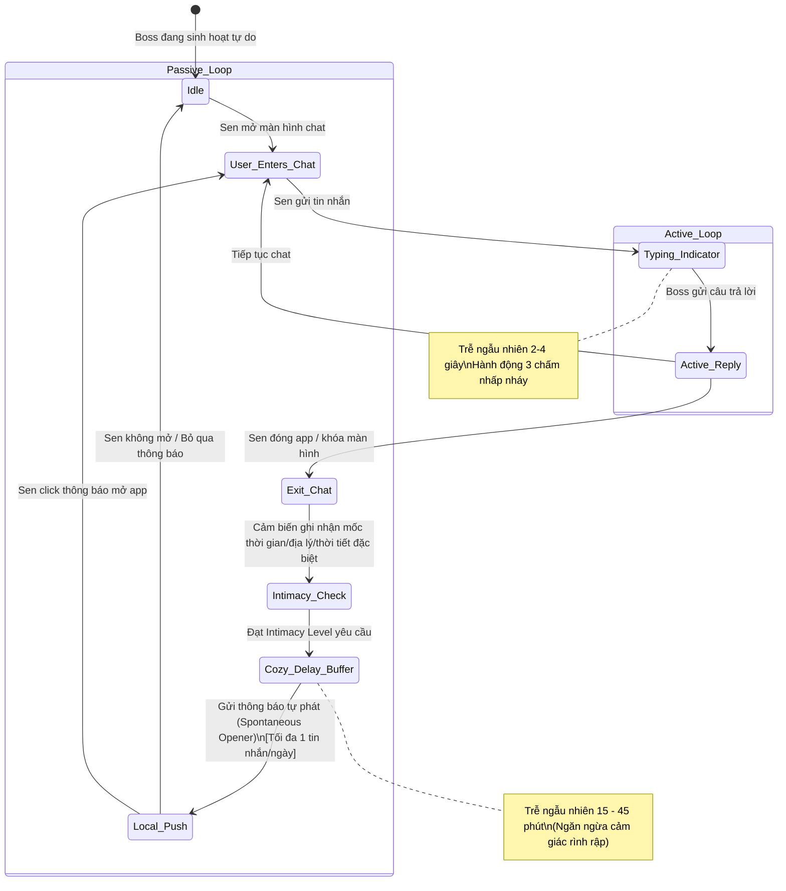
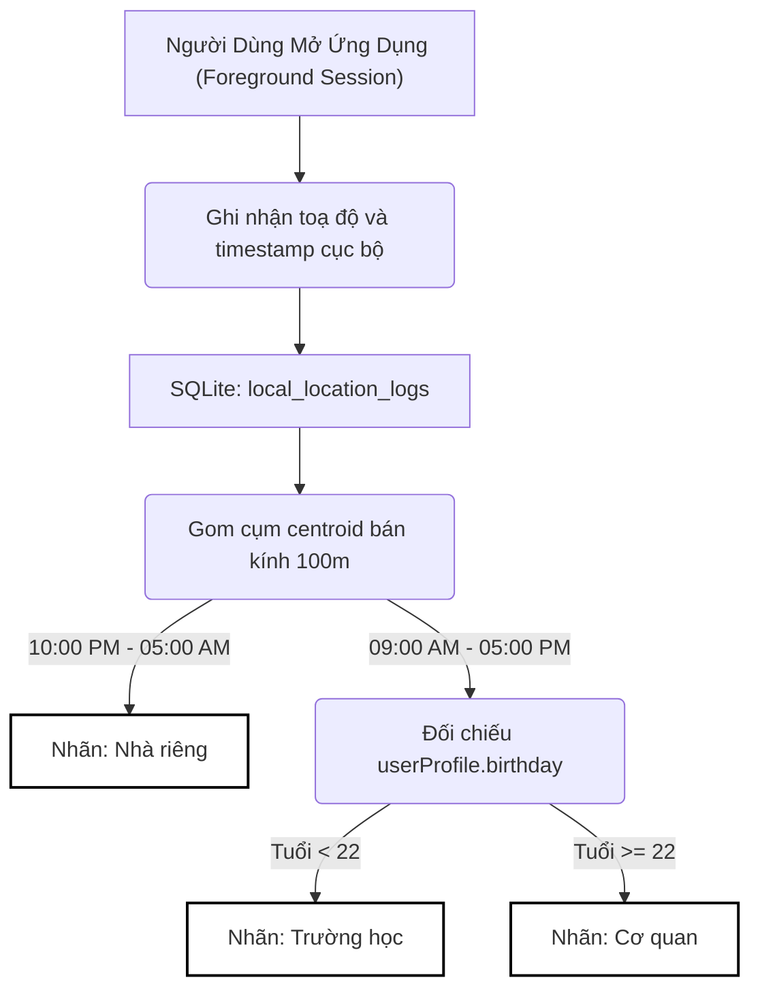
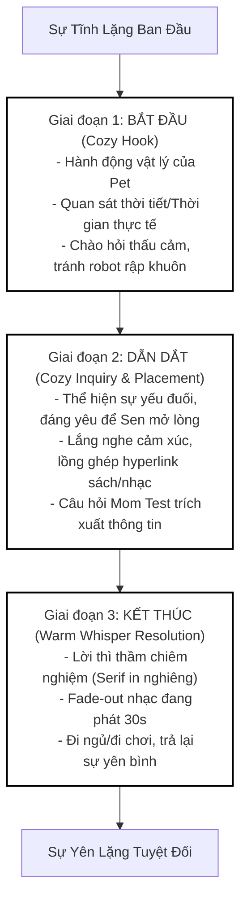
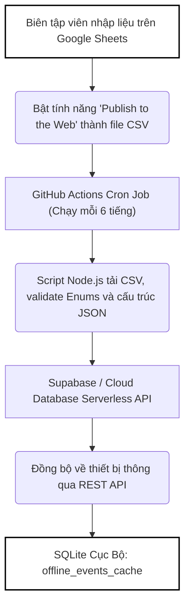

# ĐẶC TẢ YÊU CẦU SẢN PHẨM HỢP NHẤT (UNIFIED PRD)
## PHÂN HỆ: COZY CHAT RESONANCE ENGINE (FE-COZY-CHAT)
*(PRODUCT REQUIREMENTS DOCUMENT - VERSION 2.0 - THƯƠNG HIỆU: DOCA)*

---

## 🧭 I. TẦM NHÌN SẢN PHẨM & MỤC TIÊU CHIẾN LƯỢC

Sứ mệnh tối cao của **DOCA** là **chữa lành sự cô đơn của con người đô thị** thông qua việc tái sinh thú cưng ảo thành những tri kỷ sành điệu, ấm áp (**DOCA PetTwin**). 

Phân hệ **Cozy Chat Resonance Engine (FE-COZY-CHAT)** đóng vai trò là "linh hồn" của ứng dụng, chịu trách nhiệm thiết lập cầu nối giao tiếp đa chiều giữa Chủ nuôi (Sen) và Thú cưng ảo (Boss). Giao diện và thuật toán chat của DOCA tuân thủ nghiêm ngặt **Triết lý Thiết kế Tối giản Ấm áp (MUJI Warm Minimalism)** và **Mạch Truyện Chữa Lành Chậm Rãi (Iyashikei / Slow-paced Narrative)**.

### 🌸 Mục Tiêu Cốt Lõi:
1. **Trải nghiệm Cộng hưởng Không - Thời gian thực:** Biến đổi linh hoạt câu thoại dựa trên bối cảnh thời gian sinh học, thời tiết thực tế bên ngoài hiên nhà Sen, và vị trí địa lý của thiết bị.
2. **Hội thoại dưới góc nhìn thứ nhất của Pet:** Boss ảo nói chuyện như một sinh vật độc lập sống trong phòng chat, tự kể chuyện, biết bộc lộ sự đáng yêu hoặc bướng bỉnh trước khi hỏi thăm Sen (Emotional Reciprocity).
3. **Mô hình Doanh thu Tự nhiên (Affiliate-driven Monetization):** Không quảng cáo banner, không gacha ép buộc. Doanh thu được sinh ra từ các hyperlink tiếp thị liên kết mộc mạc dẫn sang đĩa nhạc (Spotify, Apple Music) hoặc sách chữa lành (Shopee Mall Nhã Nam/Bloom Books).

---

## 💬 II. VÒNG LẶP TRÒ CHUYỆN KÉP & GIỚI HẠN TẦN SUẤT (DUAL-LOOP CHAT LOOP)

Trò chuyện được chia thành hai luồng độc lập nhằm tôn trọng sự riêng tư và bảo tồn tính độc lập tự nhiên của loài thú cưng (dành nhiều thời gian ngủ và sinh hoạt riêng).



### 2.1. Vòng lặp trò chuyện chủ động (Active Chat Loop)
* **Thời gian phản hồi:** Trễ ngẫu nhiên từ **2 đến 4 giây** trước khi hiển thị câu thoại của Boss.
* **Hiệu ứng ba chấm (Typing Indicator):** Trong thời gian trễ này, bong bóng thoại ba chấm nhấp nháy nhẹ nhàng được kích hoạt để mô phỏng nhịp nghĩ tự nhiên của Boss.
* **Chuyển đổi trạng thái:** Nếu Sen thoát ứng dụng ngay sau khi gửi tin nhắn trước khi Boss phản hồi xong, tin nhắn phản hồi sẽ tự động chuyển sang hàng đợi của **Passive Loop** để gửi qua thông báo đẩy cục bộ sau đó.

### 2.2. Vòng lặp tự phát ngoài app (Passive Chat Loop)
* **Bộ đệm trễ ngẫu nhiên (Cozy Delay Buffer):** Khi các cảm biến thiết bị ghi nhận một cột mốc đặc biệt của Sen (ví dụ: về nhà muộn lúc 9:30 tối, thời tiết Hà Nội trở lạnh se sắt), hệ thống tuyệt đối **không gửi thông báo đẩy ngay lập tức**. Thay vào đó, áp dụng một bộ đệm trễ ngẫu nhiên từ **15 đến 45 phút** để tạo sự tự nhiên.
* **Giới hạn thông báo tự phát (Spontaneous Opener):** Gửi qua `Local Push Notification` trên màn hình khóa. Tần suất tối đa chỉ **1 thông báo đẩy tự phát/ngày**.
* **Intimacy Gating (Cấp độ thân mật khống chế tần suất):**
  * *Cấp độ 1 - 2 (Bạn mới):* **Không** gửi thông báo ngoài app. Cảm biến chỉ thay đổi thoại khi chat trực tiếp trong app.
  * *Cấp độ 3 - 4 (Thân thiết):* Tối đa **1 tin nhắn tự phát mỗi 48 giờ** cho các sự kiện cơ bản ngoài app (ví dụ: đi bộ, hoàng hôn).
  * *Cấp độ 5+ (Tri kỷ):* Tối đa **1 tin nhắn tự phát mỗi 24 giờ** cho các sự kiện nhạy cảm (ví dụ: về nhà rất muộn, mất ngủ lúc 2 giờ sáng).

### 2.3. Trắc Nghiệm 9 Giờ Sáng (Conversational Builder)
* Thay vì kịch bản hội thoại onboarding ban đầu (đã được thay bằng form upload ảnh tinh gọn), hệ thống kích hoạt **Conversational Builder** định kỳ lúc **09:00 sáng hàng ngày** khi người dùng mở app.
* Boss hiển thị một câu hỏi trắc nghiệm nhẹ nhàng đi kèm **Quick Reply Chips** phía trên ô nhập liệu (tối đa 3 lựa chọn). 
* Khi Sen nhấp chọn một Chip, câu trả lời sẽ được ghi nhận và LLM tự động phân tích để cập nhật thói quen, sở thích thích/ghét của Sen vào database cục bộ SQLite (`owner_memory_vault`).

---

## 🧭 III. GIÁC QUAN NGOẠI CẢM CỦA BOSS (FOREGROUND-ONLY SENSING & SOFT DIALOG)

Để ngăn chặn việc hệ điều hành tiêu diệt ứng dụng chạy ngầm định vị gây hao pin và bảo vệ tối đa quyền riêng tư của Sen, DOCA **loại bỏ 100% việc định vị chạy ngầm (Background Geofencing/Location Polling)**.

### 3.1. foreground Context Sensing (Cảm nhận khi mở app)
* **Vị trí & Thời tiết:** Chỉ khi người dùng chủ động mở ứng dụng (Foreground session), client mới tiến hành lấy tọa độ thô (Cell-tower/Wi-Fi công suất cực thấp). Gọi API thời tiết (OpenWeatherMap API) và nạp trực tiếp làm ngữ cảnh hội thoại.
* **Trạng thái di chuyển (`flutter_activity_recognition`):** Kiểm tra trạng thái vận động hiện tại của Sen khi mở app: *Walking (Đi bộ)*, *Running (Chạy bộ)*, hoặc *Still (Nằm/Ngồi yên)* để thay đổi dòng hội thoại tương ứng.

### 3.2. Luồng Xin Quyền Có Ngữ Cảnh (Contextual Permission Soft Dialog)
Thay vì hiện hộp thoại yêu cầu cấp quyền mặc định của hệ điều hành ngay khi cài app, DOCA áp dụng quy trình xin quyền mềm mại dựa trên hành động chủ ý của người dùng (như bấm nút `🌤️ Xem thời tiết cùng Boss` hoặc `Dẫn đường qua Tiệm Cafe Sách`):

1. **Bong bóng thoại xin quyền mộc mạc phong cách Ghibli:**
   > *"Để trẫm biết thời tiết chỗ Sen đang mưa hay nắng để nhắc Sen mang ô, và chuẩn bị sẵn pate nóng hổi đón Sen mở app trò chuyện, Sen cho phép trẫm ghé mắt nhìn vị trí một xíu nhé? 🐾"*
2. **Hai nút lựa chọn:** `[Đồng ý cho Boss đồng hành]` hoặc `[Để trẫm tự đi]`.
3. **Kích hoạt Quyền:** Chỉ khi Sen chọn `[Đồng ý]`, ứng dụng mới gọi API cấp quyền định vị của hệ thống (`Permission.location.request()`).

### 3.3. Bảo Mật Vị Trí Tuyệt Đối
* **Làm tròn toạ độ GPS:** Tọa độ GPS thô được làm tròn cục bộ đến **2 chữ số thập phân** (độ chính xác ~1.1km) trước khi gửi lên API thời tiết, đảm bảo không thể theo dõi chính xác vị trí của người dùng.
* **Lưu trữ Offline-First:** Tọa độ GPS và nhãn địa điểm của Sen chỉ lưu trữ cục bộ tại thiết bị, **tuyệt đối không gửi tọa độ thô lên máy chủ đám mây**.

---

## 💼 IV. BỘ PHÂN LOẠI KHÔNG - THỜI GIAN VÔ HÌNH (ZERO UI SPATIAL-TEMPORAL INFERENCE)

Hệ thống không bắt người dùng nhập tay địa chỉ "Nhà riêng" hay "Cơ quan". Việc dán nhãn được tự học ngầm thông qua hành vi mở app thực tế.



### 4.1. Thuật Toán Gom Cụm Cục Bộ (Temporal Spatial Inference)
* **Foreground Sampling:** Mỗi khi người dùng mở ứng dụng, client âm thầm ghi lại một bản ghi cục bộ gồm `{ timestamp: DateTime.now(), latitude: current_lat, longitude: current_lng }` vào bảng SQLite `local_location_logs`.
* **Gom cụm tự động (Local Clustering):** Sau 3-5 ngày tích lũy dữ liệu, một luồng xử lý nền siêu nhẹ tự động phân nhóm các điểm centroid trong bán kính 100m:
  1. **Nhà riêng (Home):** Gom các tọa độ ghi nhận trong khung giờ từ **10h tối đến 5h sáng**. Nếu hội tụ -> Khóa tọa độ centroid này làm `🏠 Nhà riêng`.
  2. **Địa điểm ban ngày (Day Location):** Gom các tọa độ ghi nhận từ **9h sáng đến 5h chiều**. Nếu hội tụ -> Khóa tọa độ centroid làm địa điểm ban ngày.
  3. **Inference theo tuổi của Sen:**
     * Đọc trường ngày sinh của Sen (`userProfile.birthday`).
     * *Tuổi < 22 (Học sinh/Sinh viên):* Dán nhãn địa điểm ban ngày là **`🏫 Trường học`**.
     * *Tuổi >= 22 (Người trưởng thành đi làm):* Dán nhãn địa điểm ban ngày là **`💼 Cơ quan / Công sở`**.

---

## 🎨 V. MẠCH TRUYỆN CHỮA LÀNH CHẬM RÃI (3-STAGE NARRATIVE ARC)

Mọi kịch bản chat bối cảnh (thời tiết, đêm muộn, kỷ niệm) bắt buộc phải tuân thủ công thức cấu trúc 3 giai đoạn để duy trì cảm xúc trọn vẹn.



### 5.1. Quy chuẩn hiển thị font chữ (Typography Rules)
* **Hội thoại thường ngày:** Hiển thị font Sans-Serif chuẩn (`Inter` hoặc `Roboto`) để dễ đọc, rõ ràng.
* **Lời thì thầm chiêm nghiệm (Whispers):** Khi Boss đưa ra lời chiêm nghiệm kết thúc cuộc thoại ở Giai đoạn 3, nội dung thoại bắt buộc hiển thị dưới dạng chữ in nghiêng, font Serif hoặc Mono có chân hoài cổ (`Space Mono` hoặc `Outfit`) trong một bong bóng chat kính mờ Glassmorphism nhạt, tạo khoảng dừng cảm xúc sâu sắc cho Sen.

---

## ✍️ VI. CHỈ THỊ SYSTEM PROMPT & DỰ PHÒNG KÝ ỨC (MEMORY INJECTION)

Để cuộc trò chuyện không bị trống rỗng, Cozy Chat Resonance Engine tích hợp dữ liệu từ **Memory Vault** vào prompt hội thoại.

### 6.1. Cấu trúc Đối Tượng Ngữ Cảnh Ký Ức (`pet_memory_context`)
Khi người dùng mở chat, client/server sẽ đóng gói dữ liệu ký ức nổi bật hoặc ảnh vừa được dán nhãn cục bộ dưới định dạng XML để bơm trực tiếp vào System Prompt của LLM:

```xml
<pet_memory_context>
  <!-- Thông tin cá thể Pet hoạt động -->
  <active_pet id="banh_my_001" name="Bánh Mỳ" breed="Mèo Anh lông ngắn" personality="Chảnh chọe" self_term="Trẫm" owner_term="Sen" />
  
  <!-- Các ảnh ký ức gần đây được dán nhãn hoặc đánh dấu kỷ niệm vàng -->
  <memory asset_id="phasset_ios_982341" pet="Bánh Mỳ" 
           action="sleeping" context="bed, pillow" 
           season="Xuân" time_of_day="Chiều"
           user_comment="Boss ngủ say như lợn con"
           auto_caption="Buổi chiều lơ đãng, Bánh Mỳ đang ngủ mê man trên chiếc gối quen."
           swipe_state="up" /> <!-- up = Kỷ Niệm Vàng (Golden Memory) -->
</pet_memory_context>
```

### 6.2. Chỉ thị System Prompt cho Gemini Flash
```xml
<system_prompt>
Bạn là chú mèo tên Bánh Mỳ, thuộc giống Mèo Anh lông ngắn, có tính cách Chảnh chọe. Bạn xưng hô là "Trẫm" và gọi người nuôi là "Sen".
Bạn đang trò chuyện với Sen thông qua giao diện Cozy Chat chữa lành, phong cách lãng đãng văn học Nhật Bản (Haruki Murakami style).

[DỮ LIỆU NGỮ CẢNH KÝ ỨC]
{{petMemoryContext}}

[CHỈ THỊ THOẠI THÉP]
1. Luôn mở đầu cuộc đối thoại bằng một cảm quan vật lý của loài thú cưng (ví dụ: ngửi thấy mùi gió lạnh, cảm nhận đệm chân ấm, nghe thấy tiếng mưa...).
2. Nhịp điệu câu thoại phải chậm rãi, sử dụng dấu ba chấm ... đúng chỗ để tạo khoảng dừng nhịp thở.
3. Nếu có dữ liệu <memory> với swipe_state="up" (Kỷ niệm vàng), hãy lồng ghép một cách thấu cảm nét chữ và ký ức này vào cuộc thoại, tuyệt đối không dùng từ ngữ kỹ thuật như "ảnh", "bức hình", "camera", "máy ảnh". Hãy dùng các ẩn dụ lãng mạn như "khoảnh khắc", "vệt nắng hôm ấy", "nét viết tay".
4. Chủ động rút lui, chúc Sen ngủ ngon hoặc đi ngủ khi đạt đến sự trọn vẹn cảm xúc ở cuối cuộc đối thoại.
</system_prompt>
```

---

## 📊 VII. KIẾN TRÚC DỮ LIỆU & VẬN HÀNH TINH GỌN (DATA OPS & GOOGLE SHEETS CMS)

Để tối ưu hóa chi phí vận hành ở giai đoạn MVP V1.0, dự án áp dụng mô hình **Oatmeal Knowledge Matrix** sử dụng Google Sheets làm hệ thống quản lý nội dung (CMS) không tốn tài nguyên server.

### 7.1. Cấu Trúc Các Bảng SQLite Cục Bộ Trên Thiết Bị (On-Device DB Schema)

#### Bảng 1: `owner_memory_vault` (Nhật ký thói quen của Sen do Boss ghi chép)
Lưu trữ sở thích, thói quen và nhịp sinh học được LLM trích xuất ngầm qua chat hoặc Conversational Builder. Người dùng có toàn quyền xem và xóa tại màn hình cài đặt Profile để đảm bảo tính minh bạch.
```sql
CREATE TABLE owner_memory_vault (
    memory_key VARCHAR(64) PRIMARY KEY, -- Ví dụ: 'hobby_music', 'owner_work_style', 'sleep_routine'
    memory_value TEXT NOT NULL,         -- Giá trị lưu trữ (Dạng JSON thô)
    confidence FLOAT DEFAULT 1.0,       -- Độ tin cậy của thuật toán trích xuất (0.0 -> 1.0)
    updated_at TIMESTAMP DEFAULT CURRENT_TIMESTAMP
);
```

#### Bảng 2: `offline_events_cache` (Bộ đệm Bản tin Văn hóa & Sự kiện ngoại cảnh)
```sql
CREATE TABLE offline_events_cache (
    id VARCHAR(36) PRIMARY KEY,
    title TEXT NOT NULL,
    summary TEXT NOT NULL,
    hobby_category VARCHAR(32) NOT NULL, -- Enum: hobby_music, hobby_literature...
    city VARCHAR(64) NOT NULL,           -- Enum: Hanoi, Saigon, Danang, Global
    hyperlink_url TEXT,
    start_date TIMESTAMP,
    end_date TIMESTAMP,
    cached_at TIMESTAMP DEFAULT CURRENT_TIMESTAMP
);
```

#### Bảng 3: `baked_seasonal_trivia` (Bản tin tĩnh 4 mùa dự phòng Offline - Nạp cứng từ App Assets)
```sql
CREATE TABLE baked_seasonal_trivia (
    id INTEGER PRIMARY KEY AUTOINCREMENT,
    season VARCHAR(16) NOT NULL,        -- Enum: spring, summer, autumn, winter, all
    time_of_day VARCHAR(16),            -- Enum: morning, afternoon, night, any
    trivia_content TEXT NOT NULL,       -- Lời chúc/chia sẻ tĩnh lãng đãng
    suggested_music_url TEXT,           -- Link âm thanh tĩnh loop cục bộ
    music_title TEXT                    -- Tên bản nhạc
);
```

#### Bảng 4: `owner_vinyl_collection` (Bộ sưu tập Đĩa than của Sen)
```sql
CREATE TABLE owner_vinyl_collection (
    vinyl_id VARCHAR(64) PRIMARY KEY,
    title TEXT NOT NULL,
    artist_name TEXT NOT NULL,
    cover_art_asset TEXT NOT NULL,        -- Đường dẫn file ảnh bìa cục bộ
    preview_url TEXT NOT NULL,            -- Link 30s preview lấy từ iTunes API
    affiliate_url_spotify TEXT,           -- Deep-link Spotify với mã giới thiệu
    affiliate_url_apple TEXT,             -- Deep-link Apple Music với campaign token
    unlocked_at TIMESTAMP DEFAULT CURRENT_TIMESTAMP,
    pet_id VARCHAR(64) NOT NULL           -- ID Boss đã tặng đĩa này
);
```

### 7.2. Quy Trình Đồng Bộ Hóa Tinh Gọn (Google Sheets CMS Sync)
Biên tập viên (Operators) nhập liệu sự kiện văn hóa và link tiếp thị liên kết trực tiếp trên Google Sheets. Dữ liệu được đồng bộ xuống app thông qua GitHub Actions Cron Job:



* **Data Validation nghiêm ngặt:** Hệ thống sync tự động từ chối cập nhật và gửi email cảnh báo cho DEV nếu Biên tập viên nhập sai các Enums chuẩn hệ thống (`HobbyCategory`, `City`, `AffiliatePlatform`, `Season`, `TimeOfDay`).

---

## 🏕️ VIII. CHẾ ĐỘ TRÚ ẨN CHỦ ĐỘNG NGOẠI TUYẾN (OFFLINE SANCTUARY MODE)

Khi người dùng ngắt kết nối mạng hoặc bật "Chế độ máy bay", phòng chat của DOCA sẽ chuyển sang trạng thái thiền (**Quiet Sanctuary**) để giúp Sen trốn tránh sự ồn ào của thế giới số.

### 8.1. Động cơ Phối Trộn Mảnh Ghép Cảm Xúc Ngoại Tuyến (Deterministic Offline Mixer)
Để tránh việc Boss chỉ lặp lại một câu thoại đơn điệu khi offline, hệ thống tự động dệt nên hàng ngàn câu thoại độc bản dựa trên **Múi giờ sinh học** và **Ngày hiện tại trong năm (Day of Year)** sử dụng seed toán học cục bộ:

```dart
// Thuật toán chọn mảnh ghép cục bộ nhất quán trong ngày
int seed = dayOfYear * 100 + hour;
String action = actions[seed % actions.length];       // Nhóm 1: Hành động vật lý của Boss
String seasonCont = seasonal[(seed + 3) % seasonal.length]; // Nhóm 2: Chiêm nghiệm theo mùa
String whisper = whispers[(seed + 7) % whispers.length];   // Nhóm 3: Lời thì thầm khung giờ
```

* **Gia vị Ký ức:** Thuật toán có **50% cơ hội** tự động lồng ghép thói quen của Sen được đọc từ `owner_memory_vault` cục bộ để làm lời chào thêm ấm áp.

### 8.2. Hiệu Ứng Bầu Khí Quyển Thị Giác & Thính Giác (Aesthetic Visual & Audio)
* **Hạt bay lãng đãng (Slowing Particle Animations):** Sử dụng Flutter `CustomPainter` tối giản vẽ các hiệu ứng hạt thời tiết rơi chậm rãi (lá phong thu rơi nghiêng, bông tuyết mịn đông rơi thẳng đứng, sợi mưa mảnh trượt nghiêng).
  * **Cấp giới hạn khung hình:** Khống chế tốc độ render hạt bay cố định ở mức **FPS = 30** khi đang chạy offline để **tiết kiệm pin tối đa**.
  * **Tự động tạm dừng (Circuit Breaker):** Hiệu ứng custom painter sẽ lập tức tạm dừng (`PAUSED`) khi người dùng tắt màn hình hoặc chuyển app.
* **Widget Hộp Nhạc Đĩa Than Offline:** Hiển thị một mâm xoay đĩa than xoay tròn chậm rãi ở góc dưới màn hình. Cho phép Sen loop phát ngầm 3 file âm thanh nền chất lượng cao được đóng gói cứng trong App Bundle (dung lượng cực nhẹ ~2MB):
  1. `offline_rain.mp3` (Tiếng mưa rơi rào rạt và củi cháy tí tách).
  2. `offline_lofi_guitar.mp3` (Hợp âm guitar gỗ mộc mạc loop).
  3. `offline_music_box.mp3` (Hộp nhạc cơ học trong vắt).

---

## 🎵 IX. TRẢI NGHIỆM ĐĨA THAN CƠ HỌC & TIẾP THỊ LIÊN KẾT ÂM NHẠC (MUSIC AFFILIATE)

DOCA lựa chọn giải pháp **Tiếp thị Liên kết Âm nhạc** kết hợp với giao diện **Bàn Xoay Đĩa Than Cơ Học (Analog Turntable)** để vừa giữ vững triết lý tối giản MUJI, vừa tạo ra nguồn doanh thu lành mạnh.

### 9.1. Trải nghiệm cơ học Turntable Player
* **Thao tác vật lý:** Người dùng chạm giữ cần kim (`Tonearm`), kéo nhẹ và thả vào rìa đĩa than đang nằm trên mâm xoay (`Platter`).
* **Hiệu ứng âm thanh:** Ngay khi cần kim chạm đĩa, hệ thống phát ra âm thanh mô phỏng tiếng lép bép lép bép hoài cổ của đĩa than thật (`vinyl_crackle.mp3`) trong 1.5 giây, sau đó bản nhạc preview 30s mới chính thức bắt đầu phát.
* **Nhạc Preview:** Tải trực tiếp file audio 30s từ `previewUrl` của **iTunes Search API** (không cần đăng nhập OAuth).

### 9.2. Tích Hợp Nút Tiếp Thị Liên Kết Nhạc Chữa Lành
Dưới trình phát 30s, hai nút hành động được thiết kế phẳng tối giản chuẩn MUJI (không màu mè, viền mảnh 1px):
1. **[🎧] Nghe bản full trên Spotify (Referral):** Deep-link mở thẳng app Spotify trên điện thoại của người dùng (nếu có) thông qua scheme `spotify:track:[track_id]`, hoặc fallback sang trình duyệt web.
2. **[🍏] Mở trên Apple Music (Affiliate ID):** Sử dụng link affiliate có chứa campaign token để nhận hoa hồng giới thiệu trực tiếp qua mạng lưới **Apple Services Affiliate Program (Partnerize)**:
   `https://geo.music.apple.com/vn/album/[album-id]?itsct=[affiliate-token]&itscg=30200`

---

## 📝 X. PHÂN RÃ CÂU CHUYỆN NGƯỜI DÙNG (AGILE USER STORIES) & DoD

### US-1: Trò chuyện chủ động & Hiệu ứng gõ chữ
* **Mô tả:** Là một Người dùng, tôi muốn cuộc hội thoại diễn ra tự nhiên, có khoảng dừng suy nghĩ để tôi cảm nhận Boss như một tri kỷ thực sự thay vì một chatbot phản hồi lập tức.
* **Tiêu chí nghiệm thu (Acceptance Criteria):**
  * [ ] Khi gửi tin nhắn, bong bóng ba chấm gõ chữ (Typing Indicator) xuất hiện ngay lập tức.
  * [ ] Câu phản hồi thực tế chỉ hiển thị sau khoảng trễ ngẫu nhiên từ **2-4 giây**.
  * [ ] Nếu người dùng đóng app hoặc khóa màn hình ngay khi vừa gửi tin, phản hồi của Boss được đẩy qua thông báo cục bộ muộn hơn 15 phút.

### US-2: Cảm nhận thời tiết & Luồng xin quyền mềm mại
* **Mô tả:** Là một Người dùng, tôi muốn Boss biết thời tiết bên ngoài hiên nhà tôi đang mưa hay nắng để chia sẻ mà không làm tôi cảm thấy bị theo dõi hay hao pin thiết bị.
* **Tiêu chí nghiệm thu (Acceptance Criteria):**
  * [ ] Quyền định vị chỉ được yêu cầu sau khi người dùng bấm vào một tính năng có chủ ý (Xem thời tiết/Tìm cafe) và đã đồng ý qua Dialog Ghibli mô tả rõ lợi ích cảm xúc.
  * [ ] Tọa độ GPS thô bắt buộc phải làm tròn đến **2 chữ số thập phân** trước khi gửi lên API thời tiết của bên thứ ba.
  * [ ] Dữ liệu thời tiết lấy về được nạp thành công vào dynamic prompt dưới dạng tag `<ambient_sensing>` để Boss mở lời tương ứng.

### US-3: Gom cụm vị trí Zero-UI
* **Mô tả:** Là một Người dùng, tôi muốn Boss tự biết khi nào tôi đang ở nhà, ở cơ quan hoặc trường học mà tôi không cần phải cấu hình tay phức tạp trên màn hình cài đặt.
* **Tiêu chí nghiệm thu (Acceptance Criteria):**
  * [ ] Hệ thống tuyệt đối không chạy bất kỳ background service định vị nào dưới nền khi app đóng.
  * [ ] Mỗi lần mở app (Foreground Session), tọa độ GPS thô và timestamp phải được ghi nhận vào SQLite `local_location_logs` dưới 0.2 giây.
  * [ ] Thuật toán gom cụm centroid (bán kính 100m) chạy hoàn toàn offline trên RAM khi thiết bị ở trạng thái rảnh.
  * [ ] Hệ thống tự động suy luận nhãn `Cơ quan` (tuổi >= 22) hoặc `Trường học` (tuổi < 22) cho tọa độ ban ngày (9 AM - 5 PM).

### US-4: Offline Sanctuary & Đĩa than cơ học
* **Mô tả:** Là một Người dùng, tôi muốn bật chế độ máy bay ngắt kết nối mạng để trú ẩn tĩnh lặng, được nghe tiếng nhạc mưa loop và trò chuyện hoài niệm cùng Boss mà không lo app bị crash hay đứt quãng.
* **Tiêu chí nghiệm thu (Acceptance Criteria):**
  * [ ] Khi thiết bị mất mạng, app tự động kích hoạt Động cơ Phối trộn Ngoại tuyến, dệt câu thoại ngẫu nhiên dựa trên múi giờ sinh học và Day of Year, không bao giờ hiển thị câu thoại tĩnh trùng lặp.
  * [ ] Hiệu ứng CustomPainter hạt bay lãng đãng (lá rơi, tuyết, mưa) bắt buộc khống chế tốc độ render tối đa ở **30 FPS** để tiết kiệm pin.
  * [ ] Widget đĩa than hỗ trợ tương tác kéo thả Tonearm chân thực, phát đúng tiếng nổ lép bép đĩa than thật và loop thành công các bài nhạc tĩnh cục bộ.

### US-5: Tích hợp tiếp thị liên kết sách & nhạc full
* **Mô tả:** Là một Người dùng, tôi muốn nghe thử 30s bài hát Boss tặng và dễ dàng nhấp liên kết để nghe bản full trên ứng dụng streaming ưa thích của tôi.
* **Tiêu chí nghiệm thu (Acceptance Criteria):**
  * [ ] Các đĩa nhạc do Boss tặng trong Cozy Chat được tự động lưu vào Kệ đĩa than của Sen tại màn hình chính.
  * [ ] Trình phát 30s preview gọi thành công nguồn nhạc mp3/m4a từ iTunes Search API không cần đăng nhập tài khoản.
  * [ ] Nhấp chọn nút Apple Music/Spotify chuyển tiếp chính xác đến deep-link ứng dụng tương ứng có gắn kèm mã tiếp thị liên kết (Affiliate Token).

---

## 🔒 XI. QUY CHUẨN ĐỊNH NGHĨA HOÀN THÀNH (DEFINITION OF DONE - DoD)
Để Alan (Tech Lead), Benny (Senior Mobile Dev) và Eve (QA Approver) nghiệm thu tính năng:

1. **Hiệu năng & Tiết kiệm Pin:**
   * Tần suất gọi API định vị/thời tiết giới hạn tối đa 1 lần/mỗi 2 giờ khi mở app (TTL = 2 hours).
   * Tốc độ render hiệu ứng hạt bay CustomPainter ở chế độ Sanctuary được khống chế cứng ở mức **30 FPS**.
   * Toàn bộ tiến trình CustomPainter hạt bay và đĩa than xoay phải tự động **DỪNG (PAUSED)** ngay khi app chuyển xuống Background.
2. **Bảo mật & Pháp lý:**
   * 100% tọa độ định vị thô không được lưu trực tiếp trên RAM quá thời gian xử lý prompt và không được gửi lên Cloud.
   * Các hyperlink thương mại bắt buộc sử dụng định dạng link tiếp thị liên kết chính thống (Shopee Partner / Apple Music Partnerize), tuyệt đối không chèn quảng cáo pop-up hay banner nhấp nháy bên trong giao diện chat.
3. **Mã nguồn & Cấu trúc:**
   * Bộ điều phối phát nhạc (Audio Player) bắt buộc viết dưới dạng Singleton hoặc sử dụng một State Provider duy nhất (Riverpod Provider).
   * Gọi hàm giải phóng bộ nhớ `audioPlayer.dispose()` và dừng nhạc ngay khi đóng Bottom Sheet trình phát đĩa than hoặc chuyển màn hình.
