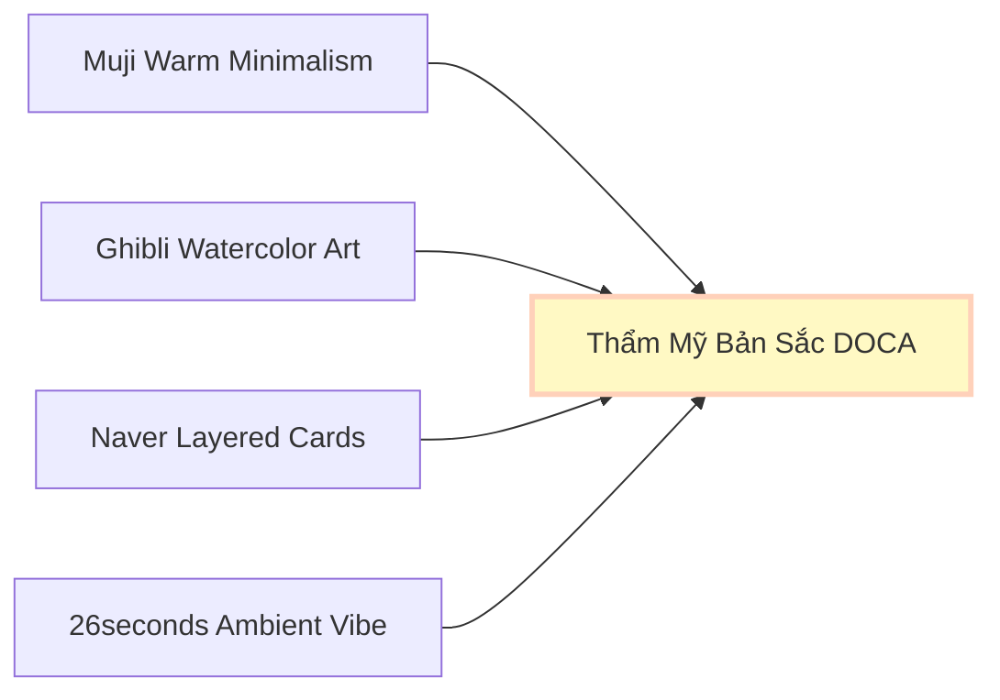

# 01. ĐẶC TẢ TRIẾT LÝ THẨM MỸ & GIỌNG ĐIỆU TRỰC QUAN (IYASHIKEI & MUJI ARTISTRY)

---

## 🌌 1. Triết Lý Thẩm Mỹ Cốt Lõi (Artistic Identity)

Ứng dụng **DOCA** hướng tới sự **hoài niệm, mộc mạc, yên bình và đậm chất thơ (Iyashikei)**. Thiết kế trút bỏ mọi sự bóng bẩy công nghiệp hay giao dịch thương mại thúc giục để tạo nên một góc trú ẩn cảm xúc thầm lặng cho người trẻ đô thị.

*   **Sự Tĩnh Lặng Trực Quan (Visual Breathing Space):** Bố cục thoáng đãng, tối ưu hóa các khoảng trắng (negative space) rộng lớn giúp giảm tải căng thẳng thần kinh và xoa dịu võng mạc, đặc biệt vào ban đêm.
*   **Cấu Trúc Tối Giản Hiện Đại (Modern Classic Structure):** Giao diện phẳng tinh khiết. Các card, panel và menu điều hướng được sắp xếp ngăn nắp, cân đối bằng các đường viền mảnh tinh tế (`1px solid`) và các thẻ bo góc nhẹ nhàng (`12px - 16px`), mang lại sự sang trọng và tin cậy.
*   **Sự Ấm Áp Tinh Tế (Subtle Warmth):** Màu sắc được lựa chọn ở các tông dịu nhẹ và tối giản, kết hợp giữa nền sáng/tối thuần khiết và các điểm nhấn tinh tế để tạo không khí chữa lành và cảm xúc, tuyệt đối không lạm dụng hiệu ứng đồ họa lòe loẹt hay hình ảnh trang trí rườm rà.

---

## 🌅 2. Quy Tắc Minh Họa Màu Nước Ghibli (Selective Ghibli Illustrations)

*   **Nghệ thuật phác họa thủ công (Watercolor Sketch Style):** Toàn bộ hình ảnh thú cưng ảo và minh họa trạng thái rỗng đều tuân thủ phong cách tranh màu nước mộc mạc Studio Ghibli. Các nét cọ mềm mại, màu sắc chuyển tiếp tự nhiên mang lại cảm giác chân thành, ấm áp.
*   **Tuyệt đối KHÔNG sử dụng Chibi (No Chibi-style Art):**
    *   Không vẽ thú cưng theo phong cách chibi đầu to mình nhỏ, hoạt hình công nghiệp phẳng lì hoặc biến dạng cường điệu tinh nghịch kiểu manga.
    *   Không tích hợp các bộ khung ghép ảnh chibi châm biếm hài hước hay Carousel động chibi Lottie thiếu chiều sâu cảm xúc.
    *   Hình ảnh thú cưng phải giữ đúng tỷ lệ sinh học mộc mạc, hiền hòa để bảo toàn tính thiêng liêng, hoài niệm của tình tri kỷ.
*   **Tính chọn lọc cao (Selective Placement):** Hình minh họa màu nước chỉ xuất hiện ở các vị trí cố định mang tính biểu tượng (như avatar pet, card trống lúc empty state, hoặc tranh Polaroid kỷ niệm). Tuyệt đối không chèn các hoạt ảnh trang trí tùy tiện gây nhiễu loạn luồng tương tác chính.

---

## 🎨 3. Bảng Màu Bóng Đêm & Ánh Sáng Ấm (Color Palette concept)

Sắc màu của DOCA được chia làm hai chủ đề chính:
*   **Chủ đề Sáng (Cozy Light) làm chủ đạo:** Nền trắng kem mây mờ cực dịu mắt (`#FBFAF6` - Cloud), bề mặt thẻ bài giấy ấm thương hiệu (`#F4F1E9` - Paper), chữ mực than Charcoal sẫm (`#15170F`). Mang lại cảm giác thoáng đãng, trật tự chuẩn tối giản MUJI.
*   **Chủ đề Tối (Cozy Dark) chuyên biệt:** Dành riêng cho các trải nghiệm có chiều sâu cảm xúc cao (Game qu Quét thẻ, Postcard lưu niệm, Vé tàu hành trình ban đêm). Nền tối vô cực Deep Charcoal (`#0D0D0D`) kết hợp với ánh sáng vàng ấm áp (`Warm Amber Light - #FFF9C4`) giả lập đèn ngủ dịu nhẹ ban đêm.
*   **Hợp nhất màu nhấn cảm xúc (Unified Emotional Accents):**
    *   `Sakura Pink` (`#EAB0B2`): Hồng hoa anh đào, màu nhấn cảm xúc chính dùng cho tim yêu thích, điểm chạm tâm hồn (tinh chỉnh sắc độ phối ấm).
    *   `Matcha Green` (`#A3B892`): Xanh Matcha, màu phụ trợ dùng cho tiến trình đồng hành, hoạt động đi dạo (đồng bộ tông màu xanh lá thương hiệu nhưng giảm bão hòa).

---

## 🎵 4. Trải Nghiệm Xúc Giác & Thính Giác Chữa Lành (Haptic & Sonic Healing)

*   **Rung động xúc giác (Breathing Haptic Loops):** Khi người dùng tương tác sâu (chạm giữ Boss ảo, vuốt thẻ Buffet Ký ức), điện thoại sẽ phản hồi rung cực nhẹ mô phỏng nhịp thở khò khò (`purring` chu kỳ `1.4s`) của mèo hoặc nhịp tim đập ấm áp của chó, thắt chặt sợi dây liên kết vật lý.
*   **Nhạc nền Acoustic & Lofi Ambient:** Tích hợp tùy chọn nhạc nền lofi acoustic gảy đàn guitar nhẹ nhàng kết hợp tiếng mưa rơi hiu hiu ngoài hiên, biến không gian chat thành một quán cà phê tĩnh lặng chữa lành.
*   **Khoảng lặng thính giác (Zero Sonic Friction):** Loại bỏ hoàn toàn các hiệu ứng âm thanh cơ học giả tạo (như tiếng sột soạt lật giấy, tiếng bút chì viết lách cách). Sự chữa lành thực sự nằm ở sự im lặng tuyệt đối khi Sen và Boss đối thoại đêm muộn.
