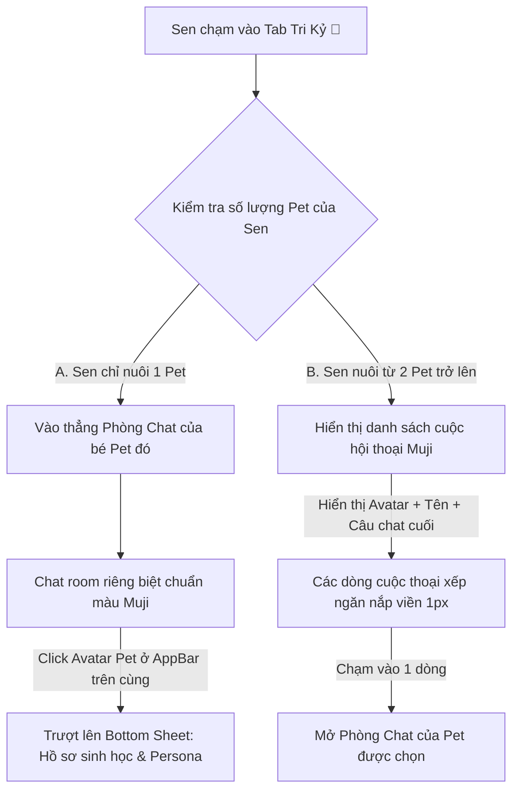

# 04. KHUÔN MẪU TƯƠNG TÁC COZY UX PATTERNS (EMOTIONAL UX SPECS)

---

## 🛋️ Pattern 1: Ambient Sensing Resonance (Cộng Hưởng Cảm Biến Môi Trường)

Giao diện ứng dụng không đứng im vô tri, nó cộng hưởng tự nhiên theo nhịp sinh học của người dùng và các biến đổi môi trường của thiết bị, tạo cảm giác Boss ảo đang cùng sinh hoạt trong một không gian vật lý với Sen:

*   **Nhịp độ Ngày/Đêm:**
    *   *Sáng & Chiều (06:00 - 21:59):* Ứng dụng mặc định chế độ Cozy Light Mode sáng sủa. Boss năng động, gợi ý Sen đi dạo hoặc chơi đùa.
    *   *Đêm muộn (22:00 - 05:59):* Tự động kích hoạt Cozy Dark Mode trên nền Obsidian đen tối giản. Bật ánh sáng vàng ấm áp (`Warm Amber Light - #FFF9C4`) làm tông màu chủ đạo cho các chi tiết nhỏ. 
    *   *Thoại Thì Thầm (Whisper Mode):* Các câu thoại của Boss tự động chuyển sang chế độ suy tư, giàu chất thơ, hiển thị chậm rãi từng chữ một (Typewriter effect) sử dụng font **Space Mono** nghiêng (`whisperMono`).
*   **Cộng hưởng Thời tiết (Ambient Weather Effect):**
    *   Sử dụng API định vị để nhận biết thời tiết thực tế:
    *   *Trời mưa:* Khung chat và dashboard phủ hiệu ứng giọt nước watercolor trượt nhẹ mờ trên màn hình. Nhạc nền tự động lồng tiếng mưa rơi rào rạt. Boss AI gửi lời nhắc: *"Ngoài trời mưa to quá, Sen đã lau khô chân cho trẫm chưa? Vào đây cuộn tròn sưởi ấm thôi..."*
*   **Trạng thái Năng lượng Thiết bị (Device Battery State):**
    *   *Pin dưới 20%:* Boss ảo chuyển sang Lottie nằm ngủ khò khò. Đoạn chat báo: *"Trẫm hết năng lượng rồi, Sen cắm sạc cho cả hai chúng mình đi nhé..."*

```json
{
  "ambient_sensor_state": {
    "current_time": "2026-06-13T23:15:00+07:00",
    "weather_condition": "rainy",
    "device_battery_level": 0.18,
    "ui_theme_applied": "cozy_dark_obsidian",
    "ambient_audio_mix": ["lofi_ghibli_acoustic", "natural_rain_pad"],
    "boss_interaction_mode": "sleep_whisper"
  }
}
```

---

## 😻 Pattern 2: Emotional Micro-Interaction & Haptic Purring (Tương Tác Xúc Giác & Rung Haptic)

Mọi cú chạm vào Boss ảo đều phải phản hồi lại bằng cảm giác vật lý sống động để củng cố sợi dây liên kết vô hình:

*   **Cơ chế Vuốt Ve (Petting Hold Pattern):**
    *   Khi người dùng chạm và ấn giữ (Long Press) lên hình ảnh minh họa Boss trên màn hình:
    *   *Visual:* Chuyển động Lottie lập tức chuyển sang trạng thái lim dim ngủ hoặc nghiêng đầu nũng nịu (Smooth transition dưới `150ms`).
    *   *Haptic:* Kích hoạt bộ rung phản hồi xúc giác nhẹ nhàng theo chu kỳ thở của thú cưng: rung nhẹ tăng dần trong `0.5s` $\rightarrow$ nghỉ `0.2s` $\rightarrow$ rung nhẹ giảm dần trong `0.5s` $\rightarrow$ nghỉ `0.2s` (chu kỳ `1.4s` mô phỏng nhịp thở gừ gừ - purring của mèo hoặc nhịp tim đập ấm áp của chó).
*   **Phản hồi khi chạm (Feedback on Touch):**
    *   Khi Sen nhấp chạm nhanh (Tap) vào Boss, hệ thống phát ra một phản hồi haptic cực nhẹ (`light impact click`) kết hợp bong bóng chat thì thầm, biểu hiện sự phản hồi thân thiện tức thời.


---

## 💬 Pattern 3: Shared Memory Recall & Variable Dopamine (Tái Hiện Ký Ức & Khịa Chéo)

Thú cưng ảo có trí nhớ dài hạn. Chúng đọc hiểu các sự kiện kỷ niệm (Moments) và ảnh dìm hàng mà Sen đăng lên nhật ký để chủ động gợi nhớ lại trong các cuộc trò chuyện thường nhật một cách hóm hỉnh, mang lại niềm vui Dopamine bất ngờ:

*   **Trí nhớ dài hạn (Shared Memory Core):**
    *   Khi người dùng đăng một tấm ảnh hay nhật ký (Moment) lên hệ thống, AI Pet lập tức đọc hiểu ảnh và nội dung text, phân tích cảm xúc và lưu vào bộ nhớ thực thể (`shared_memory_core`).
    *   Trong các phiên chat ngẫu nhiên sau đó, thay vì trả lời sáo rỗng, Boss chủ động gọi lại ký ức cũ: *"Sen ơi, nhìn cái đĩa cơm sen nấu hôm nọ trẫm thấy thương cái bụng của sen quá..."*
*   **Khịa Chéo Gia Đình (Cross-Pet Gossip - Hệ sinh thái gia đình):**
    *   Đối với các hộ gia đình nuôi nhiều Pet (ví dụ: Mèo Bánh Mỳ và Chó Lucky):
    *   Mèo Bánh Mỳ có thể truy xuất bộ nhớ kỷ niệm dìm hàng của Chó Lucky để mách lẻo với Sen: *"Trẫm vừa xem nhật ký, thấy Lucky hôm qua đi chơi bùn bị phạt đứng xó, đáng đời tên ngáo đó thật!"*
    *   *Visual:* Đoạn thoại khịa chéo đi kèm một tooltip nhỏ hiển thị hình ảnh kỷ niệm thu nhỏ của Pet kia để Sen dễ dàng nhấp vào xem lại.

---

## 🏥 Pattern 4: Conversational Health Log & Warm Warnings (Ghi Nhận Sức Khỏe Không Áp Lực)

Việc theo dõi sức khỏe và y tế cho thú cưng (Care Log) không được tạo cảm giác căng thẳng, lo âu như một phần mềm bệnh viện khô khan:

*   **Nhập Liệu Hội Thoại (Conversational Health Check):**
    *   Thay vì hiển thị bảng form dài với nhiều ô nhập liệu lâm sàng, người dùng nhập liệu thông qua giao diện Chat hoặc nhấp vào các biểu tượng tượng hình trực quan.
    *   *Ví dụ đo cân nặng:* Boss ảo sẽ ngồi lên một chiếc cân đĩa cổ vintage. Khi Sen kéo thanh trượt Slider để cập nhật cân nặng, Boss sẽ có các biểu cảm Lottie tương ứng (hóp bụng nếu tăng cân, hoặc cười tươi) kèm câu thoại: *"Trẫm thấy dạo này hơi nặng mông rồi đấy nhé, Sen bớt cho trẫm ăn vặt đi!"*
*   **Cảnh Báo Ấm Áp (Warm Warnings):**
    *   Khi đến lịch tiêm phòng hoặc chỉ số sức khỏe có biến động nhẹ:
    *   Tuyệt đối **KHÔNG** sử dụng cờ đỏ khẩn cấp, biểu tượng nguy hiểm hay banner đỏ chói.
    *   Sử dụng nhãn **Cozy Warning** màu cam quả chín nhạt (`#FFE0B2`) hoặc hồng anh đào úa (`#FFCDD2`). Thông điệp cảnh báo được diễn đạt dưới dạng lời nhắc nhở nhẹ nhàng từ Boss: *"Sen ơi, trẫm thấy tai hơi ngứa nhẹ, hay là cuối tuần này chúng mình ghé bác sĩ thú y xem sao nhé?"*

---

## 📚 Pattern 5: Cozy Shelf & Wishlist Exploration (Khám Phá Kệ Sách & Điều Ước)

Người dùng được tiếp cận các đề xuất nhạc, sách cũ và vật phẩm chăm sóc một cách bình yên, thư giãn nhất, triệt tiêu hoàn toàn cảm xúc thương mại, thúc giục mua sắm hay áp lực tiền bạc:

*   **Triệt Tiêu Giá Cả & Giỏ Hàng (No-Price & No-Cart):**
    *   Tất cả các thẻ và trang thông tin sản phẩm bắt buộc **không có nhãn giá tiền** (tránh khó khăn trong việc đồng bộ giá với các sàn ngoài và tránh cảm giác app là một cái chợ thương mại).
    *   Loại bỏ hoàn toàn bộ chọn số lượng và nút "Giỏ hàng".
*   **Góc Ước Nguyện Của Boss (Boss's Wishlist 🎁):**
    *   Hành động lưu trữ được thiết kế dưới dạng **"Ước Cho Boss 🎁"**. Khi Sen nhấn nút Hộp quà `🎁`, vật phẩm sẽ được đưa vào trang sổ tay ước nguyện của thú cưng, tạo cảm giác đó là một hành động yêu thương, chăm sóc.

---

## 🏆 Luồng Điều Hướng Tri Kỷ Lai Thông Minh (Smart Chat Hybrid Flow)

Để tránh trường hợp giao diện bị trống trải, thiếu cân đối khi người dùng chỉ nuôi duy nhất 1 chú Pet, hệ thống quản lý trạng thái (Riverpod) sẽ tự động kiểm tra số lượng Pet cục bộ và điều hướng thông minh khi chạm vào tab **Tri Kỷ (💬)**:



### 1. Trường hợp A: Sen chỉ có 1 Boss duy nhất (Zero-Friction Intimacy)
*   **Trải nghiệm:** Khi Sen nhấn Tab 💬, ứng dụng **bỏ qua hoàn toàn màn hình danh sách trung gian**. Giao diện trượt mượt mà **vào thẳng Phòng Chat riêng tư** của chú Pet duy nhất đó.
*   *Cách đi đến Hồ sơ Pet:* Tại AppBar trên cùng của Phòng Chat, có hiển thị Avatar bo góc `8px` của Pet. Nhấn vào Avatar này sẽ trượt lên một Bottom Sheet phẳng giới thiệu toàn bộ **Hồ sơ sinh học & Cấu hình tính cách (Persona)** để Sen chỉnh sửa tùy ý.
*   *Lối tắt nhanh Hộp Ký Ức:* Ở góc phải AppBar của Phòng Chat, xuất hiện một icon album nhỏ `[📸]`. Nhấn vào sẽ dẫn Sen thẳng tới **Hộp Ký Ức đã được lọc sẵn riêng cho chú Pet này**.

### 2. Trường hợp B: Sen nuôi từ 2 Boss trở lên (Smart Conversations List)
*   **Trải nghiệm:** Khi nhấn Tab 💬, ứng dụng hiển thị một danh sách các cuộc hội thoại phẳng tối giản.
*   **Cử chỉ vuốt nhanh xem album:** Vuốt nhẹ một dòng Pet sang trái (Swipe Left) sẽ lộ ra một nút chức năng phẳng màu Matcha: **[Ký Ức 📸]** giúp Sen truy cập nhanh album ảnh riêng của Pet đó mà không cần vào phòng chat.
