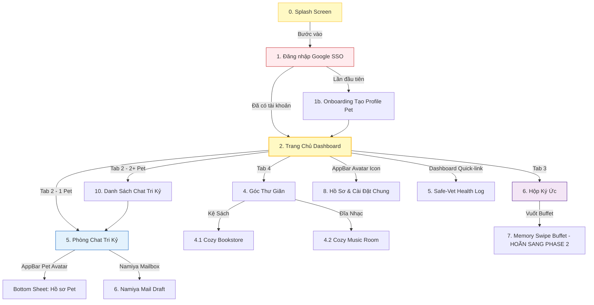

# 05. BẢN VẼ WIREFRAME & KHUNG BỐ CỤC TRANG (WIREFRAMES & TEMPLATES)

---

## 🗺️ Bản Đồ Luồng Giao Diện (Screen Flow Map)



---

## 🧩 Ký Hiệu Chú Giải Bản Vẽ (Global Legend)

```
(O)         = Avatar tròn (bo góc 8px theo Radius.cozyAvatar)
[ ... ]     = Nút bấm / Button
{ ... }     = Input Field (Muji Soft Block — nền #F5F5F0, radius 16px)
| ... |     = Khung card / Container
====        = Đường phân cách (Separator 1px #EAEAEA)
----        = Dòng kẻ Vintage Lined Input hoặc Timeline Divider
●           = Cherry Blossom Dot (Chấm báo tin thầm lặng 6px #FCAFAF)
____        = Thanh chỉ báo trượt Muji Bar (16x2px active indicator)
[Lucide: X] = Tên icon Lucide cụ thể được sử dụng tại vị trí đó
```

---

## 🗂️ Đặc Tả Chi Tiết 10 Cozy Screen Templates & Wireframes

### 🌙 0. Màn Hình Splash Ký Ức (Splash Screen)
*   **Mô tả:** Ảnh Boss toàn màn hình (full-screen cover). Lớp phủ tối dần từ trong suốt (đỉnh) xuống đen `rgba(0,0,0,0.85)` (đáy). Nút bấm nổi trên nền tối.

```
+-------------------------------------------------------+
|  [ 22:00 ]                                     [ 90%] |
|                                                       |
|                                                       |
|              ( ẢNH BOSS TOÀN MÀN HÌNH )               |
|              ( Full-screen Cover Photo )               |
|                                                       |
|          ====  Lớp Phủ Tối Dần (Vignette)  ====       |
|                                                       |
|      "Sen về rồi đó à? Hôm nay trẫm đợi              |
|       Sen hơi lâu đấy nhé!"                           | <--- Space Mono Italic 15px #FFFFFF
|                                                       |
|                  o  o  ●  o  o                        | <--- Page indicator dots
|                                                       |
|      +-------------------+  +-------------------+    |
|      |    Bước Vào       |  |    Xem Lại        |    | <--- Inter Bold 15px
|      | (Nền trắng #FFF)  |  | (Viền trắng mờ)  |    |      BorderRadius 28px, H 50dp
|      +-------------------+  +-------------------+    |
|                                                       |
|    Kỷ niệm ngày 28/05/2026 của Bánh Mỳ                | <--- Inter Regular 11px #FFF 50%
+-------------------------------------------------------+
```

---

### 🔐 1. Giao Diện Đăng Nhập (Auth Screen)
*   **Mô tả:** Nền tối Obsidian `#0D0D0D`. Hoạt ảnh Boss nét phác thảo màu nước Studio Ghibli (Lottie sketch style) đang ngủ chậm rãi ở giữa màn hình.

```
+-------------------------------------------------------+
|  [ 22:00 ]                                     [ 90%] |
|                                                       |
|                                                       |
|                      CAPCAT                          | <--- Inter Bold 32px #FFFFFF
|                   Soul of Pet                        | <--- Space Mono Regular 14px #FCAFAF
|                                                       |
|                    /\_/\   * thở nhẹ *               |
|                   ( o.o )  zZZ                        | <--- Lottie Boss Watercolor Sketch
|                    > ^ <                              |
|                                                       |
|       "Căn phòng ấm áp của ký ức                     |
|         đang đợi Sen trở về..."                      | <--- Space Mono Italic 14px #8C8C8C
|                                                       |
|         +-----------------------------------+         |
|         |  [Lucide: Chrome] Đăng nhập bằng Google |  | <--- Inter Medium 15px
|         +-----------------------------------+         |     H 56dp, radius 16px
|                                                       |
|              * Chạm để bắt đầu chữa lành             | <--- Inter Regular 12px #5C5C58
|                                                       |
+-------------------------------------------------------+
|  [Lucide: Home]  [Lucide: MessageSquare]  [Lucide: Camera]  [Lucide: Headphones]  |
|                  ____                                                 | <--- Muji Bar active indicator (Home)
+-------------------------------------------------------+
```

---

### 📝 1b. Màn Hình Tạo Profile Pet (Pet Onboarding)
*   **Mô tả:** Thiết lập giống loài, cân nặng và chọn lựa cá tính cho Boss ảo.

```
+-------------------------------------------------------+
|  [ 22:00 ]                                     [ 90%] |
|  [Lucide: X Bỏ qua]                  [ 02 / 03 Bước ] |
|-------------------------------------------------------|
|                                                       |
|         THẦN THÁI & NHÂN CÁCH AI CỦA BOSS             | <--- Inter Bold 18px
|                                                       |
|  +---------------------------------------------------+|
|  |  Nhân cách chủ đạo của Boss là gì?               ||
|  |                                                   ||
|  |  [ ] Chảnh chọe (Mèo Quý Tộc)                   || <--- Radio Options (Inter Regular 14px)
|  |  [x] Ngáo ngơ (Ngọc Hoàng thất sủng)            ||
|  |  [ ] Nịnh nọt (Chuyên viên gác đùi)             ||
|  +---------------------------------------------------+|
|                                                       |
|  { Giống loài... [Lucide: Search] }                   | <--- Muji Soft Block Input (radius 16px)
|                                                       |
|  { Cân nặng hiện tại: 5.2 kg }                        | <--- Muji Soft Block Input (radius 16px)
|                                                       |
|            +-----------------------+                  |
|            |   Kế Tiếp [Lucide: ArrowRight]  |        | <--- Primary Button H 56dp #121212
|            +-----------------------+                  |
+-------------------------------------------------------+
|  [Lucide: Home]  [Lucide: MessageSquare]  [Lucide: Camera]  [Lucide: Headphones]  |
+-------------------------------------------------------+
```

---

### 🏡 2. Trang Chủ Dashboard (Cozy Dashboard)
*   **Mô tả:** Căn phòng khách bình yên của Boss cưng. Trung tâm hiển thị Khung ảnh kỷ niệm thực tế (Real Pet Memory Canvas) bo góc phẳng. Chạm/Giữ lên khung ảnh sẽ kích hoạt haptic gừ nhẹ (Purr effect) và hiển thị bong bóng lời nhắn. Thùng sữa bưu điện bám ở AppBar Trang chủ.

```
+-------------------------------------------------------+
|  [ 22:00 ]                                     [ 90%] |
|  Mèo Bánh Mỳ                     [Lucide: Mail] (O) | <--- Top App Bar (H 56px)
|  =================================================    |
|                    ⛅ Hà Nội, 24°C                    | <--- Ambient Weather (Inter Regular 12px #8C8C8C)
|                                                       |
|       +---------------------------------------+       |
|       |  "Sen ơi, ôm trẫm một cái!"           |       | <--- Whisper Box (Space Mono Italic 13px)
|       |  — Bánh Mỳ, 22:15                     |       |      Nền #FBFBFA, viền 1px #EAEAEA, radius 12px
|       +---------------------------------------+       |
|                                                       |
|             +---------------------------+             |
|             |                           |             |
|             |     [ 📸 ẢNH CHỤP THẬT    |             | <--- Khung ảnh kỷ niệm thực tế
|             |      KỶ NIỆM CỦA BOSS ]   |             |      (Real Pet Memory Canvas)
|             |                           |             |
|             +---------------------------+             |
|                                                       |
|  +-----------------------------+                      |
|  | [Lucide: Camera] Đã thêm kỷ niệm mới... |          | <--- Moments Card (Muji Card, radius 16px)
|  +-----------------------------+                      |
|                                                       |
+-------------------------------------------------------+
|  [Lucide: Home]  [Lucide: MessageSquare]  [Lucide: Camera]  [Lucide: Headphones]  |
|  ____                                                                 | <--- Muji Bar under "Home" icon
+-------------------------------------------------------+
```

---

### 💬 3. Phòng Chat Tri Kỷ (Cozy Chat Resonance)
*   **Mô tả:** Phòng trò chuyện riêng tư. Nền chuyển màu watercolor theo thời tiết thực tế. Bong bóng chat của Boss dạng văn bản chạy typewriter Space Mono trực tiếp trên nền sáng (không khung). Bong bóng của Sen dạng kem viền nét đứt mờ.

```
+-------------------------------------------------------+
|  [ 22:00 ]                                     [ 90%] |
|  [Lucide: ArrowLeft]  (O) Mèo Bánh Mỳ  [Lucide: Camera]| <--- Top App Bar
|  =================================================    |
|   [ 15:30 ]                                           |
|                                                       |
|         +--------------------------------+            |
|         | Sen ơi, trẫm đói rồi!          |            | <--- Boss Bubble (Trái)
|         | Cơm cá mòi hôm nay đâu?       |            |      Không có khung (ban ngày)
|         +--------------------------------+            |      Space Mono Italic, #1C1C1E
|                                                       |
|                   +---------------------------+       |
|                   | Đợi tí, đang gõ nốt mấy  |       | <--- Sen Bubble (Phải)
|                   | dòng code rồi cho ăn nhé. |       |      Nền #FDFBF7, viền 1px dashed #D2D2CC
|                   +---------------------------+       |      Inter Regular 13px, #1C1C1E
|                                                       |
|         +--------------------------------+            |
|         | Lại code... Suốt ngày gõ      |            | <--- Boss Bubble (Trái) — kiểu typewriter
|         | cạch cạch rồi bỏ bê trẫm!    |            |      Space Mono Italic, #1C1C1E
|         +--------------------------------+            |
|                                                       |
|  +--------------------------------------------------+ |
|  | [Lucide: Plus] Viết gì đó với Boss...   [Lucide: Send]| | <--- Muji Chat Input Bar
|  | (Nền #FBFBFA mờ 95%, H 56-120px tự giãn)          | |      radius 16px, blur backdrop
|  +--------------------------------------------------+ |
+-------------------------------------------------------+
|  [Lucide: Home]  [Lucide: MessageSquare]  [Lucide: Camera]  [Lucide: Headphones]  |
|                  ____                                                 | <--- Muji Bar under "MessageSquare"
+-------------------------------------------------------+
```

---

### 📚 4.1. Góc Thư Giãn — Kệ Sách Cũ (Cozy Bookstore)
*   **Mô tả:** Trưng bày bìa sách tỷ lệ 3:4. Nhấn sách mở Bottom Sheet chứa trích dẫn viết tay bằng Space Mono và liên kết tiếp thị mua sách.

```
+-------------------------------------------------------+
|  [ 22:00 ]                                     [ 90%] |
|  [Lucide: ArrowLeft] Góc Thư Giãn      [Lucide: Gift]  | <--- Nút Wishlist
|  =================================================    |
|  +-------------------+  +-------------------------+  |
|  |    Đĩa Nhạc 🎵    |  |    Kệ Sách Gỗ 📚 [Active]|  | <--- Segmented Tabs (H 36px)
|  +-------------------+  +-------------------------+  |
|                                                       |
|  +-------+   Tôi Là Một Chú Mèo                       | <--- Tên sách (Inter Bold 16px)
|  |       |   Natsume Soseki                           | <--- Tác giả (Inter Regular 13px mờ)
|  | Cover |                                            |
|  | (3:4) |   [  Mua Sách [Lucide: ExternalLink]  ]    | <--- Nút mở link Shopee/Fahasa
|  +-------+                                            |
|                                                       |
|  +-------------------------------------------------+  |
|  | "Hãy sống như một chú mèo, ngủ khi mệt và kêu   |  | <--- Quote Block (Space Mono Italic 13px)
|  |  ca khi đói."                                   |  |      Nền kem ấm #F5F5F0, bo góc 8px
|  +-------------------------------------------------+  |
|                                                       |
|  - - - - - - - - - - - - - - - - - - - - - - - - - -  | <--- Nét đứt mờ phân rã
|                                                       |
|  +-------+   Quyển sách tiếp theo...                  |
+-------------------------------------------------------+
|  [Lucide: Home]  [Lucide: MessageSquare]  [Lucide: Camera]  [Lucide: Headphones]  |
|                                           ____                        | <--- Muji Bar under "Headphones"
+-------------------------------------------------------+
```

---

### 🎵 4.2. Góc Thư Giãn — Góc Âm Nhạc (Cozy Music Room)
*   **Mô tả:** Phòng phát nhạc analog tối giản. Đĩa than lofi xoay chậm ở giữa.

```
+-------------------------------------------------------+
|  [ 22:00 ]                                     [ 90%] |
|  [Lucide: ArrowLeft] Góc Thư Giãn      [Lucide: Gift]  | <--- Nút Wishlist
|  =================================================    |
|  +-------------------+  +-------------------------+  |
|  | Đĩa Nhạc 🎵[Active]|  |    Kệ Sách Gỗ 📚        |  | <--- Segmented Tabs (H 36px)
|  +-------------------+  +-------------------------+  |
|                                                       |
|              /-------\                               |
|             /  [💿]  \                              | <--- Đĩa than Lottie xoay chậm
|             \         /                              |      (diameter 180px)
|              \-------/                               |
|                                                       |
|           Gió Đùa Nhành Tre                          | <--- Inter Bold 18px #1C1C1E
|                Thế Sơn                               | <--- Inter Regular 13px #6E6E6A
|                                                       |
|    ======●---------------------------  0:15           | <--- Muji Slider (ray 4px Obsidian)
|                                                       |
|         [ Nghe Bản Đầy Đủ [Lucide: ExternalLink] ]   | <--- Primary Button H 48dp #121212
|                                                       |
|  - - - - - - - - - - - - - - - - - - - - - - - - -   |
|  [Lucide: Play] Bài kế tiếp: Mưa Hồng...             |
+-------------------------------------------------------+
|  [Lucide: Home]  [Lucide: MessageSquare]  [Lucide: Camera]  [Lucide: Headphones]  |
|                                           ____                        | <--- Muji Bar under "Headphones"
+-------------------------------------------------------+
```

---

### 🏥 5. Nhật Ký Y Tế & Chăm Sóc (Care Log / Health Log)
*   **Mô tả:** Nạp cân nặng qua thanh trượt thấu cảm (Boss Lottie đứng trên cân cổ). Hiển thị lịch tiêm ngừa, sổ giun dạng danh sách Muji. Nhãn Cozy Warning màu cam quả chín.

```
+-------------------------------------------------------+
|  [ 22:00 ]                                     [ 90%] |
|  [Lucide: ArrowLeft] Nhật Ký Sức Khỏe                  |
|  =================================================    |
|                                                       |
|               ( \ / )                                 |
|              [  Cân  ]                                | <--- Boss ảo đứng trên cân vintage
|            ====●======  4.5kg                         | <--- Slider cân nặng thấu cảm
|                                                       |
|  +---------------------------------+                  |
|  | [Lucide: Shield] Tiêm phòng định kỳ                |  | <--- Muji List Row
|  |    Ngày: 2026.06.20   [ Đã Đặt ]                   |  |
|  | [Lucide: AlertTriangle] Tẩy giun định kỳ           |  |
|  |    [⚠️ Cozy Warning: Quá hạn]                      |  | <--- Nhãn cảnh báo cam nhạt
|  +---------------------------------+                  |
|                                                       |
|             [ + Cập Nhật ]                            | <--- Nút cập nhật chỉ số
+-------------------------------------------------------+
```

---

### ✉️ 6. Soạn Thảo Thư Tay Namiya (Mail Draft Screen)
*   **Mô tả:** Giao diện viết thư ẩn danh gieo tơ lòng. Khung gõ chữ thiết kế dạng dòng kẻ sổ tay hoài cổ (Vintage Lined Input). Tem thư bám góc AppBar. Nút gửi bám sát trên Keyboard Safe Area.

```
+-------------------------------------------------------+
|  [ 22:00 ]                                     [ 90%] |
|  [Lucide: X]  Thư Gửi Boss       [🔲 Tem]  [Lucide: HelpCircle]| <--- Top Bar (Tem góc phải)
|  =================================================    |
|                                                       |
|  Gửi Boss ở quá khứ / tương lai...                    | <--- Placeholder mờ
|  ___________________________________________________  | <--- Dòng kẻ đáy sổ tay
|  Trăng đêm nay thật đẹp, Boss có đang                 |
|  ngủ ngon không? Sen nhớ Boss nhiều...                | <--- Space Mono Regular 13px #1C1C1E
|  ___________________________________________________  |
|  ___________________________________________________  |
|                                                       |
|  (Cuộn scrollable khi bàn phím lên)                   |
|                                                       |
|  +--------------------------------------------------+ |
|  | [B] [I] [Lucide: List] [Lucide: Quote] [Lucide: Smile] | [Gửi Đi ✉] | | <--- Notion Toolbar
|  +--------------------------------------------------+ |      Bám sát trên bàn phím, H 44px
|  +--------------------------------------------------+ |
|  |            BÀN PHÍM ẢO (VIRTUAL KEYBOARD)        | |
+-------------------------------------------------------+
```

---

### 🌟 7. Buffet Ký Ức (Memory Tinder Swipe) [HOÃN SANG PHASE 2]
*   **Mô tả:** Hoãn sang Phase 2 (de-scoped) để tối giản MVP. Giao diện tối màu Obsidian (`#0D0D0D`) để vuốt quẹt lọc ảnh Polaroid cũ. Vuốt phải: Lưu vào Hộp Ký ức (Haptic purring rung chu kỳ). Vuốt trái: Bỏ qua.

```
+-------------------------------------------------------+
|  [ 22:00 ]                                     [ 90%] |
|  [Lucide: X] Buffet Ký Ức                     [📊]   | <--- Nền Obsidian #0D0D0D
|  =================================================    |
|                                                       |
|           +-----------------------+                  |
|           |   /\_/\               |                  | <--- Thẻ bài phía sau (góc +2°, Obsidian mờ)
|       +---|  ( =.= )              |---+               |
|       |   +-----------------------+   |               |
|       |   |                       |   |               | <--- Thẻ bài chính (góc 0°, radius 28px)
|       |   |    [  📸 Ảnh Boss  ]  |   |               |
|       |   |                       |   |               |
|       |   |  Ngày: 2026.06.13     |   |               | <--- Space Mono Regular 12px #8C8C8C
|       |   |  "Bánh Mỳ ngủ nướng" |   |               | <--- Inter Regular 14px #FFFFFF
|       |   +-----------------------+   |               |
|       +-----------------------------------+           |
|                                                       |
|  [ 🍃 Bỏ Qua ]               [ 😻 Ghi Nhớ ]          | <--- Nút bo tròn 28px
|  (Nền Matcha #8FA882 mờ)      (Nền Sakura #FCAFAF mờ) |      Chữ #FFFFFF Inter Medium 14px
|                                                       |
|   <- Vuốt Trái: Bỏ Qua     Vuốt Phải: Lưu Lại ->    | <--- Inter Regular 12px #5C5C58
+-------------------------------------------------------+
|  (Không có Dock trong Dark Mode Swipe Screen)          |
+-------------------------------------------------------+
```

---

|  THÔNG TIN TÀI KHOẢN                                  |
|  ___________________________________________________  |
|  Email                       user@example.com         | <--- Info Field tĩnh (H 48px)
|  Ngày Tham Gia                     2026.06.12         |
|  ___________________________________________________  |
|                                                       |
|  HÀNH ĐỘNG TÀI KHOẢN                                  |
|  ___________________________________________________  |
|  Thay Đổi Mật Khẩu                [Lucide: ChevronRight]|
|  Đăng Xuất                        [Lucide: ChevronRight]|
|  ___________________________________________________  |
|                                                       |
|           Xóa Tài Khoản                               | <--- Inter Regular 14px màu #FF5252 (danger)
+-------------------------------------------------------+
```

---

### 💬 10. Danh Sách Chat Tri Kỷ (Cozy Chat List)
*   **Mô tả:** Màn hình phân loại đàn Boss trong nhà và NPC bưu điện/hàng xóm ngoài hiên. Dòng chat trượt trái mở shortcut Ký ức.

```
+-------------------------------------------------------+
|  [ 22:00 ]                                     [ 90%] |
|  [Lucide: ArrowLeft] Hộp Trò Chuyện   [Lucide: Search] |
|  =================================================    |
|                                                       |
|  ĐÀN BOSS TRONG NHÀ                                   | <--- Nhóm Label (Inter Medium 11px #8C8C8C)
|  ___________________________________________________  |
|  (O) Bánh Mỳ                           14:32   ●     | <--- Chat Row (H 72px)
|      "Sen ơi, mua pate cho trẫm..."               |      Avatar 40px, radius 8px
|  ___________________________________________________  |      ● = Cherry Blossom Dot #FCAFAF 6px
|  (O) Lucky                             12:15         |      Tên: Inter SemiBold 14px #1C1C1E
|      "Gâu! Sen về chưa?"                         |      Tin nhắn cuối: Inter Regular 13px #8C8C8C
|  ___________________________________________________  |      Time: Space Mono Regular 11px #8C8C8C
|                                                       |
|  BẠN BÈ GHÉ THĂM & HÀNG XÓM                          |
|  ___________________________________________________  |
|  (O) Mèo Mướp Hàng Xóm                Hôm qua       |
|      "Trộm được cá kho nhà Sen nè!"               |
|  ___________________________________________________  |
|  (O) Ông Lão Namiya                    06.11         |
|      "Thư hồi âm đã sẵn sàng..."                 |
|  ___________________________________________________  |
|                                                       |
|  [Vuốt trái 1 row -> Hiện nút [Ký ức 📸] màu Matcha] |
+-------------------------------------------------------+
|  [Lucide: Home]  [Lucide: MessageSquare]  [Lucide: Camera]  [Lucide: Headphones]  |
|                  ____                                                 | <--- Muji Bar under "MessageSquare"
+-------------------------------------------------------+
```
