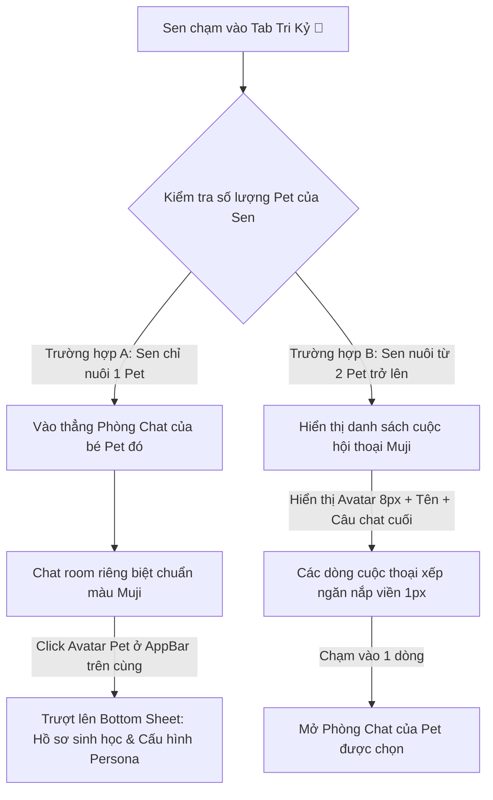

# ĐẶC TẢ CHI TIẾT 02: DOCK ĐIỀU HƯỚNG TỐI GIẢN MUJI & LUỒNG TƯƠNG TÁC THẦM LẶNG
*(MUJI NAVIGATION DOCK & HYBRID COMPANION FLOW)*

> **Mã Đặc Tả:** `SPEC-UI-02`  
> **Chủ trì:** Maya (UI/UX) & Sophia (CPO / PM) & Benny (Senior Mobile Dev)  
> **Trạng thái:** Hoàn tất đặt tả (Dev-Ready)

---

## 🧭 1. Triết Lý Thiết Kế: "Sự Kết Nối Không Tiếng Ồn"

Thanh Dock điều hướng (Bottom Navigation Bar) của **Capcat** tuân thủ nghiêm ngặt ngôn ngữ phẳng **MUJI Warm Minimalism**:
*   Không đổ bóng dày, không dập nổi 3D, không dùng các icon hoạt họa nhấp nháy nhiều màu sắc.
*   **Cấu trúc:** Một thanh ngang phẳng hoàn toàn nằm sát đáy màn hình di động, màu nền trùng màu giấy tái chế `#FBFBFA` tinh khiết.
*   **Đường chỉ ngăn cách:** Một đường kẻ mảnh `1px` màu `#EAEAEA` phân chia tinh tế phần Dock với nội dung phía trên.
*   **Biểu tượng (Icons):** Sử dụng các biểu tượng vector đơn nét mảnh (Line Icons) màu xám tro `#8C8C8C`. Khi được chọn (Active), icon chuyển sang màu đen Obsidian `#262626` kết hợp nhịp Rung cực nhẹ (`HapticFeedback.selectionClick()`).

---

## 🏛️ 2. Sơ Đồ Cấu Trúc 4 Tab Cốt Lõi (Dock Tabs Map)

Thanh Dock điều hướng được chia thành **4 Tab chính** xếp thẳng hàng ngang ngăn nắp:

```
+-------------------------------------------------------------------------+
|                                                                         |
|    [🏠]                [💬]                    [📸]                 [👤]   |
|   Trang Chủ           Tri Kỷ                Hộp Ký Ức               Tôi |
| (Home - Default)    (Chat Hybrid)          (Memory Vault)        (Profile)  |
+-------------------------------------------------------------------------+
```

---

## 🏠 2.1. Tab 1: Trang Chủ (Home - Cozy Living Room Dashboard)

Trang chủ là **không gian sinh hoạt chính** của Boss và Sen, được thiết kế theo phong cách phẳng tối giản Muji, trút bỏ hoàn toàn áp lực giao dịch hay các vòng lặp gây nghiện:

*   **Trái tim của Trang Chủ (Active Pet Room):** 
    *   Hiển thị hình ảnh hoặc hoạt cảnh phẳng tối giản của Boss đang hoạt động (ngủ, ngóc đầu, ngoáy đuôi) trong một căn phòng tĩnh lặng.
    *   Nhấn vào Boss sẽ kích hoạt nhịp rung nhẹ mô phỏng hơi thở khò khò (`HapticFeedback.vibrate()`).
*   **Trình chuyển đổi Boss (Pet Carousel Switcher):**
    *   *Sen nuôi 1 Pet:* Hiển thị duy nhất một Boss ấm áp, góc phải AppBar có nút trượt để xem hồ sơ.
    *   *Sen nuôi từ 2 Pet trở lên:* Phía trên cùng AppBar xuất hiện một **Menu thả xuống phẳng tối giản** (Flat Dropdown) hoặc thanh trượt ngang nhỏ chứa tên các Boss. Sen chạm nhẹ để "mời" Boss khác ra giữa phòng sinh hoạt. Việc này giúp Sen dễ dàng chăm sóc từng đứa trẻ một mà không làm rối loạn không gian.
*   **Thùng Sữa Trước Hiên Nhà (The Home Porch Milk Box):**
    *   **Ý tưởng Iyashikei:** Thay vì đặt Thùng Sữa (Hòm thư thông báo/Namiya Mailbox) chơ vơ dưới thanh Dock đáy di động công nghiệp, chúng tôi **mang nó về đúng vị trí thơ mộng nhất: Treo trước hiên căn phòng sinh hoạt Trang Chủ**.
    *   **Vị trí:** Nằm ở góc trên cùng bên phải của AppBar Trang Chủ, hiển thị dưới dạng biểu tượng vector hộp sữa nhỏ `[🥛]`.
    *   **Chỉ báo thầm lặng (Cherry Dot):** Khi có lá thư mới từ vườn nhà, hoặc thư hồi âm ấm áp từ Tiệm tạp hóa Namiya, một **chấm tròn đỏ anh đào mờ nhỏ (6px)** sẽ xuất hiện nhẹ nhàng ở góc hòm thư. Sen đi làm về rảnh rỗi sẽ tự nguyện chạm mở hòm thư trước hiên, loại bỏ hoàn toàn cảm giác thúc ép hay lo âu của các app thương mại.
*   **Hộp Lời Thì Thầm (Whisper Box):**
    *   Một khung thoại phẳng viền 1px màu `#EAEAEA` hiển thị các dòng tự sự chiêm nghiệm ngẫu nhiên của Boss (ví dụ: *"Hôm nay trời đổ cơn mưa rào, Sen có mang theo ô không đấy?"*), khơi gợi sự thấu cảm sâu sắc.
*   **Bộ Ba Hành Động Chăm Sóc (Care Actions Matrix):**
    *   Ba nút bấm phẳng Notion-style nằm ngay ngắn: **[Cho ăn]**, **[Đi dạo]**, **[Chải lông]** giúp Sen tích lũy điểm thân mật mà không có áp lực cày cuốc.
*   **Kệ Thư Viện Kỷ Niệm (Memory Bookshelf Portal):**
    *   **Vị trí:** Nằm ở khu vực phía dưới cùng của Trang Chủ (bên dưới bộ ba nút tương tác chăm sóc).
    *   **Mỹ thuật:** Một thẻ dài phẳng viền `1px` màu `#EAEAEA` tinh tế, bo góc `16px`, nền màu giấy trắng kem `#FBFBFA`. Phía bên trái hiển thị một icon cuốn sách và đĩa nhạc nhỏ xếp lơ lửng, phía bên phải hiển thị chỉ số: *"Đã mở khóa: 12/50 vật phẩm kỷ niệm 🎶"*.
    *   **Trải nghiệm:** Chạm nhẹ vào thẻ này sẽ mở ra **Kệ Thư Viện Ký Ức** ([PRD_MASTER_SHELF.md](file:///Users/macinia/Capcat%20Project/Document/PRD/COZY_SHELF_LIBRARY_ENGINE/PRD_MASTER_SHELF.md)) toàn màn hình với hiệu ứng trượt 2D thanh thoát.

---


## 💬 3. Giải Pháp Tư Vấn Của Maya & Sophia: Tab "Tri Kỷ" (The Smart Chat Hybrid Flow)

### 🔴 Vấn đề gãy luồng của danh sách Pet (The Blank State Dilemma):
Nếu người dùng thiết lập màn hình thứ hai là một danh sách Pet (Pets List) để bấm CTA vào chat, giao diện sẽ trông **cực kỳ trống trải, thiếu cân đối và nghèo nàn** đối với 80% người dùng trong những tháng đầu tiên (vốn chỉ nuôi 1 Boss duy nhất trong app). Tuy nhiên, nếu chỉ hiển thị một danh sách chat (Chat List) trống rỗng với một cuộc hội thoại đơn độc cũng làm giảm đi sự ấm áp.

### 🏆 Giải pháp: Vòng lặp Hybrid thông minh cho Tab "Tri Kỷ" (Smart Chat Hybrid Flow)
Hệ thống Riverpod State Management sẽ tự động kiểm tra số lượng Pet trong cơ sở dữ liệu `PetDetail` cục bộ và điều hướng thông minh khi người dùng nhấn vào Tab **Tri Kỷ (💬)**:



### 3.1. Trường hợp A: Sen chỉ có 1 Boss duy nhất (Zero-Friction Intimacy)
*   **Trải nghiệm:** Khi Sen nhấn Tab 💬, ứng dụng **bỏ qua hoàn toàn màn hình danh sách trung gian**. Giao diện trượt mượt mà **vào thẳng Phòng Chat riêng tư** của chú Pet duy nhất đó.
*   *Ý nghĩa cảm xúc:* Tạo cảm giác gắn kết tức thì, không có khoảng cách. Sen vừa mở tab trò chuyện là được nhìn thấy Boss ảo đang đợi sẵn.
*   *Cách đi đến Hồ sơ Pet (Pet Detail):* Tại AppBar trên cùng của Phòng Chat, có hiển thị Avatar bo góc `8px` của Pet. Nhấn vào Avatar này sẽ trượt lên một Bottom Sheet phẳng giới thiệu toàn bộ **Hồ sơ sinh học & Cấu hình tính cách (Persona)** để Sen chỉnh sửa tùy ý.
*   *Lối tắt nhanh Hộp Ký Ức:* Ở góc phải AppBar của Phòng Chat, xuất hiện một icon album nhỏ `[📸]`. Nhấn vào sẽ dẫn Sen thẳng tới **Hộp Ký Ức đã được lọc sẵn riêng cho chú Pet này**, giúp cuộc trò chuyện và việc lật mở ảnh cũ diễn ra cực kỳ trơn tru.

### 3.2. Trường hợp B: Sen nuôi từ 2 Boss trở lên (Smart Conversations List)
*   **Trải nghiệm:** Khi nhấn Tab 💬, ứng dụng hiển thị một danh sách các cuộc hội thoại phẳng tối giản.
*   **Thiết kế danh sách (MUJI Design Standard):**
    *   Mỗi dòng là một Pet: Gồm Avatar bo góc `8px` (`Radius.cozyAvatar`), Tên Pet viết chữ đậm (`Outfit` font), Đoạn tin nhắn chat cuối cùng mờ nhạt bên dưới, và một chấm tròn đỏ cam thầm lặng ở góc phải (nếu có tin nhắn chưa đọc).
    *   Các dòng ngăn cách nhau bởi đường chỉ ngang mảnh `1px` màu `#EAEAEA`. Không lồng ghép khung card phức tạp để giữ tính phẳng ngăn nắp.
    *   *Tính năng vuốt nhanh xem album:* Vuốt nhẹ một dòng Pet sang trái (Swipe Left Gesture) sẽ lộ ra một nút chức năng phẳng Notion-style màu Matcha: **[Ký Ức 📸]** giúp Sen truy cập nhanh album ảnh riêng của Pet đó mà không cần vào phòng chat.

---

## 📸 4. Tab 3: Hộp Ký Ức Tri Kỷ (The Memory Vault Muji Gallery)

Hộp Ký Ức được đưa lên làm **Tab cốt lõi thứ 3 dưới thanh Dock đáy**, khẳng định vị thế là trung tâm cảm xúc và lưu giữ dòng thời gian cuộc đời của Boss cưng.

*   **Thiết Chi Tiết Giao Diện:** 
    *   Tuân thủ nghiêm ngặt cẩm nang [SPEC_05_MEMORY_VAULT_GALLERY.md](file:///Users/macinia/Capcat%20Project/Document/PRD/MEMORY_VAULT_ENGINE/SPEC_05_MEMORY_VAULT_GALLERY.md).
    *   Hiển thị dưới dạng lưới phẳng 2 cột vuông vức đồng đều như kệ tủ gỗ Muji ngăn nắp. Không so le wabi-sabi gồ ghề, không nghiêng lệch, không hao tốn tài nguyên.
*   **Tương Tác Lật Mặt Sau 2D:**
    *   Chạm vào mỗi tấm ảnh kỷ niệm sẽ kích hoạt hiệu ứng trượt ngang 2D mượt mà để lật mặt sau chứa những dòng ghi chú nhật ký viết tay chân thành của Sen, kèm tùy chọn **[Chế Meme 0đ 🎨]** tự nguyện mà không làm ô nhiễm ảnh gốc.
*   **Bộ Lọc Danh Mục Phẳng:**
    *   Thanh tab phẳng tối giản trên đỉnh cho phép lọc nhanh: `[ Tất cả ]`, `[ Bánh Mỳ 🐱 ]`, `[ Lucky 🐶 ]`, `[ 📸 Ảnh đẹp ]`, `[ 📋 Chăm sóc ]`.

---

## 🥛 4.1. Thùng Sữa Trước Hiên Nhà (The Off-Dock Cozy Inbox)

Dù được di dời lên AppBar Trang Chủ làm lối tắt nhanh, hòm thư **Thùng Sữa** vẫn tuân thủ nghiêm ngặt các nguyên tắc tương tác và triết lý chữa lành:

*   **Cơ chế hoạt động:** Khi chạm vào icon `[🥛]` ở AppBar Trang Chủ, một popup sớ thư phẳng tối giản Muji (`Retro Flat Letter Sheet`) trượt mở nhẹ nhàng 2D dưới 0.15 giây.
*   **Văn phong thông báo (Notification UX Writing):** Không gửi các thông báo giật gân, thương mại. Chỉ hiển thị 3 nhóm thư từ thầm lặng:
    1.  **Lá thư từ Namiya:** Thư trả lời gỡ rối tơ lòng ẩn danh từ Ông già Namiya và 3 chú mèo mascot.
    2.  **Lời thì thầm từ vườn nhà (Boss Whispers):** Lời hỏi thăm tự phát của Boss lúc Sen vắng mặt.
    3.  **Kỷ niệm ấm áp (Recall Flashback):** Boss chủ động lục lại một ảnh cũ trong Hộp Ký Ức viết thư tay gửi cho Sen.
*   **Nút Hành Động Phẳng:** Mỗi bức thư kỷ niệm trích xuất từ quá khứ đều đính kèm nút đen Obsidian: **[🕯️ Trò chuyện về kỷ niệm này]** để tự động mở Cozy Chat và nạp ngữ cảnh cho Boss AI trò chuyện cùng Sen.

---

## 👤 5. Tab 4: Tôi (The Clean Profile Sanctuary)

Trang cá nhân của Sen được thiết kế như một **mảnh vườn tĩnh lặng** để Sen quản lý thông tin cá nhân, tinh chỉnh trải nghiệm chữa lành, quản lý đàn thú cưng và thực thi quyền kiểm soát dữ liệu tuyệt đối (Offline-First):

```
+-------------------------------------------------------------+
| [👤] CHÂN DUNG CỦA SEN                                      |
| +---------------------------------------------------------+ |
| | Avatar [8px]   Trần Nam (Sen của Bánh Mỳ)               | |
| |                Đồng hành cùng nhau: 42 ngày 🐾          | |
| +---------------------------------------------------------+ |
|                                                             |
| [🐾] ĐÀN BOSS CỦA SEN                                       |
| > Quản lý đàn thú cưng (2 thành viên)                       | | <--- Quản lý hồ sơ chi tiết các Boss
|                                                             |
| [📈] NHẬT KÝ ĐỒNG HÀNH (Vườn Vết Chân)                      |
| [🐾][🐾][ ][🐾]  (Lưới đóng dấu vết chân phẳng tối giản)   | | <--- Heatmap 12 tuần đồng hành
|                                                             |
| [🎧] CÀI ĐẶT TRẢI NGHIỆM CHỮA LÀNH                          |
| - Nhạc nền Lo-fi Ghibli: [=======o========] 30%            | | <--- Slider phẳng tinh tế
| - Tiếng mưa rơi ngoài hiên: [===o============] 10%          |
| - Rung hơi thở của Mèo (Purring Haptic): [ ON ]             | | <--- Switch phẳng đơn giản
|                                                             |
| [💾] BỘ NHỚ & TẬP TIN CỤC BỘ (Offline-First Privacy)        |
| - Dung lượng lưu trữ: 124.5 MB                             |
| > Dọn dẹp tủ ký ức (Xóa tệp tạm để giải phóng dung lượng)   | | <--- Tính năng Muji dọn dẹp bộ nhớ
|                                                             |
| [🔒] PHÁP LÝ & MINH BẠCH                                    |
| > Minh bạch dữ liệu & Sao lưu dữ liệu (.zip)                | | <--- Xuất toàn bộ chat logs & ảnh về máy
| > Điều khoản sử dụng & Cam kết Iyashikei                    | | <--- Tuyên ngôn bảo vệ tinh thần Iyashikei
|                                                             |
|              Đăng xuất và nghỉ ngơi một chút...             | | <--- Lời chào tạm biệt ấm áp
+-------------------------------------------------------------+
```

### 5.1. Chân dung của Sen (Owner Profile Card):
*   Một dòng tiêu đề phẳng chứa ảnh đại diện của Sen bo góc `8px`.
*   Hiển thị dòng chữ đếm ngày bên nhau: *“Đồng hành cùng nhau: [X] ngày 🐾”* viết bằng font `Outfit` sắc nét để kích thích sự tích lũy cảm xúc.

### 5.2. Quản Lý Đàn Boss (The Boss Pack Manager):
*   **Trải nghiệm:** Nhấn vào mục "Đàn Boss của Sen" sẽ mở ra một Bottom Sheet phẳng Muji liệt kê danh sách toàn bộ thú cưng (dù chỉ nuôi 1 hay nhiều bé).
*   **Chức năng:**
    *   Xem nhanh trạng thái thân mật hiện tại của từng bé.
    *   Bấm chọn chỉnh sửa thông tin chi tiết (Bio & Cấu hình Persona).
    *   CTA phẳng Notion-style: **[+ Đón Boss Mới Về Nhà]** để kích hoạt luồng onboarding tạo Pet mới.
    *   Tính năng *"Gửi Boss đi nghỉ dưỡng"* (Archive Profile): Cho phép tạm thời ẩn Pet khỏi phòng khách Trang chủ mà không xóa đi những bức ảnh cũ hay logs chat trong lịch sử, tôn trọng cảm xúc của người dùng khi Pet ngoài đời thật tạm thời đi vắng hoặc qua đời.

### 5.3. Nhật Ký Đồng Hành - Vườn Vết Chân (Tiny Paw Heatmap):
*   **Đặc tả UI:** Một lưới phẳng gồm các dấu chân mèo nhỏ xinh mờ nhạt (kích thước 12x7 tương đương 12 tuần). Mỗi ngày Sen có tương tác với app (Cho ăn, Chat, Trò chuyện), dấu chân tương ứng sẽ được đóng dấu màu hồng Sakura nhạt `#FCAFAF` hoặc màu xanh Matcha `#8FA882` tùy thuộc vào Pet được tương tác nhiều nhất trong ngày.
*   **Triết lý:** Không dùng bảng thành tích, không so sánh thứ hạng với người dùng khác. Đây là mảnh vườn riêng tư để Sen tự hào nhìn lại sự tích lũy thời gian bên cạnh những người bạn bốn chân.

### 5.4. Cài đặt cảm giác chữa lành (Sensory Adjustments):
*   Tích hợp các **thanh trượt phẳng (Flat Sliders)** màu xám Obsidian để người dùng tự do pha trộn âm lượng của nhạc nền Lo-fi và tiếng mưa rơi theo ý muốn ban đêm.
*   Nút bật/tắt **Rung hơi thở mèo (Purring Haptic)**.

### 5.5. Quản Lý Bộ Nhớ Cục Bộ & Sao Lưu Tự Chủ (Local Storage & Privacy Backup):
*   **Dọn dẹp tủ ký ức (Cache Optimizer):** Cho phép xóa các tệp cache hình ảnh tạm thời để tối ưu hóa bộ nhớ điện thoại mà không ảnh hưởng tới SQLite database chính lưu trữ các đoạn hội thoại.
*   **Minh bạch dữ liệu & Xuất .zip:** Hỗ trợ người dùng đóng gói toàn bộ logs chat và hình ảnh trong Hộp Ký Ức thành file `.zip` để tải về máy tính. Thể hiện sự tôn trọng tuyệt đối quyền tự chủ dữ liệu cá nhân của người dùng, không trói buộc (no lock-in).

### 5.6. Cam Kết Iyashikei & Pháp Lý (The Iyashikei Companionship Pact):
*   Thay thế các tài liệu điều khoản dài dòng, lừa dối bằng một bản cam kết "Đồng Hành Trong Tĩnh Lặng" viết bằng font chữ Nunito trang nhã:
    *   Cam kết không bao giờ bán dữ liệu hay theo dõi hành vi quảng cáo.
    *   Cam kết không sử dụng các bong bóng thông báo gây lo âu dopamine.
    *   Cam kết không thương mại hóa cảm xúc của người dùng.

### 5.7. Triết lý UX Writing lúc Đăng xuất (Silent Logout):
*   Thay thế nút "Đăng xuất" đỏ chói khô khan bằng một liên kết text mỏng màu xám tro ở chân trang: 
    *   *“Sen muốn nghỉ ngơi một chút sao? Boss ảo luôn đợi Sen trở về nhà ấm áp...”*
    *   Nhấp vào sẽ mở ra Dialog xác nhận tối giản Muji để hoàn tất đăng xuất.

---

## 🔒 6. Tiêu Chí Nghiệm Thu Dock Điều Hướng Muji (Acceptance Criteria)

1.  **AC-1 (Zero-Shadow Flat Render):** Thanh Dock hiển thị phẳng hoàn toàn với nền `#FBFBFA`, phân cách mép trên bằng đường kẻ xám mảnh 1px, không đổ bóng.
2.  **AC-2 (Smart Hybrid Chat Router):**
    *   Sen có 1 Pet -> Nhấp Tab 💬 mở thẳng Phòng Chat. AppBar hiển thị Avatar, chạm Avatar mở Bottom Sheet `PetDetail`.
    *   Sen có >= 2 Pet -> Nhấp Tab 💬 hiển thị danh sách các cuộc hội thoại phẳng.
3.  **AC-3 (Understated Porch Red Dot):** Thùng Sữa treo hiên nhà trên AppBar Trang Chủ hiển thị chính xác chấm đỏ mờ 6px khi có lá thư mới, tuyệt đối không hiện bong bóng số. Chạm vào hòm thư mở dialog phẳng sớ thư 2D.
4.  **AC-4 (Silent Audio Control):** Các thanh trượt âm lượng Lo-fi/Tiếng mưa rơi trên trang Tôi hoạt động mượt mà, phản hồi tức thì về âm thanh ambient bên dưới.
5.  **AC-5 (Pet Switcher & Whisper Grid):** Xác minh rằng Trang Chủ hiển thị đúng menu thả xuống phẳng để chọn Boss khi Sen nuôi từ 2 Pet trở lên, và ẩn đi khi nuôi 1 Pet. Nhấp vào Boss kích hoạt đúng Purring Haptic.
6.  **AC-6 (Paw Heatmap Rendering):** Lưới đóng dấu chân (12x7) hiển thị mượt mà trên Tab Tôi, tự động tô màu theo logs đồng hành từ SQLite cục bộ.
7.  **AC-7 (Offline Data Export & Clear Cache):** Bấm "Dọn dẹp tủ ký ức" giải phóng chính xác dung lượng cache tạm thời. Bấm "Minh bạch dữ liệu" đóng gói chính xác logs chat và ảnh thành tệp `.zip` tải về máy.
8.  **AC-8 (Boss Pack Management):** Menu "Đàn Boss của Sen" mở trượt lên Bottom Sheet hiển thị đầy đủ danh sách Boss, hỗ trợ chỉnh sửa hồ sơ, thêm Boss mới hoặc lưu trữ hồ sơ ("Gửi Boss đi nghỉ dưỡng").
9.  **AC-9 (Memory Vault Tab Integration):** Chạm Tab 3 dưới Dock mở mượt mà Hộp Ký Ức dạng lưới phẳng 2 cột đều Muji, không con quay gyroscope hay particle, hỗ trợ lật 2D sang mặt sau khi chạm thẻ kỷ niệm.

