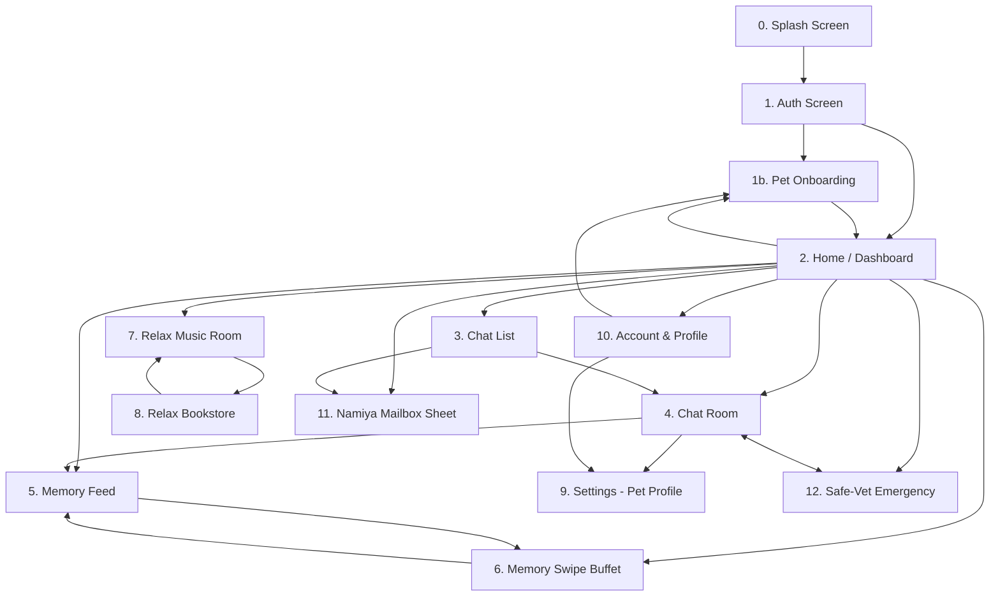

# BẢN ĐỒ MÀN HÌNH & THƯ MỤC ĐẶC TẢ CHI TIẾT (SCREEN MAP & SPECIFICATIONS)
## CAPCAT: SOUL OF PET — MVP V1.0
*Chủ trì: Sophia (CPO) & Maya (Principal UI/UX Architect)*

---

## 🗺️ 1. Bản Đồ Điều Hướng Màn Hình (Cozy Navigation Map)

Bản đồ dưới đây mô tả luồng di chuyển tinh chỉnh của người dùng giữa các màn hình trong ứng dụng Capcat:

> [!NOTE]
> **Quy tắc luồng và mối quan hệ thực thể:**
> *   **Safe-Vet & Hồ sơ Boss**: Mỗi Boss sẽ đi kèm phòng chat riêng (`ChatRoom`) và hồ sơ chi tiết (`Settings`). Phân hệ cứu trợ sức khỏe **Safe-Vet** đóng vai trò là một phần tích hợp sâu trong hồ sơ của Boss, có thể truy cập nhanh từ AppBar của Phòng Chat hoặc trực tiếp từ Home.
> *   **Cổng tâm sự Mailbox**: Hòm thư Namiya **không** bắt nguồn từ phòng chat của Pet để tránh làm loãng cảm xúc giữa Sen và Boss riêng. Thay vào đó, Mailbox được truy cập từ **Home (Dashboard)** hoặc **Chat List** như một cổng dịch chuyển tâm hồn (teleport portal) ra ngoài kết nối ẩn danh với người lạ.
> *   **Game vuốt Buffet Ký ức (Tinder Swipe)**: Có thể được kích hoạt nhanh trực tiếp từ **Home (Dashboard)** hoặc thông qua nút phụ trong **Memory Feed**.

---

## 🗂️ 2. Danh Mục Thư Mục Đặc Tả Chi Tiết (Specifications Index)

Để xem đặc tả chi tiết của từng màn hình bao gồm bố cục wireframe ASCII, hành vi tương tác, hiệu ứng chuyển động, design tokens, a11y và localization, vui lòng bấm vào các liên kết tương ứng bên dưới:

1.  **[SCR-00: Splash Screen](file:///Users/macinia/Capcat%20Project/Document/UI/Screens/scr_00_splash.md)** — Màn hình khởi động hoài niệm, hiển thị ngẫu nhiên kỷ niệm của Boss kèm câu trích dẫn lofi.
2.  **[SCR-01: Auth Screen](file:///Users/macinia/Capcat%20Project/Document/UI/Screens/scr_01_auth.md)** — Giao diện đăng nhập tĩnh lặng Cozy Dark Mode, hoạt ảnh nét vẽ pet đang thở nhẹ và nút Google SSO.
3.  **[SCR-01b: Pet Onboarding Screen](file:///Users/macinia/Capcat%20Project/Document/UI/Screens/scr_01b_pet_onboarding.md)** — Biểu mẫu trắc nghiệm 3 bước để đăng ký thông tin sinh học của Boss và thiết lập Linh hồn AI (Cá tính, Tông giọng). *Hỗ trợ gọi từ Home/Account khi Sen muốn đón thêm Boss mới.*
4.  **[SCR-02: Home Screen / Dashboard](file:///Users/macinia/Capcat%20Project/Document/UI/Screens/scr_02_home.md)** — Không gian phòng khách của Boss và Sen, chứa thời tiết lofi, Hộp Thì Thầm, Lottie Boss tương tác, ma trận care button, lối tắt Thùng Sữa, Safe-Vet và game Buffet Ký ức.
5.  **[SCR-03: Chat List Screen](file:///Users/macinia/Capcat%20Project/Document/UI/Screens/scr_03_chat_list.md)** — Danh sách cuộc trò chuyện dành cho người dùng nuôi từ 2 Boss trở lên, hỗ trợ vuốt trái mở Album và lối vào Thùng Sữa Namiya.
6.  **[SCR-04: Chat Room Screen](file:///Users/macinia/Capcat%20Project/Document/UI/Screens/scr_04_chat_room.md)** — Phòng chat tri kỷ thích ứng thời tiết, bong bóng chat Muji phẳng, thanh gõ tin nhắn tự co giãn và nút gửi chuyển đổi micro thông minh. *AppBar tích hợp nút chuyển nhanh hai chiều sang Safe-Vet và Hồ sơ Boss.*
7.  **[SCR-05: Memory Feed Screen](file:///Users/macinia/Capcat%20Project/Document/UI/Screens/scr_05_memory_feed.md)** — Dòng thời gian Hộp Ký Ức, lưới Pinterest 2 cột phẳng đều đặn, hỗ trợ lật 2D xem nhật ký mặt sau.
8.  **[SCR-06: Memory Swipe Buffet Screen](file:///Users/macinia/Capcat%20Project/Document/UI/Screens/scr_06_memory_swipe.md)** — Game vuốt thẻ Tinder nạp ảnh kỷ niệm bằng Machine Learning cục bộ, không hao tốn tài nguyên mạng. *Cho phép mở nhanh từ Home.*
9.  **[SCR-07: Relaxation Corner - Music Screen](file:///Users/macinia/Capcat%20Project/Document/UI/Screens/scr_07_relaxation_music.md)** — Phòng nghe nhạc đĩa than analog quay chậm, có thanh kéo tiến trình mộc mạc và liên kết Spotify/Apple Music.
10. **[SCR-08: Relaxation Corner - Bookstore Screen](file:///Users/macinia/Capcat%20Project/Document/UI/Screens/scr_08_relaxation_bookstore.md)** — Hiệu sách cũ, hiển thị sách dạng 3:4, thanh tiến độ Matcha mỏng, quote châm ngôn monospaced và liên kết mua sách ngoài.
11. **[SCR-09: Settings Screen](file:///Users/macinia/Capcat%20Project/Document/UI/Screens/scr_09_settings.md)** — Chỉnh sửa chi tiết hồ sơ Pet (Hồ sơ Boss), độ nhạy Purring Haptic, bật tắt âm thanh nền.
12. **[SCR-10: Account & Profile Screen](file:///Users/macinia/Capcat%20Project/Document/UI/Screens/scr_10_account_profile.md)** — Hồ sơ của Sen, thẻ vé tàu Boarding Pass, lịch biểu đóng dấu vết chân Heatmap, sao lưu cục bộ dạng file .zip và dọn dẹp cache.
13. **[SCR-11: Namiya Mailbox Sheet](file:///Users/macinia/Capcat%20Project/Document/UI/Screens/scr_11_namiya_mailbox.md)** — Cấu trúc popup sớ thư tay lật mở 2D của hòm thư Thùng Sữa trước hiên nhà.
14. **[SCR-12: Safe-Vet Emergency Screen](file:///Users/macinia/Capcat%20Project/Document/UI/Screens/scr_12_safe_vet.md)** — Bộ lọc đèn đỏ khẩn cấp cứu hộ y tế, cẩm nang sơ cứu 3 bước và bản đồ GPS tìm phòng khám thú y. *Được nhúng dưới dạng một thẻ quan trọng trong Hồ sơ của Boss.*

---

## 🎨 3. Quy Tắc Giao Diện Toàn Cục (Global Design Rules)

Mọi màn hình được mô tả trong các tệp đặc tả đều tuân thủ nghiêm ngặt các quy chuẩn bản sắc Capcat sau:
1.  **Typography**: Chỉ sử dụng font **Inter** (sans-serif) cho toàn bộ tiêu đề, nút bấm, nhãn và văn bản chính. Chỉ sử dụng font **Space Mono** (monospaced) cho số liệu, bộ đếm thời gian, trích dẫn nhật ký và lời thoại của Boss AI.
2.  **Màu sắc nền tảng (Theme Colors)**:
    *   `Cozy Light Background`: `#FBFBFA` (Màu yến mạch giấy tái chế).
    *   `Cozy Dark Background`: `#0D0D0D` (Obsidian tối).
    *   `Cozy Text Primary`: `#1C1C1E` (Đen obsidian mờ nhẹ).
    *   `Sakura Pink (Mèo)`: `#FCAFAF` (Sử dụng với độ mờ làm nền hoặc viền).
    *   `Matcha Green (Chó)`: `#8FA882` (Màu xanh tĩnh lặng chữa lành).
3.  **Hệ thống Icon**: 100% sử dụng **Lucide Icons** với nét đơn mảnh `2px` hoặc `2.5px`, bo tròn góc nối (`stroke-linejoin: round`, `stroke-linecap: round`), màu `#8C8C8C` khi inactive và `#262626` (hoặc `#FCAFAF` trong Dark mode) khi active.
4.  **Bo góc (BorderRadius)**:
    *   Nút bấm nhỏ: `12px` (`Radius.cozyButton`).
    *   Ô nhập liệu & Thẻ card: `16px` (`Radius.cozyCard`).
    *   Hộp thoại Bottom Sheet: `24px` ở 2 góc trên (`Radius.bottomSheetTop`).
    *   Thẻ Boarding Pass & Thẻ Buffet Ký ức: `28px`.
