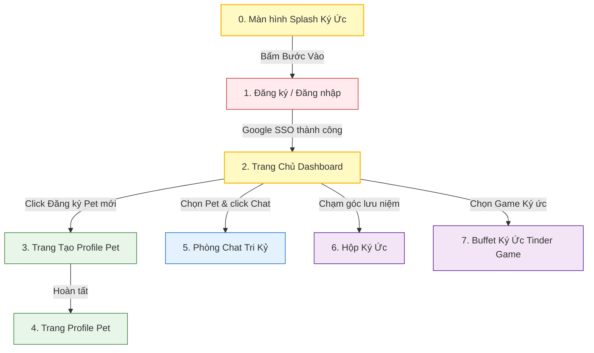

# BẢN ĐỒ WIREFRAME TỔNG THỂ: CAPCAT COZY LAYOUTS
*(DANH MỤC THIẾT KẾ BỐ CỤC KHÔNG GIAN CHO MỌI PHÂN HỆ CAPCAT)*

---

> [!TIP]
> Các Wireframe dưới đây được phác thảo bằng mã giả ASCII trực quan hóa cấu trúc giao diện điện thoại. Mọi tỷ lệ, bo góc (BorderRadius) và hiệu ứng kính mờ (Glassmorphism) đều tuân thủ chặt chẽ theo đặc tả bản sắc [08_DESIGN_SYSTEM_FOUNDATION.md](file:///Users/macinia/Capcat%20Project/Document/08_DESIGN_SYSTEM_FOUNDATION.md).

---

## 🗺️ Bản Đồ Điều Hướng Luồng Giao Diện (Screen Flow Map)



---

## 🔐 1. Giao Diện Đăng Ký / Đăng Nhập (Auth & Onboarding Screen)

*   **Không gian mỹ thuật:** Nền tối vô cực (`#0D0D0D`). Phía trên hiển thị hoạt ảnh mộc mạc nét phác thảo chì (Watercolor Chibi) một chú mèo ngủ cuộn tròn phát ra các nhịp rung nhẹ.
*   **Bố cục wireframe:**

```
+-------------------------------------------------------+
|  [ 22:00 ]                                     [ 90%] |
|                                                       |
|                                                       |
|                     ✨ CAPCAT ✨                      |
|                  ~ Soul of Pet ~                      |
|                                                       |
|                        /\_/\   * thở nhẹ *            |
|                       ( o.o )  zZZ                    |
|                        > ^ <                          |
|                                                       |
|                                                       |
|             "Căn phòng ấm áp của ký ức                |
|               đang đợi Sen trở về..."                 |
|                                                       |
|             +---------------------------+             |
|             |  G   Đăng nhập bằng Google |             | <-- Nút bo tròn 16px
|             +---------------------------+             |     Chiều cao: 56dp
|                                                       |
|                                                       |
|              * Chạm để bắt đầu chữa lành              |
|                                                       |
+-------------------------------------------------------+
```

*   **Ràng buộc Token Thiết kế:**
    *   **Font Tiêu đề:** `Playfair Display`, `size: 32`, `weight: Bold` (Dòng chữ CAPCAT).
    *   **Nút Google SSO:** Nền Milk Beige (`#F5F5F0`), chữ Deep Obsidian (`#1C1C1E`), `BorderRadius.circular(16.0)`.
    *   **Glow:** Phía sau chú mèo có dải màu chuyển nhẹ `Warm Amber Light` (`#FFF9C4` với độ mờ 8%).

---

## 🏠 2. Trang Chủ Dashboard (Cozy Living Room Screen)

*   **Không gian mỹ thuật:** Giả lập căn phòng gỗ Ghibli yên tĩnh. Ở trung tâm là chú Pet được dựng bằng hoạt ảnh Lottie chuyển động thở/ngoáy đuôi. Nhấn vào người Pet sẽ kích hoạt nhịp rung khò khò (`Purring Haptic`).
*   **Bố cục wireframe:**

```
+-------------------------------------------------------+
|  [ 22:00 ]                                     [ 90%] |
|  [🏠 Phòng gỗ]                             [⚙️ Cài đặt] | <-- Top bar kính mờ
|-------------------------------------------------------|
|                                                       |
|      +-----------------------------------------+      |
|      | "Sen đã về rồi đấy à... Trẫm đợi cơm    |      | <-- Whisper Box
|      |  cá mòi của Sen đến đói mốc meo rồi!"   |      |     (Độ bo góc 24px)
|      +-----------------------------------------+      |
|                                                       |
|                      /\_/\   <-- (Pet Carousel        |
|                     ( =^.^=)      Chibi Lottie)       |
|                     ( " ) ( " )_                      |
|                                                       |
|       [ Cho ăn ]    [ Đi dạo ]    [ Chải lông ]       | <-- Nút bấm bo tròn 16px
|                                                       |
|      +-----------------------------------------+      |
|      | ❤️ Thân mật: Tri kỷ thiết thân (99%)    |      | <-- Thanh chỉ số
|      +-----------------------------------------+      |
|                                                       |
|  ===================================================  | <-- Bottom Navigation
|  [ 🏠 Home ]        [ 💬 Chat ]        [ 🎴 Swipe ]  |     Kính mờ (sigma: 12)
+-------------------------------------------------------+
```

*   **Ràng buộc Token Thiết kế:**
    *   **Whisper Box:** Sử dụng `Soft Card Ivory` (`#FCFCF9`), độ mờ phủ nhẹ 95%, chữ `Deep Obsidian` sử dụng font `Playfair Display Italic` tạo cảm giác lời thoại tiểu thuyết trữ tình.
    *   **Nút tương tác phụ:** Bo góc `16px`, nền kính mờ `Colors.white.withOpacity(0.08)` với viền gradient mỏng.

---

## 📝 3. Trang Tạo Profile Pet (Pet Profile Creation Screen)

*   **Không gian mỹ thuật:** Thiết kế như một trang nhật ký cũ mở ra trên mặt bàn gỗ. Thể hiện các câu hỏi trắc nghiệm tâm lý thú vị do CPO Sophia đề xuất để định hình tính cách Pet.
*   **Bố cục wireframe:**

```
+-------------------------------------------------------+
|  [ 22:00 ]                                     [ 90%] |
|  [ Bỏ qua ]                             [ 02 / 03 Bước ] |
|-------------------------------------------------------|
|                                                       |
|               THẦN THÁI & NHÂN CÁCH AI                |
|                                                       |
|      +-----------------------------------------+      |
|      |  Nhân cách chủ đạo của Boss là gì?       |      |
|      |                                         |      |
|      |  [ ] Chảnh chọe (Mèo Quý tộc Hoàng gia) |      | <-- Khung trắc nghiệm
|      |  [x] Ngáo ngơ (Ngọc Hoàng thất sủng)    |      |     chọn một lựa chọn
|      |  [ ] Nịnh nọt (Chuyên viên gác đùi)     |      |
|      +-----------------------------------------+      |
|                                                       |
|      +-----------------------------------------+      |
|      |  Giống loài của Boss:                   |      |
|      |  [  Nhập giống chó / mèo...          🔍 ] |      | <-- Ô tìm kiếm bo 16px
|      +-----------------------------------------+      |
|                                                       |
|      +-----------------------------------------+      |
|      |  Cân nặng hiện tại:                     |      |
|      |  [  5.2                              kg ] |      | <-- Ô nhập số bo 16px
|      +-----------------------------------------+      |
|                                                       |
|                +-----------------------+              |
|                |        Kế tiếp        |              | <-- Nút hoàn tất lớn
|                +-----------------------+              |
+-------------------------------------------------------+
```

*   **Ràng buộc Token Thiết kế:**
    *   **Nền thẻ trắc nghiệm:** `Milk Beige` (`#F5F5F0`), độ bo góc lớn `26px`.
    *   **Input Fields:** `Colors.black.withOpacity(0.04)` tạo khoảng lõm xuống tinh tế trên bề mặt giấy Milk Beige. Font chữ số sử dụng `Outfit`.

---

## 👤 4. Trang Thông Tin Pet (Pet Profile Screen)

*   **Không gian mỹ thuật:** Trang Scrapbook (quyển sổ dán ảnh lưu niệm) chứa đựng toàn bộ các chỉ số sinh học động được hệ thống tính toán khoa học.
*   **Bố cục wireframe:**

```
+-------------------------------------------------------+
|  [ 22:00 ]                                     [ 90%] |
|  [ Trở về ]                             [ Sửa thông tin] |
|-------------------------------------------------------|
|                                                       |
|                         /\_/\                         |
|                        ( -.- ) <-- Bánh Mỳ            |
|                        / >🍑< \                       |
|                                                       |
|      +-----------------------------------------+      |
|      |  BÁNH MỲ - 3 tuổi (Mèo Anh Lông Ngắn)    |      | <-- Banner tên & giống
|      |  Cá tính động: Chảnh chọe & Ngáo ngơ    |      |
|      +-----------------------------------------+      |
|                                                       |
|      +--------------------+--------------------+      |
|      |  Cân nặng: 5.2 kg  |  Bên nhau: 102 ngày|      | <-- Lưới chỉ số sinh
|      |  (Khơi hơi béo ú)  |  (Cột mốc Tri Kỷ)  |      |     học (Bio-metrics Grid)
|      +--------------------+--------------------+      |
|      |  Tuổi người: 28t   |  Sinh nhật: 12 ngày|      |
|      |  (Độ tuổi đi làm)  |  (Đếm ngược thổi nến)|    |
|      +--------------------+--------------------+      |
|                                                       |
|      +-----------------------------------------+      |
|      | "Sở thích: Ăn vụng cá hộp của Sen và    |      | <-- Trích dẫn châm ngôn
|      |  ngủ đè lên bàn phím lúc Sen làm việc." |      |     đặc trưng của Boss
|      +-----------------------------------------+      |
|                                                       |
+-------------------------------------------------------+
```

*   **Ràng buộc Token Thiết kế:**
    *   **Lưới chỉ số sinh học:** Bo góc toàn lưới `24px`. Đường kẻ phân tách mảnh `1px` màu `#E0E0D8`.
    *   **Tuổi người quy đổi & Sinh nhật:** Sử dụng font số `Outfit` độ lớn `18sp` nổi bật.

---

## 💬 5. Phòng Chat Tri Kỷ (Cozy Real-time Chat Screen)

*   **Không gian mỹ thuật:** Giao diện nhắn tin riêng tư, ấm áp. Bong bóng thoại của Sen và Pet có màu sắc tương phản dịu nhẹ, bo góc tròn trĩnh dễ thương tuyệt đối.
*   **Bố cục wireframe:**

```
+-------------------------------------------------------+
|  [ 22:00 ]                                     [ 90%] |
|  [ 🏠 ]           💬 BÁNH MỲ (Đang ngủ khò)        [👤] | <-- Thanh header kính mờ
|-------------------------------------------------------|
|   [ 15:30 ]                                           |
|              +-----------------------------+          |
|              | Sen ơi, trẫm đói rồi!       |          | <-- Bong bóng thoại Pet
|              | Cơm cá mòi hôm nay đâu?     |          |     (Soft Ivory - bo 24px)
|              +-----------------------------+          |
|    +-----------------------------+                    |
|    | Đợi tí, đang gõ nốt mấy dòng|                    | <-- Bong bóng thoại Sen
|    | code rồi trẫm cho ăn nhé.   |                    |     (Pastel Peach - bo 24px)
|    +-----------------------------+                    |
|              +-----------------------------+          |
|              | Lại code... Suốt ngày gõ    |          | <-- Khịa chọc ghẹo động
|              | cạch cạch rồi bỏ bê trẫm!   |          |     (AI Roast)
|              +-----------------------------+          |
|                                                       |
|   +-----------------------------------------------+   |
|   | [📷] Nhập lời thì thầm với Boss...      [Gửi]  |   | <-- Thanh Input kính mờ
|   +-----------------------------------------------+   |
+-------------------------------------------------------+
```

*   **Ràng buộc Token Thiết kế:**
    *   **Bong bóng của Boss:** Nền `Soft Soft Ivory` (`#FCFCF9`), chữ màu `Deep Obsidian`, bo góc `24px` ngoại trừ góc dưới bên phải bo sát tạo chỉ hướng hội thoại.
    *   **Bong bóng của Sen:** Nền `Cat Pastel Peach` (`#FFD1BA`), chữ màu `Deep Obsidian`, bo góc `24px`.
    *   **Thanh Input Chat:** Thiết kế Glassmorphism bo tròn `16px` nổi lơ lửng trên màn hình chat.

---

## 📸 6. Hộp Ký Ức (Memory Box Album Screen)

*   **Không gian mỹ thuật:** Bố cục dạng lưới bất đối xứng (Pinterest Style) trưng bày các thẻ bài khoảnh khắc Polaroid lưu niệm chân thực của Boss.
*   **Bố cục wireframe:**

```
+-------------------------------------------------------+
|  [ 22:00 ]                                     [ 90%] |
|  [ 🏠 ]              📸 HỘP KÝ ỨC                  [➕] |
|-------------------------------------------------------|
|  [ Lọc: Tất cả ký ức v ]     [ Tìm kiếm khoảnh khắc ] |
|                                                       |
|  +---------------------+     +---------------------+  |
|  |  +---------------+  |     |  +---------------+  |  |
|  |  |  [ HÌNH ẢNH ]  |  |     |  |  [ HÌNH ẢNH ]  |  |  | <-- Thẻ ảnh Polaroid
|  |  +---------------+  |     |  +---------------+  |  |     (Bo góc 24px)
|  |  "Boss ngã chổng    |     |  "Mặt dìm ngái ngủ" |  |
|  |   vó ở sân vườn"    |     |  📅 25/05/2026      |  |
|  |  📅 26/05/2026      |     |  🏷️ #DìmHàng        |  |
|  +---------------------+     +---------------------+  |
|  +---------------------+     +---------------------+  |
|  |  +---------------+  |     |  +---------------+  |  |
|  |  |  [ HÌNH ẢNH ]  |  |     |  |  [ HÌNH ẢNH ]  |  |  |
|  |  +---------------+  |     |  +---------------+  |  |
|  |  "Ngủ trên bàn phím"|     |  "Ăn vụng cá mòi"   |  |
|  |  📅 24/05/2026      |     |  📅 22/05/2026      |  |
|  +---------------------+     +---------------------+  |
+-------------------------------------------------------+
```

*   **Ràng buộc Token Thiết kế:**
    *   **Thẻ Polaroid:** Nền `Milk Beige` (`#F5F5F0`), độ bo góc `24px`, đổ bóng mờ tán xạ `Cozy Shadows` xung quanh các cạnh để tạo cảm giác các tấm ảnh giấy thủ công đặt nổi nhẹ trên nền gỗ.

---

## 🎴 7. Buffet Ký Ức (Memory Tinder Swipe Screen)

*   **Không gian mỹ thuật:** Các thẻ bài ký ức xếp chồng đa lớp (Layered Card Stack) lệch góc nhẹ (`-2°` và `+2°`). Người dùng thực hiện vuốt (Swipe) 5 giây cực nhanh để phân loại lưu trữ offline.
*   **Bố cục wireframe:**

```
+-------------------------------------------------------+
|  [ 22:00 ]                                     [ 90%] |
|  [ 🏠 ]             🎴 BUFFET KÝ ỨC                [📊] |
|-------------------------------------------------------|
|                                                       |
|             +---------------------------+             |
|             |   /\_/\                   |             | <-- Thẻ bài phía sau
|         +---|  ( =.= )                  |---+         |     (Góc xoay +2 độ)
|         |   +---------------------------+   |         |
|         |   |                           |   |         | <-- Thẻ bài chính phía trước
|         |   |        [ BỨC ẢNH ]        |   |         |     (Độ bo góc 28px)
|         |   |        [ DÌM HÀNG ]       |   |         |
|         |   |                           |   |         |
|         |   +---------------------------+   |         |
|         |   | "Khoảnh khắc ngáo ngơ     |   |         |
|         |   |  lúc ăn vụng cá mòi hộp"   |   |         |
|         |   +---------------------------+   |         |
|         +-----------------------------------+         |
|                                                       |
|             [ ❌ Bỏ qua ]          [ ❤️ Lưu trữ ]     | <-- Nút hành động tròn 16px
|                                                       |
|      <- Vuốt Trái: Xóa bỏ       Vuốt Phải: Lưu lại ->  |
+-------------------------------------------------------+
```

*   **Ràng buộc Token Thiết kế:**
    *   **Thẻ bài chính (Top Card):** Cấu hình `BorderRadius.circular(28.0)`, bề mặt `Milk Beige` cực mịn màng, viền trong tinh tế `#EAEAEA`.
    *   **Phản hồi xúc giác:** Gạt sang phải kích hoạt nhịp rung giật nhẹ `Light Impact Haptic` đơn lập báo hiệu lưu trữ thành công.

---

## 📸 8. Màn Hình Khởi Động "Mỗi Ngày Một Món Quà Ký Ức" (Cozy Personal Splash Screen)

*   **Không gian mỹ thuật:** Nền sáng ấm sữa tinh khiết (`#FFFFFF`). Ở trung tâm là một khung thẻ ảnh Polaroid lớn bo góc cực mượt (`28px`) hiển thị ngẫu nhiên một bức ảnh dìm hàng lịch sử của chính Boss cưng được vẽ bằng nét vẽ tay màu nước chibi. Phía dưới là lời thoại thì thầm ấm áp, trêu ghẹo của Boss để mang lại tiếng cười cho Sen ngay giây đầu tiên. Ở dưới cùng là nút bấm đen sâu nổi bật để vào app.
*   **Tham chiếu Thiết kế Trực quan (Mỹ thuật bởi Maya):**
    
*   **Bối cảnh Wireframe:**

```
+-------------------------------------------------------+
|  [ 22:00 ]                                     [ 90%] |
|                                                       |
|      +-----------------------------------------+      |
|      |                                         |      |
|      |  +-----------------------------------+  |      |
|      |  |                                   |  |      |
|      |  |            [ HÌNH ẢNH ]           |  |      | <-- Khung Polaroid
|      |  |             [ DÌM HÀNG ]          |  |      |     (Độ bo góc 28px)
|      |  |                                   |  |      |     Nền Pure White
|      |  +-----------------------------------+  |      |
|      |                                         |      |
|      |          Sen về rồi đó à?               |      | <-- Tên/Câu chào serif
|      |    Hôm nay trẫm đợi Sen hơi             |      |
|      |          lâu đấy nhé!                   |      |
|      |                                         |      |
|      +-----------------------------------------+      |
|                                                       |
|                                                       |
|                +-----------------------+              |
|                |       Bước vào        |              | <-- Nút bấm chính
|                +-----------------------+              |     Charcoal Black (#121212)
|                                                       |
+-------------------------------------------------------+
```

*   **Ràng buộc Token Thiết kế:**
    *   **Nền Splash:** `Pure White` (`#FFFFFF`).
    *   **Thẻ Polaroid:** `Pure White` (`#FFFFFF`), bo góc `28px`, border mảnh `1px` màu `#EAEAEA`, đổ bóng tán xạ mờ `rgba(28,28,30, 0.03)`.
    *   **Câu nói của Pet:** Sắc chữ `Deep Obsidian` (`#1C1C1E`), font `Playfair Display Italic` (`whisperItalic` ở kích cỡ `16sp`).
    *   **Nút bấm "Bước vào":** Nền `Charcoal Black` (`#121212`), chữ `Pure White` (`#FFFFFF`) dùng font `Quicksand Bold`.

