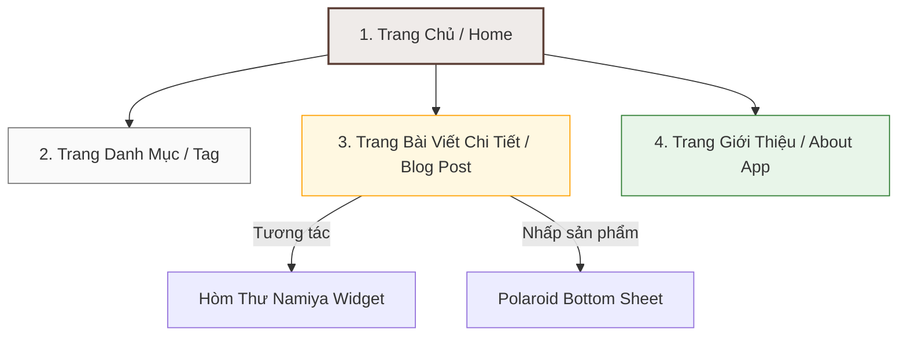
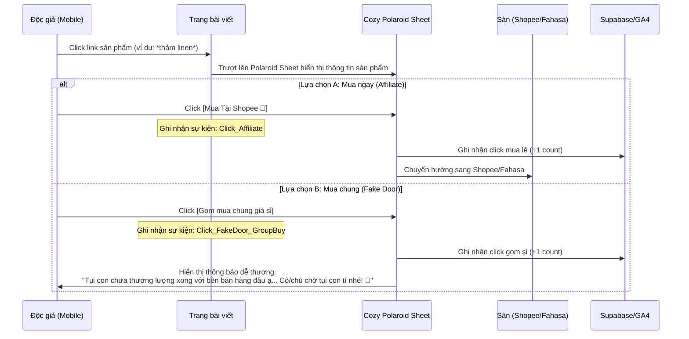
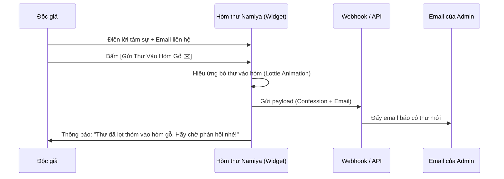

# 🧭 KIẾN TRÚC TRANG WEB & LAYOUT CHI TIẾT (WEBSITE STRUCTURE)
*(DOCA Affiliate & Validation Web MVP - Sitemap & Wireframe specs)*

> **Mã Tài Liệu:** `PRD-WEBSITE-STRUCTURE`  
> **Phiên bản:** `V1.0 (MVP)`  
> **Chủ trì:** Sophia (CPO / PM)  
> **Mục tiêu:** Mô tả sơ đồ cấu trúc trang web, luồng đi của người dùng và phác thảo giao diện (wireframe) tối giản nhất phục vụ cho việc validation.

---

## 🗺️ 1. Sơ Đồ Trang Web Tối Giản (Sitemap MVP)

Do chúng ta cắt bỏ hoàn toàn phần Backend CMS tự code và hệ thống đăng nhập, cấu trúc sitemap sẽ cực kỳ tinh gọn với chỉ 3 mẫu trang chính:



1.  **Trang Chủ (Home):** Nơi định vị thương hiệu, hiển thị hòm thư Namiya, kệ sách/đồ chữa lành tuyển chọn và danh sách các bài viết mới nhất.
2.  **Trang Bài Viết Chi Tiết (Blog Post):** Nơi độc giả đọc nội dung, nhấp vào các link affiliate ngữ cảnh hoặc link mua sắm.
3.  **Trang Giới Thiệu (About DOCA):** Trang đích giới thiệu về dự án ứng dụng di động DOCA, các tính năng tương lai và phễu đăng ký nhận slot Beta (Waitlist).

---

## 📐 2. Phác Thảo Giao Diện Gợi Ý (Wireframe Mockup)

Mọi thành phần UI được thiết kế theo phong cách **MUJI tối giản** và **Glassmorphism**, sử dụng các tông màu ấm đất `#F5F2EB` (Warm Earthy), xanh rêu cổ điển, gỗ trầm và trắng sữa để tạo cảm xúc yên bình.

### 🏡 2.1. Layout Trang Chủ (Home Page Layout)
Trang chủ được bố trí theo chiều dọc, dẫn dắt cảm xúc từ chào đón đến hành động:

```
┌────────────────────────────────────────────────────────┐
│  [Logo DOCA 🐾]                      [About App] [Menu]│
├────────────────────────────────────────────────────────┤
│                                                        │
│                  GÓC NHỎ BÌNH YÊN                      │
│        Nơi cùng thú cưng sống chậm mỗi ngày            │
│                                                        │
│            [ Nhập email của bạn... ] [Theo dõi Boss 🐾] │
│                                                        │
├────────────────────────────────────────────────────────┤
│  📚 KỆ ĐỒ CHỮA LÀNH TUYỂN CHỌN (Curated Shelf)         │
│  ┌───────────────┐ ┌───────────────┐ ┌───────────────┐ │
│  │ Thức Ăn Mèo   │ │ Sách Chữa Lành│ │ Phụ Kiện Nhà  │ │
│  │ [Shopee]      │ │ [Fahasa]      │ │ [Shopee]      │ │
│  └───────────────┘ └───────────────┘ └───────────────┘ │
├────────────────────────────────────────────────────────┤
│  📮 HÒM THƯ GỖ NAMIYA (Gỡ Rối Tơ Lòng)                 │
│  "Nếu có những nỗi buồn không thể nói cùng ai, hãy    │
│   để lại thư cho Boss..."                              │
│  ┌──────────────────────────────────────────────────┐  │
│  │ [Nhập lời tâm sự của bạn tại đây...]             │  │
│  │                                                  │  │
│  │ Email nhận thư phản hồi: [                     ] │  │
│  │                   [ Gửi Thư Vào Hòm Gỗ ✉️ ]       │  │
│  └──────────────────────────────────────────────────┘  │
├────────────────────────────────────────────────────────┤
│  🐾 NHẬT KÝ LỐI SỐNG (Bài viết mới nhất)              │
│  - Mèo mù chữ và những tràng cười Dopamine             │
│  - Setup góc phòng chuẩn Ghibli cùng Boss              │
│  - Trăng đêm nay thật đẹp: Routine ngắm trăng          │
└────────────────────────────────────────────────────────┘
```

### 📄 2.2. Layout Trang Bài Viết Chi Tiết (Blog Post Layout)
Trang đọc bài được thiết kế thoáng, tập trung hoàn toàn vào trải nghiệm đọc không bị phân tâm:

```
┌────────────────────────────────────────────────────────┐
│  [🐾 Back to Home]                                      │
├────────────────────────────────────────────────────────┤
│  Danh mục: Lối Sống Chữa Lành                           │
│  <h1>Setup góc phòng chuẩn Ghibli cùng Boss</h1>       │
│  Ngày đăng: 24/06/2026 - Thời gian đọc: 3 phút          │
├────────────────────────────────────────────────────────┤
│  [Hình ảnh màu nước góc phòng ấm áp ngập tràn ánh nắng] │
│                                                        │
│  Nuôi thú cưng không chỉ là cho ăn, đó là việc chia sẻ │
│  không gian sống cùng nhau. Một góc phòng nhỏ kê cạnh  │
│  cửa sổ, rải một vài chiếc *thảm linen ủi phẳng*...    │
│  (Nhấp vào cụm từ để xem link mua sắm Shopee)          │
│                                                        │
│  Để tạo điểm nhấn, một chiếc *đèn ngủ Ghibli gỗ* ấm... │
│                                                        │
│  > "Nhà là nơi bé cưng đợi cô/chú về..."                     │
├────────────────────────────────────────────────────────┤
│  🎁 Gợi ý từ Boss:                                     │
│  ┌──────────────────────────────────────────────────┐  │
│  │  [Ảnh Polaroid]  Đèn ngủ Ghibli Thần Rừng Totoro │  │
│  │  Quote: "Giữ ấm căn phòng đêm lạnh..."           │  │
│  │  [ Mua Tại Shopee 🐾 ]  [ Gom mua chung giá sỉ ]  │  │
│  └──────────────────────────────────────────────────┘  │
├────────────────────────────────────────────────────────┤
│  [ Nhập email của bạn... ] [Nhận Ebook Chữa Lành 📖]    │
└────────────────────────────────────────────────────────┘
```

---

## 🔄 3. Các Luồng Tương Tác Cốt Lõi (Core User Flows)

### 3.1. Luồng Mua Sắm Affiliate & Fake Door Testing

Luồng này kiểm chứng ý định mua sắm của khách hàng:



### 3.2. Luồng Gửi Thư Namiya Mailbox

Luồng này kiểm chứng độ tin cậy và sẵn sàng tương tác sâu của khách hàng:



---

## 🛠️ 4. Định Nghĩa Yêu Cầu Kỹ Thuật UI (UI Specifications)

1.  **Hiệu ứng Tap Effect:** Mọi nút bấm tương tác (gửi thư, nhấp sản phẩm) bắt buộc phải có hiệu ứng phản hồi xúc giác nhẹ (Scale down 0.95 khi chạm) để mô phỏng tương tác trên thiết bị di động.
2.  **Aesthetic Fonts:**
    *   *Tiêu đề lớn:* Ưu tiên sử dụng Serif Font như **Playfair Display** hoặc **Merriweather** để tạo cảm giác ấm cúng, hoài cổ.
    *   *Nội dung (Body text):* Dùng Sans-serif Font sạch sẽ như **Inter** hoặc **Quicksand** để đọc lâu không mỏi mắt.
3.  **Polaroid Bottom Sheet Style:**
    *   Bo góc mượt mà (Border Radius: `24px`).
    *   Nền mờ Glassmorphism (`backdrop-filter: blur(10px)` kết hợp với màu nền bán trong suốt trắng ngà).
    *   Góc ảnh Polaroid nghiêng nhẹ `2-3 độ` tạo cảm giác thủ công tự nhiên.

---

> [!TIP]
> **Sophia (CPO) gợi ý:**
> Tài liệu cấu trúc trang web đã hoàn thành. Bước tiếp theo, chúng ta nên biên soạn tài liệu **`03_CONTENT_PLAN.md`** để lên danh sách **3-5 bài viết mẫu** đầu tiên cho 3 cột trụ nội dung cùng các từ khóa SEO ngách và sản phẩm affiliate tương ứng. Bạn có muốn đi tiếp vào kế hoạch nội dung ngay không?
