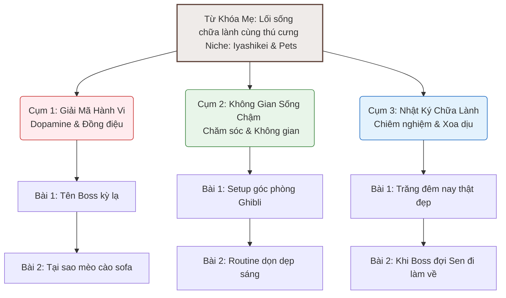

# 📝 KẾ HOẠCH NỘI DUNG & SEO THỬ NGHIỆM (CONTENT & SEO PLAN)
*(DOCA Affiliate & Validation Web MVP - Content Strategy & SEO Cluster Map)*

> **Mã Tài Liệu:** `PRD-WEBSITE-CONTENT-PLAN`  
> **Phiên bản:** `V1.0 (MVP)`  
> **Chủ trì:** Sophia (CPO / PM)  
> **Mục tiêu:** Thiết lập kế hoạch biên soạn nội dung chuẩn SEO cho website thử nghiệm, ánh xạ trực tiếp các sản phẩm affiliate tương ứng và định hướng từ khóa ngách.

---

## 🏛️ 1. Bản Đồ Cụm Chủ Đề (Topic Cluster Map)

Mọi bài viết trên Website sẽ tập trung vào từ khóa cốt lõi: **"Lối sống chữa lành cùng thú cưng"** (Iyashikei & Pets). Từ đó phân rã thành 3 cụm bài viết tương ứng với 3 cột trụ cảm xúc của DOCA:

---

## ✍️ 2. Dàn Ý 3 Bài Viết Mẫu Đầu Tiên (First 3 Pilot Articles)

Để website sẵn sàng chạy thử nghiệm (đạt Định nghĩa Hoàn thành - DoD), chúng ta cần viết 3 bài viết nền tảng đại diện cho từng cột trụ dưới đây:

### 🐾 Bài viết 1: "Mèo mù chữ" và những tràng cười chữa lành mỗi ngày
*   **Cột trụ:** Giải mã hành vi & Đồng điệu cảm xúc (SimSimi Style - Dopamine Hài Hước).
*   **Mục tiêu SEO:** Đánh vào từ khóa tò mò về hành vi của mèo, chia sẻ câu chuyện dễ lan tỏa (viral).
*   **Dàn ý tóm tắt:**
    *   **Mở bài:** Kể câu chuyện hài hước về chú mèo "mù chữ" (không biết kêu meo meo chuẩn vì xa mẹ sớm, chỉ phát ra âm thanh kỳ lạ).
    *   **Thân bài:** 
        *   Giải thích khoa học tại sao mèo có những tiếng kêu kỳ lạ (ngôn ngữ cơ thể của chúng).
        *   Nhận diện cá tính độc bản của pet (liên kết khéo léo đến ý tưởng tính năng **PetTwin** trên app).
    *   **Kết bài & Gợi ý sản phẩm (Affiliate):**
        *   Giới thiệu cuốn sách tâm lý học thú cưng để Sen hiểu Boss hơn.
        *   *Sản phẩm Affiliate (Fahasa):* Sách *"Hiểu Người Bạn Mèo"* hoặc *"Ngôn ngữ của Thú cưng"*.
        *   *Sản phẩm Affiliate (Shopee):* Hạt dinh dưỡng cao cấp giúp mèo mượt lông, khỏe mạnh.

### 🏡 Bài viết 2: Bí quyết Setup góc nhỏ làm việc chuẩn Ghibli cùng chú mèo của bạn
*   **Cột trụ:** Không gian sống chậm & Trải nghiệm chung (Tamagotchi Style - Thiết kế lối sống).
*   **Mục tiêu SEO:** Từ khóa "setup góc phòng nuôi mèo", "decor phòng ngủ tối giản MUJI".
*   **Dàn ý tóm tắt:**
    *   **Mở bài:** Sự bừa bộn và mùi rụng lông khi nuôi pet khiến góc làm việc trở nên căng thẳng. Làm sao để cải tạo nó thành góc nhỏ yên tĩnh chuẩn phong cách hoạt hình Ghibli?
    *   **Thân bài:** 
        *   **Bước 1:** Tối giản hóa đồ đạc. Chọn thảm linen/vải sợi tự nhiên để hạn chế tĩnh điện hút lông mèo.
        *   **Bước 2:** Bố trí ánh sáng vàng ấm áp để xoa dịu thần kinh của cả người và thú cưng.
        *   **Bước 3:** Bố trí một chiếc đệm nằm nhỏ ngay cạnh bàn làm việc để Boss nằm cạnh mà không phá phím.
    *   **Kết bài & Gợi ý sản phẩm (Affiliate):**
        *   *Sản phẩm Affiliate (Shopee):* Thảm Linen lót sàn tối giản MUJI, Đèn ngủ gỗ Totoro ấm áp, Nến thơm organic mùi gỗ tự nhiên.
        *   *CTA Fake Door:* Nút bấm `[Gom mua chung thảm linen sỉ giá rẻ - tiết kiệm 30% 🐾]`.

### 🌌 Bài viết 3: Trăng đêm nay thật đẹp: Routine 15 phút chải lông chánh niệm xoa dịu ngày dài
*   **Cột trụ:** Nhật ký lối sống chữa lành (Iyashikei Style - Chiêm nghiệm thư giãn).
*   **Mục tiêu SEO:** Từ khóa "chăm sóc mèo chánh niệm", "routine buổi tối thư giãn", "vượt qua cô đơn đô thị".
*   **Dàn ý tóm tắt:**
    *   **Mở bài:** 8 giờ tối bước về căn phòng trọ lạnh lẽo ở thành phố lớn, thứ duy nhất ấm áp đón bạn là tiếng mèo thở khò khò. 
    *   **Thân bài:** 
        *   Tắt bớt đèn điện công nghiệp, bật một bản nhạc lofi mộc mạc không lời.
        *   Chuẩn bị chiếc lược chải lông. Chải nhẹ nhàng theo chiều lông của mèo. Việc quan sát từng sợi lông rụng và tiếng rừ rừ của mèo là một dạng chánh niệm (Mindfulness) giải phóng cortisol gây căng thẳng cực tốt.
        *   Ghi chép lại những bức ảnh dìm hàng hoặc khoảnh khắc này (gợi ý tính năng **DOCA Capsule** lưu trữ ký ức).
    *   **Kết bài & Gợi ý sản phẩm (Affiliate):**
        *   *Sản phẩm Affiliate (Shopee):* Lược chải lông mèo tạo bọt massage, Đĩa nhạc Lofi Healing.
        *   *Sản phẩm Affiliate (Fahasa):* Các cuốn tản văn chữa lành của Nhật Bản.

---

## 🎯 3. Bảng Ánh Xạ Từ Khóa & Sản Phẩm Affiliate (Affiliate Matrix)

Chúng ta cần liên kết chính xác từ khóa tìm kiếm của độc giả với sản phẩm mua sắm tương ứng để đo lường CTR:

| Cột trụ nội dung | Từ khóa SEO Ngách | Sản phẩm Affiliate mục tiêu | Sàn liên kết | Link loại |
| :--- | :--- | :--- | :--- | :--- |
| **Giải Mã Hành Vi** | *tâm lý mèo cưng*, *tại sao mèo kêu lạ*, *hạt dinh dưỡng cho mèo* | Sách tâm lý thú cưng, Hạt hữu cơ organic | Fahasa / Shopee | Gạch chân chấm mảnh |
| **Không Gian Sống Chậm** | *decor phòng chuẩn Ghibli*, *thảm linen lót sàn*, *đèn ngủ gỗ Totoro* | Thảm linen MUJI, Đèn ngủ gỗ Totoro, Nến thơm gỗ | Shopee | Polaroid Bottom Sheet |
| **Nhật Ký Chữa Lành** | *giải tỏa cô đơn đô thị*, *routine chải lông chánh niệm*, *nhạc lofi chữa lành* | Lược chải lông massage, Đĩa CD Lofi, Sách tản văn chữa lành | Shopee / Fahasa | Gạch chân chấm mảnh |

---

## ⚙️ 4. Quy Chuẩn Viết Bài (Cozy Writing Guidelines)

Để giữ vững tinh thần của thương hiệu DOCA, mọi bài viết phải tuân thủ các quy tắc biên soạn sau:
1.  **Xưng hô ấm áp:** Xưng hô thân mật tự nhiên (ví dụ: *Sen và Boss*, *Chúng mình*, *Góc nhỏ của Boss*). Tránh giọng điệu giật gân, giật tít câu view rẻ tiền.
2.  **Visual phong phú:** Mỗi bài viết bắt buộc phải có ít nhất 1 ảnh bìa phác họa màu nước phong cách Ghibli và 1-2 ảnh thực tế về thú cưng (dùng ảnh thật tự quay/chụp để tăng tính xác thực và tin tưởng).
3.  **Tích hợp link tự nhiên:** Tuyệt đối không viết bài theo kiểu "sale pitch" (chỉ chăm chăm bắt mua hàng). Chỉ giới thiệu sản phẩm khi nó thực sự giải quyết được bài toán tinh thần hoặc vật chất được nêu ra trong bài viết.

---

> [!TIP]
> **Sophia (CPO) lưu ý:**
> Kế hoạch nội dung đã sẵn sàng để triển khai viết bài mẫu. Tiếp theo, chúng ta nên xây dựng tài liệu **`04_TECH_STACK.md`** để đánh giá và chốt nền tảng xây dựng trang web (Astro vs Substack/Ghost) nhằm tối ưu tốc độ load, SEO và chuẩn bị sẵn cho việc triển khai code giao diện. Bạn muốn tiến hành thảo luận cấu trúc công nghệ luôn không?
