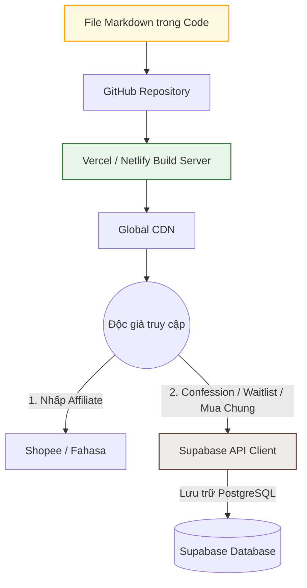

# 🛠️ LỰA CHỌN CÔNG NGHỆ DỰNG WEB (TECHNOLOGY STACK)
*(DOCA Affiliate & Validation Web MVP - Technical Evaluation & Architecture)*

> **Mã Tài Liệu:** `PRD-WEBSITE-TECH-STACK`  
> **Phiên bản:** `V1.0 (MVP)`  
> **Chủ trì:** Sophia (CPO / PM)  
> **Mục tiêu:** So sánh, đánh giá và lựa chọn giải pháp công nghệ tối ưu để dựng Web MVP nhanh nhất, tải nhanh nhất và chuẩn SEO nhất mà không phát sinh chi phí vận hành.

---

## 📊 1. So Sánh Các Giải Pháp Công Nghệ

Để dựng trang web validation này, chúng ta có 3 phương án chính:

| Tiêu chí | Phương án A: Substack / Medium | Phương án B: Ghost CMS | Phương án C: Astro (Static Site Generator) ⭐ |
| :--- | :--- | :--- | :--- |
| **Chi phí** | 0 USD (Miễn phí) | ~9 USD/tháng (Hosting) | **0 USD** (Deploy miễn phí trên Vercel/Netlify) |
| **Tự do tùy biến UI** | Rất thấp (Layout cố định) | Trung bình (Dùng theme có sẵn) | **Cực kỳ cao** (Tự do thiết kế chuẩn Ghibli/MUJI) |
| **Độ phức tạp lập trình**| Không cần lập trình (0 ngày) | Thấp (Cài đặt theme) | **Trung bình** (Agent có thể viết code HTML/Tailwind) |
| **Tốc độ tải trang** | Trung bình | Tốt | **Siêu nhanh (Bá chủ tốc độ - Zero JS mặc định)** |
| **SEO & Custom Tracking**| Hạn chế cài đặt event nâng cao | Tốt | **Hoàn hảo** (Tự do cài đặt GA4 Event Click, Fake Door) |
| **Tích hợp Polaroid Sheet**| Không thể làm được | Rất khó | **Dễ dàng** (Viết bằng vanilla JS/CSS) |

### ⭐ Đề xuất từ Sophia (CPO): Lựa chọn Phương án C - Astro (Static Site Generator)
*   **Lý do:** Astro cho phép chúng ta tùy biến 100% giao diện mộc mạc phong cách chữa lành và cài đặt các nút bấm **Fake Door (Mua chung)** hay **Polaroid Bottom Sheet** mà không gặp bất kỳ giới hạn nào.
*   **Sự phối hợp:** Toàn bộ mã nguồn web sẽ nằm trong thư mục dự án này, viết bài chỉ cần tạo file `.md` trong thư mục `src/content/`. Việc deploy lên Vercel/Netlify được tự động hóa 100% khi đẩy code lên Github.

---

## 🏗️ 2. Mô Hình Kiến Trúc Hệ Thống Tối Giản (System Architecture)

Kiến trúc tĩnh (JAMstack) giúp loại bỏ hoàn toàn cơ sở dữ liệu (database) và máy chủ (server) động để đảm bảo bảo mật và tốc độ tải trang tối đa:

---

## ⚙️ 3. Chi Tiết Thành Phần Công Nghệ (Tech Stack Details)

1.  **Core Framework:** **Astro** (phiên bản mới nhất).
    *   *Tại sao chọn:* Astro chỉ xuất bản HTML tĩnh xuống trình duyệt của người dùng, giúp trang web load tức thì trên điện thoại di động (Mobile Lighthouse Score gần 100 điểm).
2.  **Styling (CSS):** **Vanilla CSS** hoặc **TailwindCSS** (sử dụng các token màu gỗ, màu trắng ngà ấm áp được định nghĩa sẵn).
3.  **Tích hợp Form & Data Capture:**
    *   **Custom HTML Form in Astro** hoặc **Tally.so** (Dễ dàng custom giao diện tinh tế phong cách tối giản).
    *   **Supabase (PostgreSQL Backend as a Service)** ⭐: Thay thế cho Google Sheets. Lưu trữ trực tiếp Waitlist, Confession và Email Mua chung qua API client của Supabase được bảo mật bằng RLS (Row Level Security).
4.  **Đo lường (Analytics):**
    *   **Google Analytics 4 (GA4):** Cài đặt qua mã Script nhẹ để đếm traffic và bắt các sự kiện tương tác nâng cao (Click Affiliate, Click Fake Door).
5.  **Hosting & Deploy:**
    *   **Vercel** hoặc **Netlify** (Gói Starter miễn phí trọn đời, hỗ trợ trỏ tên miền riêng miễn phí, tự động cấp chứng chỉ bảo mật SSL HTTPS).

---

## 🏁 4. Định Nghĩa Hoàn Thành Kỹ Thuật (Tech DoD)

Mã nguồn trang web được coi là hoàn thành về mặt kỹ thuật khi:
*   [ ] Khởi tạo thành công thư mục mã nguồn Astro trong dự án.
*   [ ] Cấu hình thành công bộ theme màu đất ấm áp và font chữ Serif/Sans-serif chỉ định.
*   [ ] Đã lập trình thành công widget Hòm thư Namiya (kết nối với form Tally/Google Sheet).
*   [ ] Đã lập trình thành công Polaroid Bottom Sheet (với hiệu ứng trượt lên khi nhấp link affiliate).
*   [ ] Cài đặt mã đo lường sự kiện GA4 hoạt động tốt trên môi trường Local trước khi deploy.

---

> [!TIP]
> **Sophia (CPO) đề xuất:**
> Kế hoạch công nghệ đã rõ ràng. Bước tiếp theo, chúng ta nên biên soạn tài liệu **`05_CONVERSION_CTA.md`** để quy định chi tiết kịch bản tương tác chuyển đổi (khi nào xuất hiện popup, kịch bản thuyết phục người dùng để lại email nhận quà tặng tinh thần, nội dung thư cảm ơn). Bạn có muốn hoàn thành tài liệu cuối cùng này để khép kín bộ hồ sơ kế hoạch Web MVP không?
