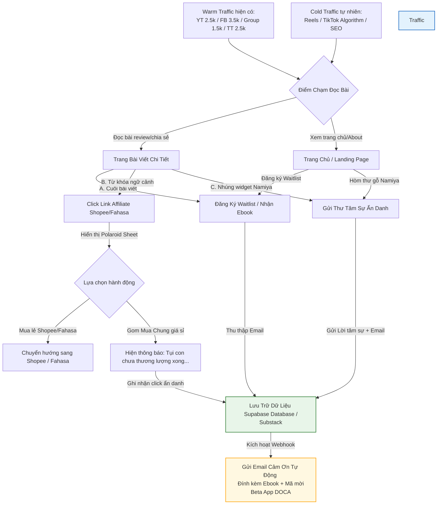

# 🎯 CHIẾN LƯỢC CHUYỂN ĐỔI & KỊCH BẢN TƯƠNG TÁC (CONVERSION & CTA STRATEGY)
*(DOCA Affiliate & Validation Web MVP - Lead Magnet & Funnel Copywriting)*

> **Mã Tài Liệu:** `PRD-WEBSITE-CONVERSION-CTA`  
> **Phiên bản:** `V1.0 (MVP)`  
> **Chủ trì:** Sophia (CPO / PM)  
> **Mục tiêu:** Định hình chi tiết kịch bản tương tác, phễu chuyển đổi email, thiết kế quà tặng dẫn dụ (Lead Magnet) và nội dung thư cảm ơn tự động nhằm đạt tỷ lệ chuyển đổi tối ưu nhất.

---

## 📈 1. Phễu Chuyển Đổi Chi Tiết (The Conversion Funnel)

Để tối đa hóa tỷ lệ thu thập Email Waitlist và nhấp link Affiliate từ traffic mạng xã hội tự nhiên (Social Reels/TikTok), hệ thống phễu sẽ vận hành như sau:



---

## 🎁 2. Quà Tặng Dẫn Dụ (Lead Magnet) - Ebook Chữa Lành

Để người dùng tự nguyện và vui vẻ để lại email mà không cảm thấy bị làm phiền, chúng ta sẽ thiết kế một món quà số đặc biệt:

*   **Tên quà tặng:** **"Nhật Ký Sống Chậm Cùng Boss: Cẩm nang 7 ngày nuôi dưỡng tâm hồn Sen & Pet"** (Định dạng PDF/Ebook tinh tế phong cách tối giản màu nước).
*   **Nội dung Ebook dự kiến:**
    *   *Ngày 1:* Setup góc nhỏ tĩnh lặng chuẩn Ghibli.
    *   *Ngày 2:* Routine chải lông chánh niệm xoa dịu lo âu đô thị.
    *   *Ngày 3:* Thực đơn 3 món lành mạnh tự tay nấu cho Boss.
    *   *Ngày 4:* Lắng nghe tiếng "Rừ rừ" - Tần số âm thanh chữa lành tự nhiên.
    *   ...
    *   *Lời kết:* Giới thiệu dự án **App di động DOCA** - Người bạn đồng hành số sắp ra mắt và tặng kèm 1 **Mã mời trải nghiệm sớm (Beta Invite Code)**.

---

## 💬 3. Kịch Bản & Copywriting Cho Các Điểm Chạm (Copy Specs)

### 3.1. Form Đăng Ký Newsletter / Ebook (Tại Trang Chủ & Cuối Bài Viết)
*   **Tiêu đề:** *"Đăng ký nhận Thư từ Boss"*
*   **Mô tả:** *"Mỗi tuần một bức thư nhỏ chứa đựng sự bình yên, đính kèm Cẩm nang 7 ngày chánh niệm cùng thú cưng và vé mời trải nghiệm sớm bản Beta ứng dụng di động DOCA."*
*   **Placeholder ô nhập:** `Nhập email của Sen tại đây nhé...`
*   **Chữ trên nút gửi:** `Nhận Quà Từ Boss 🐾`
*   **Thông báo thành công:** *"Boss đã nhận thư! Ebook chữa lành đang trên đường bay tới hòm thư của bạn đó. Sen nhớ kiểm tra cả hộp thư Spam/Quảng cáo nhé!"*

### 3.2. Form Hòm Thư Gỡ Rối Namiya
*   **Tiêu đề:** *"Hòm Thư Gỗ Namiya 📮"*
*   **Mô tả:** *"Nếu có những nỗi buồn chật chội hay những âu lo không thể gọi tên, hãy gửi thư cho Boss. Ông già Namiya và những chú mèo sẽ thay bạn giữ lại và gửi lời phản hồi xoa dịu qua email."*
*   **Placeholder ô tâm sự:** `Hôm nay Sen có điều gì phiền muộn muốn kể với Boss không?...`
*   **Placeholder ô email:** `Email để Boss gửi thư phản hồi...`
*   **Chữ trên nút gửi:** `Gửi Thư Vào Hòm Gỗ ✉️`
*   **Thông báo thành công:** *"Thư đã lọt thỏm vào hòm gỗ. Cảm ơn bạn đã tin tưởng chia sẻ tơ lòng. Boss sẽ phản hồi bạn sớm nhất qua email."*

### 3.3. Polaroid Bottom Sheet & Nút Fake Door Mua Chung
*   **Tiêu đề sản phẩm:** Đèn Ngủ Gỗ Totoro Thần Rừng
*   **Trích dẫn sản phẩm (Quote):** *"Giữ một đốm sáng vàng ấm áp trong đêm lạnh, để biết rằng góc phòng này luôn có một người đợi bạn trở về..."*
*   **Nút A (Mua ngay):** `Tìm sản phẩm trên Shopee 🐾`
*   **Nút B (Gom mua chung):** `Gom mua chung sỉ giá rẻ (Tiết kiệm 30%)`
*   **Kịch bản khi nhấp nút B:**
    *   Không yêu cầu nhập email (tối giản friction).
    *   Hiện ngay thông báo dễ thương dạng Toast hoặc Popup: *"Tính năng này đang được tụi con chuẩn bị, hoặc tụi con chưa thương lượng xong với cô chú bán hàng đâu ạ... Sen chờ tụi con tí nhé! 🐾"*
    *   Đồng thời ghi nhận sự kiện click vào database.

---

## ✉️ 4. Kịch Bản Email Gửi Tự Động (Auto-responder Email Template)

Khi người dùng đăng ký hoặc gửi thư thành công, một email tự động với tông giọng chữa lành mang đậm tính Iyashikei sẽ được gửi đi:

*   **Tiêu đề email:** `🐾 [DOCA] Boss gửi tặng Sen cuốn Cẩm nang sống chậm cùng nhau nè...`
*   **Nội dung thư:**
    ```text
    Chào Sen,

    Boss đã nhận được email đăng ký của Sen từ Góc Nhỏ DOCA rồi nhé. 
    Mỗi ngày bôn ba ngoài xã hội chắc Sen cũng mệt nhoài rồi đúng không? 

    Dưới đây là cuốn Ebook nhỏ "Nhật Ký Sống Chậm Cùng Boss" mà tụi mình đã biên soạn 
    bằng cả sự ấm áp, hy vọng nó sẽ mang lại cho Sen một chút bình yên nhẹ nhõm:

    🔗 [Tải Ebook Chữa Lành Tại Đây (PDF)]

    Ngoài ra, Boss cũng gửi kèm một Mã mời đặc biệt để Sen đăng ký trải nghiệm sớm 
    bản Beta của ứng dụng di động DOCA sắp ra mắt vào mùa thu này:

    🔑 MÃ MỜI BETA: DOCA-HEALING-SEN-2026

    Hẹn gặp lại Sen trong thế giới ấm áp của DOCA nhé!
    Thương Sen thật nhiều,

    -- Boss của Sen --
    (Thay mặt đội ngũ dự án DOCA)
    ```

---

> [!IMPORTANT]
> **Sophia (CPO) kết luận:**
> Bộ tài liệu chiến lược và đặc tả MVP cho Website Affiliate thử nghiệm đã hoàn thành 100%. Mọi ranh giới đỏ đã được dựng lên để ngăn chặn Scope Creep và định hình rõ từng điểm chạm tương tác.
> Bạn đã sẵn sàng để chuyển sang giai đoạn lựa chọn thư mục code và khởi tạo dự án trang web thực tế chưa? Hãy phản hồi để chúng ta cùng thực hiện nhé!
