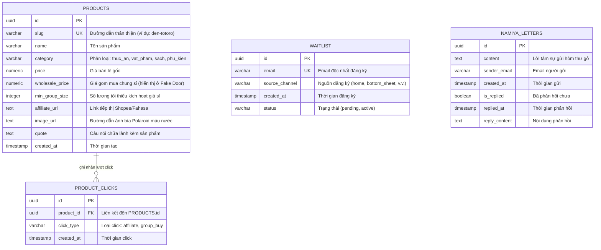

# 🏛️ THIẾT KẾ KIẾN TRÚC DATABASE TRÊN SUPABASE (DATABASE DESIGN)
*(DOCA Affiliate & Validation Web MVP - Technical Database Spec & ERD)*

> **Mã Tài Liệu:** `PRD-WEBSITE-DATABASE-DESIGN`  
> **Phiên bản:** `V1.3 (Sản phẩm Affiliate & Fake Door Click Log)`  
> **Chủ trì:** Alan (Tech Lead)  
> **Mục tiêu:** Thiết lập cấu trúc database trên Supabase. Bảng dữ liệu **Sản phẩm (products)** hiển thị link Affiliate. Lượt click quan tâm mua chung chỉ được ghi nhận dưới dạng **Click Log ẩn danh (product_clicks)** để đếm số liệu mà không yêu cầu email, giảm tối đa friction cho người dùng.

---

## ⚖️ 1. Tại Sao Sử Dụng Supabase Thay Vì Google Sheets?

Alan (Tech Lead) phê duyệt đề xuất chuyển đổi công nghệ sang **Supabase** với các lý do kỹ thuật sau:
1.  **Tính Nhất Quán & Khả Năng Tái Sử Dụng:** Dữ liệu người dùng đăng ký Waitlist và Confession sẽ được lưu giữ trên một hệ cơ sở dữ liệu PostgreSQL thực thụ. Khi App di động DOCA được phát triển, chúng ta có thể kết nối trực tiếp Flutter App với Supabase DB này mà không cần di chuyển dữ liệu (migration).
2.  **API Tự Động & Bảo Mật:** Supabase tự động sinh ra các endpoint REST API từ cấu trúc bảng. Kết hợp với **Row Level Security (RLS)**, chúng ta có thể cho phép client (trang web Astro) ghi dữ liệu (Insert) mà tuyệt đối không có quyền đọc (Select) dữ liệu của người khác, đảm bảo tính riêng tư hơn hẳn so với Google Sheets API.
3.  **Tốc Độ & Độ Tin Cậy:** Triệt tiêu sự phụ thuộc vào các công cụ trung gian (như Zapier, Make) vốn dễ bị ngắt kết nối hoặc trễ dữ liệu.

---

## 🗺️ 2. Sơ Đồ Thực Thể Mối Quan Hệ (Entity Relationship Diagram - ERD)

Bảng **PRODUCTS** chứa thông tin sản phẩm và link Affiliate. Bảng **PRODUCT_CLICKS** ghi nhận các lượt click ẩn danh vào link mua lẻ (affiliate) hoặc nút mua chung (group_buy) để đo lường nhu cầu thực tế:



---

## 💾 3. Định Nghĩa Cấu Trúc Bảng (SQL DDL Script)

Dưới đây là các mã lệnh SQL chạy trực tiếp trong Supabase SQL Editor để khởi tạo các bảng:

### 3.1. Bảng Sản Phẩm Affiliate (`products`)
Lưu trữ danh sách sản phẩm để hiển thị trên website kèm link Affiliate của Shopee/Fahasa.
```sql
CREATE TABLE public.products (
    id UUID DEFAULT gen_random_uuid() PRIMARY KEY,
    slug VARCHAR(100) NOT NULL UNIQUE,
    name VARCHAR(255) NOT NULL,
    category VARCHAR(100) NOT NULL, -- 'thuc_an', 'vat_pham', 'sach', 'phu_kien'
    price NUMERIC(12, 2) NOT NULL,
    wholesale_price NUMERIC(12, 2), -- Phục vụ hiển thị giá sỉ ở Fake Door
    min_group_size INT DEFAULT 10,
    affiliate_url TEXT NOT NULL,
    image_url TEXT,
    quote TEXT,
    created_at TIMESTAMP WITH TIME ZONE DEFAULT timezone('utc'::text, now()) NOT NULL
);

-- Tạo Index theo category và slug
CREATE INDEX idx_products_category ON public.products(category);
CREATE INDEX idx_products_slug ON public.products(slug);
```

### 3.2. Bảng Lưu Lượt Click Ẩn Danh (`product_clicks`)
Bảng này **chỉ ghi nhận sự quan tâm** của độc giả qua hành động click (bao gồm click link Affiliate mua lẻ và click nút Mua chung Fake Door) để tổng hợp báo cáo dạng số liệu click.
```sql
CREATE TABLE public.product_clicks (
    id UUID DEFAULT gen_random_uuid() PRIMARY KEY,
    product_id UUID NOT NULL REFERENCES public.products(id) ON DELETE CASCADE,
    click_type VARCHAR(50) NOT NULL, -- 'affiliate', 'group_buy'
    created_at TIMESTAMP WITH TIME ZONE DEFAULT timezone('utc'::text, now()) NOT NULL
);

-- Tạo Index để tối ưu hóa việc đếm và lọc theo sản phẩm hoặc loại click
CREATE INDEX idx_product_clicks_product_id ON public.product_clicks(product_id);
CREATE INDEX idx_product_clicks_type ON public.product_clicks(click_type);
```

### 3.3. Bảng Đăng Ký Waitlist (`waitlist`)
Lưu trữ thông tin độc giả đăng ký newsletter hoặc slot beta.
```sql
CREATE TABLE public.waitlist (
    id UUID DEFAULT gen_random_uuid() PRIMARY KEY,
    email VARCHAR(255) NOT NULL UNIQUE,
    source_channel VARCHAR(100) DEFAULT 'web_home',
    created_at TIMESTAMP WITH TIME ZONE DEFAULT timezone('utc'::text, now()) NOT NULL,
    status VARCHAR(50) DEFAULT 'pending'
);

-- Tạo Index tăng tốc độ truy vấn theo email
CREATE INDEX idx_waitlist_email ON public.waitlist(email);
```

### 3.4. Bảng Hòm Thư Namiya (`namiya_letters`)
Lưu trữ các lời confession ẩn danh hoặc kèm email liên hệ.
```sql
CREATE TABLE public.namiya_letters (
    id UUID DEFAULT gen_random_uuid() PRIMARY KEY,
    content TEXT NOT NULL,
    sender_email VARCHAR(255) NOT NULL,
    created_at TIMESTAMP WITH TIME ZONE DEFAULT timezone('utc'::text, now()) NOT NULL,
    is_replied BOOLEAN DEFAULT FALSE NOT NULL,
    replied_at TIMESTAMP WITH TIME ZONE,
    reply_content TEXT
);

-- Tạo Index theo dõi các thư chưa trả lời
CREATE INDEX idx_namiya_unreplied ON public.namiya_letters(is_replied) WHERE is_replied = FALSE;
```

---

## 🛡️ 4. Chính Sách Bảo Mật Row Level Security (RLS)

Để bảo vệ quyền riêng tư tuyệt đối của người dùng và cấu hình quyền đọc dữ liệu sản phẩm, các chính sách bảo mật sau phải được thực thi trên Supabase:

```sql
-- 1. Kích hoạt RLS cho tất cả các bảng
ALTER TABLE public.products ENABLE ROW LEVEL SECURITY;
ALTER TABLE public.waitlist ENABLE ROW LEVEL SECURITY;
ALTER TABLE public.namiya_letters ENABLE ROW LEVEL SECURITY;
ALTER TABLE public.product_clicks ENABLE ROW LEVEL SECURITY;

-- 2. Quyền đọc (Select) công khai cho bảng products (ai cũng có thể xem sản phẩm trên web)
CREATE POLICY "Allow public read access to products" 
ON public.products FOR SELECT TO anon USING (true);

-- 3. Quyền ghi (Insert) công khai qua API ẩn danh (anon key) cho các bảng giao dịch/waitlist/click log
CREATE POLICY "Allow public insert to waitlist" 
ON public.waitlist FOR INSERT TO anon WITH CHECK (true);

CREATE POLICY "Allow public insert to namiya_letters" 
ON public.namiya_letters FOR INSERT TO anon WITH CHECK (true);

CREATE POLICY "Allow public insert to product_clicks" 
ON public.product_clicks FOR INSERT TO anon WITH CHECK (true);

-- 4. Chỉ Admin (hoặc API Service Role) mới được chỉnh sửa sản phẩm hoặc đọc dữ liệu đăng ký/confession/click log
CREATE POLICY "Full access to service_role on products" 
ON public.products FOR ALL TO service_role USING (true) WITH CHECK (true);

CREATE POLICY "Restrict read/write access to service_role on waitlist" 
ON public.waitlist FOR ALL TO service_role USING (true) WITH CHECK (true);

CREATE POLICY "Restrict read/write access to service_role on namiya_letters" 
ON public.namiya_letters FOR ALL TO service_role USING (true) WITH CHECK (true);

CREATE POLICY "Restrict read/write access to service_role on product_clicks" 
ON public.product_clicks FOR ALL TO service_role USING (true) WITH CHECK (true);
```

---

## 🏁 5. Định Nghĩa Hoàn Thành Của Alan (Definition of Done - DoD)

Cơ sở dữ liệu trên Supabase được coi là hoàn thành khi:
*   [ ] Đã chạy thành công tập lệnh SQL tạo 4 bảng và thiết lập khóa ngoại liên kết trên Supabase Production.
*   [ ] Đã cấu hình chính sách RLS và kiểm thử chứng minh việc đọc dữ liệu từ các bảng `waitlist`, `namiya_letters`, `product_clicks` bị chặn đứng bởi `anon key` (chỉ bảng `products` mới được phép SELECT công khai).
*   [ ] Đã thực hiện ghi nhận click thử nghiệm thành công (Insert bản ghi `product_clicks` có liên kết `product_id` khóa ngoại từ client).
