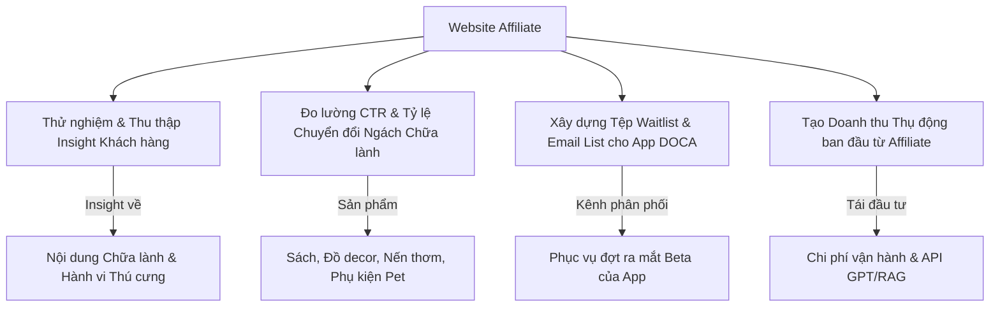

# 🌐 Website Affiliate Thử Nghiệm: Bước Đệm Cho App DOCA
*(DOCA Affiliate & Audience Validation Website - Version 1.0)*

Trước khi chính thức phát hành ứng dụng di động **DOCA** (với các tính năng cốt lõi như **PetTwin**, **Capsule** và **Tiệm tạp hóa Namiya**), chúng ta sẽ triển khai một **Website Affiliate** làm phễu thử nghiệm. 

Mục tiêu tối thượng của website này là **validation** (kiểm chứng mức độ quan tâm của tập khách hàng), thu thập insight thực tế, xây dựng tệp người dùng đăng ký trước (Waitlist/Newsletter), đồng thời tạo nguồn doanh thu thụ động ban đầu để tài trợ cho dự án.

---

## 🎯 1. Mục Tiêu Cốt Lõi (Core Objectives)

1. **Kiểm chứng và Thu thập Insight (Customer Validation & Research):**
   - Xem chủ đề nào thu hút lượng truy cập và tương tác cao nhất từ tệp khách hàng tiềm năng.
   - Thử nghiệm 3 cột trụ nội dung đã định vị tại [Chiến lược nội dung Social](file:///Users/macinia/Documents/MKT/Document/doca_content_strategy.md): *Giải mã hành vi*, *Không gian sống chậm*, và *Nhật ký chữa lành*.
2. **Đo lường Ý định Mua sắm (Commercial Intent Measurement):**
   - Đánh giá xem người dùng có sẵn sàng chi tiền cho các sản phẩm hỗ trợ lối sống Iyashikei và chăm sóc thú cưng hay không qua tỷ lệ click (CTR) vào link Affiliate.
3. **Xây dựng Tệp Người Dùng Đợi (Warm Audience & Email List Build):**
   - Đặt form đăng ký nhận Bản tin Chữa lành hàng tuần (Weekly Newsletter) hoặc nút nhận bản Beta sớm của app DOCA. Đây sẽ là tệp khách hàng trung thành đầu tiên khi app ra mắt.
4. **Doanh thu Thử nghiệm (Early Monetization):**
   - Tích hợp link tiếp thị liên kết (Affiliate Links) của Shopee, Lazada, Tiki hoặc Amazon đối với các sản phẩm như: sách chữa lành, đĩa nhạc Lofi, vật phẩm trang trí phong cách MUJI/Ghibli, phụ kiện chăm sóc thú cưng chất lượng cao.

---

## 📈 1.5. Nguồn Traffic Có Sẵn (Owned Traffic Channels)

Để tối đa hóa chuyển đổi cho Website MVP, chúng ta sẽ tận dụng triệt để tệp người theo dõi (Warm Audience) hiện có trên các kênh social:

*   **Facebook Page (3.5k followers):** Kênh phân phối chính các bài chia sẻ ngắn, hình ảnh đời thường của Boss và link trực tiếp đến blog.
*   **YouTube Channel (2.5k subscribers):** Kênh phân phối các video dài (Iyashikei Vlogs, Lofi Music, routine chăm Boss). Đặt link blog/affiliate tại phần mô tả và bình luận ghim.
*   **TikTok (2.5k followers):** Kênh phân phối Reels/Short video có tính lan tỏa cao để thu hút tệp khách hàng lạnh (Cold traffic) mới. Link bio dẫn về website.
*   **Facebook Group (1.5k members) ⭐:** Kênh cộng đồng có mức độ tin cậy và tương tác cao nhất. Đây là **mảnh đất vàng** để chạy thử nghiệm **Fake Door Mua Chung (Pre-order)** thông qua các bài post thảo luận sỉ, gom mua chung để deal giá rẻ với người bán.

---

## 📂 2. Cấu Trúc Thư Mục Tài Liệu (`Document/Website/`)

Để cùng nhau biên soạn tài liệu một cách khoa học, thư mục `Website/` sẽ được quy hoạch thành các file sau:

- **[README.md](file:///Users/macinia/Capcat%20Project/Document/Website/README.md) (Tổng quan phễu & traffic):** Định vị phễu thử nghiệm, nguồn traffic có sẵn và mục tiêu validation.
- **[01_MVP_SCOPE.md](file:///Users/macinia/Capcat%20Project/Document/Website/01_MVP_SCOPE.md) (Phạm vi MVP):** Định hình phạm vi tối giản theo MoSCoW, ranh giới đỏ chống Scope Creep và Success Metrics.
- **[02_SITE_STRUCTURE.md](file:///Users/macinia/Capcat%20Project/Document/Website/02_SITE_STRUCTURE.md) (Kiến trúc & Sitemap):** Phác thảo Wireframe và sơ đồ luồng tương tác Mua chung Fake Door & Hòm thư Namiya.
- **[03_CONTENT_PLAN.md](file:///Users/macinia/Capcat%20Project/Document/Website/03_CONTENT_PLAN.md) (Kế hoạch Nội dung & SEO):** Cụm chủ đề bài viết (Topic Cluster Map), dàn ý 3 bài viết mẫu đầu tiên và ma trận affiliate.
- **[04_TECH_STACK.md](file:///Users/macinia/Capcat%20Project/Document/Website/04_TECH_STACK.md) (Công nghệ Web):** Đánh giá Astro Static Site, kiến trúc CDN, và các tích hợp API.
- **[05_CONVERSION_CTA.md](file:///Users/macinia/Capcat%20Project/Document/Website/05_CONVERSION_CTA.md) (Kịch bản Chuyển đổi):** Thiết kế Lead Magnet (Ebook), copywriting cho các nút bấm, popup Toast và email tự động.
- **[06_DATABASE_DESIGN.md](file:///Users/macinia/Capcat%20Project/Document/Website/06_DATABASE_DESIGN.md) (Kiến trúc DB Supabase):** Sơ đồ thực thể ERD, lệnh SQL DDL khởi tạo bảng `products` & `product_clicks`, và chính sách RLS.
- **[07_BLOG_DETAIL_SEO.md](file:///Users/macinia/Capcat%20Project/Document/Website/07_BLOG_DETAIL_SEO.md) (Chi tiết Blog & SEO):** Định dạng Metadata Frontmatter tĩnh, cấu hình SEO tags (Open Graph/JSON-LD) và quy trình thêm bài viết.
- **[08_DESIGN_FOUNDATION_WEB.md](file:///Users/macinia/Capcat%20Project/Document/Website/08_DESIGN_FOUNDATION_WEB.md) (Tokens & CSS):** CSS Variables màu sắc, kiểu chữ và hiệu ứng Polaroid Bottom Sheet.
- **[09_DEV_QA_GUIDELINES.md](file:///Users/macinia/Capcat%20Project/Document/Website/09_DEV_QA_GUIDELINES.md) (Hướng dẫn Dev & QA):** Vá các lỗ hổng kỹ thuật (Astro Tree, .env, REST Fetch Payload, Seed SQL, checklist QA).
- **[10_BACKLOG_SPRINTS.md](file:///Users/macinia/Capcat%20Project/Document/Website/10_BACKLOG_SPRINTS.md) (Backlog & Sprints):** Phân chia lộ trình 2 Sprint chính, định nghĩa 10 JIRA-style tickets kèm tiêu chí nghiệm thu (AC) chi tiết.

---

## 🧩 3. Định Hướng Nội Dung Thử Nghiệm (Affiliate Content Angles)

Website sẽ đóng vai trò như một phiên bản web ban đầu của **Tiệm tạp hóa Namiya** kết hợp với **Blog phong cách sống Iyashikei**. Các tuyến bài viết sẽ được xây dựng chặt chẽ:

*   **Tuyến 1: Review & Gợi ý Sản phẩm Chăm sóc Boss (Tamagotchi Style):**
    *   *Góc tiếp cận:* "Review chân thực máy lọc nước/máy sấy lông cho mèo dưới lăng kính chánh niệm."
    *   *Affiliate:* Thiết bị thông minh, phụ kiện organic, hạt dinh dưỡng lành mạnh cho thú cưng.
*   **Tuyến 2: Góc Đọc Sách & Nghe Nhạc Chữa Lành (Neko Atsume Style):**
    *   *Góc tiếp cận:* "5 cuốn sách giúp bạn tìm lại bình yên bên chú mèo của mình", "Gợi ý list đĩa than Lofi cho ngày mưa cô đơn."
    *   *Affiliate:* Sách giấy, đĩa nhạc, nến thơm, đèn ngủ ấm áp phong cách tối giản.
*   **Tuyến 3: Giải mã Tâm lý & Câu chuyện Đồng cảm (SimSimi Style):**
    *   *Góc tiếp cận:* Chia sẻ những câu chuyện hài hước, phân tích khoa học hành vi của pet kết hợp kể chuyện (storytelling) có tính viral cao để kéo traffic tự nhiên từ Reels/TikTok về blog.

---

## 🧭 4. Liên Kết Hệ Thống Tài Liệu Gốc

Để đảm bảo tinh thần của Website đồng nhất với dự án tổng thể, chúng ta cần liên tục tham chiếu các tài liệu gốc sau:
1.  **Triết lý cốt lõi:** [03_VISION_MANIFESTO.md](file:///Users/macinia/Capcat%20Project/Document/03_VISION_MANIFESTO.md) - Đọc để giữ đúng tone & mood chữa lành (Iyashikei).
2.  **Định vị thương hiệu:** [04_BRAND_MARKETING_MANIFESTO.md](file:///Users/macinia/Capcat%20Project/Document/04_BRAND_MARKETING_MANIFESTO.md) - Đảm bảo ngôn từ, hình ảnh và cách tiếp cận đi vào chiều sâu cảm xúc.
3.  **Chiến lược kênh truyền thông:** [doca_content_strategy.md](file:///Users/macinia/Documents/MKT/Document/doca_content_strategy.md) - Đồng bộ cụm chủ đề từ Reels/TikTok để dẫn nguồn traffic khép kín về Website.

---

> [!TIP]
> **Ý tưởng thảo luận tiếp theo:** 
> Chúng ta nên chọn đặt tên miền (Domain) hướng tới thương hiệu **DOCA** luôn (ví dụ: *docacorner.com*, *docalife.com*, *tiemtaphoanamiya.com*) hay chọn một tên miền độc lập thiên về review thú cưng/chữa lành để thử nghiệm khách quan hơn? Bạn muốn cùng tôi phát triển tài liệu nào trong danh sách trên trước?
