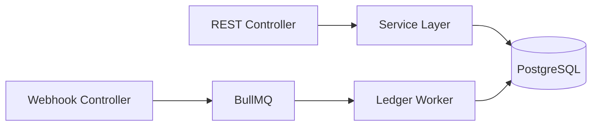

# Module: Doca Coin Hub Backend

## 1. Architecture & Responsibilities
Provides REST APIs for:
*   `WalletService`: Balance query, atomic spend, guest wallet merge.
*   `OrderService`: Package catalog, payment order dispatch (ZaloPay & Mock).
*   `WebhookController`: HMAC verification and BullMQ job dispatch.
*   `LedgerProcessor`: Worker transaction ledger bookkeeping.
*   `AdminService`: Reconciliation, manual credit, package CRUD.

