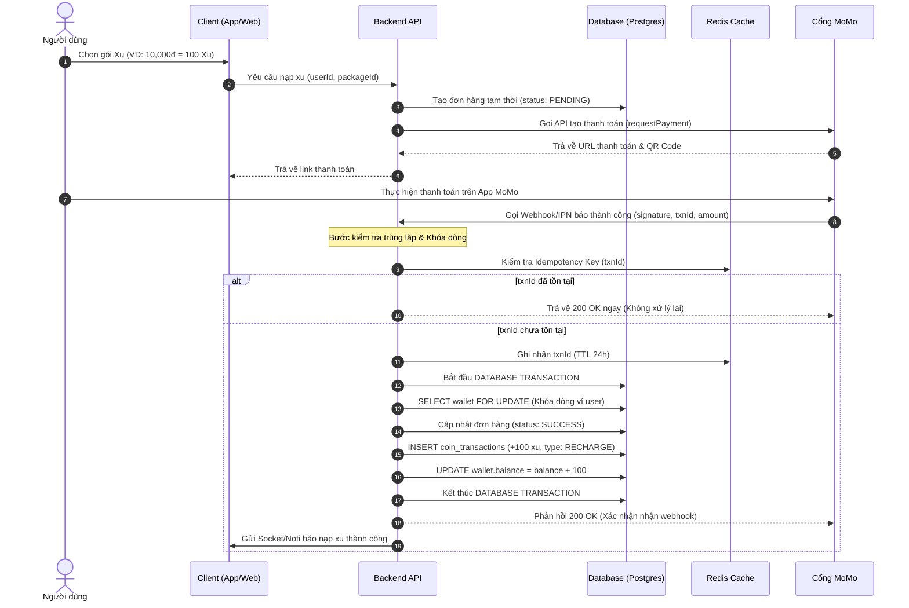
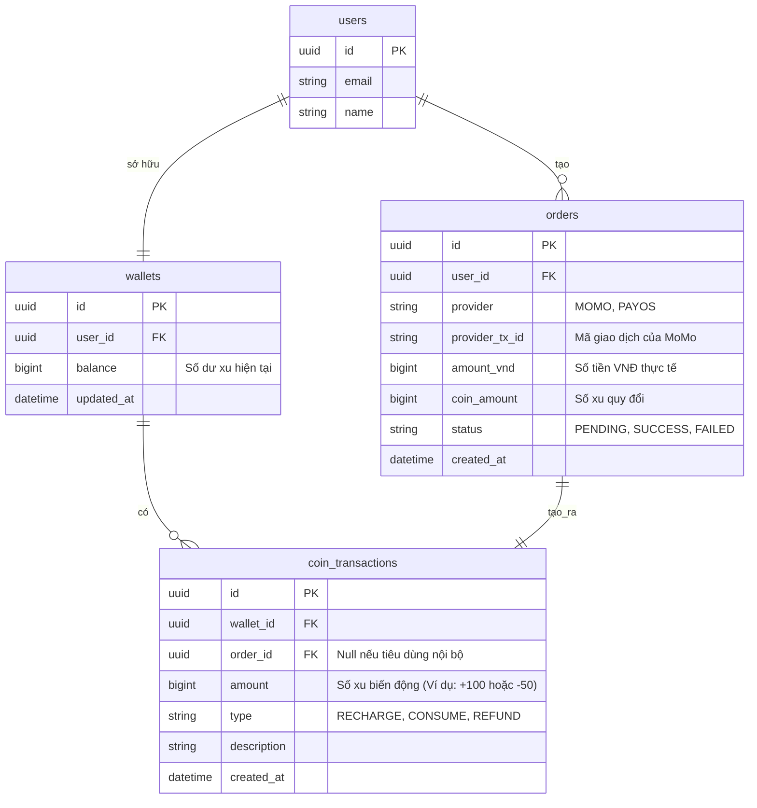

> [!CAUTION]
> **TÀI LIỆU ĐÃ ĐƯỢC NÂNG CẤP & THAY THẾ (SUPERSEDED)**
> Tài liệu phác thảo cũ này đã được nâng cấp thành **Doca Coin Hub**. Vui lòng xem tài liệu chuẩn tại [Document/CoinHub/PRODUCT_BRIEF.md](../../../Document/CoinHub/PRODUCT_BRIEF.md) và [docs/prd.md](../../prd.md).

---

# BRIEF: HỆ THỐNG QUẢN LÝ VÍ XU & NẠP TIỀN QUA MOMO

Tài liệu này ghi lại tóm tắt yêu cầu nghiệp vụ (Brief), kiến trúc hệ thống và quy hoạch phát triển cho tính năng **Ví Xu và Nạp Xu tự động** tích hợp cổng thanh toán MoMo (hoặc PayOS/VietQR) dành cho dự án CAPCAT/Doca Pet.

---

## 1. Yêu cầu Nghiệp vụ (Business Brief)
*   **Mục tiêu:** Cho phép người dùng nạp tiền thật thông qua các cổng thanh toán (chủ đạo là MoMo hoặc VietQR ngân hàng) để quy đổi thành "Xu" (điểm thưởng/tiền ảo nội bộ).
*   **Mục đích sử dụng Xu:** Mở khóa dịch vụ nội dung số (ví dụ: nghe nhạc premium, xem blog ẩn, mở khóa tính năng đặc biệt) hoặc mua vật phẩm ảo.
*   **Nguyên tắc tài chính tối thượng:**
    *   **Giao dịch 1 chiều:** Người dùng chỉ được nạp tiền vào mua xu, dùng xu trong hệ thống.
    *   **Không rút tiền mặt (No Cash-Out):** Tuyệt đối không cho phép đổi ngược xu thành tiền mặt, thẻ cào hoặc chuyển xu giữa các tài khoản khác nhau nhằm đảm bảo tính hợp pháp về mặt pháp lý chống đánh bạc & rửa tiền.

---

## 2. Quy hoạch Pháp lý (Legal Compliance)
Dựa trên quy định pháp luật Việt Nam hiện hành, đối với giấy phép **Hộ kinh doanh cá thể (HKD)** hoặc **Doanh nghiệp**:

*   **Tích hợp MoMo:** HKD **hoàn toàn có thể** ký hợp đồng với MoMo để sử dụng API thanh toán chính thức (yêu cầu GPKD HKD + Mã số thuế + CCCD chủ hộ).
*   **Thông báo Bộ Công Thương:** HKD có thể làm thủ tục thông báo website thương mại điện tử bán hàng để hợp pháp hóa việc bán xu/nội dung số trực tuyến.
*   **Giới hạn:** HKD **không được phép** vận hành ứng dụng nếu có tính năng Game (nạp tiền chơi game yêu cầu giấy phép G1/G2/G3/G4 chỉ cấp cho Doanh nghiệp) hoặc Sàn giao dịch TMĐT (cho phép nhiều bên bán hàng chéo nhau và thanh toán qua ví).

---

## 3. Kiến trúc Hệ thống (System Architecture)

### A. Luồng Dữ liệu Thanh toán (Sequence Diagram)
Quy trình nạp tiền tự động qua MoMo và đối soát an toàn thông qua Webhook (IPN):

### B. Thiết kế Cơ sở Dữ liệu (Database ERD)
Mô hình dữ liệu Sổ cái (Ledger Bookkeeping) đảm bảo tính minh bạch tài chính:

---

## 4. Kế hoạch Phân chia Module (Modular Monolith)
Nhằm tránh phức tạp hóa việc quản lý vận hành, tính năng ví xu sẽ được tích hợp trực tiếp vào codebase hiện tại dưới dạng một Module tách biệt:

*   **`Core Wallet Module`**: Quản lý số dư, cộng/trừ xu trong Database Transaction (có sử dụng cơ chế khóa dòng chống race condition).
*   **`Order & Billing Module`**: Quản lý trạng thái và vòng đời của đơn nạp tiền (Pending -> Success -> Failed).
*   **`Payment Providers Module`**: Sử dụng Adapter Pattern kết nối API MoMo, PayOS hoặc VietQR.
*   **`Webhook & Validation Module`**: Nhận callback từ bên ngoài, kiểm tra chữ ký số bảo mật và cơ chế chống xử lý trùng (Idempotency) với Redis.

---

## 5. Đề xuất Lộ trình Triển khai (Roadmap)
1.  **Phase 1 (MVP - Nghiên cứu thị trường):** Tích hợp quét mã VietQR qua PayOS hoặc Sepay (Tài khoản ngân hàng cá nhân của Hộ kinh doanh). Không mất phí giao dịch, tích hợp cực nhanh, không cần giấy phép doanh nghiệp phức tạp để thử nghiệm tính năng trước.
2.  **Phase 2 (Scale - Tích hợp sâu):** Ký hợp đồng doanh nghiệp/HKD với MoMo để kích hoạt cổng nạp ví MoMo chính thức.

---

## 6. Công cụ Quản trị & Đối soát (Admin & Accounting Portal)

### A. Vị trí Quy hoạch trên Codebase
Các chức năng quản trị và đối soát tài chính sẽ được phát triển trực tiếp trong dự án **`doca-admin-web`** dưới dạng các Router/Trang riêng biệt được bảo vệ bởi bộ lọc quyền (Role-Based Access Control - RBAC) và Google SSO.

Các trang dự kiến:
*   `src/pages/billing/transactions.astro`: Danh sách giao dịch nạp/tiêu xu và đối soát trạng thái đơn hàng.
*   `src/pages/billing/packages.astro`: Cấu hình danh sách các gói nạp (Giá VNĐ, Số Xu, Trạng thái Kích hoạt).
*   `src/pages/billing/report.astro`: Báo cáo doanh thu, tổng số xu phát hành, tổng số xu tiêu dùng theo ngày/tháng/năm dành riêng cho Kế toán.

### B. Phân quyền và Bảo mật (RBAC)
Hệ thống phân quyền chi tiết cho tài khoản truy cập Admin:

| Vai trò | Quyền hạn đối với Ví Xu | Chi tiết |
| :--- | :--- | :--- |
| **Super Admin / Owner** | Full Access | Quản lý gói nạp, đối soát giao dịch, có quyền cộng/trừ xu thủ công khi xảy ra lỗi hệ thống (Manual Adjustment). |
| **Kế toán (Accountant)** | Read-Only | Chỉ xem lịch sử giao dịch nạp tiền, xuất file đối soát báo cáo doanh thu CSV/Excel. Không có quyền sửa gói nạp hay cộng/trừ xu. |
| **Hỗ trợ khách hàng (CS/Support)** | Read & Write (Giới hạn) | Tra cứu số dư ví của User, kiểm tra trạng thái đơn hàng. Có thể tạo yêu cầu cộng xu đền bù (cần ghi rõ lý do và chờ phê duyệt hoặc giới hạn hạn mức). |

### C. Cơ chế Đối soát tài chính (Reconciliation)
*   **Đối soát tự động (API-based):** Định kỳ (ví dụ: 00:30 mỗi ngày), hệ thống chạy một tác vụ cron-job gọi API lịch sử giao dịch của MoMo để đối soát chéo với các đơn hàng thành công trong Database. Nếu phát hiện chênh lệch (lệch số tiền, đơn hàng trên MoMo thành công nhưng DB chưa ghi nhận), hệ thống sẽ gửi thông báo cảnh báo qua Telegram/Discord cho Kế toán và Kỹ thuật xử lý.
*   **Đối soát thủ công:** Giao diện cho phép Kế toán upload file báo cáo giao dịch xuất từ trang quản trị MoMo (CSV), hệ thống sẽ tự động quét và so khớp để tìm ra các giao dịch bị lệch.

---

## 7. Tự động hóa Kế toán & Thuế (Automated Tax & Accounting Integration)

Nhằm giảm thiểu gánh nặng quản lý thuế đối với mô hình doanh nghiệp siêu nhỏ, hệ thống sẽ quy hoạch tích hợp tự động hóa tối đa luồng kế toán:

### A. Tự động hóa Doanh thu đầu ra (e-Invoice API)
*   **Giải pháp:** Tích hợp API xuất hóa đơn điện tử (ví dụ: Misa MeInvoice hoặc SInvoice Viettel).
*   **Luồng xử lý:** 
    1. Hằng ngày, hệ thống ghi nhận hàng trăm/hàng nghìn giao dịch nạp xu nhỏ lẻ thành công qua MoMo/VietQR.
    2. Vào lúc 23:55 mỗi ngày, một tác vụ Cron-job sẽ chạy tổng hợp tổng doanh thu nhận được trong ngày.
    3. Hệ thống tự động gọi API của Misa MeInvoice để **xuất duy nhất 01 hóa đơn điện tử tổng** ghi nhận doanh thu dịch vụ nội dung số của ngày hôm đó (Hợp lệ theo quy định xuất hóa đơn tổng cuối ngày của cơ quan Thuế đối với hàng hóa/dịch vụ nhỏ lẻ bán trực tuyến).
    4. Dữ liệu hóa đơn này tự động đồng bộ thẳng lên hệ thống kế toán doanh nghiệp đám mây và Tổng cục Thuế.

### B. Tự động hóa Chi phí đầu vào (Expense Scan AI)
*   **Giải pháp:** Sử dụng bot quét hóa đơn đầu vào tự động kết nối qua email doanh nghiệp (như Bizzi.vn hoặc Misa AMIS).
*   **Luồng xử lý:**
    1. Khi bạn nhận hóa đơn điện tử đầu vào (tiền server AWS, tiền mua API, tiền thiết bị...) gửi về email chuyên dụng (vd: `billing@doca.pet`).
    2. Bot AI sẽ tự động đọc tệp đính kèm (XML/PDF), tra cứu xác thực hóa đơn trên Tổng cục Thuế, sau đó tự động phân loại khoản chi phí này vào phần mềm kế toán.

### C. Đồng bộ dòng tiền Ngân hàng (Bank Feed)
*   Phần mềm kế toán đám mây (Misa AMIS) được liên kết trực tiếp với tài khoản ngân hàng doanh nghiệp của bạn để tự động nhập dữ liệu dòng tiền và thực hiện đối khớp (Bank Reconciliation) với hóa đơn tương ứng.

### D. Quy trình Nộp thuế Bán tự động (Hybrid Model)
*   **Hằng ngày/Hằng tháng:** Hệ thống tự động vận hành ghi sổ dòng tiền đầu ra/đầu vào mà không cần can thiệp thủ công.
*   **Hằng quý/Hằng năm:** Bạn xuất tệp dữ liệu XML đã được đối soát chuẩn xác trên phần mềm kế toán, sau đó thuê dịch vụ đại lý thuế hoặc kế toán bán thời gian (phí dịch vụ cực kỳ rẻ vì không cần nhập liệu thủ công) để kiểm tra tính hợp lệ của chi phí và thực hiện cắm chữ ký số nộp tờ khai lên cổng Thuế điện tử của Nhà nước.

---

## 8. Giao diện Người dùng (User Interface / Wallet Dashboard)

Tính năng quản lý và nạp xu của người dùng sẽ được bố trí trực quan ngay tại trang hồ sơ cá nhân của người dùng để mang lại trải nghiệm mượt mà, tiện lợi nhất.

### A. Tích hợp Ví Xu tại Trang Hồ sơ (`/profile`)
Bố trí một khối **"Ví Xu Của Bạn" (Wallet Box)** trong thẻ `profile-card` (bên cạnh khối quản trị Kiosk) trên ứng dụng `doca-affiliate-web`:
*   **Hiển thị số dư:** Load động số dư khả dụng hiện tại từ DB hiển thị dưới dạng `150 Xu` (sử dụng icon Phosphor `ph-light ph-coins`).
*   **Nút hành động chính (Matcha Green):** *"Nạp thêm xu"* chuyển hướng người dùng sang trang thanh toán `/profile/wallet`.
*   **Nút hành động phụ:** *"Lịch sử"* mở ra danh sách trượt hiển thị lịch sử giao dịch.

### B. Trang chọn gói nạp và Thanh toán (`/profile/wallet`)
*   **Danh sách gói nạp:** Hiển thị dưới dạng Grid 3 cột trên Desktop (2 cột trên Mobile). Mỗi thẻ gói nạp hiển thị rõ: Số xu nhận được, Giá tiền VNĐ, và các tag khuyến mãi nếu có.
*   **Trình kích hoạt thanh toán (ZaloPay Web to App):**
    *   Khi người dùng click chọn gói và nhấn *"Thanh toán"*, hệ thống gọi API `createZaloPayOrder` để lấy về URL thanh toán.
    *   **Trên Desktop:** Hiển thị một Modal Cozy chứa mã QR động để người dùng mở điện thoại quét mã thanh toán. Có cơ chế kiểm tra trạng thái thanh toán tự động (polling hoặc WebSocket) để đóng modal và cộng xu ngay khi thanh toán thành công.
    *   **Trên Mobile:** Chuyển hướng hoặc mở trực tiếp ứng dụng ZaloPay trên điện thoại của người dùng để thanh toán bằng app-to-app deep link.

### C. Giao diện Lịch sử giao dịch (Transaction History)
Hiển thị danh sách cuộn mượt (Infinity Scroll hoặc phân trang) lấy dữ liệu từ bảng `coin_transactions` của user hiện tại:
*   Mỗi dòng giao dịch hiển thị:
    *   *Loại biến động:* Cộng xu (Màu xanh Matcha `+`) hoặc Trừ xu (Màu xám Charcoal `-`).
    *   *Chi tiết:* Nội dung giao dịch (Vd: *"Nạp tiền qua ZaloPay"*, *"Mở khóa bài viết Premium"*, *"Tặng quà sự kiện"*).
    *   *Thời gian:* Định dạng trực quan (Vd: *"10 phút trước"*, *"02/08/2026 14:30"*).

