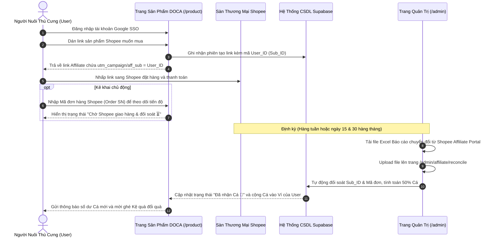

# Product Brief: Hệ Thống Cashback "Tích Cá Đổi Quà" Từ Link Shopee Affiliate

*   **Tên dự án:** DOCA Pet Ecosystem
*   **Tên tính năng:** Shopee Affiliate Loyalty Cashback ("Tích Cá Khi Mua Shopee")
*   **Trạng thái:** Thống nhất Brief (Pending Planning / Execution)
*   **Ngày hoàn thiện tài liệu:** 2026-08-30
*   **Tác giả:** Đội ngũ Kỹ thuật & Sản phẩm DOCA

---

## 1. Bối Cảnh & Mục Tiêu Kinh Doanh (Business Objectives)

### 1.1. Bối cảnh
*   DOCA đang xây dựng hệ sinh thái nội dung chữa lành (Iyashikei) và tiếp thị liên kết (Affiliate) dành cho cộng đồng chủ nuôi thú cưng (Sen).
*   Shopee hiện áp dụng chính sách hạn chế cấp Open API cho các tài khoản phổ thông, chỉ ưu tiên các đối tác có sản lượng đơn hàng và GMV lớn.
*   Để bứt phá về số lượng đơn hàng, DOCA cần một động lực mạnh mẽ để người dùng **chủ động tạo link qua DOCA trước khi mua bất kỳ món hàng nào trên Shopee**.

### 1.2. Mục tiêu chiến lược
1. **Tạo thói quen mua sắm:** Biến DOCA thành trạm dừng chân đầu tiên (First-stop portal) của chủ nuôi trước khi mua đồ thú cưng trên Shopee.
2. **Tăng trưởng GMV & Hoa hồng:** Tích lũy sản lượng đơn hàng lớn, tạo đòn bẩy để Shopee cấp tài khoản KOC VIP và mở quyền **Shopee Open API**.
3. **Gắn kết cộng đồng (Retention & Loyalty):** Thưởng đơn vị "Cá" 🐟 để người dùng nuôi Boss ảo, tích điểm đổi quà và sử dụng các tính năng cao cấp của DOCA.

---

## 2. Quy Tắc Kinh Tế & Tỷ Lệ Quy Đổi (Tokenomics)

| Hạng mục | Quy định |
| :--- | :--- |
| **Tỷ lệ phân chia hoa hồng** | **50% cho User (hoàn Cá)** : **50% cho DOCA (doanh thu vận hành)** |
| **Đơn vị tiền tệ thưởng** | **Cá 🐟** (Đơn vị điểm thưởng nội bộ của hệ sinh thái DOCA) |
| **Tỷ giá quy ước** | **`1 Cá = 1.000 VNĐ`** |
| **Công thức tính Cá hoàn** | $$\text{Số Cá} = \frac{\text{Hoa hồng Shopee thực nhận (VNĐ)} \times 50\%}{1.000}$$ |
| **Làm tròn số** | Làm tròn xuống đến 1 đơn vị Cá (hoặc 0.5 Cá) |

### Ví dụ minh họa:
*   User dán link mua máy sấy lông thú cưng trị giá **1.000.000 VNĐ** qua DOCA.
*   Shopee ghi nhận đơn hàng thành công và trả hoa hồng 6% = **60.000 VNĐ** cho tài khoản Shopee Affiliate của DOCA.
*   DOCA giữ lại 50% = **30.000 VNĐ**.
*   User nhận về 50% = 30.000 VNĐ quy đổi thành **30 Cá 🐟** vào ví tài khoản.

---

## 3. Luồng Hành Trình Người Dùng (User Experience Flow)



---

## 4. Chi Tiết Các Phân Hệ & Giao Diện Cần Xây Dựng

### 4.1. Phân hệ Phía Người Dùng (`doca-affiliate-web`)

#### A. Thanh công cụ tạo link thông minh trên `/product`:
*   Nhận diện trạng thái đăng nhập:
    *   *Chưa đăng nhập:* Hiển thị banner khuyến khích: *"Đăng nhập để nhận hoàn 50% Cá 🐟 khi mua hàng trên Shopee"*.
    *   *Đã đăng nhập:* Tự động gắn `sub_id_1 = {user_id}` vào link tạo ra.
*   Cung cấp nút **"Dán & Tích Cá Ngay"** mượt mà.

#### B. Khu vực Kê Khai & Theo Dõi Tích Cá (Claim Cashback Dashboard):
*   Nằm ngay trên trang `/product` hoặc tích hợp vào `/profile/wallet`.
*   Ô nhập **Mã đơn hàng Shopee (Order SN)** (ví dụ: `24083012345ABC`).
*   Bảng danh sách đơn hàng cá nhân với 3 trạng thái rõ ràng:
    1. 🟡 **Chờ đối soát (Pending):** Đơn đang được Shopee vận chuyển hoặc trong thời gian chờ xác nhận không hoàn trả.
    2. 🟢 **Đã nhận Cá (Approved):** Cá đã vào ví khả dụng, hiển thị rõ số lượng Cá nhận được.
    3. 🔴 **Không thành công (Rejected):** Đơn bị hủy, bom hàng hoặc người mua bấm trả hàng trên Shopee.

#### C. Giao diện Ví Cá tại Trang Cá Nhân (`/profile` & `/profile/wallet`):
*   Hiển thị 2 nhóm số dư:
    *   **Cá Khả Dụng (Available):** Sẵn sàng để tiêu dùng / đổi quà.
    *   **Cá Chờ Về (Pending):** Đang đợi đối soát từ các đơn mua gần đây.
*   Sổ cái lịch sử biến động số dư minh bạch.

---

### 4.2. Phân hệ Quản Trị & Đối Soát (`doca-admin-web`)

#### A. Trang Quản trị Đối soát Shopee (`/admin/affiliate/reconcile`):
*   **Khu vực Tải Lên (Upload Zone):** Kéo thả file Excel/CSV Báo cáo chuyển đổi (Conversion Report) xuất từ cổng Shopee Affiliate.
*   **Bộ phân tích dữ liệu (Parser Engine):**
    *   Bóc tách các cột chuẩn: `Mã đơn hàng (Order ID)`, `Sub ID 1 (User ID)`, `Thời gian tạo đơn`, `Trạng thái đơn hàng`, `Giá trị đơn`, `Hoa hồng thực tế`.
    *   Tự động tính toán: `Số Cá hoàn = Hoa hồng * 50% / 1000`, `Doanh thu DOCA = Hoa hồng * 50%`.
*   **Bảng xem trước đối soát (Preview Table):**
    *   Thống kê tổng số đơn hợp lệ, tổng hoa hồng thu về, tổng số Cá cần phát.
    *   Liệt kê chi tiết từng User nhận được bao nhiêu Cá.
*   **Nút "Xác Nhận & Duyệt Cá Hàng Loạt":**
    *   Chạy database transaction cộng Cá an toàn vào ví của các User tương ứng và cập nhật trạng thái đơn hàng.

---

## 5. Thiết Kế Cơ Sở Dữ Liệu (Database Schema - Supabase)

### 5.1. Bảng `shopee_cashback_orders` (Quản lý đơn hàng hoàn Cá)
```sql
CREATE TABLE public.shopee_cashback_orders (
    id UUID PRIMARY KEY DEFAULT gen_random_uuid(),
    user_id UUID REFERENCES auth.users(id) ON DELETE CASCADE,
    shopee_order_sn VARCHAR(100) UNIQUE NOT NULL, -- Mã đơn hàng Shopee
    product_name TEXT,
    product_image TEXT,
    order_amount DECIMAL(12, 2) DEFAULT 0,       -- Giá trị đơn hàng VNĐ
    shopee_commission DECIMAL(12, 2) DEFAULT 0,  -- Hoa hồng Shopee trả
    cashback_fish DECIMAL(10, 2) DEFAULT 0,      -- Số Cá hoàn cho User (50%)
    doca_revenue DECIMAL(12, 2) DEFAULT 0,       -- Doanh thu DOCA giữ (50%)
    status VARCHAR(20) DEFAULT 'pending',        -- pending, approved, rejected
    reconciled_at TIMESTAMPTZ,
    created_at TIMESTAMPTZ DEFAULT NOW(),
    updated_at TIMESTAMPTZ DEFAULT NOW()
);

-- Index tra cứu nhanh theo User và Mã đơn
CREATE INDEX idx_cashback_user_id ON public.shopee_cashback_orders(user_id);
CREATE INDEX idx_cashback_order_sn ON public.shopee_cashback_orders(shopee_order_sn);
```

### 5.2. Tích hợp Sổ Cái Ví Xu (`wallets` & `wallet_transactions`)
*   Mỗi lần duyệt Cá thành công, hệ thống tự động ghi 1 dòng vào `wallet_transactions`:
    *   `wallet_id`: ID ví của User.
    *   `amount`: +Số Cá được hoàn.
    *   `type`: `SHOPEE_CASHBACK`.
    *   `description`: `Hoàn 50% hoa hồng Shopee cho đơn hàng #[Mã đơn]`.

---

## 6. Chính Sách Quản Trị Rủi Ro & Chống Gian Lận (Fraud Prevention)

1. **Khóa chống trùng mã đơn hàng (Idempotency):**
   * Trường `shopee_order_sn` được đặt ràng buộc `UNIQUE`. Nếu 2 tài khoản cùng nhập 1 mã đơn, hệ thống sẽ ưu tiên đối soát theo `Sub ID 1` có trong báo cáo chính thức của Shopee.
2. **Chống bom hàng & Đơn ảo:**
   * Không bao giờ cộng Cá ngay lập tức khi tạo link hoặc khi vừa đặt hàng.
   * **Chỉ cộng Cá khả dụng khi đơn hàng có trạng thái `COMPLETED` trong file đối soát chính thức từ Shopee.**
3. **Bảo toàn giao dịch dữ liệu (ACID Transactions):**
   * Sử dụng Database Transaction khi Admin duyệt hàng loạt để đảm bảo hoặc tất cả các ví được cộng tiền chính xác, hoặc rollback nếu có sự cố.

---

## 7. Lộ Trình Triển Khai Đề Xuất (Next Steps)

1. **Giai đoạn 1 (Database & Backend API):**
   * Khởi tạo bảng `shopee_cashback_orders` và các RLS policies trên Supabase.
   * Viết API endpoint `/api/shopee/claim` (User kê khai mã đơn) và `/api/admin/shopee/reconcile` (Admin import file Excel).
2. **Giai đoạn 2 (Giao diện Người Dùng):**
   * Cập nhật component `ShopeeAffiliateTool.astro` tự động gắn `sub_id_1 = user.id`.
   * Xây dựng Tab / Modal "Kê khai & Theo dõi tích Cá" trên trang `/product` và `/profile/wallet`.
3. **Giai đoạn 3 (Giao diện Quản Trị):**
   * Xây dựng màn hình Upload & Đối soát file Excel Shopee trên `doca-admin-web`.
4. **Giai đoạn 4 (Kiểm Thử E2E & Launch):**
   * Kiểm thử luồng tạo link -> kê khai đơn -> import file test -> cộng Cá vào ví.

---
*Tài liệu đã được lưu trữ chính thức tại [BRIEF.md](file:///Users/ricyuan/CAPCAT/docs/features/shopee_cashback/BRIEF.md).*
