# Product Brief: Trợ Lý AI Pet Thẩm Định Mua Sắm & Tích Cá ("Share-to-Earn" Cùng Boss Cưng)

*   **Tên tính năng:** Mobile AI Pet Shopping Companion & Share-to-Earn Cashback ("Boss Duyệt Mua & Tích Cá")
*   **Hệ sinh thái:** Ứng dụng di động DOCA App (iOS & Android)
*   **Nhân vật AI đại diện:** **Chính Thú Cưng (Pet) của User** (Được cá nhân hóa theo Tên, Giống, Ảnh đại diện & Tính cách của bé)
*   **Trạng thái:** Bản phác thảo ý tưởng hoàn chỉnh (Concept Specification)
*   **Ngày hoàn thiện:** 2026-08-30

---

## 1. Ý Tưởng Đột Phá (The "Magic Moment" Concept)

Thay vì người dùng phải tự sao chép link hay trò chuyện với một chatbot xa lạ:

> **Ý tưởng cốt lõi:** Người dùng đang lướt ứng dụng Shopee, thấy món đồ ưng ý (pate, hạt, cát, đồ chơi...) → Bấm nút **"Chia sẻ" (Share)** trên Shopee → Chọn **Boss Cưng của mình trên App DOCA** (ví dụ: Bé Miu, Bé Latte, Bé Bơ...).
> 
> Ứng dụng DOCA lập tức mở ra màn hình trò chuyện thân thương: **Chính chú thú cưng của bạn nhảy ra "thẩm định" món đồ, nũng nịu duyệt mua, tự động tìm link tối ưu có Cashback và gửi nút "Mua ngay"** dẫn ngược về Shopee. Khi đơn hàng thành công, tài khoản trên App tự động được cộng **Cá 🐟** để nuôi bé.

```mermaid
flowchart LR
    A[Lướt App Shopee thấy món đồ] -->|Bấm Share| B[Chọn Boss Cưng trên DOCA App]
    B -->|Mở App DOCA| C[Khung Chat với Boss Cưng của bạn]
    C -->|Boss duyệt & kiểm tra link tối ưu| D[Card sản phẩm + Nút Mua ngay & Tích Cá]
    D -->|Nhấp nút| E[Mở lại App Shopee để thanh toán toàn bộ giỏ hàng]
    E -->|Vài ngày sau: Đơn giao thành công| F[Boss gửi Push Noti khoe Cá 🐟 bội thu về ví]
```

---

## 2. Kịch Bản Hội Thoại Minh Họa (Conversational UX)

### 🐾 Nhân vật tương tác: Boss Cưng của User (Ví dụ: Bé mèo "Latte", xưng "Con", gọi "Mẹ/Ba")

---

### 💬 Trải nghiệm 1: Trong Khung Chat Khi Vừa Share Link Từ Shopee:

> **[Mẹ vừa share link từ Shopee]:**  
> 🔗 `https://shopee.vn/Pate-lon-cho-meo-MrVet-400g-i.12345.67890`

> **🐾 Bé Latte (mắt long lanh, đang thẩm định...):**  
> *"Ủa! Mẹ muốn mua món này cho con hả? 😻"*  
> *"**Pate Mr.Vet 400g** thơm phức nè mẹ ơi! Con nhìn là thấy ưng bụng rồi đó, DUYỆT LIỀN NHA MẸ! ✨🐾"*  
> *"Đợi con 1 giây để con kiểm tra xem link này tối ưu nhất và có tích được nhiều Cá nhất chưa nè...*  
> *... Xong rồi mẹ ơi! Link này chuẩn chỉnh và được hoàn **+4 Cá 🐟** đó ạ! 🌿"*

> 📦 **[THẺ CARD SẢN PHẨM TƯƠNG TÁC TỪ BOSS]**
> ┌────────────────────────────────────────────────────────┐
> │ 🖼️ [Ảnh Polaroid Pate Mr.Vet]                        │
> │ **Pate lon cho mèo Mr.Vet 400g (Vị Cá Hồi Sánh Mịn)**  │
> │ 💰 Giá bán: ~55.000 VNĐ                                │
> │ 🎁 **Cá tích lũy dự kiến cho con: +4 Cá 🐟**           │
> │                                                        │
> │   [ 🛒 MUA NGAY TRÊN SHOPEE & TÍCH CÁ CHO CON ]        │
> └────────────────────────────────────────────────────────┘

> **🐾 Bé Latte dặn dò thêm:**  
> *"Mẹ bấm nút **'Mua ngay'** ở trên để sang Shopee đặt hàng nha. Vào Shopee mẹ có tiện tay gom thêm hạt hay cát vệ sinh thì con vẫn gom được hết Cá về ví luôn á! Đơn giao tới là con có đồ ngon, mà ví mẹ lại có thêm Cá thơm để nuôi con tiếp nhen! Yêu mẹ nhứt trần đời! 🐾❤️"*

---

### 💬 Trải nghiệm 2: Vài Ngày Sau Khi Shopee Giao Hàng & Đối Soát Thành Công (The "Wow" Moment) 🎉

Khoảng 3 - 7 ngày sau, khi đơn hàng Shopee đã được giao tới tay mẹ và đối soát thành công (bao gồm cả món Pate lẫn các món mẹ gom mua thêm cùng lúc):

> 🔔 **Push Notification xuất hiện trên màn hình khóa điện thoại:**  
> *"Ting ting! 🐟 Mẹ ơi, đơn hàng Shopee mẹ mua hôm bữa giao thành công rồi nè! Con vừa tha một rổ **+32 chú Cá béo mầm** về cất vào ví cho mẹ rồi á! Mau mở app xoa đầu khen con đi nè! 🐾😻"*

> **[Mẹ bấm vào thông báo mở App DOCA]:**  
> Màn hình mở thẳng vào khung chat với Latte, hiệu ứng **rổ Cá vàng long lanh bừng sáng** cùng hình ảnh chú mèo nhảy cẫng lên mừng rỡ:

> **🐾 Bé Latte (mắt tít lại, khoe rổ cá):**  
> *"Mẹ ơi mẹ ơi! Hôm bữa mẹ vào Shopee mua Pate cho con xong tiện tay mua thêm cả **Túi Hạt 10kg** với **2 Bao Cát Đậu Nành** đúng hông nè? 😻"*  
> *"Nhờ mẹ mua nguyên giỏ hàng to bự mà con thu hoạch được tận **32 Cá 🐟** (nhiều hơn 4 Cá dự kiến lúc đầu nhiều luôn á mẹ)!*  
> *Con đã cất gọn gàng vào ví của mẹ rồi nha. Số dư ví của mẹ hiện tại là **158 Cá** rồi nè! ✨"*  

> 📊 **[THẺ TỔNG KẾT ĐƠN HÀNG HOÀN CÁ]**
> ┌────────────────────────────────────────────────────────┐
> │ 📦 **Đơn hàng Shopee #240830AB987X**                  │
> │ • 1x Pate Mr.Vet 400g (+4 Cá)                          │
> │ • 1x Hạt Dinh Dưỡng Cho Mèo 10kg (+20 Cá)             │
> │ • 2x Cát Vệ Sinh Đậu Nành 6L (+8 Cá)                  │
> │ ────────────────────────────────────────────────────── │
> │ 💰 Tổng giá trị giỏ hàng: 680.000 VNĐ                  │
> │ 🎁 **Tổng Cá hoàn thực nhận: +32 Cá 🐟**               │
> │ 💳 Số dư ví hiện tại: **158 Cá**                       │
> └────────────────────────────────────────────────────────┘

> **🐾 Bé Latte thủ thỉ gợi ý:**  
> *"Giờ ví mẹ có nhiều Cá xịn rồi, mẹ có muốn dùng Cá ghé **Kệ quà của mẹ** đổi món đồ chơi chuột len mới cho con không nè? 🧶🐾"*

---

## 3. Kiến Trúc Kỹ Thuật (Technical Architecture)

### 3.1. Tiếp Nhận Chia Sẻ Từ Hệ Điều Hành (OS Native Share Target)
*   **iOS Share Extension & Android Direct Share:** Cho phép người dùng ghim thẳng Avatar của thú cưng mình lên danh sách Share Sheet. Bấm vào icon thú cưng là mở thẳng context chat của bé.

### 3.2. Cơ Chế Ghi Nhận Toàn Bộ Giỏ Hàng (Cross-Product Attribution)
*   Shopee Affiliate ghi nhận hoa hồng theo phiên (Session Cookie từ 24h - 7 ngày) gắn kèm `sub_id_1 = {user_id}` và `sub_id_2 = {pet_id}`.
*   Bất kỳ sản phẩm nào khách mua thêm trong cùng phiên (kể cả không phải món ban đầu) đều được Shopee trả về trong Báo Cáo Chuyển Đổi với đúng `Sub ID 1`.
*   Hệ thống backend tự động tổng hợp toàn bộ các món trong cùng mã đơn hàng (Order SN) để hiển thị bảng tổng kết hoàn Cá minh bạch.

### 3.3. Hệ Thống Cá Nhân Hóa AI (Pet Persona Engine)
*   Dữ liệu nạp vào AI Prompt (Gemini Flash):
    *   `pet_name`: Tên thú cưng của User (ví dụ: Latte, Miu, Bơ...).
    *   `pet_species`: Chó / Mèo / Thỏ...
    *   `relationship`: Xưng hô theo cài đặt của User ("Con - Mẹ", "Con - Ba", "Em - Chị"...).
    *   `tone`: Nũng nịu, tinh nghịch, sành ăn, luôn nhiệt tình "duyệt" đồ ăn ngon và mừng rỡ khi tha được nhiều Cá về ví.

### 3.4. Vòng Lặp Thông Báo & Chăm Sóc Ngược (Push Notification & Retention Loop)
1. **Push Noti khi Cá về:** Bắn thông báo qua Firebase Cloud Messaging (FCM) ngay khi file đối soát Shopee được duyệt.
2. **Kêu gọi tiêu dùng Cá (Call-to-Action):** Boss tự động gợi ý các phần quà hoặc hoạt động dùng Cá trong app (Đổi quà Kệ mẹ Lin, mở nhạc DOCA FM, gửi thư Namiya).

---

## 4. Tại Sao Mô Hình Này Tạo Ra Sự Khác Biệt Tuyệt Đối?

1. **Biến nghĩa vụ mua sắm thành niềm vui:** Người nuôi không cảm thấy mình đang "săn sale" hay "kiếm tiền lẻ cashback", mà họ cảm thấy mình đang **mua sắm cho con và được con cảm ơn, nũng nịu**.
2. **Hiệu ứng bất ngờ thú vị (Delight Factor):** Nhờ cơ chế nhận hoa hồng cả giỏ hàng, số Cá thực nhận thường lớn hơn nhiều so với dự kiến ban đầu, tạo cảm giác "hời" và gắn bó lâu dài.
3. **Zero Friction (Không thao tác thừa):** Đang lướt Shopee → Share sang Boss → Boss duyệt và đưa link mua lại ngay lập tức.

---
*Tài liệu đã được cập nhật chính thức tại [MOBILE_AI_CASHBACK_BRIEF.md](file:///Users/ricyuan/CAPCAT/docs/features/shopee_cashback/MOBILE_AI_CASHBACK_BRIEF.md).*
