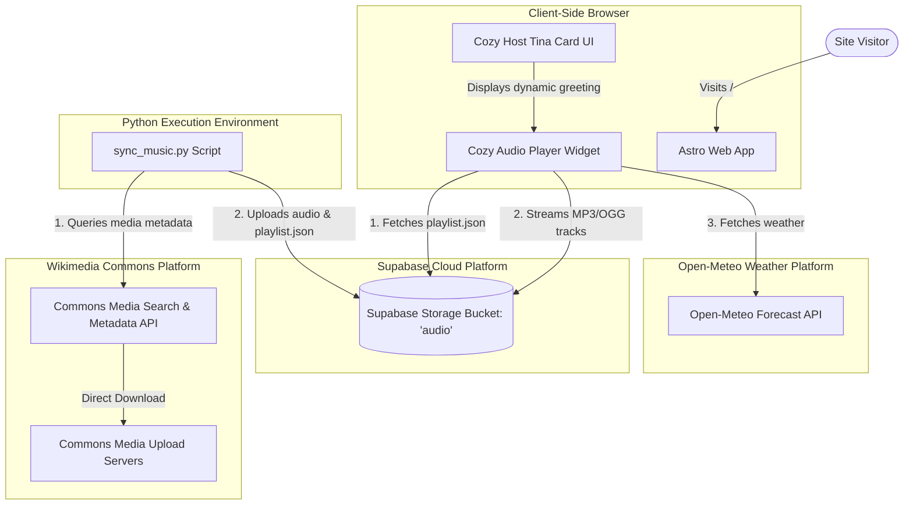
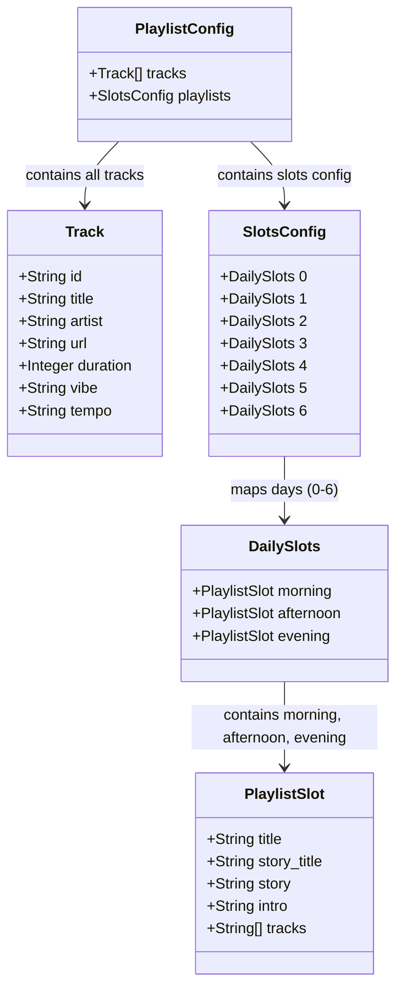
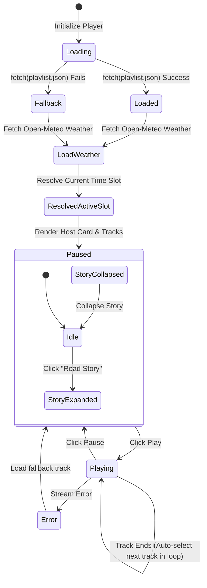
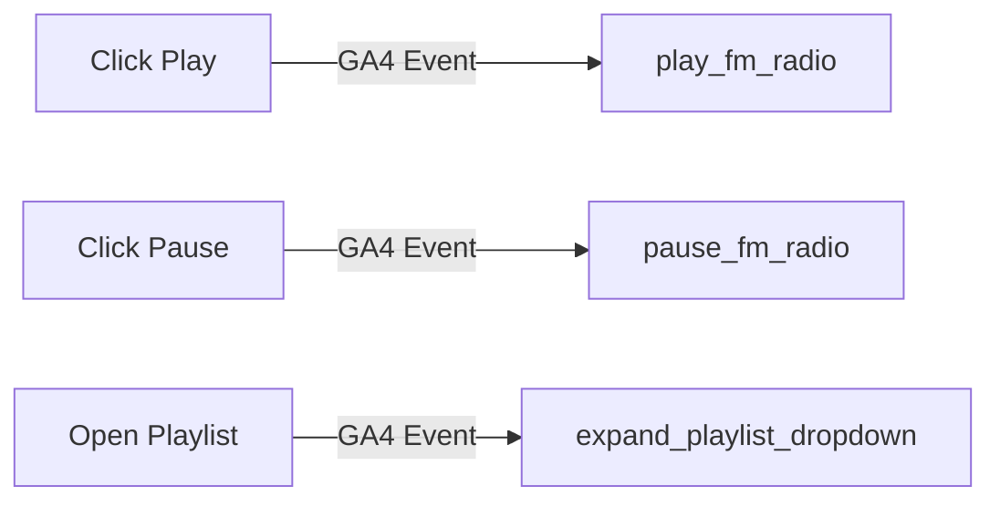

# Architectural Diagrams - DOCA FM Live Sync & Weather Integration

This document houses the structural, data, and behavioral diagrams for the live synchronized FM player and weather integrations.

## 1. C4 Container Diagram

The high-level architecture of the website media integration:

---

## 2. Data Model Diagram

The structure of the `playlist.json` metadata model showing the 3 slots:

---

## 3. Audio Player Lifecycle State Diagram

The lifecycle of the Cozy Audio Player widget including the daily host card:

---

## 4. Observability & Telemetry Map

We track player interactions in Google Analytics 4 (GA4) as defined in our analytics integration:

